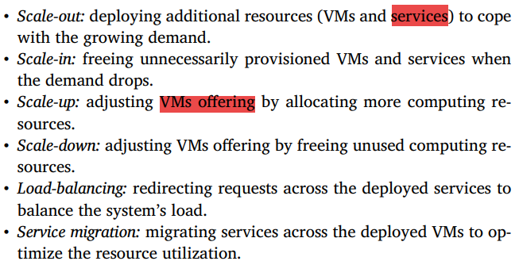
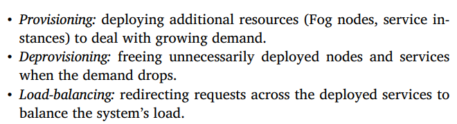
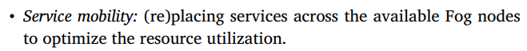
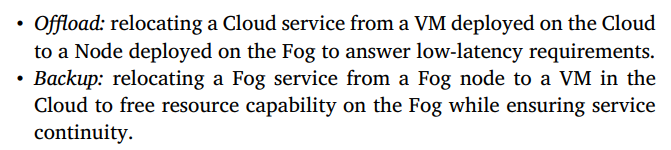
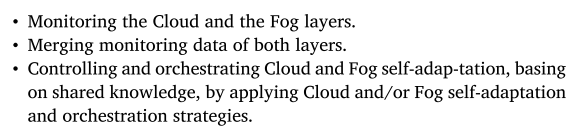

# Introduction
	- 任何具有计算能力，存储容量和网络连接的设备都可以称为**雾节点**
		- 包括但不限于：本地专用服务器，工业控制器，交换机，路由器等
	- 核心思想在于就近分析IoT数据，以最小化延迟
	- 此文章试图解决的问题：
		- 如何在雾层准确设计自适应相关行为
		- 如何在雾层不断演变的同时全面表达和确保雾应用程序的需求和特性
		- 云层和雾层的自适应行为如何在物联网景观中协调以满足计算资源能力、服务可用性和低延迟敏感性的异构需求
	- 验证过程大概**分为三步**
		- **第一步**
			- 在雾层和云层分别**以解构和行为为重点**建模自适应行为
			- 这一步的输出是为了识别一系列的**监控谓词**(Monitoring Predicate)和**原子自适应动作**(Atomic Adaptation Action)
				- 监控谓词用于怎段两层的资源分配状态(不足或过多)
				- 原子自适应动作用于识别自适应机制(Adaptation Mechanisms)，例如复制服务实例或雾节点，或调整云端VM的资源(处理器，内存和带宽等)
		- **第二步**
			- 描述一个云雾**编排器**(Cloud-Fog Orchestrator)
				- 此编排器决定在进行自适应时将会被触发的云层或雾层行为
			- 编排器会分别考察两层各自的状态(监控谓词)，然后在满足特定条件的情况下应用适当的动作序列(策略)来在某一层或两层都实现自适应
		- **第三步**
			- 找出和设计一系列需要被满足的时序逻辑属性，以确保自适应行为的正确性
	- [[$red]]==**重点**==：introduction里说使用kripke结构做了***符号化状态(symbolic state)***所以解决了**[[$red]]==状态爆炸==问题**？看情况好像是定义一堆等价类，等价类的后续状态迁移都相同？
- # 一个自适应的云雾编排模型
	- ## 针对云的自适应策略([[$red]]==来源于什么地方，普适性足够吗==)：
		- 
		- 可否把services理解为部署在云端或雾节点上的应用？
	- ## 针对雾的自适应策略
		- 
		  
	- ## 编排策略
		- 编排是比云和雾的自适应策略更高层次的行为抽象，编排通过动态调整云和雾的配置来让系统**对齐(align)**业务要求。相当于从一个更高的视角来平衡资源分配，没有编排，云和雾都只能在本地进行自适应，不具备全局视角
		- 
	- ## 编排器行为
		- [[$red]]==编排器是否就是编排的实例化？编排器行为和编排策略之间的关系是什么？==
		- 
		-