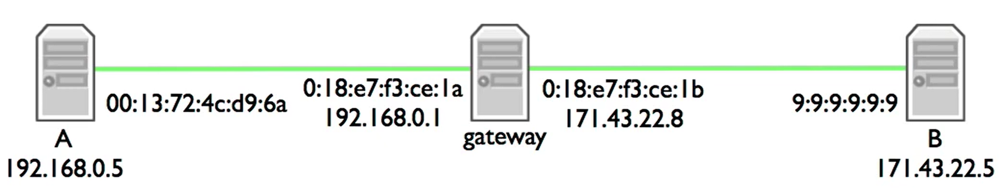

- 不同的网络层级有不同的地址
- 例如网络层使用IP地址，而连路程则使用MAC(media access control address)地址
- MAC地址是分配给网络接口控制器的标识符，一般来说一个MAC地址对应一个网络设备，例如网卡
- 虽然链路地址和IP地址在逻辑上是分离的，但实际应用中一个IP地址可能回合一个链路地址绑定
- 举例：
	- 
	- 如果网关只用一个IP地址的话，那这个IP地址就必须既和A的IP地址在同一个网络下，又必须和B的IP地址在同一个网络下([[$red]]==?==)，而这要求一个很大子网掩码(只有一位)，而在这个子网掩码下，B和A已经在同一个网络下了
	- 所以网关实际上给自己连接的两条链路都分配了一个IP地址
	- 在实际操作中，如果A要给B发送数据，则首先会根据子网掩码发现不在同一个网络下，因此A会发送一个IP地址为B但链路地址为网关的数据报
		- 因此问题在于，**如何知道网关IP地址对应的链路地址？**(知道IP地址并不能直接发送数据，要知道链路地址才知道如何发送给下一站)，**ARP**协议就是为了解决这个问题
- # ARP
	- 负责将网络层地址映射到链路层地址
		- 节点负责缓存映射，缓存条目会过期
	- 简单的“请求-回复”协议
		- “谁有网络层地址X的映射？”
		- “我有网络层地址X的映射”
	- 协议请求会送到链路层广播地址(全1)
	- 回复会送到请求发送的地址，非广播
	- 包格式包括冗余数据
		- 请求有足够的信息用于生成到请求者的映射
		- 让debug更加简单
	- 没有状态共享，坏的状态最终会超时
	- 
	-
	-