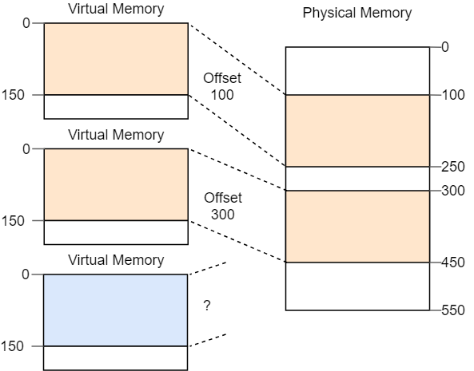

- # 再探内存分段分页
	- 内存分段和分页都是内存**保护**机制，也是一种内存**管理**手段
	- x86架构中既有分段也有分页1
	- ## 内存分段
		- 内存分段出现于1978年，最初仅用于扩展可用内存的地址空间(此时CPU普遍为16位，可用内存因此仅有64KB)
		- 最初，用于保存分段信息的段**寄存表**仅包含段基址，没有任何和**权限控制**的信息
		- 后续随着**保护模式**的引入，增添了权限控制功能
			- CPU进入此模式之后段描述符会包含一个**本地或全局的描述符表(GDT)索引**
			- 此索引对应的数据包含了偏移量，段大小和访问权限
			- 通过加载各个进程的全局或本地描述符表，可以实现进程仅能访问自身内存区域的效果，以此完成进程隔离
		- 对于X86架构来说：
			- 代码段储存于**代码段寄存器**``CS``
			- 栈段储存于**栈段寄存器**``SS``
			- 数据段存储于**数据段寄存器**``DS``或**额外段寄存器**``ES``
			- 可随意使用的**扩展段寄存器**``FS``和``GS``
	- ## 虚拟内存
		- 进程内访问使用虚拟地址，虚拟地址到物理地址的转换通过CPU和操作系统共同完成
	- ## 内存碎片
		- 分段会导致**外部碎片**，即在内存中无法找出一段连续的空间给新的程序进行分段
		- 
		- 分页会带来**内部碎片**，但是相对于分段带来的外部碎片问题，其严重性和代价都要小很多
	- ## 内存分页
		- 将内存分割为若干最小单位，每个单位的大小固定，分配内存时以此为单位
		- 相当于对内存管理的颗粒度更加细
- # X86_64中的分页
	- 使用**4级页表**
	- 页大小为**4KB**
	- 任何一个层级的页表都具有**512**个条目，每个条目大小为8字节，刚好占满一页
	- 一个八字节的虚拟地址结构为：
		- 
		- 48-64未使用，但是要求必须和第47位保持一致，这也称为**符号扩展**，和二进制补码相似
		- 因此实际上x86-64的实际地址位数并不是64位，而是48位
			- 未使用的地址位可以用于后续的扩展
	- 每一个页表项记录了下一级页表或页帧的物理地址，同时还有很多其他flag用于权限控制
	- ## 页表格式
		- | 位 | 名字 | 含义 |
		  | ---- | ---- | ---- |
		  | 0 | present | 该页目前在内存中 |
		  | 1 | writable | 该页可写 |
		  | 2 | user accessible | 如果没有设定，仅内核代码可以访问该页 |
		  | 3 | write through caching | 写操作直接应用到内存 |
		  | 4 | disable cache | 对该页禁用缓存 |
		  | 5 | accessed | 当该页正在被使用时，CPU设置该比特的值 |
		  | 6 | dirty | 当该页正在被写入时，CPU设置该比特的值 |
		  | 7 | huge page/null | 在P1和P4状态时必须为0，在P3时创建一个1GiB的内存页，在P2时创建一个2MiB的内存页 |
		  | 8 | global | 当地址空间切换时，该页尚未应用更新（CR4寄存器中的PGE比特位必须一同被设置） |
		  | 9-11 | available | 可被操作系统自由使用 |
		  | 12-51 | physical address | 经过52比特对齐过的页帧地址，或下一级的页表地址 |
		  | 52-62 | available | 可被操作系统自由使用 |
		  | 63 | no execute | 禁止在该页中运行代码（EFER寄存器中的NXE比特位必须一同被设置） |
	- ## TLB
		- TLB存放最近几次地址转换之后的结果，免去频繁的四级页表转换
		- TLB不会在页表自动更新或删除被缓存结果，需要系统内核自行管理
		- x86 CPU 提供了一个删除TLB特定页缓存的指令``invlpg``(invalidate page)
		-