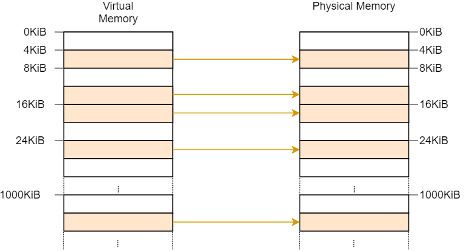
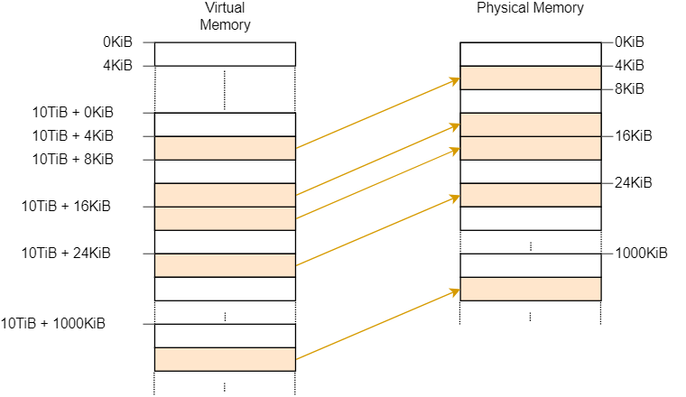
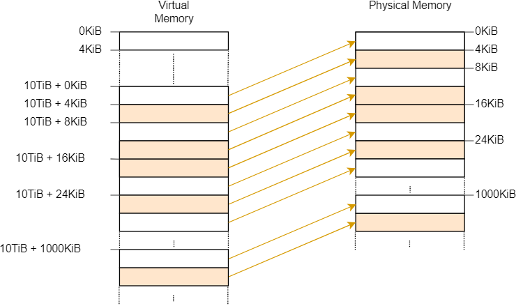
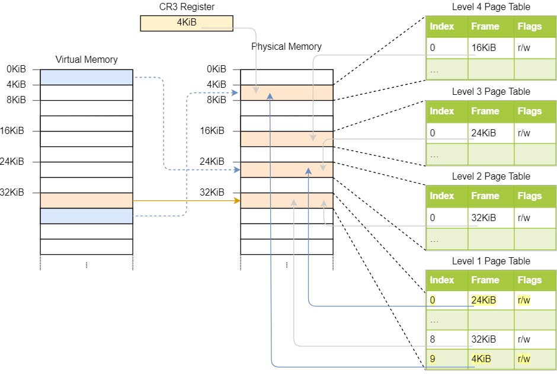
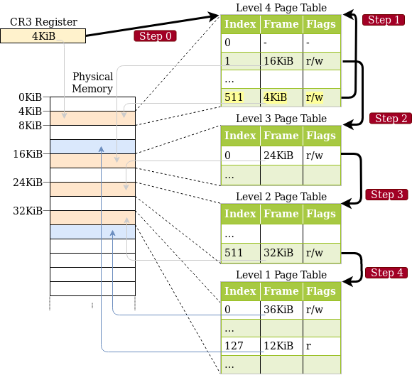
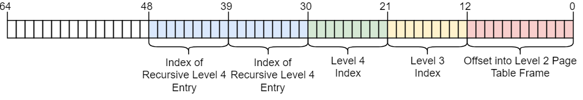
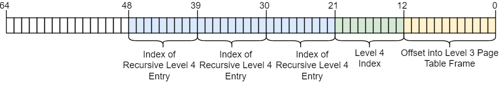
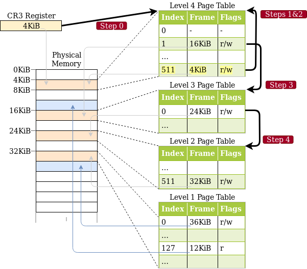
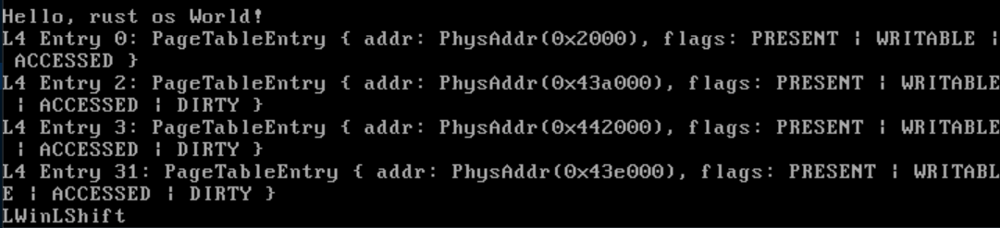

- # 访问页表
	- 页表条目中存储的是物理地址，而不是虚拟地址，避免了无休止的循环翻译和性能损耗
	- 为了访问这些在物理地址中的页表条目，需要将一些虚拟地址映射到这些物理地址
	- ## 直接映射(Identity Mapping)
		- 
		- 最简单的解决方案
		- 如果大量使用会造成很多问题，会将虚拟地址打乱，失去虚拟地址的优势
	- ## 固定偏移映射(Map at  a Fixed Offset)
		- 
		- 在虚拟地址空间中使用一块专门的区域来映射物理地址
		- 方法就是将物理地址加上一个固定的偏移量，这样一来所有的页表在虚拟地址空间中的地址都是在某个地址之后
		- 缺点在于每当创建一个新页表时，一个新的映射需要被创建
	- ## 映射完整物理内存(Map the Complete Physical Memory)
		- 
		- 直接将一整个物理内存映射到虚拟空间中的一个固定区域而不是只映射页框
	- ## 临时映射(Temporary Mapping)
		- 
		- 首先创建一个**直接映射**的一级表
		- 对于内存很小的设备，可以在需要访问页表时，只对页表进行临时映射页表
		- 一次临时映射的过程为
			- 在一级直接映射页表中找到一个未使用的条目
			- 将此条目映射到想访问的包含页表的物理页帧上
			- 通过被映射的虚拟地址访问目标页帧
			- 访问完毕之后释放条目
	- ## 递归页表(Recursive Page Tables)
		- 这是一种不需要额外空间的精妙方式
		- 4级页表中的某个条目储存的物理地址空间就是自身的物理地址空间，即指向自己
		- 
		- 这样一来，就可以在四级列表地址中的前若干个地址填上同样的页表索引(在此处是511)来控制对某一层页表的访问
			- 
			- 
			- 
			- 
			- {:height 128, :width 689}
		- 例如，在上图中，由于对四级页表进行了两次防问，因此访问到一级页表时，CPU将会认为自己已经到了实际的数据页帧，而将这个一级页表返回，如此便实现了对一级页表的访问
		- 
		- 如果增加一次四级页表的访问次数，则可以访问到2级页表
		- 类似的，我们还可以做到对二级页表的访问
		- 此方法最大的[[$red]]==缺点==是平台相关性很大，深度依赖``x86_64``架构的页表结构
- # Bootloader Support
	- bootloader提供两种访问页表的方式，通过crate feature的方式做选择
		- ``map_physical_memory``将完整的物理内存映射到虚拟地址空间，使得**内核可以访问所有物理地址**
		- ``recursive_page_table``将4级页表的一个条目进行递归映射
	- 本文选择第一种方式，因为其简单且**平台无关**
	- ## Boot Information
		- bootloader会将启动过程中产生的一些信息通过``BootInfo``结构体提交给kernal，包括映射的虚拟地址偏移
		- 在启用``map_physical_memory`` feature之后，``BootInfo``结构体将会包含两个域
			- ``memory_map``域包含对目前可用物理内存的一个概览
				- 包含**可用物理内存大小**，**被保留**的物理地址空间(用于硬件，例如VGA)等信息
				- 这些信息都是在启动早期从BIOS和UEFI固件处获取的，因此内核在启动之后不可能获取这些信息，只能 让bootloader传递
			- ``physical_memory_offset``
				- 将物理地址加上这个偏移量即可获得虚拟地址
				- 此偏移量可以自定义
					- ```toml
					  [package.metadata.bootloader]
					  physical-memory-offset = "0x0000f00000000000"
					  ```
				- 但是自己设置有可能出现问题，如果偏移量和物理地址出现了重叠(偏移量小于物理地址空间)，会产生panic
- # 实现
	- ## 访问页表
		- 可以看到四级页表中有一些不同的条目
			- 
		- 因为内核代码，内核栈，物理内存映射和启动信息都是储存在内存中的不同区域的
		- 为了访问一个三级页表，可以将物理地址翻译为虚拟地址，然后直接访问。
			- 由于选择的是直接映射整块物理内存的方式，可以直接将物理地址加上固定偏移量就是虚拟地址
	- ## 创建映射
		- 在将一个虚拟地址映射到一个物理地址时，单纯创建一个映射是不够也无法做到的
		- 假设一个虚拟地址所指向的页表并不存在，那么需要一个函数来为这个页表分配物理内存
		- 在x86_64 crate中有``FrameAllocator`` trait，在进行映射分配时往往需要一个实现了此trait的struct
		-