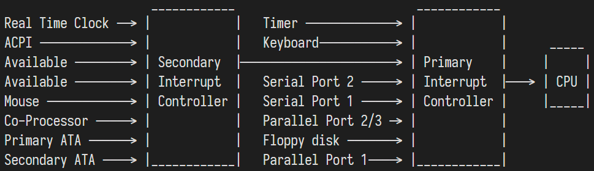

- 硬件通过硬件中断的方式告知CPU有硬件事件的发生
- 所有硬件并不是和CPU直连，而是和一个统一的**中断控制器(Interrupt Controller)**连接
- 
- 大多数中断控制器都是可编程的，可自行设置**中断优先级**
- # 8259 PIC
	- 是一款发布于1976年的**可编程中断控制器(Programmable Interrupt Controller, PIC)**
	- 已被更先进的**APIC**替代，但是其接口仍然由于兼容问题被现有系统支持
	- 8259 PIC的设置非常简单
	- 一个使用8259的典型系统会使用两片8259组成一个主仆系统
	- 
	- PIC默认情况下只会将0-15的中断编号发给CPU，然而CPU内部已经有了一些默认中断编号，因此不能直接使用，需要重新编码PIC的编号
	-