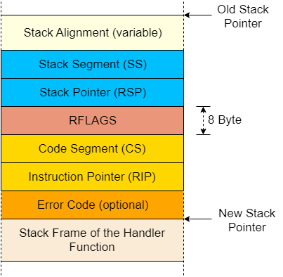

- # 异常
	- x86架构中，存在20种不同的CPU异常类型，以下列举**重要的几种**
		- **Page Fault**
			- 非法访问内存触发，例如当前指令试图访问未被映射的页、试图写入只读页等
		- **Invalid Opcode**
			- 当前指令操作无效
		- **General Protection Fault**
			- 权限异常，试图使用用户态代码执行特权指令，或修改配置寄存器保留字段
		- **Double Fault**
			- 错误发生后，CPU会调用异常处理函数，若在异常处理函数中再次发生错误则抛出此错误。没有注册错误处理函数也为触发此错误
		- **Triple Fault**
			- 调用了处理Double Fault的函数仍然无法成功处理double fault，则抛出此错误
			- 此错误是致命级别的**三重异常**，大多数操作系统此时会选择重置数据并重启操作系统
	- 完整**异常列表**如下：
	  collapsed:: true
		- | Name | Vector nr. | Type | Mnemonic | Error code? |
		  | [Division Error](https://wiki.osdev.org/Exceptions#Division_Error) | 0 (0x0) | Fault | #DE | No |
		  | [Debug](https://wiki.osdev.org/Exceptions#Debug) | 1 (0x1) | Fault/Trap | #DB | No |
		  | [Non-maskable Interrupt](https://wiki.osdev.org/Non_Maskable_Interrupt) | 2 (0x2) | Interrupt | - | No |
		  | [Breakpoint](https://wiki.osdev.org/Exceptions#Breakpoint) | 3 (0x3) | Trap | #BP | No |
		  | [Overflow](https://wiki.osdev.org/Exceptions#Overflow) | 4 (0x4) | Trap | #OF | No |
		  | [Bound Range Exceeded](https://wiki.osdev.org/Exceptions#Bound_Range_Exceeded) | 5 (0x5) | Fault | #BR | No |
		  | [Invalid Opcode](https://wiki.osdev.org/Exceptions#Invalid_Opcode) | 6 (0x6) | Fault | #UD | No |
		  | [Device Not Available](https://wiki.osdev.org/Exceptions#Device_Not_Available) | 7 (0x7) | Fault | #NM | No |
		  | [Double Fault](https://wiki.osdev.org/Exceptions#Double_Fault) | 8 (0x8) | Abort | #DF | Yes (Zero) |
		  | ~~[Coprocessor Segment Overrun](https://wiki.osdev.org/Exceptions#Coprocessor_Segment_Overrun)~~ | 9 (0x9) | Fault | - | No |
		  | [Invalid TSS](https://wiki.osdev.org/Exceptions#Invalid_TSS) | 10 (0xA) | Fault | #TS | Yes |
		  | [Segment Not Present](https://wiki.osdev.org/Exceptions#Segment_Not_Present) | 11 (0xB) | Fault | #NP | Yes |
		  | [Stack-Segment Fault](https://wiki.osdev.org/Exceptions#Stack-Segment_Fault) | 12 (0xC) | Fault | #SS | Yes |
		  | [General Protection Fault](https://wiki.osdev.org/Exceptions#General_Protection_Fault) | 13 (0xD) | Fault | #GP | Yes |
		  | [Page Fault](https://wiki.osdev.org/Exceptions#Page_Fault) | 14 (0xE) | Fault | #PF | Yes |
		  | Reserved | 15 (0xF) | - | - | No |
		  | [x87 Floating-Point Exception](https://wiki.osdev.org/Exceptions#x87_Floating-Point_Exception) | 16 (0x10) | Fault | #MF | No |
		  | [Alignment Check](https://wiki.osdev.org/Exceptions#Alignment_Check) | 17 (0x11) | Fault | #AC | Yes |
		  | [Machine Check](https://wiki.osdev.org/Exceptions#Machine_Check) | 18 (0x12) | Abort | #MC | No |
		  | [SIMD Floating-Point Exception](https://wiki.osdev.org/Exceptions#SIMD_Floating-Point_Exception) | 19 (0x13) | Fault | #XM/#XF | No |
		  | [Virtualization Exception](https://wiki.osdev.org/Exceptions#Virtualization_Exception) | 20 (0x14) | Fault | #VE | No |
		  | [Control Protection Exception](https://wiki.osdev.org/Exceptions#Control_Protection_Exception) | 21 (0x15) | Fault | #CP | Yes |
		  | Reserved | 22-27 (0x16-0x1B) | - | - | No |
		  | [Hypervisor Injection Exception](https://wiki.osdev.org/Exceptions#Hypervisor_Injection_Exception) | 28 (0x1C) | Fault | #HV | No |
		  | [VMM Communication Exception](https://wiki.osdev.org/Exceptions#VMM_Communication_Exception) | 29 (0x1D) | Fault | #VC | Yes |
		  | [Security Exception](https://wiki.osdev.org/Exceptions#Security_Exception) | 30 (0x1E) | Fault | #SX | Yes |
		  | Reserved | 31 (0x1F) | - | - | No |
		  | [Triple Fault](https://wiki.osdev.org/Exceptions#Triple_Fault) | - | - | - | No |
		  | ~~[FPU Error Interrupt](https://wiki.osdev.org/Exceptions#FPU_Error_Interrupt)~~ | IRQ 13 | Interrupt | #FERR | No |
		-
	- ## 中断描述表(IDT)
		- 捕捉CPU异常要求用户设置一个**中断描述表(Interrupt Descriptor Table, IDT)**
		- 硬件会直接使用此表且不加任何验证，因此需要使用预定义的格式直接写入数据
		- 符号表每一条目都有如下**16字节结构**
		  collapsed:: true
			- | Type | Name | Description |
			  | ---- | ---- | ---- |
			  | u16 | 函数指针 [0:15] | 异常handler函数地址的低16位 |
			  | u16 | GDT selector | **全局描述符表([GDT](https://en.wikipedia.org/wiki/Global_Descriptor_Table))**中的代码段(Code segment)标记 |
			  | u16 | Options | (见下表) |
			  | u16 | Function Pointer [16:31] | 异常handler函数地址的中间16位  |
			  | u32 | Function Pointer [32:63] |异常handler函数地址的剩余位 |
			  | u32 | Reserved |
		- Option**字段结构**如下
		  collapsed:: true
			- | Bits | Name | Description |
			  | ---- | ---- | ---- |
			  | 0-2 | Interrupt Stack Table Index | 0: 不要切换栈, 1-7: 当处理函数被调用时，切换到中断栈表的第n层。 |
			  | 3-7 | Reserved |  |
			  | 8 | 0: Interrupt Gate, 1: Trap Gate | 如果该比特被置为0，当处理函数被调用时，中断会被禁用。 |
			  | 9-11 | must be one |  |
			  | 12 | must be zero |  |
			  | 13‑14 | Descriptor Privilege Level (DPL) | 执行处理函数所需的最小特权等级。 |
			  | 15 | Present |
		- 每一个异常都有一个预定义的IDT序列号(即不能自定义IDT序号，否则CPU在处理异常时无法找到正确的异常处理函数)，在异常列表中已经列出对应的序号
	- ## 异常处理步骤
		- 将寄存器数据入栈，包括指令指针和**RFLAGS寄存器**
		- 读取IDT中的对应条目
		- 若该条目不存在，触发**Double Fault**
		- 若该条目要求**关中断**(即中断门(Interrupt Gate)，option中(整个entry的第40位)设置了关中断)，则禁用硬件中断
		- 将GDT选择器载入代码段寄存器(CS segment)
		- 跳转执行处理函数
- # IDT类型
	- 与其自己定义IDT的映射类，不如直接使用``x86_64`` crate 中的内置的``InterruptDecriptorTable``结构体，其类似于：
		- ```rust
		  #[repr(C)]
		  pub struct InterruptDescriptorTable {
		      pub divide_by_zero: Entry<HandlerFunc>,
		      pub debug: Entry<HandlerFunc>,
		      pub non_maskable_interrupt: Entry<HandlerFunc>,
		      pub breakpoint: Entry<HandlerFunc>,
		      pub overflow: Entry<HandlerFunc>,
		      pub bound_range_exceeded: Entry<HandlerFunc>,
		      pub invalid_opcode: Entry<HandlerFunc>,
		      pub device_not_available: Entry<HandlerFunc>,
		      pub double_fault: Entry<HandlerFuncWithErrCode>,
		      pub invalid_tss: Entry<HandlerFuncWithErrCode>,
		      pub segment_not_present: Entry<HandlerFuncWithErrCode>,
		      pub stack_segment_fault: Entry<HandlerFuncWithErrCode>,
		      pub general_protection_fault: Entry<HandlerFuncWithErrCode>,
		      pub page_fault: Entry<PageFaultHandlerFunc>,
		      pub x87_floating_point: Entry<HandlerFunc>,
		      pub alignment_check: Entry<HandlerFuncWithErrCode>,
		      pub machine_check: Entry<HandlerFunc>,
		      pub simd_floating_point: Entry<HandlerFunc>,
		      pub virtualization: Entry<HandlerFunc>,
		      pub security_exception: Entry<HandlerFuncWithErrCode>,
		      // some fields omitted
		  }
		  ```
	- `HandleFunc`的定义为：
		- ```rust
		  type HandlerFunc = extern "x86-interrupt" fn(_: InterruptStackFrame);
		  ```
		- 其中，``"x86-interrupt"``是一种调用约定(ABI的一种)
	- ## 中断调用约定
		- 在X86_64 Linux中，C语言函数的调用约定为(System V ABI标准)：
			- 前六个整形参数从寄存器``rdi, rsi, rdx, rcx, r8, r9``传入
			- 其他参数从栈传入
			- 函数返回值存放在``rax``和``rdx``
		- 然而Rust实际上并不遵守C ABI，而是一套它们尚未张氏发布的Rust ABI草案
			- 只有``extern "C" fn``定义的函数才会遵守C ABI
		- ### 保留寄存器和临时寄存器
			- 调用约定将寄存器分为两部分
			- 也就是被调用者保存和调用者保存
			- 前者被调用者必须保证自己将控制权返回之后，保留寄存器的值不会发生变化
			- 后者会被被调用者随意读写，因此如果调用者希望这些寄存器的值保持不变，就必须自己保存这些寄存器中的值
			- x86_64下的寄存器分类：
				- | 保留寄存器 | 临时寄存器 |
				  | ---- | ---- | ---- |
				  | `rbp`, `rbx`, `rsp`, `r12`, `r13`, `r14`, `r15` | `rax`, `rcx`, `rdx`, `rsi`, `rdi`, `r8`, `r9`, `r10`, `r11` |
				  | *callee-saved* | *caller-saved* |
		- ###
		- ### 保存所有寄存器数据
			- 与一般的函数调用不同，异常可能会被**任何指令触发**
				- 因此当异常被触发时，往往不会有一般调用函数时的保存上下文(寄存器)的指令
				- 所以异常处理函数往往需要保存所有的寄存器
		- ### 中断栈帧
			- 对于中断处理函数，仅仅压入返回地址往往是不够的
			- 在中断处理时，CPU处理**栈数据**的方法如下：
				- **对齐栈指针**
					- 任何指令都可能触发中断，所以栈指针可能是任何值
					- 部分CPU指令需要栈指针16字节边界对齐，因此CPU会在中断触发后立刻进行栈指针对齐
				- **切换栈**(可能)
					- 若CPU特权等级改变时，例如一个用户态程序触发CPU异常，栈切换会被触发
					- 此行为也能被***中断栈表***配置
				- **压入旧栈指针**
					- 中断触发后，栈指针对齐前，CPU会将栈指针寄存器(`rsp`)和栈段寄存器(`ss`)入栈
					- 以便在中断处理函数返回后恢复上一层栈指针
				- **压入并更新`RFLAGS`寄存器**
					- RFLAGS寄存器包含了各种空值位和状态位，CPU可能会修改其中的某些数值，并入栈旧值
				- **压入指令指针**
					- 将指令指针寄存器(`rip`)和代码段寄存器(`cs`)入栈
					- 此过程与常规函数调用中的返回地址入栈类似
				- **压入错误码**(可能)
					- 对于部分特定一场，例如page fault，CPU会压入错误码以标记错误成因
				- **执行中断处理函数**
					- 在完成以上准备之后，CPU开始读取IDT条目中描述的中断处理函数对应的**地址**和**段描述符**，将两者分别载入`rip`和`cs`以开始运行处理函数
			- 一个完整的终端栈帧形如：
				- {:height 245, :width 242}
			- `x86_64`crate的`InterruptStackFrame`已经完整表达了一个中断栈帧的结构
			- 一个结构体变量会被以**可变引用**的方式传入处理函数
			- 此结构体并不包含错误码，只要极少数错误的处理需要错误码
				- 对于需要错误码的错误处理函数，其函数类型为`HandleFuncWithErrCode`
			-