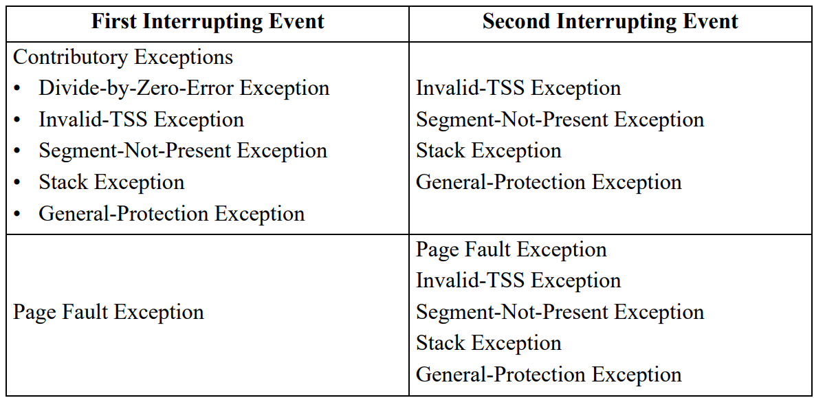

- # Double Fault的成因
	- 并不是任何时候只要两个fault接连出现就会触发double fault，**AMD64手册**定义了哪些嵌套异常会触发double fault
	- 
	- 按照上表，只有**处理**对应的**一层异常**的时候，出现了相应的**二层异常**才会抛出double fault
	- 否则，在处理某个异常时出现其他的异常，则直接调用二层异常的处理函数即可
	- 不注册异常处理函数触发double fault的
	- **[[$red]]==单纯注册Double Fault的handler无法完全避免出现Triple Fault==**
	- ## 内核栈溢出
		- 一般为了保护内存访问，在栈的底部可能会存在一些特殊的内存页，即**guard page**
		- 假设一次内存访问越界了，会产生一个``Page Fault``
		- 此时CPU根据IDT寻找此错误的handler，但是在将错误栈帧入栈时，由于栈指针指向guard page，又会产生一个page fault，于是会产生一个double fault，又因为在产生double fault时仍然试图入栈栈帧，因此就会产生无法回复的triple fault
- # 切换栈
	- 为了避免以上问题，x86_64架构允许在异常发生时，将栈切换为一个预定义好的**完好栈**
		- 此切换行为在硬件层次执行，所以可以在CPU将异常栈帧入栈之前执行
	- 此切换机制由**中断栈表(Interrupt Stack Table, IST)**实现
		- IST由7个确认可用的**完好栈**的**指针**组成，使用rust可表述为：
			- ```rust
			  struct InterruptStackTable {
			      stack_pointers: [Option<StackPointer>; 7],
			  }
			  ```
	- 对于每一个错误处理函数，都可以将IDT条目中的``stack_pointers``项指定IST中的一个栈
	- ## IST和TSS
		- IST实际上是一个名叫**任务状态段(Task State Segment)**的上古遗留结构的一部分
		- TSS是x86架构中使用的一种数据结构，用于管理人物的上下文切换和特权级别的转换
			- 其一般用于存储32位任务中的零碎信息，例如寄存器状态等
			- 但是在64位架构中，硬件上下文切换已经不再适用，普遍采用软件上下文切换
		- 在x86_64架构中，TSS不再存储任何与任务相关的信息，其结构如下
			- | 字段 | 类型 |
			  | ---- | ---- | ---- |
			  | (保留) | `u32` |
			  | 特权栈表 | `[u64; 3]` |
			  | (保留) | `u64` |
			  | 中断栈表 | `[u64; 7]` |
			  | (保留) | `u64` |
			  | (保留) | `u16` |
			  | I/O映射基准地址 | `u16` |
		- **特权栈表(Privilege Stack Table, PST)**在CPU特权等级变更时会被用到
	- ## 创建一个TSS
		- 详见代码
		- ### 加载TSS
			- 加载TSS比较繁琐，因为TSS用到了**分段系统**(历史原因)
			- 可以不直接在在而是在**全局描述符(GDT)**中添加一个**段描述符**，然后通过``ltr``指令加上GDT序号来加载TSS(也是模块取名为GDT的原因)
	-