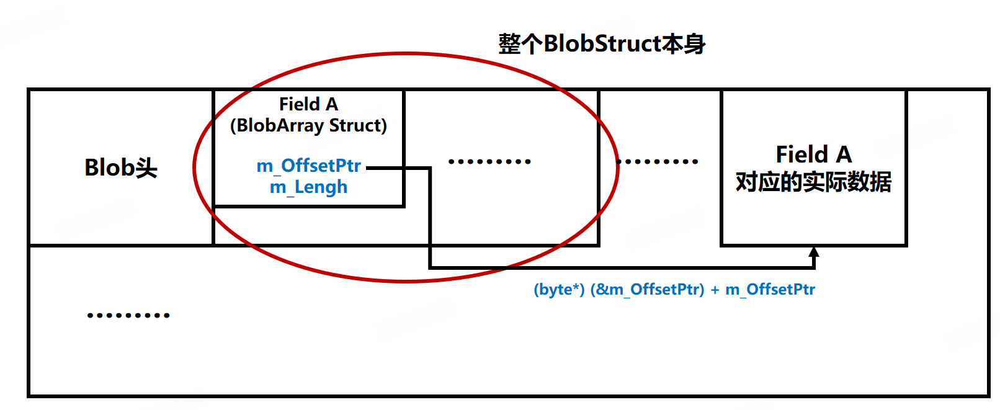

# Blob Asset的创建和内存布局
	- ## 创建Blob Asset根节点资源
		- 所谓根节点，可以理解为一个描述头，也就是正真的Blob Asset Struct所占的空间，这个struct本身
		- 例如，以下面的Blob Asset Struct为例：
			- ```C#
			  public struct SomeConfig
			  {
			      public BlobArray<BlobStructTypeA> A;
			      public BlobArray<BlobStructTypeB> B;
			      public BlobArray<BlobStructTypeC> C;
			      public BlobArray<uint> D;
			  }
			  ```
			- 这个struct本身的大小其实就是四个BlobArray的大小（外加对齐填充，如果有）
		- 而一个BlobArray本身其实也只是一个头，所占内存也很小，仅存储数据地址和数组长度
			- ```C#
			      /// <summary>
			      ///  An immutable array of value types stored in a blob asset.
			      /// </summary>
			      /// <remarks>When creating a blob asset, use the <see cref="BlobBuilderArray{T}"/> provided by a
			      /// <see cref="BlobBuilder"/> instance to set the array elements.</remarks>
			      /// <typeparam name="T">The data type of the elements in the array. Must be a struct or other value type.</typeparam>
			      /// <seealso cref="BlobBuilder"/>
			      [MayOnlyLiveInBlobStorage]
			      [DebuggerDisplay("Cannot display the value of a " + nameof(BlobArray<T>) + " by itself. Please inspect the root BlobAssetReference instead.")]
			      public unsafe struct BlobArray<T> where T : struct
			      {
			          internal int m_OffsetPtr;
			          internal int m_Length;
			  
			  		....
			      }
			  ```
		- 在创建Blob Asset时，第一件事就是先把这个SomeConfig struct 本身先创建出来，这一步调用``BlobBuilder.ConstructRoot<T>``完成
			- 这个函数本身也没做啥，就是分配出一块大小为struct的空间，然后作为要分配的BlobAsset Struct 的 ref 返回
			- ```C#
			  public ref T ConstructRoot<T>() where T : struct
			  {
			      var allocation = Allocate(UnsafeUtility.SizeOf<T>(), UnsafeUtility.AlignOf<T>());
			      return ref UnsafeUtility.AsRef<T>(AllocationToPointer(allocation));
			  }
			  ```
	- ## 创建各个field
		- 接下来就是针对struct中的每一个field进行创建，以`BlobArray`为例，这一步通过调用`BlobBuilder.Allocate`完成
		- ```C#
		  public BlobBuilderArray<T> Allocate<T>(ref BlobArray<T> ptr, int length) where T : struct
		  {
		      return Allocate(ref ptr, length, UnsafeUtility.AlignOf<T>());
		  }
		  ```
		- 拿到返回的`BlobBuilderArray`之后就可以开始填充数据了
			- `BlobBuilderArray`重载了`[]`操作符，用index去取的数据实际就是在BlobBuilder中复配并记录下的内存地址，对某个index对应元素的操作能直接反映到BlobBuilder中
	- ## Blob Asset的内存分配
		- `BlobBuilder`中有很多个Allocate函数，都是参数和返回值不同的重载，最核心的就是下面这个`Allocate`
		- ```C#
		  BlobDataRef Allocate(int size, int alignment)
		  {
		      if (size > m_chunkSize)
		      {
		          size = CollectionHelper.Align(size, 16);
		          var allocIndex = m_allocations.Length;
		          var mem = (byte*)Memory.Unmanaged.Allocate(size, alignment, m_allocator);
		          UnsafeUtility.MemClear(mem, size);
		          m_allocations.Add(new BlobAllocation {p = mem, size = size});
		          return new BlobDataRef {allocIndex = allocIndex, offset = 0};
		      }
		  
		      BlobAllocation alloc = EnsureEnoughRoomInChunk(size, alignment);
		  
		      var offset = alloc.size;
		      UnsafeUtility.MemClear(alloc.p + alloc.size, size);
		      alloc.size += size;
		      m_allocations[m_currentChunkIndex] = alloc;
		      return new BlobDataRef {allocIndex = m_currentChunkIndex, offset = offset};
		  }
		  ```
		- `BlobBuilder`内部有一个`m_allocations`成员记录了每一次申请的内存
			- 内存申请是按照chunk来的，每次分配时，如果当前chunk还有余量，则直接分配在当前chunk内，否则``EnSureEnoughRoomInChunk``函数会返回一个新的allocation，该allocation也就是一个新的chunk
			- 如果这次要求分配的内存大小超过了一个chunk大小，会申请一片新的对齐大小的内存，相关信息保存在一个新的allocation中
		- 对于每一个field，通过上述`Allocate`函数拿到内存分配信息之后，还会记录自身field相关信息，以`BlobArray` field为例，其对应的allocate函数为：
			- ```C#
			  public BlobBuilderArray<T> Allocate<T>(ref BlobArray<T> ptr, int length, int alignment) where T : struct
			  {
			      if (length <= 0)
			          return new BlobBuilderArray<T>(null, 0);
			  
			      if (!math.ispow2(alignment))
			          throw new ArgumentException("Alignment must be a power of two");
			  
			      if (alignment > 16)
			          throw new ArgumentException("Alignment larger than 16 is not supported");
			  
			      var offsetPtr = (int*)UnsafeUtility.AddressOf(ref ptr.m_OffsetPtr);
			  
			      ValidateAllocation(offsetPtr);
			  
			      var allocation = Allocate(UnsafeUtility.SizeOf<T>() * length, alignment);
			  
			      var patch = new OffsetPtrPatch
			      {
			          offsetPtr = offsetPtr,
			          target = allocation,
			          length = length
			      };
			  
			      m_patches.Add(patch);
			      return new BlobBuilderArray<T>(AllocationToPointer(allocation), length);
			  }
			  ```
			- 通过`Allocate`函数拿到内存分配信息之后，还会把自身内部的offsetPtr这个field的地址（**[[$red]]==注意是这个BlobArray.m_OffsetPtr这个field本身的地址，而不是这个field指向的地址==**，其实际地址就在之前分配的跟节点对应的内存中）和分配信息存到`m_patches`中
		- `m_patches`保存的是每一个field的相关分配信息
	- ## 创建实际使用的Blob Asset
		- 以上所做的所有分配其实都是在`BlobBuilder`所申请和记录的内存中的，这些内存分配往往是临时的，而且是不连续的，访问性能并不好，在创建完成之后不久就会被释放掉。因此在完成了数据填充之后，还需要调用``CreateBlobAssetReference``来完成最终的Blob Asset创建
		- ```C#
		  public BlobAssetReference<T> CreateBlobAssetReference<T>(AllocatorManager.AllocatorHandle allocator) where T : unmanaged
		  {
		      //Align last chunk upwards so all chunks are 16 byte aligned
		      AlignChunk(m_currentChunkIndex);
		  
		      var offsets = new NativeArray<int>(m_allocations.Length + 1, Allocator.Temp);
		      var sortedAllocs = new NativeArray<SortedIndex>(m_allocations.Length, Allocator.Temp);
		  
		      offsets[0] = 0;
		      for (int i = 0; i < m_allocations.Length; ++i)
		      {
		          offsets[i + 1] = offsets[i] + m_allocations[i].size;
		          sortedAllocs[i] = new SortedIndex {p = m_allocations[i].p, index = i};
		      }
		      int dataSize = offsets[m_allocations.Length];
		  
		      sortedAllocs.Sort();
		      var sortedPatches = new NativeArray<SortedIndex>(m_patches.Length, Allocator.Temp);
		      for (int i = 0; i < m_patches.Length; ++i)
		          sortedPatches[i] = new SortedIndex {p = (byte*)m_patches[i].offsetPtr, index = i};
		      sortedPatches.Sort();
		  
		      byte* buffer = (byte*)Memory.Unmanaged.Allocate(sizeof(BlobAssetHeader) + dataSize, 16, allocator);
		      byte* data = buffer + sizeof(BlobAssetHeader);
		  
		      for (int i = 0; i < m_allocations.Length; ++i)
		          UnsafeUtility.MemCpy(data + offsets[i], m_allocations[i].p, m_allocations[i].size);
		  
		      int iAlloc = 0;
		      var allocStart = m_allocations[sortedAllocs[0].index].p;
		      var allocEnd = allocStart + m_allocations[sortedAllocs[0].index].size;
		  
		      for (int i = 0; i < m_patches.Length; ++i)
		      {
		          int patchIndex = sortedPatches[i].index;
		          int* offsetPtr = (int*)sortedPatches[i].p;
		  
		          while (offsetPtr >= allocEnd)
		          {
		              ++iAlloc;
		              allocStart = m_allocations[sortedAllocs[iAlloc].index].p;
		              allocEnd = allocStart + m_allocations[sortedAllocs[iAlloc].index].size;
		          }
		  
		          var patch = m_patches[patchIndex];
		  
		          int offsetPtrInData = offsets[sortedAllocs[iAlloc].index] + (int)((byte*)offsetPtr - allocStart);
		          int targetPtrInData = offsets[patch.target.allocIndex] + patch.target.offset;
		  
		          *(int*)(data + offsetPtrInData) = targetPtrInData - offsetPtrInData;
		          if (patch.length != 0)
		          {
		              *(int*)(data + offsetPtrInData + 4) = patch.length;
		          }
		      }
		  
		      sortedPatches.Dispose();
		      sortedAllocs.Dispose();
		      offsets.Dispose();
		  
		      BlobAssetHeader* header = (BlobAssetHeader*)buffer;
		      *header = new BlobAssetHeader();
		      header->Length = (int)dataSize;
		      header->Allocator = allocator;
		  
		      // @TODO use 64bit hash
		      header->Hash = math.hash(buffer + sizeof(BlobAssetHeader), dataSize);
		  
		      BlobAssetReference<T> blobAssetReference;
		      blobAssetReference.m_data.m_Align8Union = 0;
		      header->ValidationPtr = blobAssetReference.m_data.m_Ptr = buffer + sizeof(BlobAssetHeader);
		  
		      return blobAssetReference;
		  }
		  ```
		- 这个函数主要做了五件事：
			- **统计分配信息**
				- 分别统计内存分配信息和field分配信息，排序field的分配，得出最终总的数据大小
			- **申请连续内存**
				- 申请一块等于数据大小+Blob头的连续内存
			- **拷贝数据**
				- 把每一个allocation的数据都拷贝到申请的内存中
			- **填充field数据**
				- 根据patch中的信息，算出实际数据地址到某个field自身地址的偏移，并写入申请的内存中
				- 如果有长度信息，则也一并写入
			- **填充Blob头数据并返回一个创建好的BlobAssetReference**
	- ## 内存布局图示
		- 
		- 每一个m_OffsetPtr存储的是，实际数据到自身地址的偏移量，因此只需要使用自身地址(使用`&`取地址)加上自身的值即可得出对应数据的地址
- # 对Blob Asset的访问
	- ## 为什么只能用ref来访问一个Blob Asset？
		- 如内存布局图所示，blob asset所有blob field存的都是相对自身地址的偏移，所以如果在拿一个Blob Struct的时候不拿根据BlobBuilder创建好的BlobReference中数据所在的地址，而是单纯只拷贝一份Blob Struct是无法正确读到数据的（相当于只拷贝了头，没有拷贝跟在后面的具体数据）。
		- 所有的Blob struct都有这个属性，所以都只能用ref来访问，例如BlobArray，其重载了`[]`运算符，返回的值，就是根据相对地址偏移拿到的：
			- ```C#
			  public ref T this[int index]
			  {
			      get
			      {
			          AssertIndexInRange(index);
			  
			          fixed (int* thisPtr = &m_OffsetPtr)
			          {
			              return ref UnsafeUtility.ArrayElementAsRef<T>((byte*) thisPtr + m_OffsetPtr, index);
			          }
			      }
			  }
			  ```