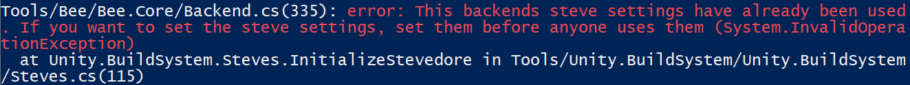
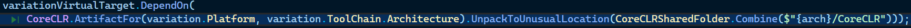

title:: Build系统行为

- 目前看来是：
	- ``jam.bat`` 调用 ``jam.pl`` 调用 ``bee`` 读取 BuildSystem下的建造脚本
- # `jam.pl`
	- 在windows下，在项目目录下能直接使用``bat``指令能运行建造系统的原因应该是调用了``jam.bat``批处理文件
		- 此文件就一行语句，即直接调用当前目录下的``jam.pl``脚本文件，并且把其接收到的所有命令行参数传递给perl
	- 会做一些判断，收集一些信息，包括：
		- 为了向下兼容，会将一些已经被淘汰的命令行参数做替换
		- 检查并设置一些环境变量，如代理设置
		- 检查bee是否已经build好，调用编译器build bee
	- 最终会调用bee可执行文件，并把命令行参数传给bee
	- 根据debug执行，在第197行调用``bee``
		- 
		- ``beePath``的值为``Tools\Bee\build\Distribution\Standalone\Release\bee``
		- ``args``是被处理过的命令行参数数组
- 感觉``jam.pl``和``build.pl``是两套独立的建造系统
- # Bee
	- 直接在`beePath`和项目根目录下调用``bee --help``会得到不同的输出，怀疑是项目根目录下的``bee.config``改变了bee的行为
	- bee似乎也只是调用了``Tools\Unity.BuildSystem\``下的一些东西，``jam --help``的输出内容能在``Tools\Unity.BuildSystem\Unity.BuildSystem\Help.cs``中找到
- # Unity.BuildSystem
	- 应该是实际完成build的项目，**[[$red]]==暂不清楚bee是如何与这个项目互动的==**
		- 答案是在项目根目录下的``bee.config``对建造过程进行了配置
			- 
			- 制定了建造脚本，工作目录和bee可执行问价你的目录
	- 首先判断命令行参数中是否有``--help``，如果有
	- 根据这篇[文档](https://yousandi.feishu.cn/wiki/T7LuwNM8JiJKqWkDcUAcaI69n0e)，可以直接对建造系统进行debug
	- Debug时一个比较奇怪的现象是如果从entry point开始逐步debug执行，在``Main.cs``的112行会触发exception
		- 
		- 而在非debug运行时不会触发这个问题
		- 目前怀疑是debug运行改变了程序的某些行为，发现一个解决方法是**直接跳过此语句**，在此语句之后的某个地方打断点，然后选择继续执行即可
	- debug只到``Main.cs``的103行，之后的行为debugger里看不到
		- 感觉buld system只是完成了前端工作，实际进行action的后端需要别的方法来追踪(可能)
	- ``CoreCLR``运行时似乎**是直接从stevedore上下载后解压的**
		- 
		- 解压的目录是``build\WindowsStandaloneSupport\Variations\CoreCLRShared\x64\CoreCLR``
		- 这个目录下的运行时很奇怪，确实很多关键目录和文件，以至于``dotnet``根本无法使用
			- 例如缺失正常``dotnet``运行时目录下的``host``目录
	-