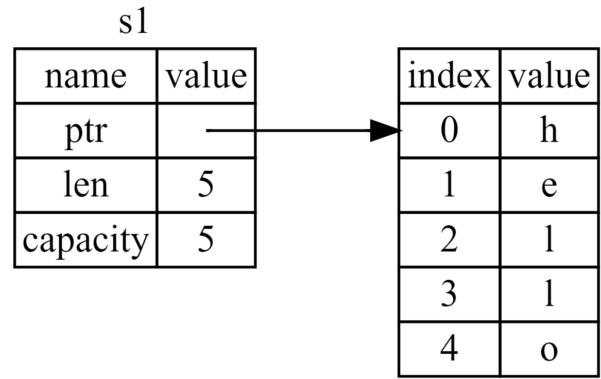
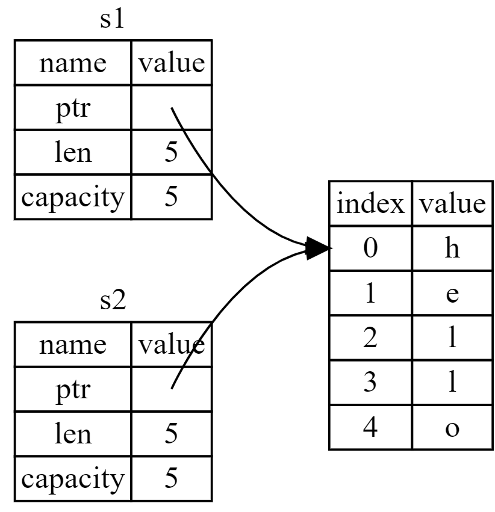
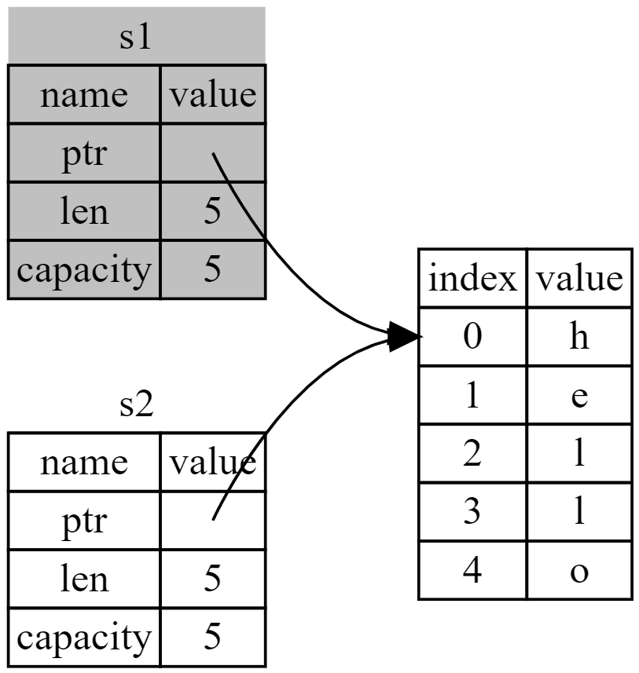
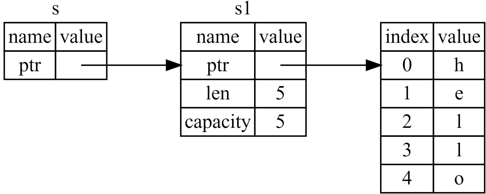

- 所有权系统是rust最为与众不同的特性，使得**rust无需垃圾回收(garbage collect)即可保证内存安全**
- # 什么是所有权
	- 所有权是一组rust程序用于管理内存的**规则**(rule)
	- 通过遵守这些规则，rust程序可以在没有gc的情况下管理内存，若有规则被违反，**[[$red]]==编译器将拒绝编译==**
	- 所有权规则**不会拖慢**运行速度
	- ## rust的堆栈
		- rust中，栈只会存放**大小已知且固定**的数据
		- **编译时大小未知或可能变化**的数据会在对上分配内存
			- 而指向内存的**指针**大小是已知的，可以放在栈上
		- 入栈(在栈上分配空间)的速度要快于在对上分配内存
		- 调用函数时，传入的参数和函数的局部变量会压入栈中
- # 所有权规则
	- **rust中每一个值都有一个[[$red]]==所有者(owner)==**
	- **值在同一时刻[[$red]]==只能有一个所有者==**
	- **当所有者(变量)离开作用域，[[$red]]==值将会被抛弃==**
	- ## 变量的作用域
		- 一个变量从被声明到作用域结束**都是有效的**
	- ## 内存与分配
		- 在rust中，由于**大小未知**，``String``的管理是在堆上的
			- 新建一个``String``对象，可以使用``String::new()``也可以使用``String::from("")``从字面量构造一个String
		- 对于``String``类型，为了支持一个可变，可增长的文本片段，需要：
			- 内存必须在运行时想**内存分配器(memory allocator)**申请
			- 需要一种在使用完毕``String``之后，将内存返还给分配器的方法
		- 第一步通过``String::from``这样的函数能够实现
		- 第二步，rust会在作用域的末尾(`}`)自动调用变量的drop函数，drop函数由``String``的作者负责实现，其中的行为便是释放``String``的内存
	- ## 变量与数据的交互方式(1)：移动
		- 对于已知大小的值，在交替赋值时往往采用的是**[[$red]]==拷贝==**的方式，栈上会放置两份数据，例如：
			- ```rust
			  let x = 5;
			  let y = x;
			  ```
		- 对于动态变化的值，情况将不同
			- ```rust
			  let s1 = String::from("hello");
			  let s2 = s1;
			  ```
			- 一个``String``对象实际上由多个部分组成
				- {:height 240, :width 366}
				- 一个指向堆中实际字符内容的指针
				- 字符串的长度
				- 字符串的容量
			- 因此当后续将`s1`赋给`s2`时，堆中的实际内容并不会再赋值一份，而是直接将指针，长度，容量复制过去
				- {:height 324, :width 307}
			- 然而如果有两个指针都指向同一块内存，当着两个指针都被`drop`时将导致而此释放，因此`s1`被赋值给`s2`之后**便认为`s1`不再有效**，以下代码会编译错误
				- ```rust
				  let s1 = String::from("hello");
				  let s2 = s1;
				  println!("{}, world!", s1);
				  ```
				- 实际上就相当于C++中的**移动语义**，只不过这个释放操作需要在类的移动构造函数中由程序员手动编写释放被移动对象的内存(一般是置空指针)
				- {:height 274, :width 254}
		- **rust[[$red]]==永远不会自动创建数据的“深拷贝”==**，因此**自动的复制**可以被看作对性能影响不大
	- ## 与变量交互的方式(2)：克隆
		- 若确实需要深度复制堆上的数据，则需要**显式调用`clone`函数**
			- ```rust
			  let s1 = String::from("hello");
			  let s2 = s1.clone();
			  println!("s1 = {}, s2 = {}", s1, s2);
			  ```
		- 对于在栈上的数据，拷贝数都很快，因此默认都是直接拷贝一份，**不存在深拷贝和浅拷贝的区别**
		- rust中有一个叫做``Copy``的trait(类似于其它语言中的接口)
			- 对于在栈上的类型可以实现此trait，实现之后被赋值的变量在赋值之后**仍然可用**
			- 可以查阅文档来确认某一类型是否实现了``Copy``，但是一般来说，任何一组**简单标量值的组合**都可以实现`Copy`，任何**不需要分配内存或某种形式资源的类型**都可以实现``Copy``，包括
				- 所有**整数类型**
				- **布尔类型**
				- 所有**浮点类型**
				- **字符类型**
				- **n元组**
					- 当其包含的所有类型也都实现了``Copy``
		- 同时，**任何[[$red]]==自身或其任何部分(成员变量)==实现了``Drop``trait的类型都[[$red]]==不允许使用==``Copy`` trait**
- # 所有权与函数
	- 向函数传递值可能会移动或复制，机制**和赋值类似**
	- ```rust
	  fn main() {
	      let s = String::from("hello");  // s 进入作用域
	  
	      takes_ownership(s);             // s 的值移动到函数里 ...
	                                      // ... 所以到这里不再有效
	  
	      let x = 5;                      // x 进入作用域
	  
	      makes_copy(x);                  // x 应该移动到函数里，
	                                      // 但 i32 是 Copy 的，
	                                      // 所以在后面可继续使用 x
	  
	  } // 这里，x 先移出了作用域，然后是 s。但因为 s 的值已被移走，
	    // 没有特殊之处
	  
	  fn takes_ownership(some_string: String) { // some_string 进入作用域
	      println!("{}", some_string);
	  } // 这里，some_string 移出作用域并调用 `drop` 方法。
	    // 占用的内存被释放
	  
	  fn makes_copy(some_integer: i32) { // some_integer 进入作用域
	      println!("{}", some_integer);
	  } // 这里，some_integer 移出作用域。没有特殊之处
	  ```
	- ## 返回值与作用域
		- ```rust
		  fn main() {
		      let s1 = gives_ownership();         // gives_ownership 将返回值
		                                          // 转移给 s1
		  
		      let s2 = String::from("hello");     // s2 进入作用域
		  
		      let s3 = takes_and_gives_back(s2);  // s2 被移动到
		                                          // takes_and_gives_back 中，
		                                          // 它也将返回值移给 s3
		  } // 这里，s3 移出作用域并被丢弃。s2 也移出作用域，但已被移走，
		    // 所以什么也不会发生。s1 离开作用域并被丢弃
		  
		  fn gives_ownership() -> String {             // gives_ownership 会将
		                                               // 返回值移动给
		                                               // 调用它的函数
		  
		      let some_string = String::from("yours"); // some_string 进入作用域。
		  
		      some_string                              // 返回 some_string 
		                                               // 并移出给调用的函数
		                                               // 
		  }
		  
		  // takes_and_gives_back 将传入字符串并返回该值
		  fn takes_and_gives_back(a_string: String) -> String { // a_string 进入作用域
		                                                        // 
		  
		      a_string  // 返回 a_string 并移出给调用的函数
		  }
		  ```
- # 引用与借用
	- 由于默认都是使用的**移动语义**，调用了函数之后除非函数主动返回所有权，否则作为参数传入的变量之后都无法使用，这会**导致不便**
	- 因此**引用(Reference)**的引入显得格外重要
		- 引用类似于指针，它指指向某个变量的地址，而不真的获取所有权
		- ```rust
		  fn main() {
		      let s1 = String::from("hello");
		      let len = calculate_length(&s1);
		      println!("The length of '{}' is {}.", s1, len);
		  }
		  fn calculate_length(s: &String) -> usize { // s 是 String 的引用
		      s.len()
		  } // 这里，s 离开了作用域。但因为它并不拥有引用值的所有权，
		    // 所以什么也不会发生
		  ```
		- {:height 252, :width 605}
		-
	- **创建一个引用的行为被称为[[$red]]==借用==(Borrowing)**
	- ## 可变引用
		- **一个引用的作用域[[$red]]==从声明到最后一次使用为止==**
			- 若声明之后从来不使用，**则相当于没有声明过**
		- 引用并不能改变原对象的大小，所需改变，则需要使用**[[$red]]==可变引用==**
		- ```rust
		  fn main() {
		      let mut s = String::from("hello");
		  
		      change(&mut s);
		  }
		  fn change(some_string: &mut String) {
		      some_string.push_str(", world");
		  }
		  ```
		- 使用可变引用，**调用者需要显式使用``&mut``**，被调用函数生命的形参也需要**显式告知编译器，此形参可变**
		- 可变引用有一个限制：**[[$red]]==如果已经创建了一个某变量的可变引用，则不能再创建可变引用==**
			- ```rust
			  let mut s = String::from("hello");
			  let r1 = &mut s;
			  let r2 = &mut s;
			  println!("{}, {}", r1, r2);
			  ```
			- 以上代码无法通过编译
			- 这一限制可以有效避免**数据竞争(data race)**，数据竞争可能由三种情况引起
				- 两个或以上指针访问同一数据
				- 至少有一个指针被用来写入数据
				- 没有同步数据访问机制
			- 可以使用大括号将代码分隔以创建多个可变引用，但是这些可变引用**不能存在于同一作用域**
				- ```rust
				  let mut s = String::from("hello");
				  {
				      let r1 = &mut s;
				  } // r1 在这里离开了作用域，所以我们完全可以创建一个新的引用
				  let r2 = &mut s;
				  ```
		- 而且，**[[$red]]==也不能在拥有不可变引用的同时创建可变引用==**
			- ```rust
			  let mut s = String::from("hello");
			  let r1 = &s; // 没问题
			  let r2 = &s; // 没问题
			  let r3 = &mut s; // 大问题
			   println!("{}, {}, and {}", r1, r2, r3);
			  ```
			- 允许多个不可变引用存在
		- 但是由于引用作用域的特性(从声明到最后一次使用)，可以写出如下代码：
			- ```rust
			  let mut s = String::from("hello");
			  let r1 = &s; // 没问题
			  let r2 = &s; // 没问题
			  println!("{} and {}", r1, r2);
			  // 此位置之后 r1 和 r2 不再使用
			  let r3 = &mut s; // 没问题
			  println!("{}", r3);
			  ```
	- ## 悬垂引用(Dangling References)
		- 所谓悬垂指针，即**其指向地址[[$red]]==已经被释放==的指针**
		- rust实际上已经从设计上避免了悬垂指针
			- ```rust
			  fn main() {
			      let reference_to_nothing = dangle();
			  }
			  
			  fn dangle() -> &String { // dangle 返回一个字符串的引用
			      let s = String::from("hello"); // s 是一个新字符串
			  
			      &s // 返回字符串 s 的引用
			  } // 这里 s 离开作用域并被丢弃。其内存被释放。
			    // 危险！
			  ```
			- 以上代码无法编译
		-