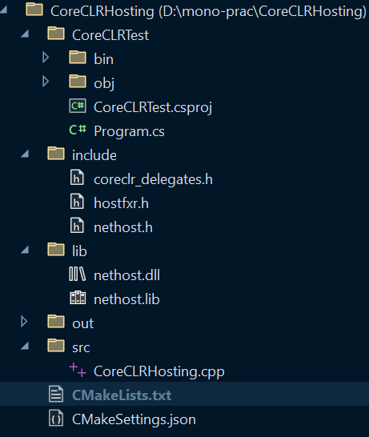
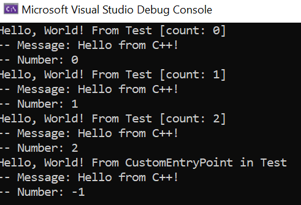

- # 补充
	- ## 布局(Layout)
	  collapsed:: true
		- 在不同语言编写的代码之间进行互调时，数据结构的**布局**相当重要
		- ### 在C++中
			- 能够用于和其他语言代码互动的布局被称为**标准布局(Standard Layout)**
			- 以下类型属于**标准布局类型(Standard-layout types)**
				- **标量(scalar)类型**
					- 算术类型(arithmetic)
						- 整形
						- 浮点数
					- 枚举类型(enumeration)
					- 指针类型(pointer)
					- 指向成员指针类型(Pointer-to-member)
					- 空指针类型(nullptr_t)
					- 以上所有类型的**cv-qualified**版本
						- 即添加了``const``和``volatile``关键字的版本
				- **标准布局class类型**
					- [参看](https://en.cppreference.com/w/cpp/language/classes#Standard-layout_class)
				- 以上类型的数组
				- 以上类型的**cv-qualified**版本
		- ### 在C\#中
			- 使用**bittable**和**non-bittable**概念来区分可直接复制到native结构中的类型和不能直接复制到native结构中的类型
			- bittable类型的定义和C++的标准布局类型的定义类似
			- [参看](https://learn.microsoft.com/zh-cn/dotnet/framework/interop/blittable-and-non-blittable-types)
	- ## 调用约定(Calling Convention)
	  collapsed:: true
		- 调用约定规定了参数如何传入，例如：
			- 从第一个参数开始逐个入栈
			- 从最后一个参数开始逐个入栈
			- 不入栈，使用寄存器传参
		- 同样也是用于和外部(使用不同语言编写的)库进行互动时需要的
		- 在同一个语言项目内部，所有的函数都由同样的编译器编译，因此一般来说都遵守同样的调用约定，因此根本不需指明调用约定
		- ### 在C++中
		  collapsed:: true
			- ``__cdecl``
				- C和C++默认的调用约定
				- | Element | Implementation |
				  | ---- | ---- | ---- |
				  | Argument-passing order | Right to left. |
				  | Stack-maintenance responsibility | Calling function pops the arguments from the stack. |
				  | Name-decoration convention | Underscore character (_) is prefixed to names, except when __cdecl functions that use C linkage are exported. |
				  | Case-translation convention | No case translation performed. |
			- ``__stdcall``
				- 用于调用Win32 API
				- 被调用者负责清理stack
				- 微软特有
				- | Element | Implementation |
				  | ---- | ---- | ---- |
				  | Argument-passing order | Right to left. |
				  | Argument-passing convention | By value, unless a pointer or reference type is passed. |
				  | Stack-maintenance responsibility | Called function pops its own arguments from the stack. |
				  | Name-decoration convention | An underscore (`_`) is prefixed to the name. The name is followed by the at sign (`@`) followed by the number of bytes (in decimal) in the argument list. Therefore, the function declared as `int func( int a, double b )` is decorated as follows: `_func@12` |
				  | Case-translation convention | None |
- # 拷贝头文件和库
	- ``hostfxr.dll``在``C:\Program Files\dotnet\host\fxr\<version>``目录下
	- ``nethost.h``，``hostfxr.h``和``coreclr_delegates.h``三个头文件都在``C:\Program Files\dotnet\packs\Microsoft.NETCore.App.Host.win-x64\<version>\runtimes\win-x64\native``下
	- ``nethost.lib``和``nethost.dll``也在``C:\Program Files\dotnet\packs\Microsoft.NETCore.App.Host.win-x64\<version>\runtimes\win-x64\native``中
	- 将``nethost.h``，``hostfxr.h``和``coreclr_delegates.h``拷贝到项目根目录的``include``中
	- 将``nethost.lib``和``nethost.dll``拷贝到项目根目录下的``lib``中
- # 构造从native调用需要用到的dll和配置文件
	- 使用``dotnet new CoreCLRTest``命令新建一个dotnet项目
	- 更改项目目录下的``CoreCLRTest.csproj``配置文件为：
		- ```xml
		  <Project Sdk="Microsoft.NET.Sdk">
		  
		    <PropertyGroup>
		      <TargetFramework>net7.0</TargetFramework>
		      <ImplicitUsings>enable</ImplicitUsings>
		      <Nullable>enable</Nullable>
		      <EnableDynamicLoading>true</EnableDynamicLoading>
		    </PropertyGroup>
		  
		  </Project>
		  
		  ```
	- 编辑好``.cs``源码文件之后，使用``dotnet build``命令即可获得``.dll``和``.runtimeconfig.json``文件
	- 其实``.dll``文件也可以通过``dotnet build -p:OutputType=Library``命令可编译获得
		- ``-p:OutputType=Library``实际是传递给``msbuild``的命令行参数
		- 但是此命令无法产生``.runtimeconfig.json``文件
- # 整理项目结构
	- ## 编写``CMakeLists.txt``
		- ```cmake
		  CMAKE_MINIMUM_REQUIRED(VERSION 3.26)
		  
		  PROJECT(CoreCLRHosting)
		  SET(CMAKE_CXX_STANDARD 17)
		  
		  INCLUDE_DIRECTORIES("include")
		  LINK_DIRECTORIES("lib")
		  
		  FILE(GLOB_RECURSE inc "include/*.h")
		  
		  
		  SET(SOURCE_FILES ${inc} "src/CoreCLRHosting.cpp")
		  
		  ADD_EXECUTABLE(CoreCLRHosting ${SOURCE_FILES})
		  
		  # This custom command copies desired dll to the target build directory
		  add_custom_command(TARGET CoreCLRHosting POST_BUILD        # Adds a post-build event to target
		      COMMAND ${CMAKE_COMMAND} -E copy_if_different  # which executes "cmake - E copy_if_different..."
		          "${PROJECT_SOURCE_DIR}/CoreCLRTest/bin/Debug/net7.0/CoreCLRTest.dll"      # <--this is in-file
		          $<TARGET_FILE_DIR:CoreCLRHosting>)                 # <--this is out-file path
		  
		  add_custom_command(TARGET CoreCLRHosting POST_BUILD        
		      COMMAND ${CMAKE_COMMAND} -E copy_if_different  
		          "${PROJECT_SOURCE_DIR}/CoreCLRTest/bin/Debug/net7.0/CoreCLRTest.runtimeconfig.json"      
		          $<TARGET_FILE_DIR:CoreCLRHosting>)                 
		  
		  add_custom_command(TARGET CoreCLRHosting POST_BUILD        
		      COMMAND ${CMAKE_COMMAND} -E copy_if_different  
		          "${PROJECT_SOURCE_DIR}/lib/nethost.dll"      
		          $<TARGET_FILE_DIR:CoreCLRHosting>)                 
		  
		  TARGET_LINK_LIBRARIES(CoreCLRHosting nethost)
		  
		  SET(CMAKE_EXPORT_COMPILE_COMMANDS ON)
		  
		  
		  ```
		- 在Visual Studio中打开项目目录并配置``CMake``
		- 此时项目结构应该类似于：
			- {:height 554, :width 461}
- # 编写``cpp``源文件
	- ```cpp
	  #include <iostream>
	  #include <string>
	  #include <stdio.h>
	  #include <stdint.h>
	  #include <assert.h>
	  #include <stdlib.h>
	  // nethost.dll library provides `get_hostfxr_path` function for locating the hostfxr library
	  #include "nethost.h"
	  // hostfxr.dll library exposes functions for hosting the .NET runtime
	  #include "hostfxr.h"
	  #include "coreclr_delegates.h"
	  
	  // Windows-specific code
	  #include <Windows.h>
	  // This `L` is a prefix marks wide-character(wchar_t, unicode) string literals
	  #define STR(s) L##s
	  #define CHAR(c) L##c
	  #define DIR_SEPARATOR L'\\'
	  
	  // char_t equals to wchar_t on Windows
	  using string_t = std::basic_string<char_t>;
	  
	  namespace {
	  
	  	// Global variables to hold hostfxr exports
	  	hostfxr_initialize_for_runtime_config_fn init_fptr;
	  	hostfxr_get_runtime_delegate_fn get_delegate_fptr;
	  	hostfxr_close_fn close_fptr;
	  
	  	// Forward declarations
	  	bool load_hostfxr();
	  	load_assembly_and_get_function_pointer_fn get_dotnet_load_assembly(const char_t *assembly);
	  }
	  
	  // __cdecl is a calling convention that specifies that the caller cleans the stack.
	  // This is used for C/C++ functions as default calling convention that accept a variable number of arguments.
	  int __cdecl wmain(int argc, wchar_t* argv[]) {
	  
	  	// Get the current executable's directory
	  	// This sample assumes that both managed assembly and the runtime configuration file are next to this host
	  	char_t host_path[MAX_PATH];
	  
	  	auto size = ::GetFullPathNameW(argv[0], sizeof(host_path) / sizeof(char_t), host_path, nullptr);
	  	assert(size != 0);
	  
	  	string_t root_path = host_path;
	  	auto pos = root_path.find_last_of(DIR_SEPARATOR);
	  	assert(pos != string_t::npos);
	  	root_path = root_path.substr(0, pos + 1);
	  
	  	/**********************************************************
	  	* Step 1: Load hostfxr and get exported hosting functions *
	  	**********************************************************/
	  	if (!load_hostfxr()) {
	  		assert(false && "Failure: load_hostfxr()");
	  		return EXIT_FAILURE;
	  	}
	  
	  	/**********************************************************
	  	*   Step 2: Initialize and start the .NET Core runtime    *
	  	**********************************************************/
	  	// Path to the runtime configuration file
	  	const string_t config_path = root_path + STR("CoreCLRTest.runtimeconfig.json");
	  	load_assembly_and_get_function_pointer_fn load_assembly_and_get_function_pointer = nullptr;
	  	load_assembly_and_get_function_pointer = get_dotnet_load_assembly(config_path.c_str());
	  	assert(load_assembly_and_get_function_pointer && "Failure: get_dotnet_load_assembly()");
	  
	  	/**********************************************************
	  	*  Step 3: Load managed assembly and get function pointer *
	  	**********************************************************/
	  	const string_t assembly_path = root_path + STR("CoreCLRTest.dll");
	  	// The class name and the namespace the desired method resides in
	  	// Refer to the managed assembly's source code(.cs file) for available namespaces and classes
	  	const char_t* dotnet_type = STR("CoreCLRTest.Test, CoreCLRTest");
	  	const char_t* dotnet_type_method = STR("Hello");
	  	// Function pointer to managed delegate
	  	// Delegate is a type that represents references to methods that can be invoked by native coded
	  	component_entry_point_fn hello = nullptr;
	  	int result = load_assembly_and_get_function_pointer(
	  		assembly_path.c_str(),
	  		dotnet_type,
	  		dotnet_type_method,
	  		nullptr, // delegate_type_name
	  		nullptr,
	  		(void**)&hello);
	  	assert(result == 0 && hello != nullptr && "Failure: load_assembly_and_get_function_pointer()");
	  
	  	/**********************************************************
	  	*               Step 4: Run managed code                  *
	  	**********************************************************/
	  	// This struct is used to pass arguments to managed code
	  	struct lib_args {
	  		const char_t* message;
	  		int number;
	  	};
	  	for (int i = 0; i < 3; i++) {
	  		lib_args args{ STR("Hello from C++!"), i };
	  		hello(&args, sizeof(args));
	  	}
	  #ifdef NET5_0
	  	// Function pointer to managed delegate with non-default signature
	  	custom_entry_point_fn custom = nullptr;
	  	rc = load_assembly_and_get_function_pointer(
	  		dotnetlib_path.c_str(),
	  		dotnet_type,
	  		STR("CustomEntryPointUnmanaged") /*method_name*/,
	  		UNMANAGEDCALLERSONLY_METHOD,
	  		nullptr,
	  		(void**)&custom);
	  	assert(rc == 0 && custom != nullptr && "Failure: load_assembly_and_get_function_pointer()");
	  #else
	  	// Function pointer to managed delegate with non-default signature
	  	typedef void (CORECLR_DELEGATE_CALLTYPE *custom_entry_point_fn)(lib_args args);
	  	custom_entry_point_fn custom = nullptr;
	  	result = load_assembly_and_get_function_pointer(
	  		assembly_path.c_str(),
	  		dotnet_type,
	  		STR("CustomEntryPoint") /*method_name*/,
	  		STR("CoreCLRTest.Test+CustomEntryPointDelegate, CoreCLRTest"), // delegate_type_name, + is used for splitting class name and delegate name
	  		nullptr,
	  		(void**)&custom);
	  #endif
	  	lib_args args { STR("Hello from C++!"), -1 };
	  	custom(args);
	  
	  	return EXIT_SUCCESS;
	  }
	  
	  
	  /********************************************************
	  * Function used to load and activate .NET Core runtime *
	  ********************************************************/
	  
	  namespace {
	  	// Forward declarations
	  
	  	void *load_library(const char_t *path);
	  	void *get_export(void *h, const char *name);
	  
	  	void* load_library(const char_t* path) {
	  		// An HMODULE is a handle to a module (the handle is actually a pointer to a pointer to the module's base address).
	  		// A module is a file that contains executable code, such as a .dll or .exe file.
	  		HMODULE h = ::LoadLibraryW(path);
	  		assert(h != nullptr);
	  		return (void*)h;
	  	}
	  
	  	void* get_export(void* h, const char* name) {
	  		void* f = ::GetProcAddress((HMODULE)h, name);
	  		assert(f != nullptr);
	  		return f;
	  	}
	  
	  	// Using nethost library to discover the location of hostfxr.dll and get exports
	  	bool load_hostfxr() {
	  		char_t buffer[MAX_PATH];
	  		size_t buffer_size = sizeof(buffer) / sizeof(char_t);
	  		if (get_hostfxr_path(buffer, &buffer_size, nullptr))
	  			return false;
	  	
	  		// Load hostfxr and get desired exports
	  		void *lib = load_library(buffer);
	  		init_fptr = (hostfxr_initialize_for_runtime_config_fn)get_export(lib, "hostfxr_initialize_for_runtime_config");
	  		get_delegate_fptr = (hostfxr_get_runtime_delegate_fn)get_export(lib, "hostfxr_get_runtime_delegate");
	  		close_fptr = (hostfxr_close_fn)get_export(lib, "hostfxr_close");
	  
	  		// Check if we got all the exports
	  		return (init_fptr && get_delegate_fptr && close_fptr);
	  	}
	  
	  	load_assembly_and_get_function_pointer_fn get_dotnet_load_assembly(const char_t* config_path) {
	  		// Load .NET Core
	  		void* load_assembly_and_get_function_pointer = nullptr;
	  		hostfxr_handle cxt = nullptr;
	  		int result = init_fptr(config_path, nullptr, &cxt);
	  
	  		// Initialization failed, print the result code
	  		if (result != 0 || cxt == nullptr) {
	  			std::cerr << "Init failed: " << std::hex << std::showbase << result << std::endl;
	  			close_fptr(cxt);
	  			return nullptr;
	  		}
	  
	  		// Get the load assembly function pointer
	  		result = get_delegate_fptr(
	  			cxt,
	  			hdt_load_assembly_and_get_function_pointer,
	  			&load_assembly_and_get_function_pointer);
	  
	  		if(result != 0 || load_assembly_and_get_function_pointer == nullptr)
	  			std::cerr << "Get delegate failed: " << std::hex << std::showbase << result << std::endl;
	  
	  		close_fptr(cxt);
	  		return (load_assembly_and_get_function_pointer_fn)load_assembly_and_get_function_pointer;
	  	}
	  
	  }
	  ```
	- 将源码文件置于``src``目录下
	- 在Visual Studio直接编译运行即可看到如下运行结果
		- 