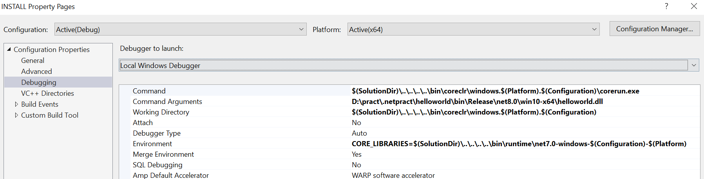
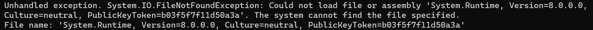
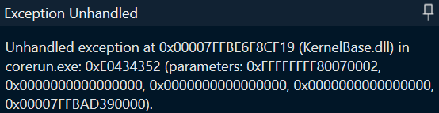

# Debug CoreCLR
	- 在debug之前需要保证所需的组件都已经build完毕，建议先执行命令：
		- ``.\build clr+libs``
		- 如果没有先进性这一步build而进入了后续步骤，有可能会出现报错，如果遇到这样的问题，可以删除``artifacts``目录，然后重新执行建造命令
	- 以上建造属于debug所必须，如果不执行可能会导致无法启动debug
		- 但是仅执行以上建造可能会导致某些符号无法生成，执行命令``.\build.cmd``可以建造所有组件
	- 建造所需工具和native build的依赖
		- ``.\build.cmd clr.native``
		- 只要没有删除``artifacts``目录，此命令只需执行一次
	- 打开CoreCLR的solution文件
		- 如果已经build过solution文件，在``artifacts\obj\coreclr\windows.<architecture>.<configuration>\ide\CoreCLR.sln``文件夹下
			- ``<architecture>``是架构名，例如``x64``
			- ``<configuration>``是配置，例如``Debug``或``Release``
		- 如果没有build过solution文件，使用指令``.\build.cmd clr.nativeprereqs -a <architecture> -c <configuration>``
			- ``<architecture>``和``<configuration>``的含义同上，如果`<configuration>`为Debug，则``-c Debug``可以省略
			- 运行此命令会自动在建造完毕之后打开solution
	- 将``INSTALL``项目设置为StartUp project，并且设置项目属性：
		- 
		- 将``Command``设置为``Command=$(SolutionDir)\..\..\..\..\bin\coreclr\windows.$(Platform).$(Configuration)\corerun.exe``
		- 将``Arguments``设置为希望运行的托管程序路径，例如一个``helloworld.dll``
		- 将``Working Directory``设置为``$(SolutionDir)\..\..\..\..\bin\coreclr\windows.$(Platform).$(Configuration)``
		- 将``Environment``设置为``CORE_LIBRARIES=$(SolutionDir)\..\..\..\..\bin\runtime\<target-framework>-windows-$(Configuration)-$(Platform)``
	- 设置断点，启动Debug
	- ## [[$red]]==问题==
		- 目前是能够正常启动debug但是在执行托管程序时会出现异常
		- 如果在终端中直接运行``corerun.exe``，报错为：
			- 
		- C:\engine\coreclr-runtime\src\coreclr\vm\corhost.cpp
		- 在Visual Studio中，报错为
			- 
		- 追溯之后应该是挂在了``src\coreclr\vm\corhost.cpp``的``CorHost2::ExecuteAssembly``函数里
			- 具体原因尚不明确，猜测可能是build的runtime和安装的sdk发行版之间有冲突
			- 可以考虑sdk也直接使用源码build的版本
			- 我使用了coreclr官方的最新repo来build，仍然会出现这个问题，机器上装的发行版.net是8.0 preview
			-
			-