- # Player Setting
	- 在player setting中看到有关于scripting backend的选项
	- 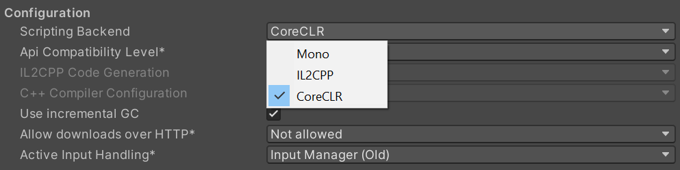
	- 通过搜索定位到处理此界面业务逻辑的文件``Editor\Mono\Inspector\PlayerSettingsEditor\PlayerSettingsEditor.cs``中
	- 其中关于Scripting Backend的处理代码：
	- 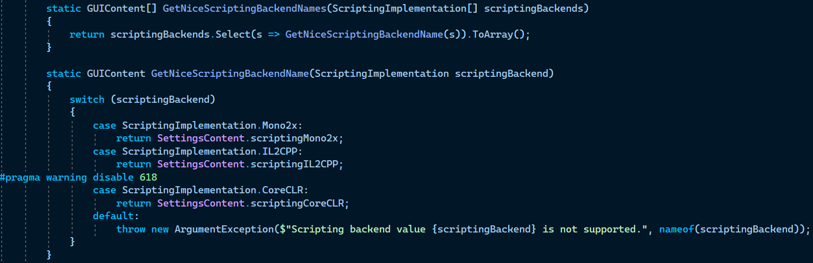
	- 检查``ScriptingImplementation``类型，发现其定义出现在文件``Editor\Mono\PlayerSettings.bindings.cs``
		- 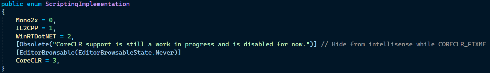
- # 设置``ScriptingImplementation``为`CoreCLR`之后的行为
	- ``Editor\Mono\AssemblyHelper.cs``文件中``AssemlyHelper``类的``IgnoreAssembly``函数会对所有可能属于.NET或windows运行时的程序集返回true
	  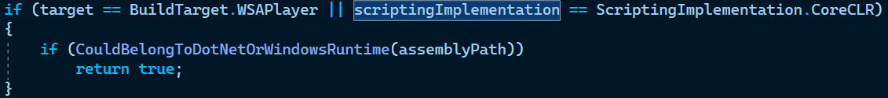
		- 做判断的``CouldBelongToDotnetOrWindowsRuntime``函数
		  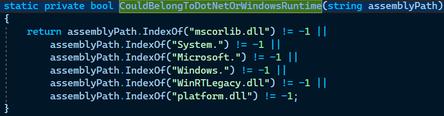
	- 在``Editor\Mono\BuildPipeline\DesktopStandaloneBuildWindowExtension.cs``文件的``DesktopStandaloneBuildWindowExtension``类的函数``GetCannotBuildPlayerInCurrentSetupError``会在``m_HasCoreCLRPlayers``为false时返回错误字符串
		- 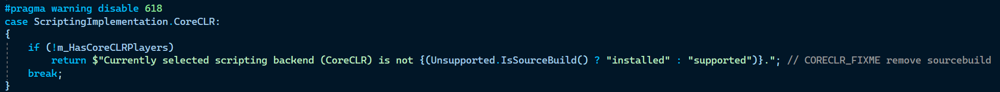
		- ``Unsupported``类定义在``Editor\Mono\Unsupported.bindings.cs``文件中，其中声明了``IsSourceBuild``函数
			- 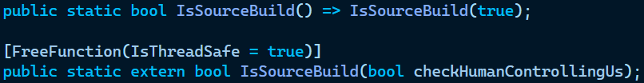
			- 此函数并不是``C#``写的，其定义在外部，实际是在文件``Editor\Src\EditorHelper.cpp``中定义
				- 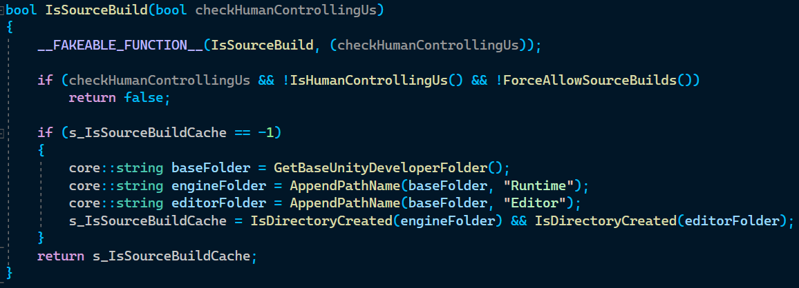
				- ``__FAKEABLE_FUNCTION__``是一个宏，定义在``Runtime\Testing\Fakeable.h``中
					- 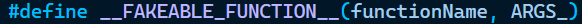
					- 实际上就是啥都不做，一个空定义，可能在测试中有用
				- ``IsHumanControllingUs``函数定义在文件``Runtime\Utilities\Argv.cpp``
					- 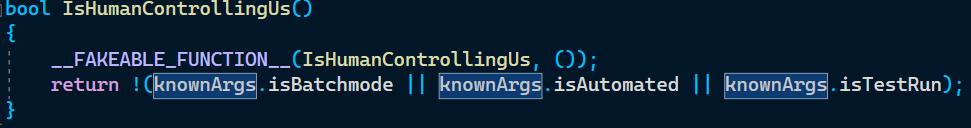
					- ``knownArgs``定义在同一个文件中
						- 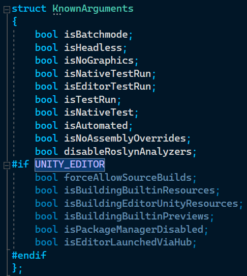
						  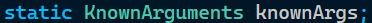
						- 这个结构体是用来辅助处理命令行参数的，静态变量``knownArgs``在函数``SetupArgv``中被设置，此函数在各个平台的main函数(包括editor和player)中被调用**处理命令行参数**
					- 也就是说，判断目前是否有人在操作的条件就是启动时**不是batch模式，不是自动模式也不是测试模式**
				- ``core::string``是Unity自定义的字符串类型，定义在``Runtime\Core\Containers\String.h``
				- 这个函数好像就是检查一下是否存在Runtime和Editor两个文件夹
					- 如果如要检查是否是人在操作，那么在检查不通过时直接返回false
				-
		- ``DesktopStandaloneBuildWindowExtension``类被多个类继承
			- ``PlatformDependent\WinPlayer\Extensions\Managed\WindowsStandaloneBuildWindowExtension.cs``中的``WindowsStandaloneBuildWindowExtension``类
				- 其在``PlatformDependent\WinPlayer\Extensions\Managed\ExtensionModule.cs``中被实例化一次
					- 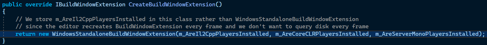
					- 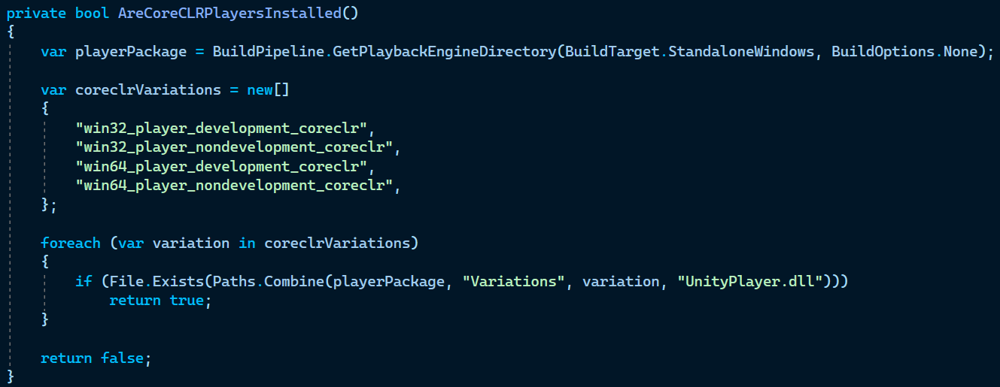
					- **能找到``GetPlayerbackEngineDirectory``函数，但是找不到``BuildPipeline``的定义**
					- 函数``GetPlaybackEngineDirectory``在``Editor\Src\BuildPipeline\BuildTargetPlatformSpecific.cpp``中，只是简单地调用函数``GetPlaybackEngineExtensionDirectory``，此函数在同一个文件中
					  id:: 64b0f231-0fc4-4843-b861-f8bc2d30e173
						-
						-
	- 在``Editor\Mono\BuildPipeline\DesktopStandalonePostProcessor.cs``中