- # 目标
	- 探明为什么CoreCLR能作为可选项出现在菜单中
		- ``Editor\Mono\Inspector\PlayerSettingsEditor\PlayerSettingsEditor.cs``中的
		- 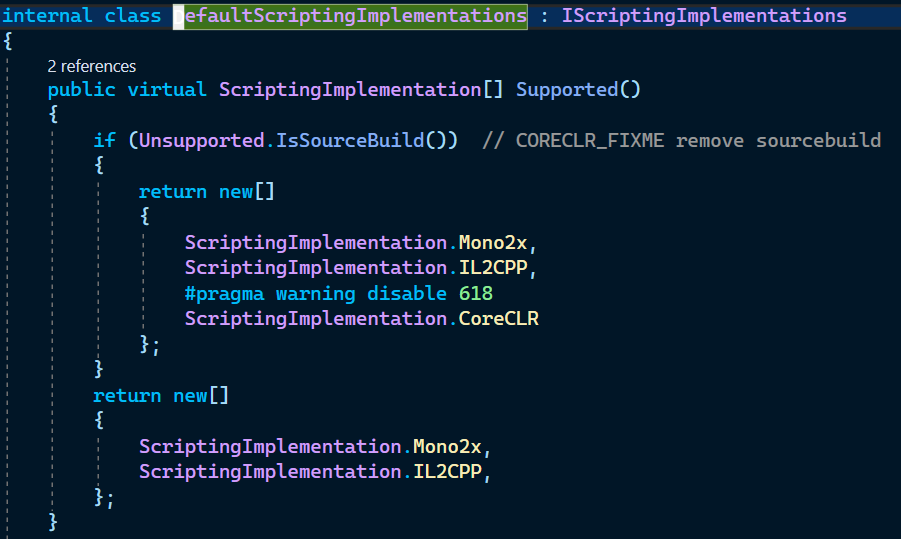
		- 而只要当前的``BuildTargetGroup``是``Standalone``，调用``Editor\Mono\Modules\PlatformSupportModule.cs``中的``GetScriptingImplementations``只要``IsSourceBuild``判断通过就会有``CoreCLR``选项可用
	- 探明为什么会显示**CoreCLR**未安装
		- 在特定目录中的``WindowsStandaloneSupport/Variations"目录下缺失了backend相关的目录
	- 探明UnityPlayer.dll是如何生成的，是否能够直接生成CoreCLR的UnityPlayer.dll
		- 在建造系统中可以直接建造``CoreCLR``版本的Player
		- 但是直接使用如此构建来的Player会出现**``Failed to load mono``**错误
			- 
	- 尝试解决``Failed to load mono``错误
		- 直接将mono build的player的运行时移过来，则不会再产生此错误，但是仍然无法正常运行，会直接退出
	- 阅读build脚本，探明CoreCLR的UnityPlayer.dll文件是如何被打包生成的
	- 通过Debug，探明Player的行为
- # 疑问
	- ``BuildTargetPlatform``和``BuiltTargetPlatformGroup``是什么关系
	- 有一些枚举类型之间似乎是一一对应关系,不过有的是在托管代码中,有的是在CLR内部，如何绑定起来
		- 好像是用``BIND_MANAGED_TYPE_NAME``宏，如``BIND_MANAGED_TYPE_NAME(BuildTargetPlatform, UnityEditor_BuildTarget)``
- # Player Setting
	- 在player setting中看到有关于scripting backend的选项
	- 
	- 通过搜索定位到处理此界面业务逻辑的文件``Editor\Mono\Inspector\PlayerSettingsEditor\PlayerSettingsEditor.cs``中
	- 其中关于Scripting Backend的处理代码：
	- 
	- 检查``ScriptingImplementation``类型，发现其定义出现在文件``Editor\Mono\PlayerSettings.bindings.cs``
		- 
- # 设置``ScriptingImplementation``为`CoreCLR`之后的行为
	- ``Editor\Mono\AssemblyHelper.cs``文件中``AssemlyHelper``类的``IgnoreAssembly``函数会对所有可能属于.NET或windows运行时的程序集返回true
	  
		- 做判断的``CouldBelongToDotnetOrWindowsRuntime``函数
		  
	- 在``Editor\Mono\BuildPipeline\DesktopStandaloneBuildWindowExtension.cs``文件的``DesktopStandaloneBuildWindowExtension``类的函数``GetCannotBuildPlayerInCurrentSetupError``会在``m_HasCoreCLRPlayers``为false时返回错误字符串
		- 
		- ``Unsupported``类定义在``Editor\Mono\Unsupported.bindings.cs``文件中，其中声明了``IsSourceBuild``函数
			- 
			- 此函数并不是``C#``写的，其定义在外部，实际是在文件``Editor\Src\EditorHelper.cpp``中定义
				- 
				- [[$blue]]==**重点：理解这个函数的关键在于其调用的**==``GetBaseUnityDeveloperFolder``函数的行为
					- 此函数会直接调用``Runtime\Utilities\FileUtilities.cpp``中的``GetDeveloperWorkspaceRoot``
						- 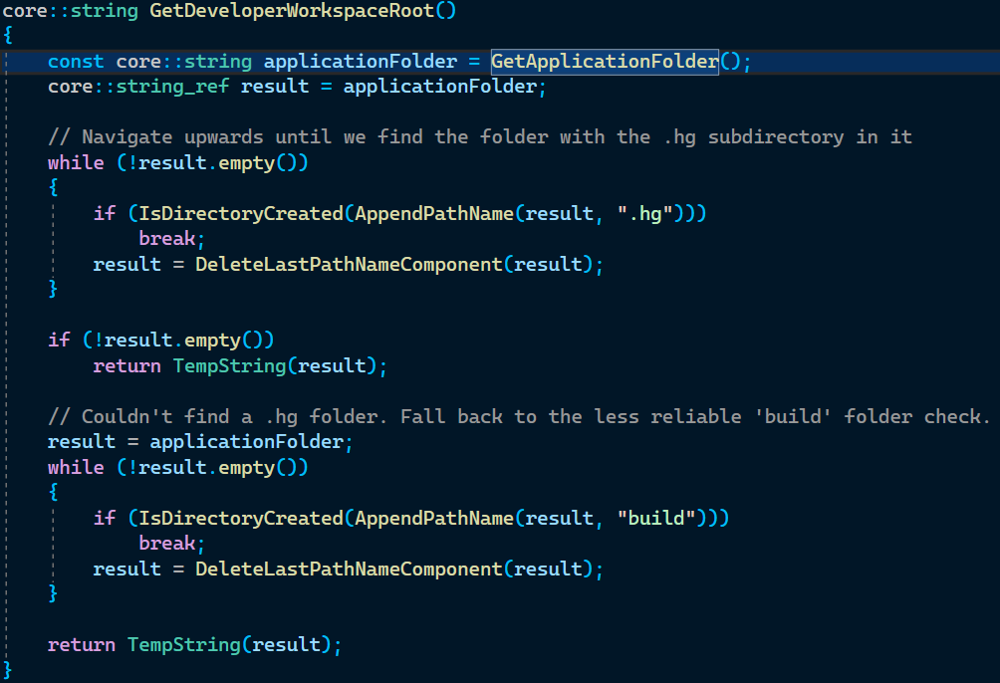
					- 上一个函数又会调用``GetApplicationFolder``函数
						- 这个函数经过多个包装类和继承的转发，**在Windows平台下**最终调用的应该是``PlatformDependent\Win\LocalFileSystemWindowsShared.cpp``中的``GetApplicationFolder``函数
					- 上一个函数会调用同一个类中的``GetApplicationPath``函数
					- 最终会一路调用到``C:\Program Files (x86)\Windows Kits\10\Include\10.0.22000.0\um\libloaderapi.h``中的``GetModuleFileNameW``函数
						- 这个函数是Windows自带的库函数，此库和**模块(Module)加载**相关
					- 最终：``GetApplicationPath``拿到当前可执行文件的路径，``GetApplicationFolder``删除最后一个路径元素(即可执行文件的名称)，返回处理后的路径(即可执行文件所在的文件夹的路径)
					- ``GetDeveloperWorkspaceRoot``函数会在拿到可执行文件所在目录之后不停向父目录探索知道找到``.hg``或``build``目录
				- 拿到疑似项目目录的路径之后再去检查是否存在``Runtime``和``Editor``这两个目录，如果都存在，则认为是目前正在运行的Unity是从源码build而来的，这也是此函数名``IsSourceBuild``的含义
					- ``__FAKEABLE_FUNCTION__``是一个宏，定义在``Runtime\Testing\Fakeable.h``中
						- 
						- 实际上就是啥都不做，一个空定义，可能在测试中有用
					- ``IsHumanControllingUs``函数定义在文件``Runtime\Utilities\Argv.cpp``
						- 
						- ``knownArgs``定义在同一个文件中
							- 
							  
							- 这个结构体是用来辅助处理命令行参数的，静态变量``knownArgs``在函数``SetupArgv``中被设置，此函数在各个平台的main函数(包括editor和player)中被调用**处理命令行参数**
						- 也就是说，判断目前是否有人在操作的条件就是启动时**不是batch模式，不是自动模式也不是测试模式**
					- ``core::string``是Unity自定义的字符串类型，定义在``Runtime\Core\Containers\String.h``
					- 如果如要检查是否是人在操作，那么在检查不通过时直接返回false
		- ``DesktopStandaloneBuildWindowExtension``类被多个类继承
			- ``PlatformDependent\WinPlayer\Extensions\Managed\WindowsStandaloneBuildWindowExtension.cs``中的``WindowsStandaloneBuildWindowExtension``类
				- 其在``PlatformDependent\WinPlayer\Extensions\Managed\ExtensionModule.cs``中被实例化一次
					- {:height 59, :width 544}
					- 
					- **能找到``GetPlayerbackEngineDirectory``函数，但是找不到``BuildPipeline``的定义**
						- 但是能找到``BuildPipline``的namespace
					- 调用这个函数时使用的参数分别是
						- ``BuildTarget``是一个枚举类型，定义在``Editor\Mono\BuildTarget.cs``中
							- 似乎和``Runtime\Serialize\BuildTarget.h``中的``BuildTargetPlatform``枚举类型是一一对应关系
							- ``StandaloneWindows``的值为5
								- 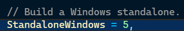{:height 60, :width 309}
						- ``BuildOption``没有在源码中找到定义，但是在``Documentation\TrackedApi\editor\UnityEditor.api``能看到定义
							- ``None``的值是0
								- 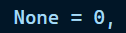
					- 函数``GetPlaybackEngineDirectory``在``Editor\Src\BuildPipeline\BuildTargetPlatformSpecific.cpp``中
					  id:: 64b0f231-0fc4-4843-b861-f8bc2d30e173
						- 此函数有两个重载，其中一个接受三个参数，但是最后一个参数``assertUnsupportedPlatforms``在头文件定义中默认为``true``，因此可以不用给出
					- ``GetPlaybackEngineDirectory``只是简单地调用函数``GetPlaybackEngineExtensionDirectory``，此函数在同一个文件中，返回值应该是目录``build\WindowsStandaloneSupport``
						- 调用时补足了``buildTargetGroup``参数为``BuildTargetPlatformGroup``类型的``kPlatformUnknown``，值为0
							- 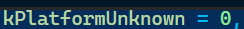
						- 且最后一个参数``overridemode``默认为``kUseOverride``
						- **[[$red]]==这个Resouce Build是什么意思？==，从行为来理解是在判断有没有某些命令行参数**，不知道这个resource的具体工程含义是什么
							- 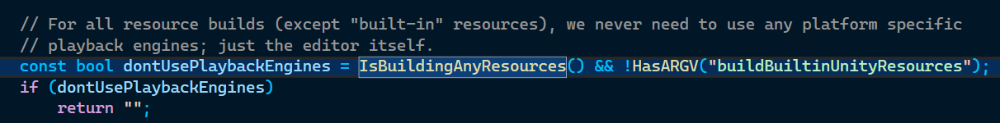{:height 53, :width 362}
						- ``playbackEngineName``经过函数查询，得到的结果应该是``"WindowsStandaloneSupport"``
							- 首先进入``GetBuildTargetName``函数，由于``buildTargetGroup``是``kPlatformUnknown``，进入``GetDirNameForBuildTarget``函数
							- ``GetDirNameForBuildTarget``函数是``BuildTargetDiscovery``类的一个函数，因此在调用此函数前需要通过``BuildTargetDiscovery``获取一个实例(应该也是全局唯一的实例，这个类感觉应该是个单例)。此实例获取函数同时也会检查预加载的平台信息是否已经初始化，如果没有的话会调用此类的``PreloadKnownBuildTargets``函数，此函数会预加载一系列的平台信息，这些信息会通过``AddDiscoveredTargetInfo``函数存放到类的成员变量``m_BuildTargetMap``中，例如目前我们所关心的windows standalone player的建造信息就包含如下信息：
								- 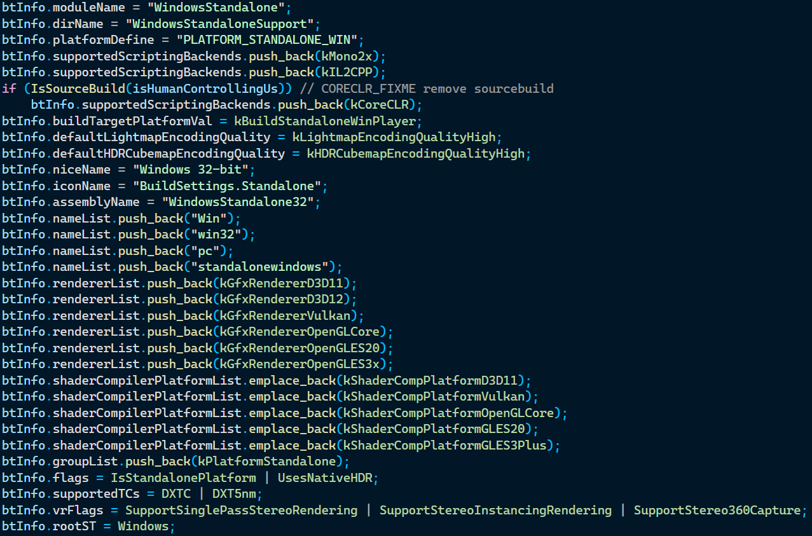
								- 注意到增添CoreCLR的时候做了一次``IsSourceBuild``判断，目前的源码中似乎只要是和CoreCLR的地方经常用到``IsSourceBuild``判断，因此猜测目前的CoreCLR选项只是一个placeholder，可能没有实际功能
							- ``GetDirNameBuildTarget``函数首先通过枚举参数``platform``查询得到``string``类型的key，``kBuildStandaloneWinPlayer``对应的key是``"win"``
							- 获取字符串key之后再调用同名函数通过key获取目录名称，即去``m_BuildTargetMap``中查询，然后返回``dirName``域
						- ``GetApplicationContentsPath``函数返回可执行文件目录下的``Data``文件夹的路径，在其后又append了一个``PlaybackEngines``目录名称
						- ``GetTargetBuildFolder``函数返回项目目录下``build``文件夹的路径
						- 相当于去上述两个路径下寻找是否存在``WindowsStandaloneSupport``目录，如果存在，则返回此目录路径
						- 如果都不存在，则去可执行文件目录下的``PlaybackEngines``目录下寻找，如果存在则返回路径，如果仍不存在，则输出一个错误信息
					- 在``build\WindowsStandaloneSupport\Variations``目录下依次寻找是否存在四个CoreCLR相关的目录，且目录中是否存在``UnityPlayer.dll``文件，如果其中一个存在则返回`true`，否则``false``
				- 其成员变量``m_AreCoreCLRPlayersInstalled``最终在初始化时被``AreCoreCLRPlayersInstalled``函数检查为false，因此最终导致了``DeskTopStandaloneBuildWindowExtension``类在GUI处输出CoreCLR 未安装的错误信息
					- 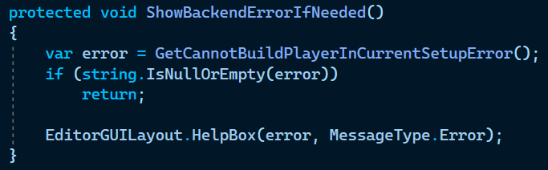
					- 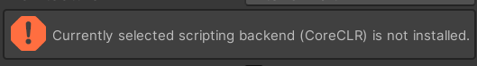
	- ``Editor\Mono\BuildPipeline\DesktopStandalonePostProcessor.cs``被``WinPlayerPostProcessor``继承，并且在`PlatformDependent\WinPlayer\Extensions\Managed\ExtensionModule.cs` 的``CreateBuildPostprocessor``函数中完成实例化
- # Build行为
	- 规定了一些和编译有关的attribute
	  collapsed:: true
		- 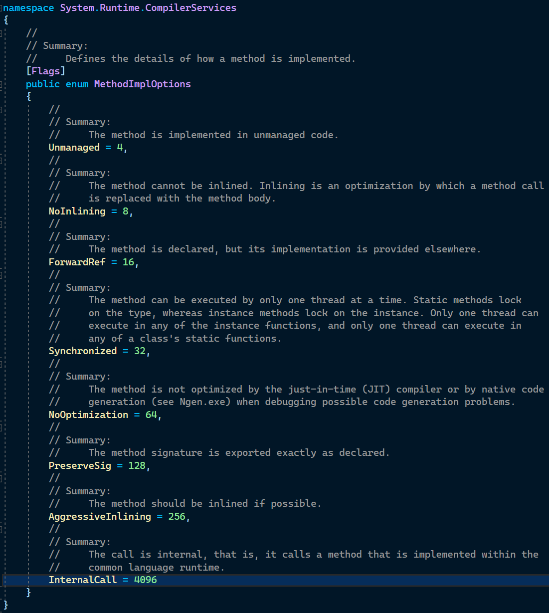
- # [[Build系统行为]]
- # 尝试直接构建使用CoreCLR的Player
	- ## 使用``build.pl``
		- 使用``perl build.pl``指令通过互动的方式选择target和scriptingBackend构建
		- 或者``perl build.pl --scriptingBackend=coreclr``
		- 无法直接构建，报了一堆错，看报错信息好像是设计license问题和文件缺失
	- ## 使用``jam``
		- ``jam``支持很多版本的Player构建
		  collapsed:: true
			- 使用``./jam --help WinPlayer``查看所有支持的版本
			- 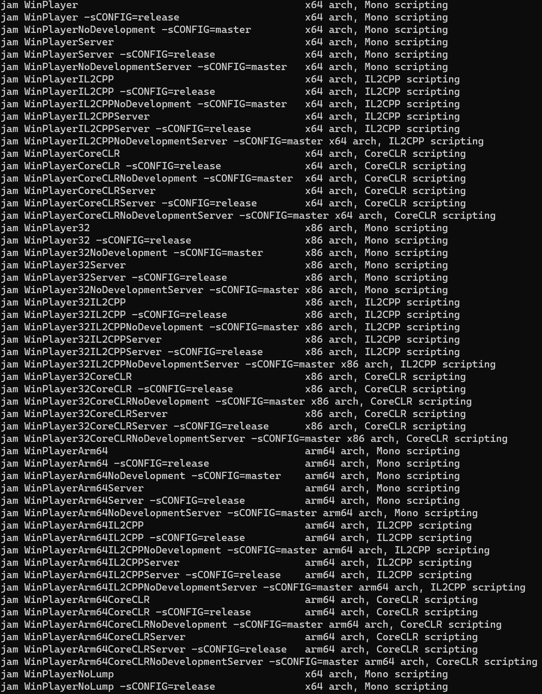{:height 352, :width 269}
		- ``./jam WinPlayerCoreCLR``
		- 构建成功，``C:\engine\unity-reengineering\build\WindowsStandaloneSupport\Variations``下出现了代码中提到的文件夹
		- 
		- 但是如此构建出来的player会出现错误
		  collapsed:: true
			- 
		- 此错误应该出现在``PlatformDependent\WinPlayer\WinMain.cpp``的``LoadScriptingRuntime``函数
		  collapsed:: true
			- 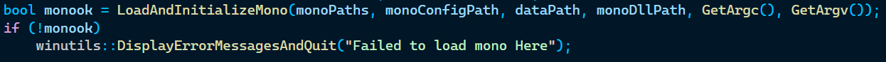
		- 通过Debug输出，得到如下传入``LoadAndInitializeMono``函数的参数
		  collapsed:: true
			- 
			- 
			- 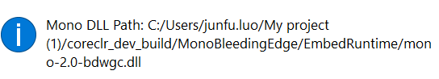
			- 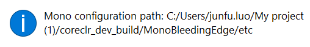
			- 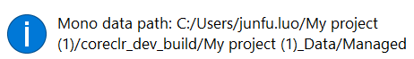
		- 感觉是根本没有把Mono运行时相关的东西拷过来，**尝试直接拷贝**
		  collapsed:: true
			- 将mono build的Mono运行时拷贝过来之后，不再报加载mono错误，但是程序无法正常执行，没有任何反应直接退出了
			- 而且在存在Mono运行时的目录下，Editor构建player会报错
			  collapsed:: true
				- 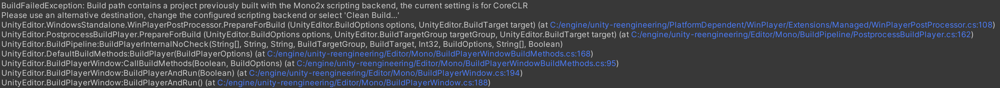
				- 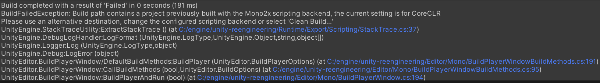
			- 这个报错信息是在``PlatformDependent\WinPlayer\Extensions\Managed\WinPlayerPostProcessor.cs``中的``PrepareForBuild``函数中报的
			  collapsed:: true
				- 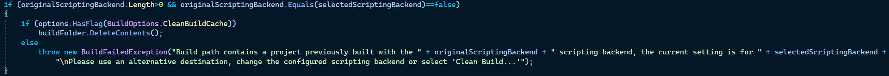
				- 这个函数会检测build目录下是否存在一些列runtime的目录，如果存在即将其存于变量``originalScriptingBackend``中
				- 如果``originalScriptingBackend``不为空且与当前选择的backend不一致则抛出错误
		- ### 尝试搞清楚player在哪一步退出
			- 根据断点结果，因该是挂在了``Runtime\Mono\MonoManager.cpp``的第2444行
			- 
			- 这个函数应该已经是dll库中的函数，无法在debugger中继续跳转跟踪
			- editor和mono build的player都会经过这一语句，但是都正常运行，只有在coreclr build的player会出现这个问题
			- [[$red]]==**有没有办法跟踪dll中的函数？**==
			- 在``External\MonoBleedingEdge\builds\include\mono\mono\jit\jit.h``文件中有此函数的定义，不知道和实际函数实现和符号引入有什么关系
				- 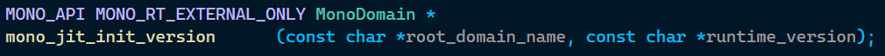
	- ## 查看coreclr player build目录下的coreclr运行时
		- ``CoreCLR``目录下有两个目录
		- 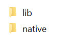
		- ``native``目录下有一个`dotnet.exe`可执行文件，但是似乎不可执行
			- 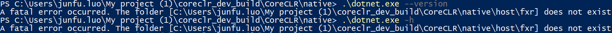
		- 将发行版本.NET目录下的``host/fxr``目录拷贝过来之后，有如下输出：
			- 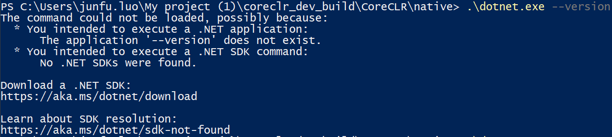
			- 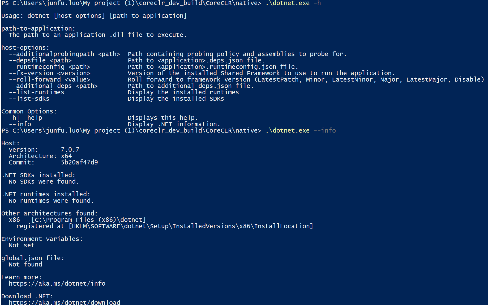
	-
		-