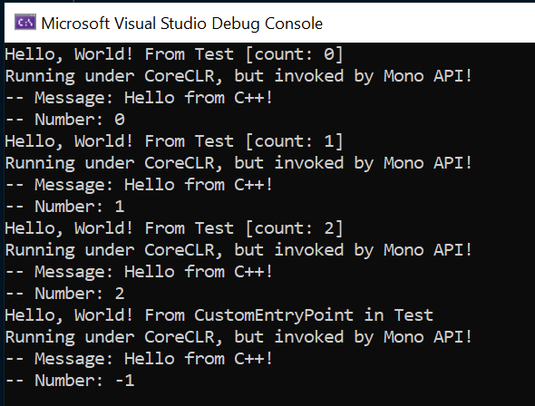
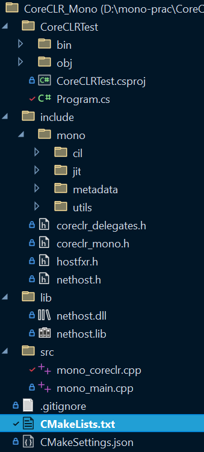

# 初步尝试
	- 在不链接mono库的情况下，mono头文件中的所有函数都没有实现，直接编写一个``cpp``文件即可覆盖
	- 先将所有的mono函数直接返回空值，然后在最后调用的函数中直接重复之前CoreCLR Hosting的代码
	- ``mono_coreclr.cpp``
		- ```c++
		  #include <iostream>
		  #include <Windows.h>
		  #include <assert.h>
		  #include "mono/metadata/appdomain.h"
		  #include "mono/metadata/assembly.h"
		  #include "mono/metadata/mono-config.h"
		  #include "mono/jit/jit.h"
		  #include "mono/metadata/debug-helpers.h"
		  #include "coreclr_mono.h"
		  
		  namespace {
		  
		  	// Global variables to hold hostfxr exports
		  	hostfxr_initialize_for_runtime_config_fn init_fptr;
		  	hostfxr_get_runtime_delegate_fn get_delegate_fptr;
		  	hostfxr_close_fn close_fptr;
		  
		  	// Forward declarations
		  	bool load_hostfxr();
		  	load_assembly_and_get_function_pointer_fn get_dotnet_load_assembly(const char_t* assembly);
		  }
		  
		  
		  MONO_API MonoDomain* mono_jit_init_version(const char* root_domain_name, const char* runtime_version) {
		  	return nullptr;
		  }
		  MONO_API MonoAssembly* mono_domain_assembly_open(MonoDomain* domain, const char* name) {
		  	return nullptr;
		  }
		  MONO_API MonoImage* mono_assembly_get_image(MonoAssembly* assembly) {
		  	return nullptr;
		  }
		  
		  MONO_API MonoClass* mono_class_from_name(MonoImage* image, const char* name_space, const char* name) {
		  	return nullptr;
		  }
		  MONO_API MonoMethodDesc* mono_method_desc_new(const char* name, mono_bool include_namespace) {
		  	return nullptr;
		  }
		  
		  MONO_API MonoMethod* mono_method_desc_search_in_class(MonoMethodDesc* desc, MonoClass* klass) {
		  	return (MonoMethod*)desc;
		  }
		  
		  MONO_API MonoObject* mono_runtime_invoke(MonoMethod* method, void* obj, void** params, MonoObject** exc) {
		  	char_t host_path[MAX_PATH];
		  
		  	auto size = ::GetFullPathNameW(STR(".\\"), sizeof(host_path) / sizeof(char_t), host_path, nullptr);
		  	assert(size != 0);
		  
		  	string_t root_path = host_path;
		  	auto pos = root_path.find_last_of(DIR_SEPARATOR);
		  	assert(pos != string_t::npos);
		  	root_path = root_path.substr(0, pos + 1);
		  	/**********************************************************
		  	* Step 1: Load hostfxr and get exported hosting functions *
		  	**********************************************************/
		  	if (!load_hostfxr()) {
		  		assert(false && "Failure: load_hostfxr()");
		  		return false;
		  	}
		  
		  	/**********************************************************
		  	*   Step 2: Initialize and start the .NET Core runtime    *
		  	**********************************************************/
		  	// Path to the runtime configuration file
		  	const string_t config_path = root_path + STR("CoreCLRTest.runtimeconfig.json");
		  	load_assembly_and_get_function_pointer_fn load_assembly_and_get_function_pointer = nullptr;
		  	load_assembly_and_get_function_pointer = get_dotnet_load_assembly(config_path.c_str());
		  	assert(load_assembly_and_get_function_pointer && "Failure: get_dotnet_load_assembly()");
		  
		  	/**********************************************************
		  	*  Step 3: Load managed assembly and get function pointer *
		  	**********************************************************/
		  	const string_t assembly_path = root_path + STR("CoreCLRTest.dll");
		  	// The class name and the namespace the desired method resides in
		  	// Refer to the managed assembly's source code(.cs file) for available namespaces and classes
		  	const char_t* dotnet_type = STR("CoreCLRTest.Test, CoreCLRTest");
		  	const char_t* dotnet_type_method = STR("Hello");
		  	// Function pointer to managed delegate
		  	// Delegate is a type that represents references to methods that can be invoked by native coded
		  	component_entry_point_fn hello = nullptr;
		  	int result = load_assembly_and_get_function_pointer(
		  		assembly_path.c_str(),
		  		dotnet_type,
		  		dotnet_type_method,
		  		nullptr, // delegate_type_name
		  		nullptr,
		  		(void**)&hello);
		  	assert(result == 0 && hello != nullptr && "Failure: load_assembly_and_get_function_pointer()");
		  
		  
		  	/**********************************************************
		  	*               Step 4: Run managed code                  *
		  	**********************************************************/
		  	// This struct is used to pass arguments to managed code
		  	struct lib_args {
		  		const char_t* message;
		  		int number;
		  	};
		  	for (int i = 0; i < 3; i++) {
		  		lib_args args{ STR("Hello from C++!"), i };
		  		hello(&args, sizeof(args));
		  	}
		  #ifdef NET5_0
		  	// Function pointer to managed delegate with non-default signature
		  	custom_entry_point_fn custom = nullptr;
		  	rc = load_assembly_and_get_function_pointer(
		  		dotnetlib_path.c_str(),
		  		dotnet_type,
		  		STR("CustomEntryPointUnmanaged") /*method_name*/,
		  		UNMANAGEDCALLERSONLY_METHOD,
		  		nullptr,
		  		(void**)&custom);
		  	assert(rc == 0 && custom != nullptr && "Failure: load_assembly_and_get_function_pointer()");
		  #else
		  	// Function pointer to managed delegate with non-default signature
		  	typedef void (CORECLR_DELEGATE_CALLTYPE* custom_entry_point_fn)(lib_args args);
		  	custom_entry_point_fn custom = nullptr;
		  	result = load_assembly_and_get_function_pointer(
		  		assembly_path.c_str(),
		  		dotnet_type,
		  		STR("CustomEntryPoint") /*method_name*/,
		  		STR("CoreCLRTest.Test+CustomEntryPointDelegate, CoreCLRTest"), // delegate_type_name, + is used for splitting class name and delegate name
		  		nullptr,
		  		(void**)&custom);
		  #endif
		  	lib_args args{ STR("Hello from C++!"), -1 };
		  	custom(args);
		  
		  	return nullptr;
		  }
		  
		  
		  
		  
		  
		  
		  /********************************************************
		  * Function used to load and activate .NET Core runtime *
		  ********************************************************/
		  
		  namespace {
		  	// Forward declarations
		  
		  	void* load_library(const char_t* path);
		  	void* get_export(void* h, const char* name);
		  
		  	void* load_library(const char_t* path) {
		  		// An HMODULE is a handle to a module (the handle is actually a pointer to a pointer to the module's base address).
		  		// A module is a file that contains executable code, such as a .dll or .exe file.
		  		HMODULE h = ::LoadLibraryW(path);
		  		assert(h != nullptr);
		  		return (void*)h;
		  	}
		  
		  	void* get_export(void* h, const char* name) {
		  		void* f = ::GetProcAddress((HMODULE)h, name);
		  		assert(f != nullptr);
		  		return f;
		  	}
		  
		  	// Using nethost library to discover the location of hostfxr.dll and get exports
		  	bool load_hostfxr() {
		  		char_t buffer[MAX_PATH];
		  		size_t buffer_size = sizeof(buffer) / sizeof(char_t);
		  		if (get_hostfxr_path(buffer, &buffer_size, nullptr))
		  			return false;
		  
		  		// Load hostfxr and get desired exports
		  		void* lib = load_library(buffer);
		  		init_fptr = (hostfxr_initialize_for_runtime_config_fn)get_export(lib, "hostfxr_initialize_for_runtime_config");
		  		get_delegate_fptr = (hostfxr_get_runtime_delegate_fn)get_export(lib, "hostfxr_get_runtime_delegate");
		  		close_fptr = (hostfxr_close_fn)get_export(lib, "hostfxr_close");
		  
		  		// Check if we got all the exports
		  		return (init_fptr && get_delegate_fptr && close_fptr);
		  	}
		  	load_assembly_and_get_function_pointer_fn get_dotnet_load_assembly(const char_t* config_path) {
		  		// Load .NET Core
		  		void* load_assembly_and_get_function_pointer = nullptr;
		  		hostfxr_handle cxt = nullptr;
		  		int result = init_fptr(config_path, nullptr, &cxt);
		  
		  		// Initialization failed, print the result code
		  		if (result != 0 || cxt == nullptr) {
		  			std::cerr << "Init failed: " << std::hex << std::showbase << result << std::endl;
		  			close_fptr(cxt);
		  			return nullptr;
		  		}
		  
		  		// Get the load assembly function pointer
		  		result = get_delegate_fptr(
		  			cxt,
		  			hdt_load_assembly_and_get_function_pointer,
		  			&load_assembly_and_get_function_pointer);
		  
		  		if (result != 0 || load_assembly_and_get_function_pointer == nullptr)
		  			std::cerr << "Get delegate failed: " << std::hex << std::showbase << result << std::endl;
		  
		  		close_fptr(cxt);
		  		return (load_assembly_and_get_function_pointer_fn)load_assembly_and_get_function_pointer;
		  	}
		  
		  }
		  ```
	- ``mono_main.cpp``
		- ```c++
		  #include <iostream>
		  #include <string>
		  #include "mono/metadata/appdomain.h"
		  #include "mono/metadata/assembly.h"
		  #include "mono/metadata/mono-config.h"
		  #include "mono/jit/jit.h"
		  #include "mono/metadata/debug-helpers.h"
		  
		  
		  
		  int main() {
		      MonoDomain* domain = mono_jit_init_version("mono_embedding","v4.0.30319");
		  
		  
		      // assembly now hold the absolute path to the assembly
		      MonoAssembly* assembly = mono_domain_assembly_open(domain, "CoreCLRTest.dll");
		      // image hold the same value as assembly
		      MonoImage* image = mono_assembly_get_image(assembly);
		      // kclass holds the class name
		      MonoClass* kclass = mono_class_from_name(image, "CoreCLRTest", "Test");
		  
		      // Get method description
		      MonoMethodDesc* getHelloMethodDesc = mono_method_desc_new("Test:GetHello", false);
		  
		      MonoMethod* getHelloMethod = mono_method_desc_search_in_class(getHelloMethodDesc, kclass);
		  
		      // Execute the method and store the result in a MonoObject
		      MonoObject* helloReturnValue = mono_runtime_invoke(getHelloMethod, nullptr, nullptr, nullptr);
		  
		  
		      return 0;
		  }
		  ```
	- buil之后可以正常运行：
		- {:height 456, :width 590}
	- 目录结构：
		- 
- # 思路：
	- mono API中的很多返回值都仅仅是指针，这可能能够被利用
		- 这些指针是否可以直接指向CoreCLR API中提供的结构体？
	- 关于域重加载，mono API在host中可以很方便地创建域，而CoreCLR好像没有类似API，这一块可能是实现难点
		- 看相关文档有提到使用CoreCLR的Assembly load context来实现类似功能，这部分还需要进一步探究
		- 根据global那边的文档，8.0，或者已经发布的7.0有可能有相关功能，需要查文档看看
	- 引擎中的实际改动是只需要改host部分的代码，managed code中如果有使用只有mono才提供的API，那么managed code那边应该也需要一定程度的改写
	- 目前看来传递简单类型(int)没有问题，**[[$red]]==但是复杂类型(string)似乎不像mono那么方便==**