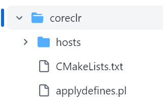

- [[CoreCLR Build]]
- # 建议学习路线
	- ## 了解CLR需要提供哪些服务
		- **CLR via C#**
			- 了解CLR提供哪些服务，各种服务之间有什么联系
			- 建立大体概念
		- **Pro .NET Performance**
		- **Writing High-Performance .NET Code**
	- ## CIL
		- **[ECMA-335](https://www.ecma-international.org/publications-and-standards/standards/ecma-335/)**
		- **Inside Microsoft .NET II Assembler**
		- **Expert .NET 2.0 IL Assembler**
		- **[Shared Source CLI 2.0 Internals](http://pages.di.unipi.it/ferrari/CORSI/AP/NOTES/SSCLI2.pdf)**
			- 一个开源CLI runtime
	- ## [Book of the Runtime](https://github.com/dotnet/runtime/blob/main/docs/design/coreclr/botr/README.md)
	- 另外需要补足一些GC和编译原理的基础知识
		- The Garbage Collection Handbook
- # 项目结构
	- [Book of the Runtime](https://github.com/dotnet/runtime/blob/main/docs/design/coreclr/botr/README.md)
	- 目前，最新的仓库目录结构主要包含**三大部分**
		- 运行时(Runtime)
		- 库(Library)
		- 安装程序(Installer)
	- ## Github仓库
		- 最开始，coreclr是在[dotnet/coreclr](https://github.com/dotnet/coreclr/tree/master)仓库下开发
		- 后来(应该是在19年)整合到了[dotnet/runtime](https://github.com/dotnet/runtime)
			- 这个新仓库的结构更复杂，整合了一些.NET相关的其他项目，例如mono
			- 更详细的信息和FAQ可以参看[这个issue](https://github.com/dotnet/announcements/issues/119)
	- ## 文档
		- 作为一个复杂的超大项目，CoreCLR，或者中整个.NET runtime项目有着庞杂的文档，以至于文档也有自己的目录结构
		- 文档的根目录在项目根目录的``docs``目录下
		- **一些关键文档：**
			- [Glossary](https://github.com/dotnet/runtime/blob/main/docs/project/glossary.md)
				- 列举了若干术语和关键词
	- ## 语言
		- CoreCLR本身基本是完全使用C++写的，测试基本使用C#
		- CoreCLR提供的``mscorlib``使用C\#编写
	- ## mscorlib
		- 看之前``dotnet/coreclr``那个仓库里是有mscorlib的源码的(其实在被merge之前的最新提交中也已经没有相关目录了)
		- 不过对于迁移的关系不大，所以这个应该不是重点关心的对象
	- ## CoreRT
		- .NET Core的一个实验性AOT运行时
		- 现在已经更名为[runtimelab](https://github.com/dotnet/runtimelab/tree/feature/NativeAOT)
- # CoreCLR目录结构
	- 我们更关心CoreCLR相关的东西，目前的项目repo中，CoreCLR的源码主要是在`/src/coreclr`下
	- 这部分内容是coreclr仓库迁移以前的主要内容，每个文件夹都是一个特定模块。
	- 每个模块的职责可以参看[这篇文章](https://mattwarren.org/2017/03/23/Hitchhikers-Guide-to-the-CoreCLR-Source-Code/)，但是此文章成文于17年，有些内容已经outdated
	- ## binder
		- 负责在.NET程序内部载入程序集
		- 控制程序集和application context的代码也在此处
	- ## classlibnative
		- 许多Core数据类型的native实现，例如
			- ``arraynative.cpp``对应Arrays
			- ``objectnative.cpp``对应System.Object
		- 同时也包含一些暴露给``System.Environment``命名空间的函数在``system.cpp``中
			- 例如：``System.ProcessorCount``对应`system.cpp`中的``Environment_GetProcessorCount``
	- ## host
		- 在迁移之前的repo中，目录名为``coreclr``
		- 主要存放用于host coreclr运行时的工具，例如``corerun``
		- {:height 212, :width 321}
- # [[CoreCLR Workflow]]