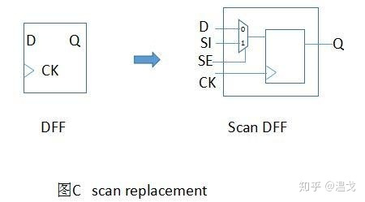
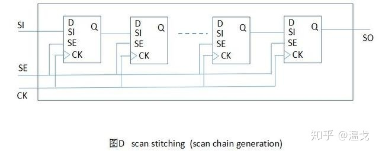
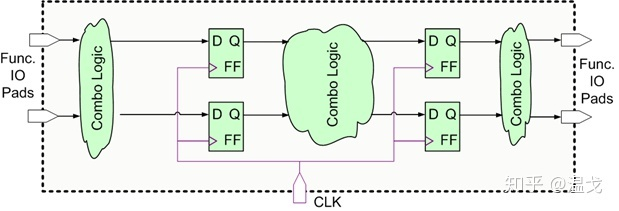
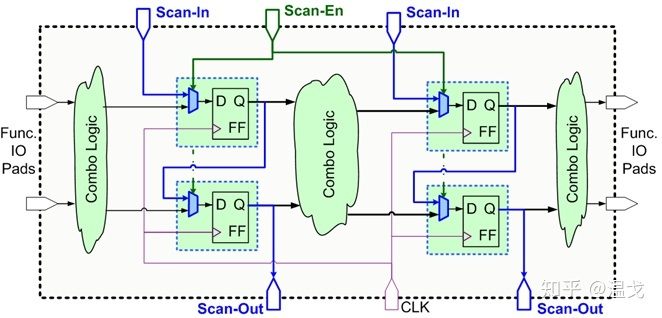
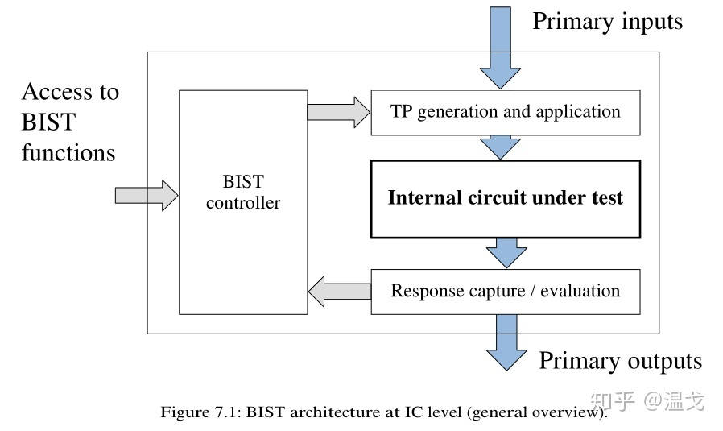

- # 概念
	- **[[$red]]==Design For Testability==**，可测试性设计
	- 将特殊结构在**设计阶段**植入电路，以便胜场完成周进行测试
	- 复杂的集成电路并不好测试，因此DFT可以显著提升集成电路的可测试性，方便展开各种测试
- # 方法
	- ## [扫描路径设计(Scan Design)](https://zhuanlan.zhihu.com/p/201353304)
		- 扫描路径法是一种针对时序电路芯片的DFT方案.其基本原理是时序电路可以模型化为一个组合电路网络和带触发器(Flip-Flop，简称FF)的时序电路网络的反馈。
		- Scan 包括两个步骤，**scan replacement**和**scan stitching**，目的是把一个不容易测试的时序电路变成容易测试的组合电路。
		- ### scan replacement
			- 把电路中的normal时序单元(例如DFF(D触发器))替换为一个scan时序单元
			- 
			- 当SE为0时，电路工作在正常状态，锁存D的值
			- 当SE为1时，电路工作在扫描状态，所存SI的值
		- ### Scan stitching
			- 把上一步中得到的Scan DFF的Q和I链接在一起，组成全局的SE信号和scan chain的输入输出信号SI和SO
			- 通过scan chain的连续动作可以把问题从对复杂的时序电路的测试转化成测试组合电路
			- 
		- ### 过程简介
			- 
			- 
			- 把Scan-En设成0，此时电路工作在正常状态（function mode)下, scan insertion对电路的正常功能没有影响。
			- 把Scan-En设成1，然后enable clock来驱动寄存器，在Scan-In端输入测试数据，然后在输出端Scan-Out观测，用此种方法便可以测试Flip-Flop.
			- 测试组合逻辑的时候，把Scan-En设成1，然后enable clock来驱动寄存器，在Scan-In端输入测试数据，两个时钟周期后，数据便会送到组合逻辑的输入端。
			- 然后把Scan-En设成0，时钟打一拍，经过组合逻辑的输出值便会送到右侧的寄存器中。
			- 再把Scan-En设成1，此时scan chain 工作在shift mode，此时便可以把组合逻辑的输出值shift出来，和期望值进行比较[[$red]]==(?)==。
	- ## 内建自测试(Bist)
		- 在芯片的设计中加入一些额外的自测试电路，测试时只需要从外部施加必要的控制信号，通过运行内建的自测试硬件和软件，检查被测电路的缺陷或故障
		- 
	- ## JTAG
		- Joint Test Action Group，一种国际标准测试协议，IEEE 1149.1兼容
		- 主要用于芯片内部测试
		- 在器件内部定义一个TAP(Test Access Port)
		- 通过专用的JTAG测试工具对内部节点进行测试
		- JTAG测试允许多个器件通过JTAG接口串联在一起，形成一个JTAG链，能实现对各个器件分别测试
	- ## ATPG
		- Automatic Test Pattern Generation