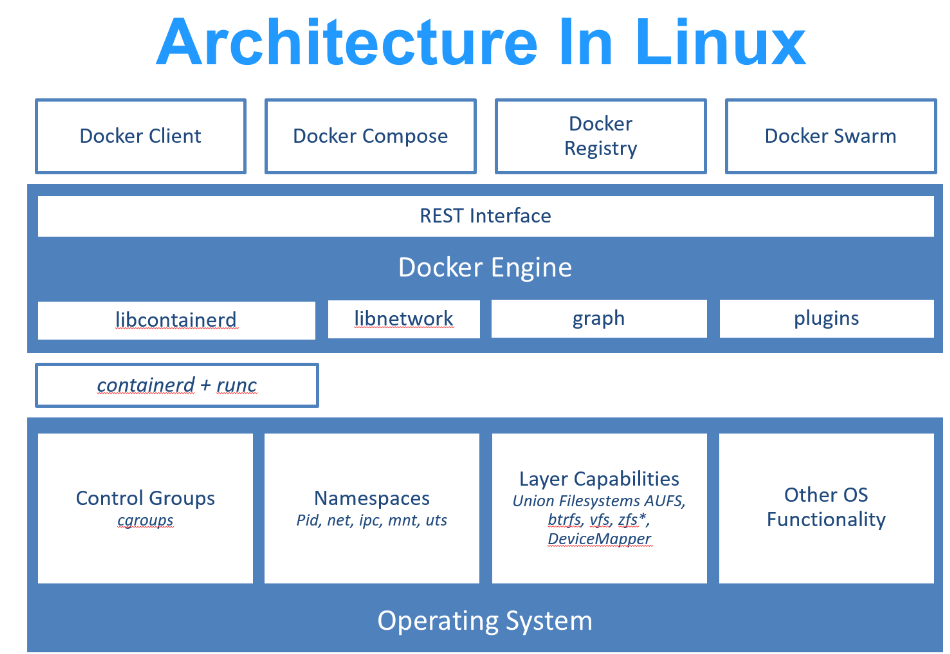
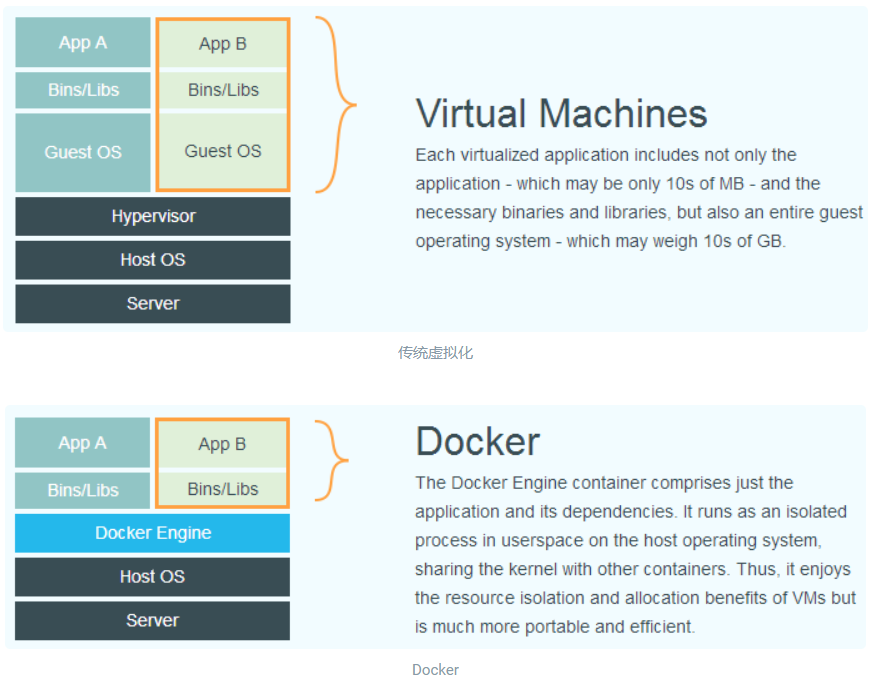

- 由dotCloud公司发起的开源项目
- 使用go语言实现，基于**操作系统层面的虚拟化技术**
- 由于隔离的进程独立于宿主和其他隔离的进程，因此也被称为**容器**
- 最初实现是继续**LXC**(一个可以实现linux kernel containment特性的用户空间interface)，0.7版本后开始去除LXC改为使用自行开发的libcontainer，从1.11版本开始进一步演进为使用runC和containerd
	- runc是一个linux命令行工具，用于根据**OCI容器运行时规范**创建和运行容器
	- containerd是一个守护程序(daemon)，管理容器生命周期，提供了在一个节点上执行容器和管理镜像的最小功能集
- 
  此图展示了linux下docker架构
- Docker在同期的基础上进行了进一步封装，包括文件系统，网络互连，进程隔离等，使得Docker比虚拟机技术更为轻便快捷
- 
  上图展示了虚拟机和docker的区别
	- 虚拟机需要虚拟出一套硬件，在其上运行完整的操作系统，然后再在系统上运行所需的应用进程
	- docker的应用进程直接运行于宿主内核，容器内没有自己的内核，也无硬件虚拟
- # Docker的优势
	- ## 相比虚拟机更高效的利用系统资源
		- 一个相同配置的主机，docker可以运行更多数量的应用
	- ## 更快的启动时间
		- Docker容器应用直接运行于宿主内核，无需启动完整操作系统，可以做带最快毫秒级的启动时间
	- ## 一致运行环境
		- Docker镜像提供除内核外完整的运行时环境，确保一个团体内的开发环境一致性
	- ## 持续交付部署
		- Docker通过定制应用镜像来实现持续集成，持续交付，部署
		- 开发人员可以通过Dockerfile进行镜像构建，结合**持续集成**(continuous integration)系统进行集成测试，运维人员可以直接在生产环境中快速部署镜像或结合**持续部署**(Continuous Delivery)系统进行自动部署
		- Dockerfile使镜像构建透明化，帮助开发者理解运行环境，帮助运维团队理解运行所需条件
	- ## 更轻松的迁移
		- Docker能打包整个运行开发环境，所以可以很方便地将应用迁移到另一台机器
	- ## 更轻松的维护和扩展
		- 复用部分代码和应用更为容易，基于基础镜像进一步扩展也非常简单
		- Docker官方维护了大量高质量官方镜像，可以直接在生产环境中使用和扩展