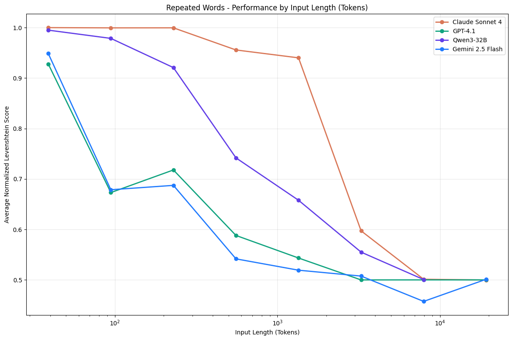

- [Memory & context management with Claude Sonnet 4.6](https://platform.claude.com/cookbook/tool-use-memory-cookbook)
- 用Anthropic自己的话来说：Agent就是“**[[$red]]==LLM自主使用工具的循环程序==**”
- # Prompt Engineering -> Context Engineering
	- 
	- Agent说白了，其主要逻辑就是一个while loop。
		- 之所以叫上下文管理，是因为需要把agent生成的内容、用户的输入、系统prompt好好管理起来。
		- llm会在一次任务过程中进行若干tool-calling，可能是mcp可能是skill，反正就是需要各种实时的提示词融合、组装来生成最新的提示词。
	- 之所以和过去的prompt engineering分割开来，在anthropic眼里，是因为以前的prompt engineering更像是单次的、静态的、为了各种one shot任务服务的做法。
- # Context Engineering为何重要
	- 说一千道一万，其实就一句话：LLM并不擅长处理长输入
	- ## Context Rot
	  collapsed:: true
		- 已经有研究证明，随着输入长度的增加，LLM获取有效信息的能力会减弱
			- 
		- 因此上下文必须作为一种有限的资源来处理。
			- 就像人类不能处理信息量过大的工作一样，LLM也有自己的"Attention Budget"
		- 随着上下文长度增长而导致的能力减弱，基本上**[[$red]]==属于LLM的固有缺陷==**，短期内难以根本解决
			- LLM内部的每一个token都会影响其他token，因此token增加就意味着一些重要指示的重要性被稀释，噪音增加
			- LLM的训练集中，短的对话更常见，因此LLM本来就不熟悉长输入与上下文范围中的依赖
- # 怎样才是有效的上下文？
	- Context Engineering的第一要义：寻找能够导向有效输出的最小高价值token集合。
	- 从过往实践来看，有效上下文往往可以考虑由如下几个部分组成
		- ### System Prompt
			- 需要使用极度简练、清晰、直白的语句，来描述agent的**[[$red]]==正确态度(Right Altitude)==**
				- 正确态度是一个平衡的艺术，太复杂、仔细、细节约束过多不可，太过模糊也不可
				  collapsed:: true
					- 
			- 建议将System Prompt做进一步拆分，且做好格式化，例如：
				- ``<background_information>``
				- ``<instructions>``
				- ``## Tool Guidance``
				- ``## Output Description``
			- 最好配合几个多样的，能cover到不同case的example
			- Anthropic建议从最简的system prompt开始，在最好的模型上跑测试，再根据不同的failure path修订
				- 注意最小最简并不意味着在绝对长度上短，它是在能够获取期望结果上尽可能短。
		- ### Tools
			- 工具允许agent与环境交互，最终会交互式地修改给到LLM的上下文
			- 一个常见的误区是提供太多以及用途模糊的工具
				- 如果一个人类不知道在哪些情形下最好用什么工具，那么LLM也不可能知道。
				- 所以最好是提供一套最小可用的工具集
- # Context retrieval And Agentic Search
	- 不要在对话开始之前就准备好所有的数据，而是给出文件路径、URL或各种Tool、MCP等references，让LLM自行动态获取所需信息。
		- 有能力的大模型会自行通过tail、head等工具获取自己关心的信息而不是全文
		- 注意这些references的meta data同样重要！
			- 就像一个叫做`test_utils.py`的文件，其存在于`tests`目录下与`src/core_logic`目录下包好了不同的语义。
	- 这样做的代价就是，达成目标的时间大概率会变长。而且需要提供能够让Agent自主、启发式地获取信息的工具
	- ## 混合式
		- 有些信息最好也还是在准备对话promt的时候就直接提供，也就是说，部分信息直接随着用户prompt注入，部分信息只提供reference，让agent自己取。
		- Claude Code就是混合式的
			- ``CLAUDE.md``里的所有内容都是会直接注入的
	- ## Context Engineering for long-horizon tasks
		- 某些任务可能需要agent连续工作数十分钟到数小时的任务其prompt最终一定会耗尽context window。
		- 如何让agent在这种情况下也能有效工作是重中之重。Anthropic的团队针对这种情况，使用了如下手段。
		- ### Compaction
			- 上下文压缩是当上下文窗口马上被撑爆时的第一道保险。
			- 首要目标是将过往的context压缩为summary，让agent工作在这份summary上
			- 核心是决定：哪些信息保留，哪些信息丢弃
			- #### 使用LLM生成总结
				- 总容易想到的方法。
				- 需要精心设计prompt，让LLM最大化保留细节。
				- 可以先让LLM在保持最大召回率（recall）的情况下入手，然后逐步微调剔除冗余内容
			- #### 结构化与启发剪裁
				- 不依赖于LLM，而是通过结构化管理对话内容，直接丢弃注定意义不大的内容。
					- 例如已经不知道多少轮对话之前的工具调用结果。这些内容完全没必要留
			- #### RAG与JIT Context
				- 把详细的对话内容留档到磁盘上，然后将其作为rag，给到agent reference。
		- ### Structured Note-Taking
			- agent在运行中，规律性地向上下文窗口以外的记忆中持久化一些信息。
			- 这项策略可以以最小化成本提供持久化记忆能力，与极大的灵活性
				- 就像claude code会记录todo list
				- 能够辅助agent非常复杂，上下文极长的任务
			- 非常适合用在强交互式任务中
		- ### Sub-Agent
			- 主Agent直接派发任务给子agent，子agent完成之后汇报结果（汇报往往只有2000 token以下）
				- 完全隔离了主agent的上下文，避免主agent的上下文被拉长
			- 这个结构的一个问题是，子agent之间的信息完全隔离且难以流通
				- multi-agent部分解决了这个问题