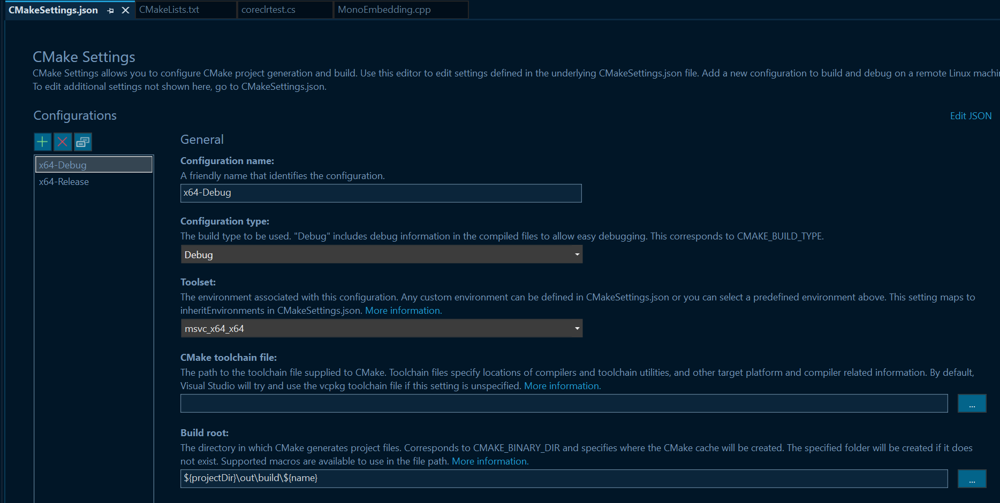

- 此实例描述如何将Mono运行时嵌入到应用程序中，并且从C代码中调用托管代码的函数以及从托管代码中调用C代码
- 单纯的C/C++语言会导致开发人员需要面对很多硬件特性且缺乏现代语言特性(安全，动态特性)，而更高层级的JIT体验则受到性能的制约
- 一种解决方法就是**混合两种语言的特点**，也叫做**Scripting**
	- {:height 247, :width 293}
	- 即，将性能敏感的部分通过C/C++甚至汇编语言来实现，而高层的功能，例如GUI等交互功能交由scripting语言来实现。
	- scripting语言由scripting engine带来高级特性支持，同时又可以直接调用高性能的C/C++实现的API
- # How Embedding Works
	- 将mono和C代码链接(即将``libmono``和C代码link)，链接之后，应用的地址空间类似于：
		- 
		- 嵌入的Mono API会将Mono运行时暴露给C代码，使开发者可以控制运行时的各个方面并且可以直接审视运行在运行时中的CIL代码
	- 当mono运行时初始化之后，CIL/.NET代码即可被载入其中，此时应用的地址空间类似于
		- 
		- C代码亦被称为**未托管代码(Unmanaged Code)**
		- CIL代码则被称为**托管代码(Managed Code)**
		- 更有趣的在于，未托管代码和托管代码可以**互相调用**
			- 托管代码->未托管代码：``P/Invoke``，或使用低层Mono嵌入的API
			- 未托管代码->托管代码：通过载入Mono assembly，并通过mono寻找到目标函数之后调用
- # 示例代码
	- ## 安装Mono
		- [下载地址](https://www.mono-project.com/download/stable/#download-win)
		- 安装完成之后将安装目录下的``bin``目录添加进环境变量中
	- ## 拷贝库文件
		- 将mono安装目录下的``lib``和``include``目录拷贝到工程目录下
		- 
	- ## 准备托管代码
		- 在工程目录下编写一个简单的C\#文件
			- ```C#
			  namespace CoreCLRTest {
			      public class Test{
			          public static int GetNumber(){
			              return 42;
			          }
			          public static string GetHello()
			          {
			              return "Hello World";
			          }
			          public int Add(int a ,int b){
			              return a+b;
			          }
			      }
			  }
			  ```
		- 使用mono编译器编译获得dll文件
			- ``mcs -target:library -out:CoreCLRTest.dll .\coreclrtest.cs``
	- ## 组织项目结构
		- 在项目目录下新建一个``src``目录，在其中新建一个``MonoEmbedding.cpp``文件
			- ```c++
			  #include <iostream>
			  #include <string>
			  #include "mono/metadata/appdomain.h"
			  #include "mono/metadata/assembly.h"
			  #include "mono/metadata/mono-config.h"
			  #include "mono/jit/jit.h"
			  #include "mono/metadata/debug-helpers.h"
			  
			  
			  
			  int main() {
			      MonoDomain* domain = mono_jit_init_version("mono_embedding","v4.0.30319");
			  
			  
			      // Due to CmakeLists.txt has copied the dll to the target build folder, so we can load with relative path
			      auto assemly = mono_domain_assembly_open(domain, "CoreCLRTest.dll");
			      MonoImage* image = mono_assembly_get_image(assemly);
			      MonoClass* kclass = mono_class_from_name(image, "CoreCLRTest", "Test");
			  
			      // Get method description
			      MonoMethodDesc* getNumberMethodDesc = mono_method_desc_new("Test:GetNumber()", false);
			      MonoMethodDesc* getHelloMethodDesc = mono_method_desc_new("Test:GetHello", false);
			  
			      MonoMethod* getNumberMethod = mono_method_desc_search_in_class(getNumberMethodDesc, kclass);
			      MonoMethod* getHelloMethod = mono_method_desc_search_in_class(getHelloMethodDesc, kclass);
			  
			      // Execute the method and store the result in a MonoObject
			      MonoObject* numberReturnValue = mono_runtime_invoke(getNumberMethod, nullptr, nullptr, nullptr);
			      MonoObject* helloReturnValue = mono_runtime_invoke(getHelloMethod, nullptr, nullptr, nullptr);
			      int int_result = *(int *)mono_object_unbox(numberReturnValue);
			      std::string string_result(mono_string_to_utf8((MonoString*)helloReturnValue));
			  
			      std::cout << "Invoke GetNumber result: " << int_result << std::endl;
			      std::cout << "Invoke GetHello result: " << string_result << std::endl;
			  
			      // Create an instance of the Test class
			      MonoObject* instance = mono_object_new(domain, kclass);
			      // Obtain method from the instance
			  	MonoMethod* addMethod = mono_class_get_method_from_name(kclass,"Add", 2);
			  
			      //Prepare the parameters and exception pointer
			      void* params[2];
			      params[0] = new int(42);
			      params[1] = new int(47);
			      MonoObject* exception = nullptr;
			  
			      // Invoke the method, an instance is needed
			      numberReturnValue = mono_runtime_invoke(addMethod,instance,params,&exception);
			      // If exception is set, print the message
			      if(exception)
			          std::cout<<mono_string_to_utf8(mono_object_to_string(exception,nullptr))<<std::endl;
			  	
			      //Get the result and print
			      int_result = *(int *)mono_object_unbox(numberReturnValue);
			      std::cout<<"Invoke Add result: "<<int_result<<std::endl;
			      
			      // Clean up the mono runtime
			      mono_jit_cleanup(domain);
			  
			      return 0;
			  
			  ```
			- 这一步可以在编写``CMakeLists.txt``之后再做，如此可以获得代码提示
		- 编写``CMakeLists.txt``
			- ```CMake
			  CMAKE_MINIMUM_REQUIRED(VERSION 3.26)
			  
			  PROJECT(MonoEmbedding)
			  SET(CMAKE_CXX_STANDARD 17)
			  
			  INCLUDE_DIRECTORIES("include/mono-2.0")
			  LINK_DIRECTORIES("lib")
			  
			  FILE(GLOB_RECURSE mono
			              "include/mono/cli/*.def"
			              "include/mono/jit/*.h",
			              "include/mono/metadata/*.h",
			              "include/mono/utils/*.h",)
			  
			  
			  SET(SOURCE_FILES ${mono} "src/MonoEmbedding.cpp")
			  
			  ADD_EXECUTABLE(MonoEmbedding ${SOURCE_FILES})
			  
			  # This custom command copies desired dll to the target build directory
			  add_custom_command(TARGET MonoEmbedding POST_BUILD        # Adds a post-build event to target
			      COMMAND ${CMAKE_COMMAND} -E copy_if_different  # which executes "cmake - E copy_if_different..."
			          "${PROJECT_SOURCE_DIR}/CoreCLRTest.dll"      # <--this is in-file
			          $<TARGET_FILE_DIR:MonoEmbedding>)                 # <--this is out-file path
			  
			  TARGET_LINK_LIBRARIES(MonoEmbedding mono-2.0-sgen)
			  
			  SET(CMAKE_EXPORT_COMPILE_COMMANDS ON)
			  
			  ```
	- 项目目录结构此时应该类似于：
		- 
	- ## 编译与运行
		- 使用VS打开项目目录，配置cmake之后即可编译运行
		- ``<CTRL-Q>``搜索cmake可以配置cmake
			- 
			- 
		- 打开``.cpp``源文件并将起动项设置为当前文档
			- 
		- ``<F5>``即可编译运行
		- 