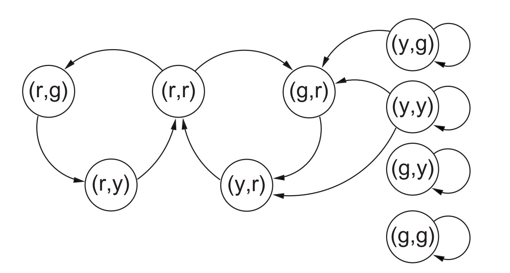
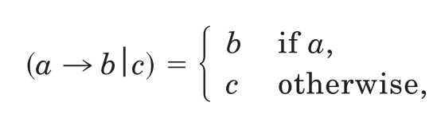

title:: Formal Verification In Hardware Design: A Survey

- ## verification & validation
	- verification是一种内部过程，验证产品是否满足特定的regulation，requirement，specification
	- validation一般需要外部(客户)参与，验证用户对于产品的接受度
- # SPCIFICATION AND VERIFICATION CONDITIONS
	- 两种主要的用于specification的方法和对应的verification
		- 聚焦于描述对于设计的理想的性质
			- 主要是时序的性质，即动态的性质
			- 利用时序逻辑描述性质
			- 此时验证需要展示系统所有的可能行贿都满足specification的时序性质
			- 又称：[[$red]]==**性质验证（property verification）**==
		- 基于系统的高层及模型specification
			- 此时验证需要证明系统实现的所有可能行为都和高层级specification的行为是一致的
			- 又称：[[$red]]==**实现验证（implementation verification）**==
	- 两种验证都是同一个问题的不同描述，specification 本质上就是定义了一些系统中对于有效行为的一些限制（constraints），verification就是证明实现满足了这些限制
	- ## 使用时序逻辑描述specification
		- ### 时序逻辑的核心
			- 一个系统$M$会在任何一个时间节点处在一个状态集合$S$中的某一个状态上，并会随着时间推移进行各种状态的迁移
			- *原子命题(Atomic proposition)*和每一个状态有关，是时序逻辑公式的基础建造材料
			- 实际操作中，状态机和通常由布尔n元组组成，如此一来原子命题便可以很简单的描述为：“状态中的第i个元素的值是true(false)”
			- 时序操作符号将原子命题的真假值在不同时间点下联系起来
		- 有很多种时序逻辑模型
		- ## 选择时序逻辑的考虑
			- **逻辑的表达能力**
				- 有的性质只能在合适的时序逻辑下被表达
			- **逻辑的复杂度**
				- 一般来说，表达能力越强的逻辑，其验证的计算复杂度往往更高
				- 选择何时的逻辑可以降低验证的成本
			- **确保specification和验证者实际想验证性质的一致性**
				- 这个只能人工来做
		- ### CTL（Computation Tree Logic）
		  collapsed:: true
			- 命题逻辑在分支时间上的变种
			- 离散时间
			- **CTL公式和语义**
				- 一个时序结构形如：$M=(S,R,L)$
					- $S$是状态集合
					- $R\subseteq S \times S$是一个全双元关系($\forall_{s\in S}\exists_{t\in S}(s,t)\in R$)，表示状态的迁移
					- $L:S\rightarrow 2^{\mathscr{P}}$，标记某一个状态下，$\mathscr{P}$中的哪些哪些原子命题为true
				- 一条**路径（path）**是指一个无限的状态序列
				- 一个CTL公式递归定义如下
				  collapsed:: true
					- 所有的原子命题是一个CTL公式
					- 如果$f_1$和$f_2$是CTL公式，那么$\neg f_1,f_1\wedge f_2, \bold{AX}f_1,\bold{EX}f_1,\bold{A}[f_1\bold{U}f_2], \bold{E}[f_1\bold{U}f_2]$也是CTL公式
				- $\bold{AX}$表示“所有的后继”，对于状态$s_0$，如果$s_0$的所有后继都满足公式$f_1$，则称$\bold{AX}f_1$在$s_0$上成立
				- $\bold{EX}$表示“存在一个后继”
				- $\bold{A}[f_1\bold{U}f_2]$表示“总是-直到”，从$s_0$开始的每一条路径上，要么$f_1$一直成立，要么在某一时刻前$f_1$一直成立，且在该时刻$f_2$成立
				- 相应的$\bold{EU}$表示“存在-直到”
				- 一些延申定义：
					- $\bold{AF}f = \bold{A}[true\bold{U}f]$ (f最终会被满足)
					- $\bold{EF}f=\bold{E}[true\bold{U}f]$ (存在一个可到达的状态满足$f$)
					- $\bold{EG}f = \neg\bold{AF}\neg f$ (存在一条路径，该路径上所有的状态都满足$f$)
					- $\bold{AG}f = \neg \bold{EF}\neg f$ (所有的可能路径上$f$都必须一直被满足)
				- [[$blue]]==**个人理解**==：X表示next，U表示until，F表示future，G表示global
				- 对于一个$M=(S,R,L),s_0\in S,S_0\subseteq S$
				  collapsed:: true
					- $M,s_0\vDash f$表示$f$在$M$的状态$s_0$上满足, 当$M$在上线文中明确时，可以省略不写
					- $M,S_0\vDash f \equiv \forall_{s\in S_0}M,s,\vDash f$
					- $M \vDash f \equiv M,S\vDash f$
				- $\vDash$的语义递归定义如下
				  collapsed:: true
					- $M,s_0\vDash p$ iff $p \in L(s_0)$
					- $M,s_0 \vDash \neg f$ iff not $(M,s_0) \vDash f$
					- $M,s_0 \vDash f_1 \wedge f_2$ iff $(M,s_0 \vDash f_1)$ and $(M,s_0\vDash f_2)$
					- $M,s_0 \vDash \bold{AX}f$ iff $\forall _{t\in S}(s_0,t)\in R \rightarrow (M,t\vDash f)$
					- $M,s_0\vDash \bold{EX}f$ iff $\exists_{t\in S} (s_0,t)\in R \wedge (M,t \vdash f)$
					  collapsed:: true
						- [[$red]]==注意此处任意用的蕴含， 存在用的且==
					- $M,s_0 \vDash \bold{A}[f_1\bold{U}f_2]$ iff 对于所有路径$s_0,s_1,\ldots$ 
					  都有$\exists_{i\ge 0}(M,s_i\vDash f_2)\wedge \forall_{j=0,\ldots, i-1}M,s_j\vDash f_1$
					- $M,s_0,\vDash \bold{E}[f_1\bold{U}f_2]$ iff 存在某条路径$s_0,S-1,\ldots$
					  都有$\exists_{i\ge 0}(M,s_i\vDash f_2) \wedge \forall_{j=0,\ldots,i-1}M,s_j\vDash f_1$
			- **使用CTL描述specification**
			  collapsed:: true
				- 引入一个简单的**交通信号灯控制系统**作为例子
					- $\mathscr{C}=\{r,y,g\}$，表示灯的颜色集合
					- 状态空间$S = \mathscr{C\times C}$，表示南北向和东西向的信号灯的颜色
					- 
					- 标签函数：$L((c,d)) = \{[ns=c],[ew=d]\}$
				- 一般有两种希望验证的的性质
					- **安全性质（safety properties）**：坏事永远不会发生
					- **活性性质（liveness properties）**：好事终究会发生
				- 在信号灯系统下一个重要的安全性质就是：任意时刻至少有一个方向显示红灯
					- 此性质使用CTL描述为：$\bold{AG}([ns=r]\vee [ew =r])$
					- 需要手动指定初始状态，因为状态空间中的有些状态并不满足该性质
						- $M\vDash ([ns=r]\wedge [ew = r])\Rightarrow \bold{AG}([ns=r]\vee[ew=r])$
					- 一个对于安全性质通用的形式为
						- $M\vDash P_{init}\Rightarrow \bold{AG}P_s$
				- 在信号灯系统下一个合适的活性性质是某一方向的交通灯总是会最终编程绿灯
					- 使用CTL描述为$\bold{AG}(\bold{AF}[ns=g])\wedge \bold{AG}(\bold{AF}[ew = g])$
					- 这个性质只能在$M$满足不会总是“歧视”某一条状态转换的公平性下成立
					- 但是在公平性假设下的活性性质并不能在CTL中被表达
		- ### Branching Time Logics
		  collapsed:: true
			- 表达能力更强
			- $\mathrm{CTL^*}$是CTL的一个泛化版本，其公式分为路径(path)公式和状态(state)公式，定义如下
				- 任何原子命题是一个状态公式
				- 如果$s_1,s_2$是状态公式，$p$是一个路径公式，那么$s_1\wedge s_2,\neg s_1, \bold{E}p$都是状态公式
				- 如果$s$是一个状态公式，$p_1,p_2$是路经公式，那么$s,p_1\bold{U}p_2,\neg p_1,p1\wedge p_2,\bold{X}p_1$都是路经公式
				- 所有的状态公式都是一个$\mathrm{CTL}^*$公式
			- 延申表达：
				- $\bold{F}p \equiv true \bold{U}p$
				- $\bold{G}p\equiv \neg\bold{F}\neg p$
				- $\bold{A}p \equiv \neg \bold{E}\neg f$
			- $\bold{E,A}$是路径量词，表示是存在一条路径还是所有可能路径
			- $\bold{X,U,F,G}$是“情态动词”，表示下一状态，直到，未来，全局
				- 如果严格要求每一个路径量词之后跟一个情态动词，那么就变成了标准的CTL
			- CTL的所有公式都是状态公式，这就排除了所有有关独立计算的断言
			- 在公平性假设下的活性性质可以表述为：
				- $\bold{A}((\bold{GF}p_1\wedge\cdots\wedge\bold{GF}p_n)\Rightarrow\bold{F}q)$
				- $\bold{GF,F}$都被$\bold{A}$束缚了，表示在同一条路径下的情态
			- 没必要使用总是采用完整的$\mathrm{CTL^*}$，来描述特定的公平性性质
			- 有人提出了$\mathrm{CTL}^F$，此逻辑语法和CTL相同，但是引入了*公平性约束(fairness constraints)*，一些状态必须必须被无限次地进入，这样的路径才能被认为是公平的
				- 语法和CTL完全相同，但是所有的路径量词都仅作用在公平的路径上
		- ### Linear Time Logic
		  collapsed:: true
			- CTL的不确定性通过允许在某一时刻有多个未来状态来表现
			- LTL只考虑某一次具体的执行，从语法上看，像是没有路径量词的$\mathrm{CTL^*}$
			- LTL的结构为$M=(S,x,L)$，$x$是一个无限的状态序列
				- 更加普遍的结构是$M_X = (S,X,L)$，$X$是所有可能的状态序列的集合
			- LTL没有存在量词，表达能力比$\mathrm{CTL^*}$更弱
			- 若状态迁移是确定的，那么LTL和BTL是相等的
		- ### $\mu-Calculus$
		  collapsed:: true
			- 对于一个时态结构$M=(S,R,L)$，一个**谓词**是标记出在该谓词为true的状态集合$P\subseteq S$
			- $\bold{AX}P = \{s\in S\ |\ \forall_{s'\in S}(s,s')\in R \Rightarrow s'\in P\}$
			- $\mu-Calculus$公式由下一状态符号$\bold{EX,AX}$，布尔连接符和最小、最大不动点操作符$\mu,\nu$组成
		- ### 不变式和安全性质
			- 一个最简单的描述时序specification的方式是不变式和安全性质
			- 不变式指若一个状态满足某个性质，则其所有的后继都满足该性质
				- $M\vDash (I\Rightarrow\bold{AX}I)$
			- 使用不变式可以帮助验证安全性质，一般路径如下：
				- $M\vDash P_{init}\Rightarrow I$
				- $M\vDash I \Rightarrow \bold{AX}I$
				- $M\vDash I\Rightarrow P_s$
		- ### Trajectory Formulas
			- 只允许下一状态操作符，不允许或，递归定义如下：
				- **简单谓词**
					- $\mathtt{nd}$是电路模型中的一个节点，则$\mathtt{nd}\ \bold{is}\ 0,\mathtt{nd}\ \bold{is}\ 1$都是一个轨迹公式
				- **合取**
					- 如果$F_1,F_2$是轨迹公式，那么$F_1\wedge F_2$也是
				- **下一状态**
					- 如果$F$是轨迹公式，那么$\bold{N}F$也是
				- **Domain restriction**
					- 如果$F$是轨迹公式，$E$是在符号变量上的布尔表达式，那么$F\ \bold{when}\ E$是一个轨迹公式
			- 一个轨迹断言形如$[A\Rightarrow C]$，其中$A,C$都是轨迹公式
			- 一个时序结构$M\vDash [A\Rightarrow C]$ 当且仅当$M$中的任何状态序列在满足$A$ (antecedent)时也满足$C$ (consequent)
				- 一般情况下，$A$用来限制电路的输入，$C$用来断言输出节点的结果
				- 例如，$[\mathtt{in}\ \bold{is}\ 0 \Rightarrow \bold{N}(\mathtt{out}\ \bold{is}\ 1)]$
			- 利用符号化的布尔表达式可以避免重复单独列举所有的可能输入，定义一种简写，$b$是一个布尔表达式
				- $\mathtt{nd}\ \bold{is}\ b \equiv ((\mathtt{nd}\ bold{is}\ 0)\ \bold{when}\neg b)\wedge ((\mathtt{nd}\ \bold{is}\ 1)\bold{when}\ b)$
			- 则表达一个有一个时间单位延迟的非门，可以使用： $[\mathtt{in}\ \bold{is}\ a \Rightarrow \bold{N}(\mathtt{out}\ \bold{is}\ \neg a)]$
	- ## Specification with High-Level Models
		- 之前的specification都是描述期望的性质，另一种specification的风格是使用高层级模型规定被允许的系统行为
		- 在此框架下，验证需要分析高层级模型$M_S$(specification)和底层及模型$M_I$(implementation)之间的关系
		- 三种方式描述一个设备的行为
			- 一阶或高阶逻辑
			- 用状态迁移系统描述，使用语言如CSP或UNITY
			- 能够被自动机或infinite objects识别的语言
		- ### 抽象机制
			- 四种普遍的抽象方式
			- **结构抽象(structural abstraction)**
				- 隐藏实现的内部结构细节
				- 反应外部可以观测的行为，不对内部设计做出限制
				- 精化描述为更加细致地描述所使用地组件
			- **行为抽象(behavioural abstraction)**
				- 隐藏在不可达状态下的行为
				- “不关心”条件
			- **数据抽象(Data abstraction)**
				- 关系到对于实现的信号的语义解释
				- 例如，对于一个counter来说，specification要求输出从0到7，而实现的输出是三位bit
				- 实际上是给出一个从实现的状态或信号到specification的语义空间的映射
			- **时序抽象(temporal abstraction)**
				- 将实现的时间步骤和规范的时间步骤联系起来
				- 高层级描述一个时间单位里应该做什么，具体实现使用多长的时钟周期是自由的
		- ### Specifications in logic
			- 形式化逻辑足以描述硬件系统
			- 一个记法：
				- {:height 66, :width 247}
			- 一个设备的外部行为可以使用在其外部连接或可见状态上的谓词进行建模
				- 若行为与时间无关(组合逻辑？)，一阶逻辑足以，如对一个无时间延迟的与非门建模
					- $NAND(i_1,i_2,o) = (o=\neg(i_1\wedge i_2))$
				-