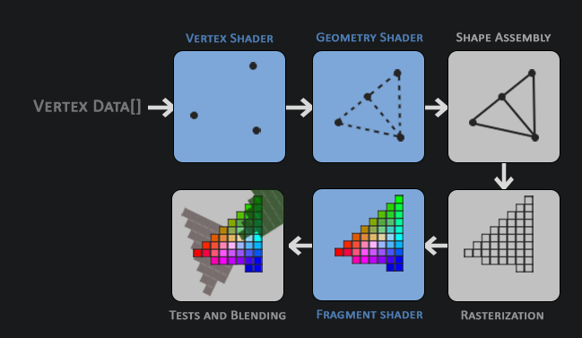
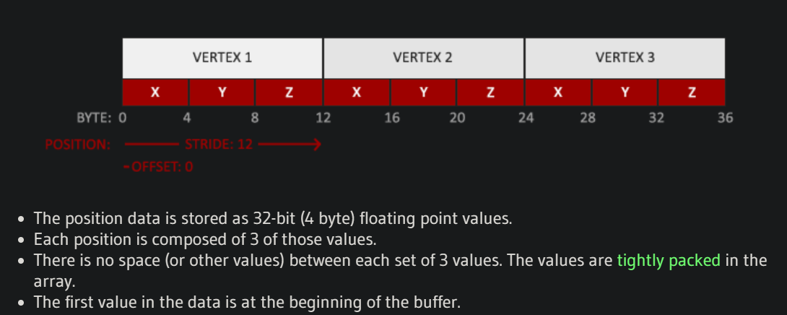
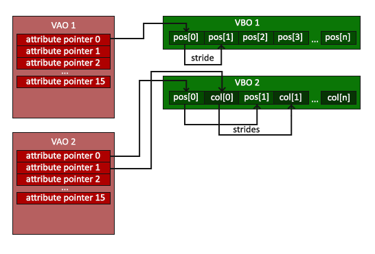
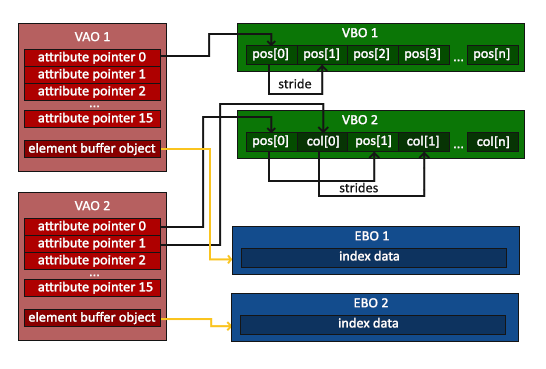

- [[在WSL中安装OpenGL开发环境]]
- # 简单理解OpenGL
	- 一种图形API标准(Specification)，实际的实现仰赖于各家显卡厂商所提供的驱动
	- ## Core-Profile和Immediate Mode
		- OpenGL的两种编码模式，或者又称风格
		- 最初opengl仅提供Immediate Mode供开发者使用
		- ### Immediate Mode
			- 使用简便，但是缺乏Flexibility
			- 抽象了，但过于抽象，使用immediate mode编程将缺乏对于opengl实际行为的具体理解
		- ### Core-Profile
			- **现代**opengl所采用的方式
			- 移除了Immediate Mode中的一些deprecated函数
		- 本书采用opengl-3.3的core-profile模式作为案例
	- ## 扩展
		- 不同的显卡厂商可能会在opengl的官方标准意外，实现一些额外的扩展函数
		- 这些扩展在使用前最好实现判断是否可用，例如：
			- ```glsl
			  if(GL_ARB_extension_name)
			  {
			      // Do cool new and modern stuff supported by hardware
			  }
			  else
			  {
			      // Extension not supported: do it the old way
			  }
			  ```
	- ## 状态机
		- 使用opengl开发类似于在和一个巨型的状态机打交道
		- 在opengl中，这样的状态被称作**[[$red]]==Context==**
			- context定义了当前opengl应该如何运作
		- 当要改变opengl的行为方式的时候，可以通过**改变一些context中的变量**的方式来更换状态，如此一来当下一个绘制命令来到时，opengl就会更改行为模式
		- 在实际使用opengl进行开发时，常会用到一些**State-Changing**函数和**State-Using**函数
			- 前者更改context，后者根据不同状态执行一些不同的操作
	- ## 对象
		- 大多数OpenGL库函数都由C实现，opengl代码有很浓重的C语言风格
		- 但是为了让编码更加简易，opengl实现了一些便捷的抽象，例如**对象(Object)**
		- opengl中的一个对象是一组**可选项（options）**的集合。
			- 表示opengl中的一个子状态
			- 例如可以用一个对象来表示绘制一个窗口时的一些设置，包括大小和支持的颜色等
		- 对象定义风格类似于C语言的结构体
			- ```glsl
			  struct object_name {
			      float  option1;
			      int    option2;
			      char[] name;
			  };
			  ```
		- 对象的使用则类似于：
			- ```glsl
			  // The State of OpenGL
			  struct OpenGL_Context {
			    	...
			    	object_name* object_Window_Target;
			    	...  	
			  };
			  ```
				- 这里表示了一个对象是Context的一个子状态
			- ```glsl
			  // create object
			  unsigned int objectId = 0;
			  glGenObject(1, &objectId);
			  // bind/assign object to context
			  glBindObject(GL_WINDOW_TARGET, objectId);
			  // set options of object currently bound to GL_WINDOW_TARGET
			  glSetObjectOption(GL_WINDOW_TARGET, GL_OPTION_WINDOW_WIDTH,  800);
			  glSetObjectOption(GL_WINDOW_TARGET, GL_OPTION_WINDOW_HEIGHT, 600);
			  // set context target back to default
			  glBindObject(GL_WINDOW_TARGET, 0);
			  ```
- # GLAD
	- glad可以看作一个显卡驱动和图形API之间的中间层
	- opengl api并不是由操作系统提供而是各家显卡驱动厂商实现，因此需要有个抽象层来方便地获取每一个硬件平台的opengl api函数地址
	- 其调用就是将``glfwGetProcAddress``传给`gladLoadGLLoder`，前者会通过后者取出若干函数保存到事先定义好的函数签名变量中，后续调用函数时不再需要通过前者根据函数名来获取函数地址，而是直接使用预先定义好的一些同名函数宏，这些宏会展开为预先定义好的函数指针
- # 创建一个窗口
	- ## 初始化GLFW
		- glfw在使用前需要被初始化，使用函数``glfwInit``来完成
		- ### 给出向新创建的window给出hint
			- 在创建一个新窗口之前可以给出一些hint，这些hint包括GLFW版本，使用的profile模式（Core Profile）等
			- hint分为**Hard Constraints**和**Soft Constraints**
				- **[[$red]]==Hard Constraints==**：创建出来的窗口必须完全符合这些constraints， 否则创建失败，包括：
					- GLFW_STEREO
					- GLFW_DOUBLEBUFFER
					- GLFW_CLIENT_API
					- GLFW_CONTEXT_CREATION_API
					- 以下两个constraints对于OpenGL context来说是hard的，但是对于OpenGL ES context来说会被忽略
				- **[[$red]]==Soft Constraints==**
					- 非hard的hint都是soft constraints
					- 这些hint，opengl在创建窗口时会尽量靠拢
					- 某些例如GLFW_CONTEXT_VERSION_MAJOR这样的hint，虽然不是hard constraints，但在某些情况下也会导致窗口创建失败，例如如果创建出来的窗口支持的api版本低于给定版本，就会失败
- # Hello Triangle
	- OpenGL中的渲染管线大致可以分为以下几个步骤：
		- 
		- 其中标记为蓝色的步骤可以自编程shader
		- ### 原始数据(Vertex Data)
			- 代表组成三角形的每一个顶点
			- 每一个顶点的数据包括其3d空间坐标和一些其他任意数据
			- 目前为了简单起见假设一个顶点的数据只包括位置坐标和颜色信息
			- #### primitives
				- 用来告知opengl如何去解读这些顶点数据集
				- 例如是把这些顶点看作独立的点还是三角形集合还是线的集合
				- 使用hint来告知
					- GL_POINTS
					- GL_TRIANGLES
					- GL_LINE_STRIP
		- ### Vertex Shader
			- 顶点数据需要经过的pipeline中的第一道工序
			- 也就是**视图变换**
		- ### Geometry Shader (Optional)
			- 将Vertex Shader的输出作为输入
			- 从一系列顶点中生成一个primitive
			- 还拥有发散新顶点组成新的primitive来生成形状的能力。
			- 例如在上图例子中，Geometry Shader通过给定的形状生成了第二个三角形
		- ### Primitive assembly
			- 将所有的顶点，或选择的顶点作为输入
			- 根据primitive和顶点组装形状
			- 在上图的例子中，组装得到了两个三角形
		- ### Rasterization
			- 光栅化，将形状映射为屏幕空间的像素点
			- 这一阶段得到的就是fragment，共下一阶段的fragment shader使用
				- 在OpenGL中，一个Fragment是OpenGL渲染**[[$red]]==一个像素点==**所需的**[[$red]]==所有数据==**
			- 在fragment shader运行之前会执行clipping，剪切掉在试图之外的fragment
		- ### Fragment Shader
			- 主要为了计算每个像素点的最终颜色
			- 一些高级特效往往在这一阶段引入
			- 一般来说，fragment shader包含了和3D场景香瓜你的数据，这些数据会用来计像素点的最终颜色
		- ### Test And Blending
			- 当所有像素点的颜色都被确定之后，最终的结果还需要经过**Alpha Test**和**Blending**
			- 这一阶段计算每个fragment的**深度**和**Stencil(模板？)**值，以判定每个fragment是在其他物体的前还是后，是否需要被舍弃
			- 这一阶段还计算每个fragment的alpha值，以判定fragment道德透明度，如果是透明的则需要**blends**其他物体
	- 虽然OpenGL给出了多个可自定义的步骤，但绝大多数情况下，只需要修改Vertex Shader和Fragment Shader的行为就可以做出理想的效果
		- 这两个shader也不提供默认shader，需要自己写
	- ## Shader Program
		- 在所有的shader都编译好之后需要将所有的shader link在一起形成一个整的Shader Program
		- 详见代码
	- ## Vertex Attributes
		- OpenGL要求必须由使用者自己去确定如何组织顶点数据
		- 例如，可以这样组织顶点数据：
			- 
	- ## Vertex Array Objec(VAO)
		- 存储了vertex attributes
		- 
		- 当调用``glVertexAttribPointer``时，attribute会被记录到当前绑定的VAO(也就是上一次调用``glBindVertexArray``时指定的VAO)
		- 同理，调用`glVertexAttributePointer`时，attribute中记载的地址，是上一次绑定到``GL_ARRAY_BUFFER``中的VBO的地址
	- ## Element Buffer Object(EBO)
		- 画两个三角形需要六个顶点，但是如果两个三角形有重叠的顶点（实际中经常发生），那么把重叠的顶点也存储一边就会造成空间浪费。
		- 更好的做法是，每一个顶点位置数据都只存储一份，用某个顶点在buffer中的index来表示一个形状。
		- 例如，一个三角形可以表示为0,1,2，表示由顶点数据缓存中的第0，1，2个顶点组成
		- 存储索引数据信息的buffer就被叫做**[[$red]]==EBO==**
		- A VAO stores the glBindBuffer calls when the target is GL_ELEMENT_ARRAY_BUFFER. This also means it stores its unbind calls so make sure you don't unbind the element array buffer before unbinding your VAO, otherwise it doesn't have an EBO configured.
		- 
	-