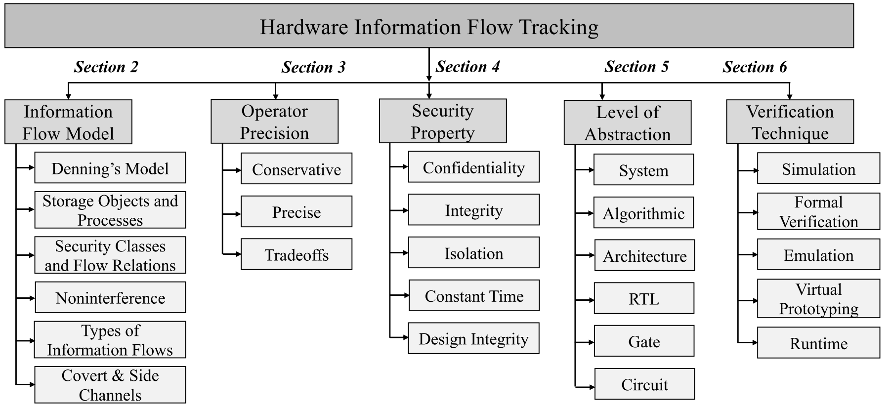
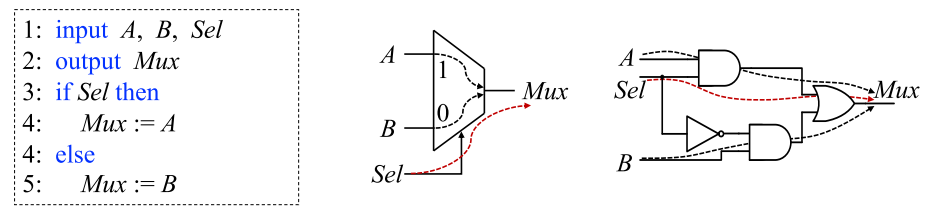
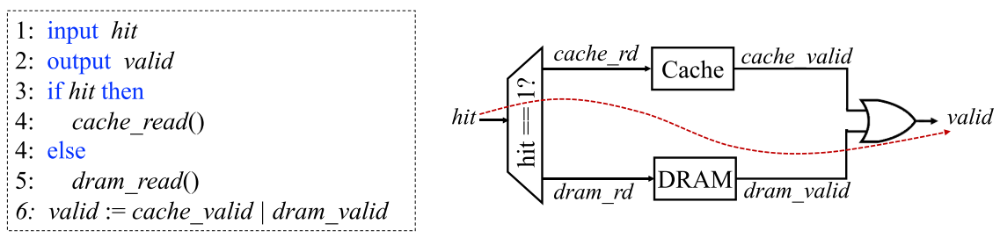
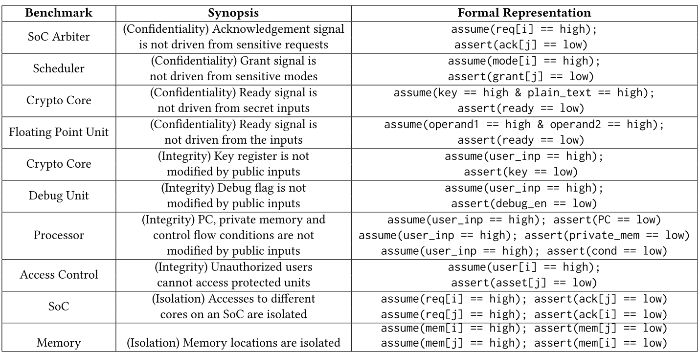
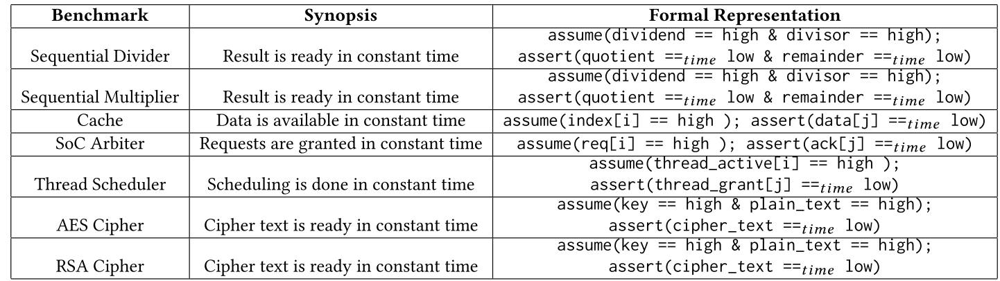
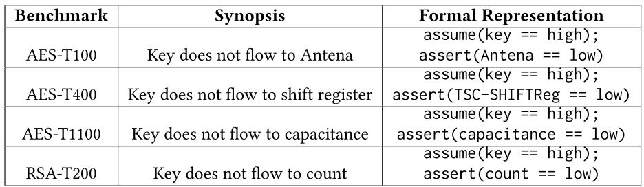
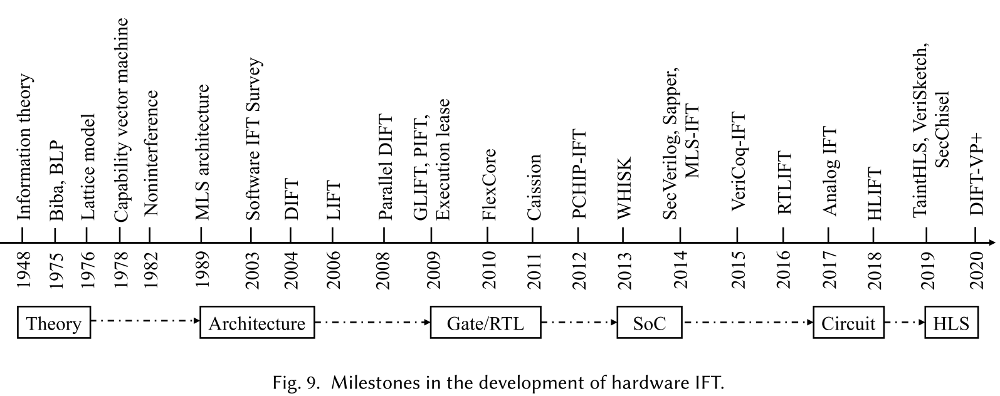
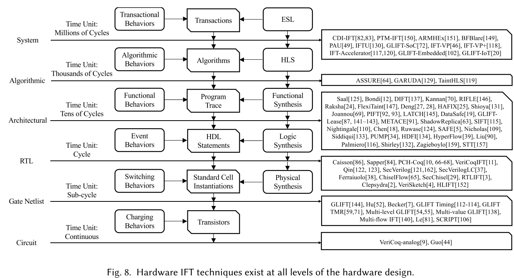
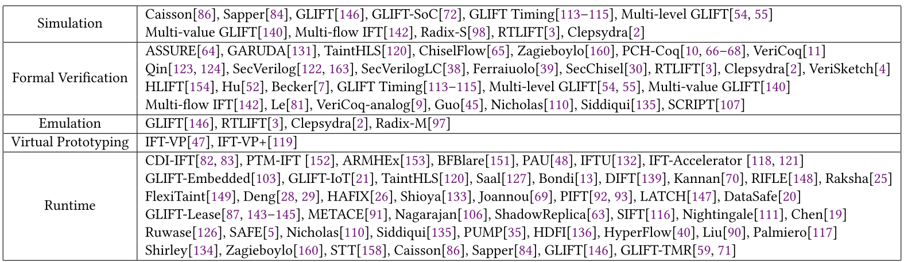

- # 图例
	- [[#green]]==生词==
	- ==重点==
	- [[#red]]==疑点==
	- [[#blue]]==附注==
- # Introduction
	- information flow model 最早由 Denning 在文章
		- Secure Information Flow in Computer Systems (1975)
		- A lattice model of secure information flow (1976)
	- 中提出
	- 一个information flow model一般具有已下特质：
		- **安全性质**(security property)
		- **抽象层级**(level of abstraction)
		- **运算符准确度**(operator precision)
		- **验证技巧**(verification technique)
	- 本文根据这些特质形成了对于IFT技巧的分类：
	- 
	- ## 分类解释
		- ### 运算符准确度
			- class comibing operator 如何更新安全等级？
			- **conservarive**：IFT 运算符使用一个最小上限[[$red]]==(?)==
			- **precise**：IFT运算符会考虑数据值的影响
			- **tradeoffs**：IFT运算符在精确性和计算复杂度之间寻找平衡
		- ### 安全性质
			- 支持的安全性质
			- **机密性(confidentiality)**：阻止敏感信息的泄露
			- **完整性(integrity)**：禁止不受信实体修改可信数据
			- **独立性(isolation)**：阻止两个不同可信级别的实体进行通信
			- **持续时间(Constant time)**：捕捉整个运行时变化下的信息流
			- **设计完整性(design integrity)**：检测由未归档的设计修改导致的有害信息流
		- ### 抽象层级
			- 该技巧适用的抽象层级
			- **系统(system)**：考虑系统层级的信息流
			- **算法(algorithmic)**：在高级综合时适用
			- **架构(architecture)**：在ISA层级可用
			- **RTL**：RTL设计适用
			- **门级别(gate)**：门级别的网表适用
			- **电路(circuit)**：模拟和混合信号硬件设计可用
		- ### 验证技巧
			- **模拟(simulation)**：使用模拟工具确定信息流
			- **Formal verification**：使用形式化方法验证安全性质
			- **仿真(emulation)**：允许硬件仿真信息流的行为
			- **虚拟原型(virtual prototyping)**：创造一个硬件的软件版本来测量信息流
			- **runtime**：在运行时动态追踪信息流
- # Information flow
	- [[$red]]==**information flow tracking 和 information flow control 是一个东西?**==
	- ## information flow model的构成
		- 一个information flow model $\mathcal{FM}$ 由五部分构成$<\mathcal{N,P,SC,\oplus,\rightarrow}>$
			- $\mathcal{N} = \{a,b,\cdots\}$，是***储存对象(storage objects)***的集合，储存对象所代表的实际对象取决于抽象层级，可以是文件，分段，寄存器，触发器等
			- $\mathcal{P}=\{p,q,\cdots\}$，是***过程(processes)***的集合，信息流将会流经这些对象；例如：函数，算术操作和布尔门等
			- $\mathcal{SC}=\{A,B\}$，是**安全分级(security class)**的集合，标注了数据的机密性
				- 最经典的例如$\mathsf{secret,unclassified}$。
				- 安全分级可以被静态绑定给数据对象，也可以在运行过程中依据一些策略根据信息流被动态更新
				- **AKA. *tag, label* **
			- $\oplus$，是***分级组合运算符(class combination operator)***
				- 将一个分级对映射为另一个分级：$\mathcal{SC\times SC \mapsto SC}$
			- $\rightarrow$ 是一个***流关系(flow relation)***
				- 定义了什么层级的信息可以流向什么层级
				- $\rightarrow \subseteq \mathcal{SC}\times \mathcal{SC}$
				- 信息从A流向B意味着改变A的值有可能改变B的值
				- $A\rightarrow B$表示层级A的信息被允许流向层级B
	- ## Storage objects and processes
		- 在硬件中，储存对象是HDL语言中可以用于接受或储存值的类型，其硬件实现通常包括：(输入输出端口)，（内部连线），**寄存器**，**触发器**和**内存块**；为方便考虑，一般只考虑具有状态的部件，即专注于加粗的部件，忽略括号内的部件
		- 过程作为应用在储存对象上的操作，可以被定义为寄存器转移操作，有限状态自动机动作，组合函数和其他常见硬件计算模型
	- ## security calsses and flow relations
		- 信息流策略定义了数据对象之间可能的关系
		- 数据对象定义了系统的功能状态，标签确定了系统的安全状态
		- 可以用$\rightarrow$定义何种标签的数据可以流向何种标签
		- 也可以用$\nrightarrow$定义禁止两种标签的数据之间进行信息流通
		- 常用***格(lattice，一种偏序集)***来描述这种流关系，Denning定义信息流策略为一种有限格
		- $A \oplus B$表示A和B在有限格$\mathcal{E}$中的**最小上界**，有：
			- $A \rightarrow A\oplus B, B\rightarrow A\oplus B$
			- $A \rightarrow C, B\rightarrow C \Longrightarrow A\oplus B \rightarrow C$
			- 将$\rightarrow$看作一种偏序关系$\sqsubseteq$便很好理解
			- 事实上，$\rightarrow$就是一种偏序关系
		- $A\odot B$表示A和B在$\mathcal{E}$中的**最大下界**
			- $A\odot B = \oplus LSet(A,B)$
				- $LSet(A,B) = \{C\ |\ C \rightarrow A \mathrm{and} C \rightarrow B\}$
		- $\mathcal{E}$上最小上界和最大上界又被称为**最大元素**和**最小元素**
			- $\mathsf{high} = A_1\oplus \ldots \oplus A_n$
			- $\mathsf{low} = A_1\odot \ldots \odot A_n$
		- 一个数据流策略可以用一个安全格来建模
		- 偏序关系定义了流，操作符定义了两种标签的信息交会之后的标签
	- ## Noninterference
		- 可以参见 [[A Perspective on Information-Flow Control]]
		- 本文的几种表述：
			- high输入不能够影响low输出
			- low对象不能从high对象处获得任何数据
			- 系统在任何相同的low输入上只能输出同样的low输出，不论high输入是什么
			- 系统在任何low输入序列下的回应都完全一致而不论high输入为何
		- 如此便确保不可能通过修改low输入的值获取任何high对象的值
	- ## Types of Information Flow Relations
		- flow relation 定义了不同对象之间能否进行数据交换的安全策略
		- information flow relation 确定是否存在flow of information
		- 信息可以通过**功能信道(functional channel)**(布尔门，算数运算符，事物)和**物理信道(physical channel)**(能耗，电磁，热力学)流动
			- 根据本文描述，物理信道更像是可以用来推测某些信息的侧信道
		- 功能信道又可以被更进一步被分类为
			- **显式(explicit)**
				- 与直接的数据移动有关
					- 因此又叫**数据流(data flow)**
			- **隐式(implicit)**
				- 又上下文相关的执行导致，例如条件语句
				- 选择器中的sel的值便可能流向mux的输出
					- 随着抽象层度的降低，这种隐式流也变得越来越显式
					- 
				- 换言之：[[$blue]]==**所有的功能信息流，在门级别都是显式的**==
				- 在越低的抽象层级，分辨显式和隐式流将越困难
				- 又包含一种更为特殊的**timing flow**
					- 信息流流过时间相关的行为
					- 
					- 不管hit与否，valid都为1，因此hit没有隐式更没有显式流向valid，但是cache读取时间远远小于DRAM，因此通过判断valid被设置的时间可以的值hit的情况，因此hit通过时间流向了valid([[$red]]==感觉像是physical channel？==)s
	- ## Covert and Side Channels
		- ### 密道
			- ***储存密道(Covert and Side Channels)***
				- 将信息传输到一个存储位置，让本来无权限沟通的实体也能交流
			- ***时间密道(Timing covert channals)***
				- 将信息通过使用系统资源的方式传送出去，其他进程可以通过观测系统资源的被使用情况来提取信息
			- 使用本不是为了传递信息的机制来传递信息
		- ### 侧信道(side channel)
			- 通过非功能(通常是物理)特征来泄露信息
			- 包括执行时间，电量消耗，电磁辐射，声响等
		- 密道和侧信道之间的最大不同是，密道往往是认为构造的用于泄露的信息的通道，而侧信道大多是无意中形成的，但是可能会被利用
- # Operator Precision
	- ## Precision of IFT
		- **Precise IFT**
			- 令一个函数$O=f(I_1,\ldots,I_n)$，precise IFT标明存在$I_k$到$O$的信息流，当且仅当
				- $I_k$的值的变化会影响输出的变化
				- $I_k\rightarrow O \Leftrightarrow f(I_1,\ldots,I_k,\ldots,I_n)\ne f(I_1,\ldots,I_k',\ldots,I_n)$
		- 精确IFT能够准确地建模出硬件设计中地信息流行为，而非精确IFT可能出现**假阳(标记不存在地信息流)**和**假阴(漏标信息流)**
		- 大多数非精确IFT都会产生假阳，安全但是会导致硬件设计偏向保守
		- 时间和资源不足时也会导致非精确IFT[[$red]]==(主动选择还是被动结果?)==
	- ## imprecise IFT
		- 认为信息流和组建的功能性以及输入状态无关，只要任何一个输入为$\mathsf{high}$，那输出就是$\mathsf{high}$
		- 令$\mathcal{L}$为获取标签的函数，对于输出和n个输入，采取最小上界运算符来获取输出label可以描述为：
			- $\mathcal{L}(O)=\mathcal{L}(I_1)\oplus \cdots\oplus \mathcal{L}(I_n)$
			- 计算复杂度为$O(2^n)$[[$red]]==(感觉应该是O(n)?)==
		- 相较于精确IFT计算速度更快，可用于快速侧写潜在的信息流安全脆弱性
	- ## precise IFT
		- 既考虑硬件组件的功能性，又考虑输出
			- $\mathcal{L}(O) = f(I_1,\ldots,I_n,\mathcal{L}(I_1),\ldots,\mathcal{L}(I_n))$
		- 计算复杂度是$O(2^{2n})$[[$red]]==(?)==
		- **Gate level information flow tracking** (GLIFT)是最先建立的精确IFT技巧
		- 
		- 左边是没有考虑输入数值，使用最小上界的非精确IFT，右边是考虑值的精确IFT
		- 一些文献综述
	- ## Precision and complexity tradoffs
		- 有研究将非精确IFT的假阳归结于静态逻辑冒险，如2位MUX出现的假阳是因为静态0或静态1逻辑冒险
		- **[[$blue]]==降低精确度就意味着逐渐忽略输入变量的值==**
- # Security properties
	- ***trace property***：单个trace可以满足或违反的property
	- ***hyperproperties***：在一个trace集合中的所有trace(这种集合也叫system)都要满足某一trace property
		- 验证hyperproperty的一种方式是保持某些值不变，而便利关键输入的所有输入空间
		- 例如，验证机密性时，保持所有公共可观测对象为low，它们的数值也不关心，然后标记敏感对象为high，并遍历high的所有可能取值，确保都不会使公共可观测对象变为high
	- 接下来的部分使用**System Verilog Assertion(SVA)**语言描述性质
	- ## 机密性(Confidentiality)
		- 信息不会从敏感对象(high)流向未加密对象(low)
		- 
	- ## 完整性(Integrity)
		- 和机密性非常相似
		- 将公共访问标记为high，然后确保敏感变量在执行中保持low
	- ## 独立性(Isolation)
		- 不同加密层级之间的对象不应该有任何信息交换
		- 是双向(two-way)性质[[$red]]==(按两种方向各验证一次？)==
	- ## 常量时间(Constant Time)
		- 捕捉timing flow的前提是区分logical 和 timing flow
		- 
		- 说白了就是不同输入，获取输出的执行时间是**常量时间**，不然就可以通过计时获取信息
	- ## 设计完整性(Design integrity)
		- 可以用来检测硬件木马
		- **感觉还是机密性完整性那一套**
		- 
	- ## 常见弱点枚举(CommonWeakness Enumeration)
		- Common Weakness Enumeration(CWE)是一个设局开发的软硬件弱点种类列表
		- 大多数都能够用IFT建模
- # LEVEL OF ABSTRACTION
	- 
	- electronic system level (ESL) ->High level synthesis (HLS) tools -> RTL -> Gate level
		- 细节越来越多，越复杂
	- **系统层级**
		- 优点：找出的问题修复成本低
		- 缺点：缺少实现细节，只能做出一些很保守的假设
	- **架构层级**
		- 优点：有足够的设计信息用于验证按群相关的软硬件之间的干扰
		- 缺点：准确找出显式流和计时信道较难
	- **RTL**
		- 优点：准确的时钟周期天然方便了寻找计时信息流
		- 缺点：复杂的语义特点(各种控制语句)使得IFT分析举步维艰
	- **门级别**
		- 优点：所有的信息流到此级别都成为了显式流，使得IFT分析复杂度下降
		- 缺点：规模太大，模拟和验证同样的性质比RTL慢一到两个数量级
	- 不同的层级适合验证不同的安全性质
	- 
	- ## System Level
		- dynamic information flow tracking(DIFT)
		- 有的技巧应用在运行时，有的应用在静态分析
		- ### IFT Through Co-processing Unit
			- 介绍了一系列软硬件工具
		- ### IFT for Verifying and Enforcing SoC Security
			- 介绍了一些列技巧和相关工作
		- ### IFT for Enforcing Embedded System Security
			- 一系列工作总结
	- ## Algorithmic Level
		- 介绍了三种架构(工具，方法论)
	- ## Architecture Level
		- ### Capability Vector Architecture
			- 一种实现information flow control的方式
			- 每一种操作都需要请求相关的capability vector，只有当相关的capability vector存在时才能执行操作
			- 如，一条将数据从A移动到B的指令，会请求capability vector <(A,READ) and (B,WRITE)>
		- ### DIFT and Related Architectures
			- 使用协处理器完成IFC，例如用一个处理器来负责检查每一条指令的tag check，如果检查失败，会抛出异常
			- **Runtime Information Flow Engine (RIFLE) **
				- 将程序的二进制源码从常规ISA翻译为信息流安全的ISA
				- 跑在具有IFT能力的硬件上，和负责实施安全策略的安全强化操作系统交互
			- 接下来介绍了多种可以辅助DIFT硬件和软件架构，以及为了降低追踪开销而做出的各种努力
		- ### Execution Lease Architectures
			- execution lease 是 一种lease architecture，能够将执行的上下文隔离在一定范围内，因此副作用也被限制
		- ### IFT on Multi-core Architectures
			- 由于在多核处理器中，数据和元数据的处理被打撒为不同的顺序，如何维系DIFT在该环境下的正确性很有挑战性
			- **ShadowReplica**使用一个shadow thread和一个空闲的CPU核心来解耦执行和数据流追踪
				- 两个过程通过共享数据结构来通信
			- **SMT-based IFT (SIFT)**
				- Simultaneous Multithreading(SMT)
				- 一个执行在空闲上线问空间中的单独的线程来执行taint propagation和policy checking
		- ### IFT on RISC-V Architectures
			- **Programmable Unit for Metadata Processing (PUMP)**，经过强化之后可以执行IFT操作的RISC指令集
				- 会检查每一条指令的输入的tag，判断操作是否可执行并确定输出的tag
		- ### IFT for Speculative Architecture
			- **Speculative Taint Tracking (STT)**
				- 使用类似于DIFT的方式追踪结果的流，直到遇到密道
				- 自动untaint所有退出speculative状态的指令来增加性能
	- ## RTL
		- ### State Machine Based IFT Language
			- 介绍了两种支持IFT的HDL语言
				- Caisson
				- Sapper(改进了caisson的一些缺点)
		- ### PCH and Coq Based IFT
			- 将IFT结成到proof carrying hardware (PCH) framework
			- 定义一些verilog到coq的法则，直接自动化verilog到coq模型的转化
		- ### SecVerilog and SecChisel
			- 分别是Verilog和Chisel的强化版
		- ### RTLIFT
			- 可以捕捉所有逻辑流
			- 挑战在于如何找到各种复杂控制语义中的隐式流
				- 可以转换为MUX网络来完成
			- 允许可变的精度
			- 介绍了两种可以用于找到计时信道的工具Clepsydra 和VeriSketch
		- ### Control and Data FlowGraph Based RTL IFT
			- High-level information flow tracking (HLIFT)用于检测硬件木马
			- 通过将RTL设计的High-level information flow tracking (HLIFT)和标准库对比来检测木马
	- ## 门级别
		- ### GLIFT
			- 一个被标记为high的位的值不会影响最终结果，所以可以减少位的状态到三种,low0,low1,high*
			- 将三种状态分别编码为00,11,01(或10)，可以在原有的电路上通过较小的改动实现IFT
		- ### Multi-level, Multi-valued and Multi-flowGLIFT
			- 多安全层级，线性安全层级和非线性安全层级
			- 多值（不只0，1，还有x,z）
			- 多流：有多少输入同时影响一个输出(how many key or random number bits are affecting a target bit at the same time)
		- ### GLIFT Enhanced with Timing Label
			- Timing-only flow定义为，一组输入只会影响输出的时间
		- ### Gate Level IFTThrough Structural Checking
			- 核心是structural checking，但是这是个啥
	- ## Circuit Level
		- 将IFT推向模拟或者混合信号设计
		- **难点：** 如何使用连续的模拟信号编码label，如何精确地确定输出的label
		- VeriCoq也被扩展来支持追踪混合信号领域的敏感信号
- # VERIFICATION TECHNIQUE
	- 分为**静态(模拟，形式化方法，仿真，虚拟原型)**和**动态(增强原有硬件)**两种
	- **形式化验证**是[[$blue]]==完全==的，但是[[$red]]==状态爆炸==，验一些IP和小的子系统还行
	- **虚拟原型**允许对可能的信息流违反做[[$blue]]==快速==但是[[$red]]==保守==的侧写(大量假阳[[$red]]==(?)==)
	- **运行时IFT**可以[[$blue]]==监控真实的信息流==，但是导致面积和性能的损失
	- ## 模拟
		- 类似于功能验证模拟，都是给出通过testbench，给出特定的测试序列，观测结果
			- 功能验证验证功能的正确性，IFT simulation观测是否违反了一些安全策略
		- 有的IFT技巧使用标准的硬件描述语言来描述其信息流模型（GLIFT，RLTIFT），这些技巧可以使用开源的EDA模拟工具执行
		- 也有商业IFT模拟工具
	- ## 形式化验证
		- 使用equivalence checking, SAT solving, theorem proving, or type checking等形式化方法来验证信息流性质
		- 优点：可靠
		- 缺点：状态爆炸，且非常依赖于巧妙设计的安全性质
		- ### Equivalence Checking
			- 将key information 分别置为不同的值，观察输出是否相同[[$red]]==(?)==
		- ### SAT 求解器
			- 将性质转换为约束，调用求解器求解
			- 当策略被违反时会给出反例，帮助硬件设计
			- 缺点：验证时序逻辑电路比较困难
			- 一款商用软件：Mentor Graphics Questa Formal
		- ### 定理证明
			- 有工具可以将HDL转化为Coq
			- 仍然需要大量人类操作
		- ### 类型检查
			- 在类型系统中加入classified 和 unclassified两种类型，观察是否有类型冲突
			- SecVerilog提供在编译时检查信息流的工具
	- ## 仿真
		- 速度快，软硬件安全协同验证[[$red]]==(?)==
		- 一个硬件安全平台Raddix-M，可以验证固件的安全性
	- ## 虚拟原型
		- 创建一个不同硬件组件的抽象模型
	- ## 运行时
		- 用专用的硬件来检车和控制运行时的信息流
		- 通常在RTL即以上层级，越低层级执行IFT的成本就越大
		- 需要额外的label内存和IFT逻辑，或者在架构层面，额外的propagation unit 和 协+处理器
		- 不存在状态爆炸，但是增加资源消耗以及性能开销
	- 
- # FUTURE RESEARCH DIRECTIONS AND CHALLENGES
	- ## Automated Security Property Generation
		- 现阶段给出一个安全性质往往需要形式化验证，安全，被验证硬件设计相关的知识，相当困难并且耗时
		- 两大方向，随后介绍
	- ## Parameterized Security Properties
		- 开发一种security Verification IP (VIP)
		- 安全性质模板，根据性质参数自动构建性质
		- 是可行的，但是目前(2021)相关研究还有待进一步开展
	- ## Hardware Access Control Policy Language
		- 将描述的性质编译为现有硬件IFT工具可以使用的性质
		- 有人做过芯片外内存控制器的语言
	- ## Novel Information Flow Models
		- 需要更加定量的IF模型来刻画能耗，故障，电磁辐射等侧信道
		- 已经有人做过定量信息流模型的初始工作
	- ## Automated Debugging
		- 目前的IFT工具最多给出一个反例，难以debug
		- 如果能提供错误定位之类的功能，将能大大减轻工作量
	- ## Firmware IFT
		- 固件的攻击价值很高，通常包含或控制一些敏感信息
		- 对固件进行IFT要求跨软硬件的协同
		- 有人做了一些初始的研究工作
	- ## Analog/Mixed-signal Hardware IFT
		- 更下一层楼，到模拟信号层级
		- 在模拟信号上进行IFT的主要挑战是标签的编码
		- 已经有人做出了初始尝试
	- ## Relationship between IFT and Traditional Function Hardware Verification and Test
		- 将一些经典的问题(switching circuit theory)和IFT统一起来，开发一个统一的验证模型
		- controllability, observability, X-propagation, and fault propagation
		- 最近有人做出了初步尝试，证明了IFT可以解决taint和x-propagation问题
		- 解决这个问题可以减少建模次数和工作量，增加模型复用率