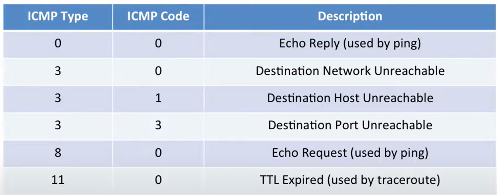

- 让网络层运行起来的三个模块
	- IP协议
		- 数据报递送
	- 路由表
		- 形成路由表的算法
	- ICMP协议
		- 在主机和路由器之间交流网络层信息
		- 汇报error condition
		- 用于诊断问题所在
- ICMP**运行在网络层之上**，因此属于一种**传输层协议**，主要用于错误报告
- **ICMP性质和行为**
	- **报告消息**(reporting message)
		- self-contained message, reporting error
	- **不可靠**
		- 简单的数据报服务，没有重传
- # 情景举例
	- 当一个ip报文被发送到某个路由器，而该路由器的转发表中没有对应目标IP地址的转发规则时：
		- 该路由器会向IP源地址发送一条ICMP消息，告知目的地不可达
	- 该ICMP消息将包含：
		- 该IP报文的IP头
		- 该IP报文数据部分的前8个字节内容
		- 消息类型
		- 代码(CODE)
	- 然后将这个ICMP消息封装进入一个IP报文，发送给源地址
- # ICMP的部分类型和代码
	- {:height 250, :width 614}
	- 具体可以参见RFC 792
- **ping指令**
	- 当A企图ping B时
		- A向B发送一条ICMP 的echo request消息(类型为8，code为0)
		- 将此ICMP消息封装进入IP数据报，递送给B
	- B受到A的ICMP echo request之后
		- 向A发回一条ICMP echo reply消息(类型为0，code为0)
- **traceroute指令**
	- A反复向B发送UDP数据报，但是每一次发送都会将其封装进入一个TTL从1开始递增的IP报文中
	- 若一个路由器收到一个TTL归零的IP数据报，其可能向源IP发送一个ICMP TTL expired消息(类型为11，code为0)
	- 收到ICMP TTL expired消息的A可以通过ICMP消息中带有的IP报文信息知道此ICMP消息是在回应之前发出的用于traceroute指令的报文，以此推断出路由路径