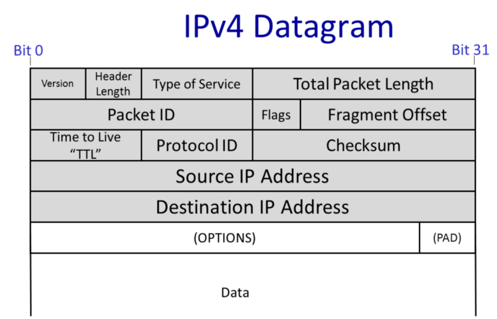

- 是英特网中最重要的一层，甚至有时就是互联网本身
- 每一层都向上一层提供服务，因此了解其所提供的服务对于了解协议本身**相当重要**
- # 传输过程简述
	- IP数据报包含IP头和IP数据
	- 当传输层有数据需要发送时，会将数据分段(segment)递交给IP进行传输
	- 网络层会新创建一个数据报，并将分段装入数据报的数据部分
	- 然后IP将数据报装入链路层的帧(frame)中，然后将其送达给第一个路由器
- # IP服务模型的基本性质
	- **数据报**
		- 一个数据报就是一个独立路由的包(packet)
		- Hop-by-Hop路由
		- 数据报头包含源地址(IP SA)和目的地址(IP DA)
		- 每一跳的路由都是基于IP DA做出的
			- 每一个路由器都包含一个转发表，记录了每一个数据报应该去哪里
		- 网络层中任何一个路由器并不知道数据报在网络中路由的全路径，只是简单地将目的地址和下一站做关联，一次来转发数据报
			- 因此IP数据报头仅需要包括目标地址就可以完成递送，而不需要指明完整地路径
	- **不可靠(unreliable)**
		- 包可能会被延迟送达，错位送达，一份被送达多次，甚至丢包
	- **尽最大努力(Best Effort)**
		- 仅仅在必要时才会丢弃一个包
			- 比如路由器的缓存已经满了，只能丢弃接下来一段时间收到的所有包
	- **无连接(Connectionless)**
		- 没有连接状态（状态机）
		- 包可能会被mis-sequenced
- # 为什么IP提供的服务如此简单
	- 简单意味着效率的提升，且相关设施的建设成本也更低
	- **端到端原则(end-to-end principle)**
		- 是一个在通讯系统中非常重要的原则
		- 只要可能，那么只在终端主机中实现相关特性
		- 在此处就指source 和 destination主机
		- 软件实现便于后续修改，如果直接在整个互联网中都是硬件实现的某个feature，那么后续很难更改
		- 一个例外是手机网络，其终端很简单，但是整个网络包含了提供相当多丰富特性的交换机
	- 允许在其上建立各种可靠(或不可靠)的服务
		- 如果IP已经是一个可靠的服务，那么其对于某些本就需要不可靠服务的应用将很不友好
			- 比如视频通话
		- 将需要可靠还是不可靠的选择权交给用户（应用层）
	- IP可以在任何链路层上工作
		- 因此IP基本不会对其之下的分层做出任何假设
		- 戏谑地说，正因为IP对于其下的层级基本不做任何假设，IP甚至可以在信鸽上工作
			- 甚至IETF还真的发布过恶搞的RFC协议IPoAC(IP over Avian Carriers)，[参看](https://en.wikipedia.org/wiki/IP_over_Avian_Carriers)
- # IP服务模型(细节)
	- 本小节提供五个关于IP的特性，并会在之后的课程中详细学习
	- **尽量避免包的死循环传递**(Tries to prevent packets looping forever)
		- 当转发表出错的时候，网络中可能出现环路
			- 当转发表在变化，全局一致性被破坏时可能发生
		- IP并不会阻止死循环的发生，而是采取很简单的手段删除掉那些可能处于死循环中的包来减轻损耗
			- IP会在每一个数据报头中加入一个跳数计数器(Time to Live(TTL))
			- TTL会有一个初始值，每经过一跳都会被路由器减1，当TTL归零时，IP就会判定这个包可能处于一个循环当中，丢弃该包
	- **在包过长时会将其分段**(Will fragment packets if they are too long)
		- 有的链路层协议对于包的大小有限制
		- 例如以太网只能传递不大于1500字节的包
		- 如果包的大小超过了链路层限制，则会将其打散
		- IP头中包含了辅助分段的信息，也包含了如何重新组装被分割数据段的信息
	- **使用header checksum降低错误递送数据报的概率**
		- IP数据包头有一个checksum域
	- **允许新版本的IP协议**
		- 现阶段使用的IPv4有32位地址
		- IPv6有128位地址
	- **允许将额外的域插入数据报头**
		- 在实际执行中，这些可选项很少被使用，应为需要额外的硬件支持
	- # IP数据报
		- {:height 375, :width 579}
		- 协议ID告知数据部分是什么协议的数据
		- 例如，如果协议ID为6，则说明数据部分储存的是TCP的数据，则数据被递送到之后会被转交给TCP处理
		- **版本域**告知使用的是哪个版本的IP协议，目前有效的值仅为IPv4或IPv6
		- **Packet ID， flags， Fragment Offset**用于帮助将超出限制的包分割为更小的包
		- **Type of Service**告知路由器当前包的重要性
		- **Header Length**告知头的大小，因为头有一些可选域(optional field)，使用了可选域会导致变长的头部
		-