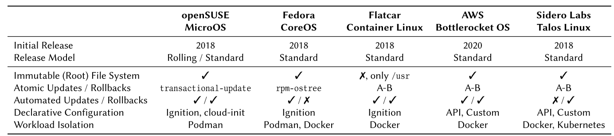

- 本文主要回答三个问题：
	- **RQ1**：IOS遵循怎样的[[$red]]==**概念**==？
	- **RQ2**：IOS有哪些典型的**[[$red]]==应用场景==**？
	- **RQ3**：一个IOS应该被怎样**[[$red]]==定义==**？
- # 不可变性(Immutability)
	- 在CS中，“不可变性”常常和面向对象编程(OOP)相关，OOP中的不可变性常指一个对象在创建之后不可被修改(modification)
	- 衍生到操作系统中，**不可变性**意味着操作系统的状态不能在运行时被改变，对操作系统的修改将导致摧毁或重新部署
- # 回顾：不可变Linux发行版
	- 不可变系统往往会具有一些共通的特性
	- 
	- ## 不可变(根)文件系统(Immutable Root File System)
		- 大多数IOS都提供一个完全不可变的根文件系统
		- 所有和系统有关的文件都映射到``/usr``**不可变**目录下
		- 大多数IOS会提供一些能够承载读写操作的目录，例如``/etc, /var, /home, /root``
			- 这些目录一般用于保存配置文件，log和用户数据
	- ## 原子升级和回滚(Atomic Updates and Rollbacks)
		- 由于根目录完全不可变，因此将需要使用的别的方式进行升级
		- 不同的发行版会使用不同的手段，例如某些发行版会将现有的系统镜像拷贝到可变目录下，一次性将所有的改写实施完毕之后，再重新启动，载入到升级后的系统镜像中
	- ## 自动升级/回滚(Automated Updated / Rollbacks)
	- ## 声明式配置(Declarative Configuration)
		- IOS往往需要在许多不同环境下运行，例如bare-metal，虚拟化，云原生等，因此能够通过声明式配置快速自定义实例行为相当重要
		- 一般都需要提供对于声明式配置的支持
		- 可以使用工具实现，例如**[Ignition](https://coreos.github.io/ignition/)**，**[cloud-init](https://cloudinit.readthedocs.io/en/latest/index.html)**
	- ## 负载隔离(Workload Isolation)
		- 使用**容器(container)**技术做到负载隔离可以大幅减轻安全问题
- # 不可变操作系统
	- ## 概念
		- ### 可靠性(Reliability)
			- 可靠性一般定义为，“在特定条件下软件不会导致failure的概率”
			- **不可变性**意味着所有**[[$red]]==和系统相关的文件都不能在运行时被修改==**，每次启动之后的系统的运行都是一致的
			- 不可变性解决了**配置漂移(Configuration Drifts)**的问题，增强了软件的可靠性
		- ### 伸缩性(Scalability)
			- 通俗来讲就是系统可以根据需求提供或多或少的服务，即**按需安装/实例化**
			- IOS一般都具有**最小性(Minimality)**，即提供针对裸机(bare-metal)，虚拟机或云环境的**最小安装镜像(minimal installation image)**，
			- IOS一般都具有**可配置性(Configurability)**，可以通过基于文件系统的配置方式，且有可以在运行时通知系统配置更改的API
		- ### 安全性
			- 所有的负载都通过**容器虚拟化**执行
			- 同时不可变的根文件系统也避免了**特权升级(Privilege Escalation)**后可能导致的安全问题
	- ## 使用场景和限制
		- IOS本质上是试图作为一个容器的host
		- 因此IOS能够作为一个单独的容器host或者组成集群
		- 但是相对的，IOS的不可变文件系统限制了包(package)的安装
	- ## 最终定义
		- 一个**不可变操作系统**是一种特殊的草走系统，一般是引入了**只读文件系统**，**自动原子更新，回滚**，声明性配置和负载隔离的最小**Linux发行版**，这些特性是为了获得更好的可靠性，伸缩性和安全性，且一般作为一个容器host