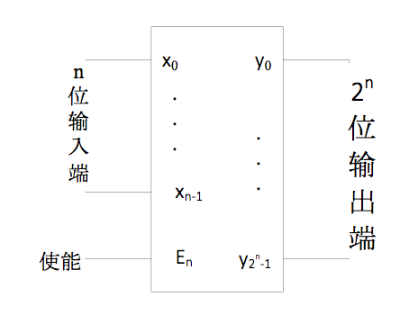
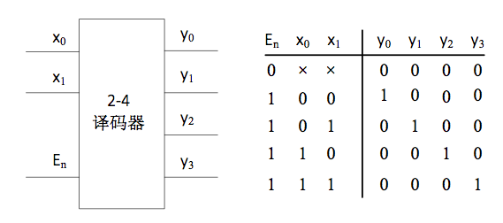
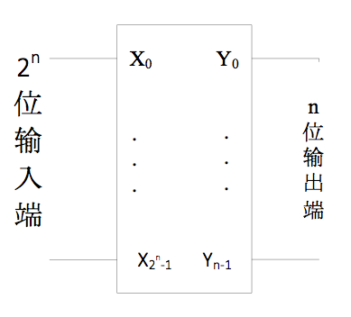
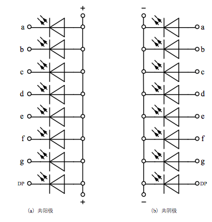
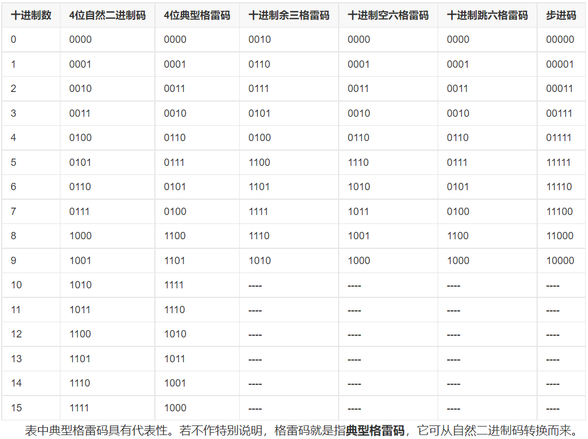

- # 译码器
	- 将某一输入信息转换为某一特定输出的逻辑电路
	- 将 n 位的输入编码转换为 m 位的编码输出，一般情况下，n<m
	- ## 常用的二进制译码器结构
		- 
		- 有$n$路输入和$m=2^n$位输出
		- 使能信号$E_n$为0时没有任何有效输出
	- ## 常用二进制码
		- **独热编码**，$2^n$位中只取一位编码，任何时刻，$m$位输出只有1位有效，其余各位都为0
	- ## 2-4译码器
		- 
		- 假定输出为高电平有效
		- **[[$red]]==补充==：**在Verilog HDL代码中，for循环的condition条件表达式必须为常数，不能是可改变的量。
- # 编码器
	- 与译码器功能相反的逻辑电路，输出少于输入编码的位数
	- ## 常用编码器结构
		- 
		- 输入为独热码
	- ## 优先编码器
		- 允许同时有若干个输入信号为1
		- 每位输入的权重不同，当高权重的输入为为1时，不管其他各位的输入为何，输出都是高权重位对应的输出
- # 七段数码管
	- 一种常用显示原件，分为共阴极和共阳极
	- 
	- 共阴极若某一管的输入为一则两起，共阳极相反
- # 补充
	- verilator 默认会在综合verilog文件时[[$red]]==**会在遇到warning时抛出error**==，使用``-Wno-lint``选项不再提示linter相关的warning，使用``-Wno-fatal``让其不在遇到warning时停止
	- nvboard中的七段管中的参数，A对应0，G对应7
	- ## BCD码
		- 用二进制来编码十进制数
		- 最简单的是8421码，2421码等定权码
		- ### 格雷码
			- 每一个状态之间只相差一个位
			- {:height 520, :width 684}
			- 优点在于状态转换时由于只有一位翻转，所以电路中产生的剑锋电流脉冲更小
			- 更可靠