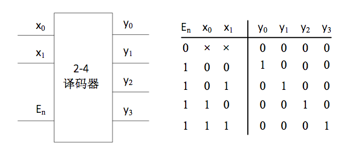

- # 译码器
	- 将某一输入信息转换为某一特定输出的逻辑电路
	- 将 n 位的输入编码转换为 m 位的编码输出，一般情况下，n<m
	- ## 常用的二进制译码器结构
		- 
		- 有$n$路输入和$m=2^n$位输出
		- 使能信号$E_n$为0时没有任何有效输出
	- ## 常用二进制码
		- **独热编码**，$2^n$位中只取一位编码，任何时刻，$m$位输出只有1位有效，其余各位都为0
	- ## 2-4译码器
		- 
		- 假定输出为高电平有效
		- **[[$red]]==补充==：**在Verilog HDL代码中，for循环的condition条件表达式必须为常数，不能是可改变的量。
- # 编码器
	- 与译码器功能相反的逻辑电路，输出少于输入编码的位数
	- ## 常用编码器结构
		- 
		- 输入为独热码
	- ## 优先编码器
		- 允许同时有若干个输入信号为1
			-
		-