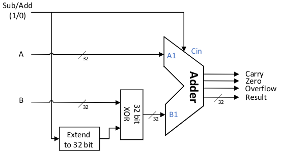

- # 加法器
	- 延伸阅读：超前进位加法器Carry-lookahead adder
	- ``{out_c,out_s} = in_x+in_y``
	- 溢出位的判断依据是，两个操作数的符号相同，但是结果和操作数的符号不相同
	- c为进位，s为结果输出
	- 在x86中，$CF=out_c\oplus cin$，减法时$cin=1$
		- $out_c$是就是上文中定义的out_c，cin是初始的进位位
		- 在有符号加减法中，溢出判断依据为溢出位
		- 无符号加减法中，溢出判断依据为进位位
			- 如果是加法，那么溢出时进位位肯定为1
			- 如果是减法，无符号减法是不会产生负数的，而减数的符号位一定是1，若没有进位说明符号位被保留下来，说明产生了溢出，而如果进位了，说明符号位被进位掉了，反而没有溢出
	- 
	- 做减法时，cin为1
	- 当被减数是最小负数时的情况需要特殊判断
		- ```
		  assign t_no_Cin = {n{ Cin }}^B;
		  assign {Carry,Result} = A + t_no_Cin + Cin;
		  assign Overflow = (A[n-1] == t_no_Cin[n-1]) && (Result [n-1] != A[n-1]);
		  ```
	- 判断是否为零的高效做法：
		- `assign zero = ~(| Result);`
		  id:: 63346569-67bd-4f35-bfa2-0ff619196bca
	- **比较运算的实现**
		- **全等**：用减法Zero输出判断。
		- **符号数大小比较**：减法判断，在不溢出时，结果的符号位为1则A小于B。如果减法溢出，则A和B原始符号一定不同。此时，如果结果符号位为0，说明A为负数，B为正数，B取反加一后为负，两者相加为正，所以A应小于B。在溢出时如果结果符号位为1，则B小于等于A。所以，可以用 Lesss=out_s[n−1]⊕Overflow 来进行判断。具体原因请自行分析。
		- **无符号数大小比较**：如果最高位进位，则A大于或等于B，否则A小于B。实际电路中常常用 Less_u=cin⊕Carry 来实现。具体原因请自行分析。