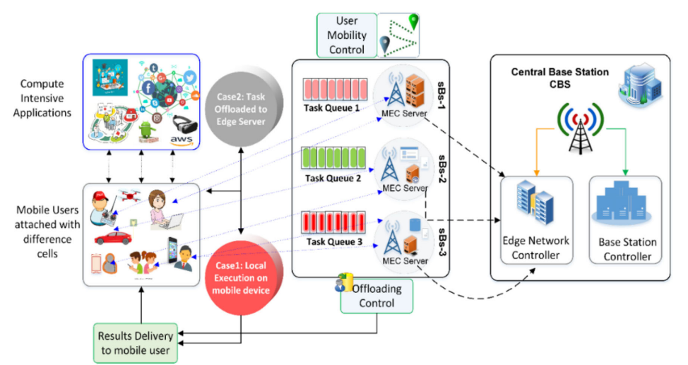

- 本文中点在于，在任务卸载(Task Offload)的服务器选择时，考虑用户的**移动性(mobility)**
- 对于移动性的考虑主要是引入了机器学习和多目标遗传算法来预测用户的移动性以便在选择服务器时能做到更低的延迟，跟高的资源利用效率
- # Introduction
	- 移动计算需求加剧，然而移动设备收到功耗和计算能力的限制，**移动云计算(Mobile Cloud Computing, MCC)**应运而生
	- MCC的延迟问题又使得**移动边缘计算(Mobile Edge Computing, MEC)**进入大众视线
	- MEC将计算和存储资源部署到蜂窝网络边缘，很多国外大厂已经跟进了MEC的部署
	- MEC的一大关键在于计算卸载的方式，良好的计算卸载方法可以有效降低延迟，反之则可能导致服务质量的大幅下降
		- 评价MEC计算卸载的关键参数包括**能耗**，**延迟**，**服务质量(QoS)**，**体验质量(QoE)**等
		- 而影响计算卸载好坏的一大关键因素就是用户的移动性，预测用户的下一个位置是分配合适边缘服务器的关键
	- 本文贡献如下：
		- 设计并开发了一个带有轻量化用户移动性预测的新颖的任务卸载框架，该框架的机器学习模型复杂度很低
		- 使用一种基于**多目标遗传算法(Multi-objective generic algorithm, MOGA)**的方法来选择服务器，此技术可降低延迟和工号
	- ## 
	  翻译
	- 我们设计并开发了一个新颖的任务卸载框架，该框架利用机器学习技术进行轻量级的用户移动性预测。自然地，由于用户随机移动，用户移动性数据是非线性的。输入特征有限，窗口大小小。因此，为了使网络架构轻量化，我们使用了一个单层的人工神经网络 (ANN)，该网络启用了具有 Sigmoid 激活函数的 NAREX 编码器，其在训练和测试期间具有非常低的复杂性。
	- 考虑到训练数据的性质，我们开发了一个神经网络，利用移动用户位置数据进行自我训练。最终，训练好的模型被用于边缘网络控制器 (ENC) 来预测用户的下一个位置。
	- 为了优化边缘服务器选择，我们使用了一种基于多目标遗传算法 (MOGA) 的服务器选择技术，该技术可以降低延迟和能耗，同时提高 MEC 系统的资源利用率。我们使用 MobFogSim 模拟器 [16] 对大量的实验进行了分析，将提出的框架与最先进的技术进行比较。我们将 LiMPO 与 DMPO 和 TAOM 进行了比较。LiMPO 在延迟、能耗和资源利用率方面都优于其他技术。
	- 扩展解释
		- **NAREX 编码器:** 这是一个神经网络结构，可以处理时间序列数据。它将当前输入和过去时间步的输出作为输入，从而捕获序列中的动态信息。
		- **Sigmoid 激活函数:** 这是一种常用的激活函数，其输出值在 0 和 1 之间。它有助于将网络的复杂性保持在较低的水平。
		- **多目标遗传算法 (MOGA):** 这是一种优化算法，可以同时考虑多个目标函数。它通过模拟自然选择的过程来找到满足所有目标的最佳解决方案。
		- **MobFogSim:** 这是一个用于模拟移动边缘计算环境的开源模拟器。它可以帮助研究人员评估不同的卸载框架的性能。
- # 系统模型和问题描述
	- ## 网络模型
		- 
		- 一个包含移动用户和若干移动性模式的异构移动边缘网络
		- 以5G蜂窝网络为例，网络模型包含一个**中心基站(Central Base Station)**和若干部署到更贴近用户地理位置的**小型基站(Small Base Station)**，每一个小型基站都包含一个部署到同一个位置的**边缘服务器(Edge Server)**
		- 所有的小型基站形成一个集合$sBS = \{sBS_1,\cdots, sBS_n\}$
		- 所有的边缘服务器形成一个集合$E=\{E_1,\cdots,E_n\}$
		- 所有的小型基站都要受重要基站控制
		- **移动位置预测的计算发生在[[$red]]==边缘网络控制器(ENC)==和[[$red]]==基站控制器==**，也由这两个结构负责将任务卸载到何处9
		- 移动设备会决定是将计算密集型的任务在本地计算还是**就近卸载到附近的边缘服务器**。而上文中的**任务卸载**问题实际发生在服务器将计算结果发回时，计算结果应该发到哪个位置(哪个基站，哪个边缘服务器)。由于用户很有可能已经在计算结果可用时不再处于之前的位置，直接将结果发送到之前位置附近的基站很有可能造成资源浪费和延迟上升，因此对于用户位置的预测显得十分重要。
	- ## 应用模型
		- 应用程序可以用一个有向无环图(DAG, Directed Acyclic Graph)$D = \{T,E\}$来表达，其中：
			- 一个节点表示一个任务，使用任务集合$T=\{T_1,T_2,\cdots, T_n\}$来表示，每一个$T_i$包含两个组件
				- 完成此任务所需的计算需求，单位：**百万指令每秒(MIPS)**，记为$C_i$
				- 完成此任务所需的内存需求，记为$M_i$
			- 边表示任务之间的依赖关系