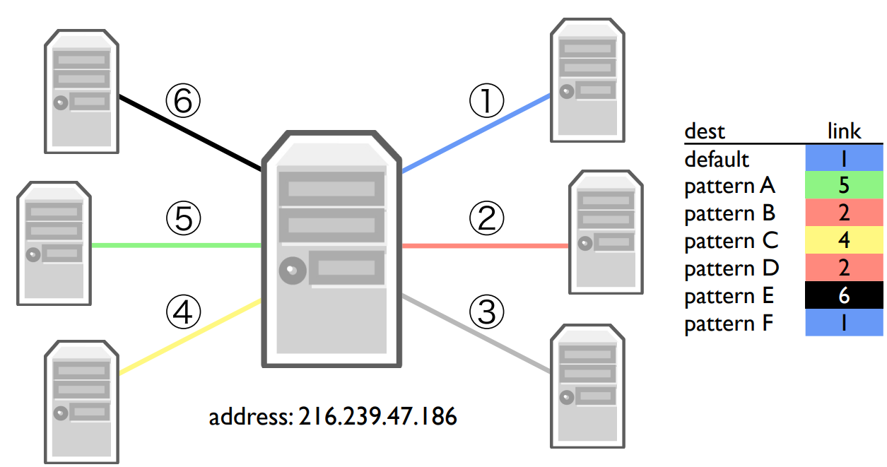

- 互联网的四层结构中：
	- 应用层开启数据流
	- 传输层将数据分段，并且负责将数据可靠地地送给另一台电脑
	- 网络层将传输层数据划分为更小的网络层包
- 传输层负责把数据递交给应用层，网络层负责把消息递交给电脑
- # TCP字节流
	- 服务器监听连接建立请求
	- 客户端通过向服务器发送请求建立连接
	- 连接建立需要经过**[[三次挥手(Three-way handshake)]]**
	  id:: 63bd79f8-1e6c-41e8-a20b-49d6dc0b6aa6
	- 建立一个能狗正确送达数据的TCP连接实际上需要两个地址
		- IP地址用于让网络层将数据地送到目的电脑
		- TCP端口(port)告知目的电脑的软件，数据应该地送给哪一个应用
			- web服务器一般使用80端口
- # 流的内部
	- 在抽象的TCP流的背后，是一张由若干路由器组成的网络
	- 路由器也有IP地址，因此路由器可能不会转发某个包，而是将包递交给自己的软件
		- 例如，当电脑和路由器直接链接时，TCP包(目标IP地址就是路由器的IP地址)会直接递交给路由器的软件
	- ## 每一跳的背后
		- 包是通过若干跳最终路由到目的地的
		- 每一个路由器都会维护一个转发表，记录了不同IP地址模式的包应该向哪一个链路转发
		- 
		- 默认路由是least specific的路由路线，任何IP地址都可以匹配该模式
		- 默认路由对于边缘网络(edge network)很有用，例如在局域网中，只要不是发送给内网的包，可以全部发送给默认路由地址，默认路由地址对应的链路就是更大的网关
		- **先建立TCP连接**，在开始发送HTTP请求
		- 使用**traceroute**(windows下是tracert)可以最终每一跳的具体信息(如果某一跳的路由器没有选择隐藏信息的话)
			- 原理是通过反复发送一个ttl逐渐递增的包，而超时的包则会被相应的路由器以一个ICM包回应，直到到达最大跳数或者到达目的地
			-
		-