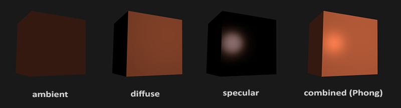
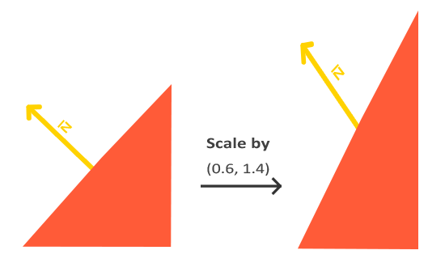
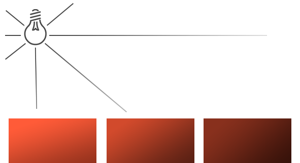
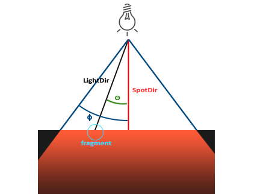

# Colors
collapsed:: true
	- 颜色可以用**一个三维向量**来表示，分别代表[[$red]]==R==[[$green]]==G==[[$blue]]==B==
	- ## 物体颜色与光源颜色
		- ### 定义光源颜色
			- 很简单，就是一个三维向量，表示光源的颜色
			- 例如，一盏白光灯的光源颜色即为：``glm::vec3 lightColor(1.0f,10f,10f)``
		- ### 物体颜色的形成
			- 现实生活中一个物体的颜色来源于其对于光源的反射。
			- 如果其吸收红光和绿光，那么它最终呈现出的颜色就为蓝色
		- ### 定义物体颜色吸收率
			- 同样使用一个三维向量，表示物体对于RGB每一个通量的吸收率
			- 例如：``glm::vec3 toyColor(1.0f,0.5f,0.31f)``
		- ### 计算最终颜色
			- 在glm中，只需要将光源颜色和物体颜色吸收率相乘即可：
			- ``glm::vec3 result = lightColor * toyColor; // = (1.0f, 0.5f, 0.31f);``
- # Basic Lighting
  collapsed:: true
	- 本节主要介绍最基本的光照模型：Blinn-Phong模型
		- 可以参见之前的笔记 [[第四课：着色(Shading)]]
	- ## 光照的组成
		- blinn-phong模型的光照分为三个部分：环境光，漫反射和高光
		- 
		- ### 环境光 (Ambient Lighting)
			- 环境中固定存在的光，由环境中所有的反射光一起贡献
			- 是此模型对于环境光的极简建模
		- ### 漫反射（Diffuse Lighting）
			- 光源直接照射到物体上之后的效果，越靠近光源的表面越亮
		- ### 高光（Specular Lighting）
			- 模拟类金属物体的高光反射，相较于物体本身的颜色，更依赖于光源的颜色
	- ## 环境光
		- 最基本的底色，实际实现即一个float值：环境光强度
		- 看起来的表现就像是永远会有分散的光照射到物体上
		- ```c++
		  void main()
		  {
		      float ambientStrength = 0.1;
		      vec3 ambient = ambientStrength * lightColor;
		  
		      vec3 result = ambient * objectColor;
		      FragColor = vec4(result, 1.0);
		  }  
		  ```
	- ## 漫反射
		- 此光照模型下，漫反射依赖于光源与物体表面所形成的夹角，光源越是垂直照射到表面，其反射强度也就最大
		- 因此从现在开始，需要在数据中包括**[[$red]]==法线向量==（Normal Vector）**来指示物体表面的朝向
		- ### 法向量的模型变换
			- 法向量如果直接应用mvp变换中的model变换矩阵，可能会出现**[[$red]]==不再和表面垂直的畸变==**
				- 
				- 出现在对模型进行non-uniform scaling的情况下
				- 具体的解决方式参见[这篇文章](http://www.lighthouse3d.com/tutorials/glsl-12-tutorial/the-normal-matrix/)
			- 因此需要为向量专门计算一个模型变换矩阵：
				-
		-
- # Materials
	- 材质就是描述表面如何与光互动的各种参数的集合
	- 对于blinn-phong模型来说，材质就是四个参数：
		- ambient：环境光照的反射颜色，一般来说和物体表面颜色保持一致
		- diffuse：漫反射颜色，一般来说就是物体表面有暗色
		- specular：高光颜色，
		- shininess：定义高光半径
- # Light Casters
	- 之前实现的光都是**点光源**
	- 基础的光源类型包含三类，分别是：**平行光(Directional Light)，点光源(Point Light)，聚光灯(Spot Light)**
	- ## 平行光(Directional Light)
		- 一般用来建模太阳光，或是其他类似的，距离非常远的光源
		- 与点光源不同，不再需要记录光源位置信息，**只需记录[[$red]]==光源方向==**
	- ## 点光源(Point Light)
		- ### 衰减(Attenuation)
			- 
			- 之前实现的点光源未考虑**衰减(Attenuation)**
			- 点光源的衰减与距离的平方成反比
				- $$F_{att} = \frac{1.0}{K_c + K_l * d + K_q * d^2} $$
				- $K_c$一般为1，避免比值大于等于1
	- ## 聚光灯
		- 
		- 相较于点光源，多了方向和cufoff angle的定义
		- ### 边缘平滑
			- 使用两个cutoff角度，一个inner cutoff $\phi$和一个outer cutoff $\gamma$
			- 对于一个fragment的角度$\theta$，其光照强$I$度为
				- $$I = \frac{\theta-\gamma}{\epsilon}$$
				- 其中$\epsilon = \phi-\gamma$
			- 注意所有的角度实际上都是其角度所代表的cosine值，而对于cosine值来说，角度越小，值越大
	-