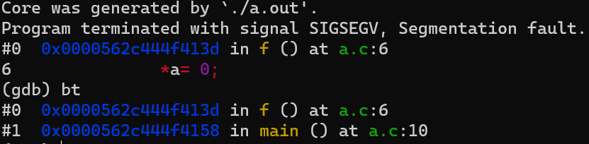

- Linux Core Dump是用于帮助dbug的
- core dump文件存储了出错时调用盾战的信息
- # 启用Core Dump
	- 默认是未开启的，如果要启用首先需要**增加core文件的大小限制**
		- 使用``ulimit -a``命令可以查看所有用户限制
		- `ulimit`是一个``bash``内置指令，修改的限制仅对当前shell和由其启动程序有效
		- 使用``ulimit -c unlimited``可接触对于core文件大小的限制
		- 还需要查看``/proc/sys/kernel/core_pattern``设置，如果是：
			- ``|/usr/share/apport/apport %p %s %c %P``
		- 那么需要将apport服务暂停掉：
			- ``sudo service apport stop``
		- 总之需要``/proc/sys/kernel/core_pattern``的值为``core``
	- 还需要在编译时增加``-g``选项开启debug模式
- # 使用Core Dump文件
	- 在开启Core Dump文件的生成之后，若运行的文件出错异常退出，会在**当前目录(pwd)**下生成一个`core`文件
	- 假设编译得到的二进制可执行文件的名称是``a.out``，那么使用``gdb a.out core``即可读取core中的信息并还原出错的地方
	- 使用``bt``命令打印出错时的调用栈
	- 
-