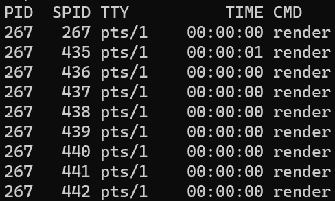

# Linux线程历史
	- 通过线程调度这是在核内还是核外可以将线程区分为内核线程和用户线程
		- 前者更利于并发使用多处理器资源
		- 后者更多考虑上下文切换开销
	- 如果在操作系统内核内实现了线程，那么就可以实现所谓的**多对多**模型，即一个进程的某个线程由核内调度，同时此内核线程也可以作为用户级线程的调度这，选择合适的用户级线程在其空间中运行
		- 这种**混合**模型既可满足多处理器系统的需要，又可以最大限度减少调度开销，绝大多数商业操作系统都采用这种线程模型
	- 核外实现的线程又可以分为**一对一**和**多对一**两种模型
		- 前者使用一个核心进程(可能是LWP)对应一个线程，线程调度等同于进程调度，意味着线程的调度由核心来完成
		- 后者完全在核外实现多线程，调度也在用户态完成，也即**纯用户态线程**
			- 在用户态切换线程栈即可完成上下文切换
			- 但是无法应用于多处理器系统，因为处理器的调度是由内核完成，而这种纯用户线程在内核处不可见，内核只能看到一个用户进程。因此无法做到一个进程中的若干个纯用户线程分配到若干个处理器核上。
	- ## Pthreads
		- Pthreads是IEEE委员会制定的一组线程API，P代表**POSIX**，Pthreads也可理解为POSIX线程库
		- 此接口用于统一不同(操作系统)厂商提供的线程接口，以方便移植
	- ## Linux下的线程发展历史
		- Linux内核一直以来并无线程概念，对于Linux内核来说，所有可被调度的任务实体都是一个``task_struct``结构，进程线程在这一层面上不做区分
		- 但是linux在**2.0**版本中就已经实现了**轻量级进程(LWP)**，可以看作是共享了很多资源(虚拟内存空间，信号处理器等)的进程
			- 相比于普通进程，轻量级进程**共享了**所有或大部分虚拟地址空间核系统资源(打开文件描述符，异常处理函数等)
			- 相比于普通线程，LWP有自己的**PID**，和其他进程有**父子关系**，且LWP自能由内核调度(用户级线程可由用户自己调度(例如自实现的线程池))
		- 使用``clone``系统调用接口时，可以根据指定参数的不同，决定是创建普通进程还是LWP(通过``clone``的FLAG参数，可指定flag``CLONE_VM``或``CLONE_THREAD``)
			- ``clone``最终会调用``do_fork``，这个函数也是``fork``，``vfork``最终会调用的函数
		- 在Linux**[[$red]]==2.6==**版本之后，**线程组**的概念被引入，至此Linux支持：内核线程，LWP，用户进程，线程组
			- **内核线程**：是内核创建的线程，用于处理内核事务，可看作内核的分身。典型的内核线程包括``kthreadd``(用于创建内核线程)，``ksoftirqd``(用于创建软中断)等。所有的内核线程**只运行在内核态[[$red]]==(没有用户地址空间和相关资源)==**。具体来说：
				- 这个内核线程和线程实现中所谓的**内核线程**并不是一回事，其主要用于并行处理内核事务
				- 从数据结构上看，其``task_struct``没有用户空间相关的描述
				- 其父进程是``kthreadd``(pid为2)而不向用户进程一样以``init``(pid为1)作为父进程
				- 只能由内核API创建，不能使用``fork``，``exec``等系统调用创建
				- 内核线程之间互不干扰，只不过都以``kthreadd``为父进程
				- 如果想创建内核线程，**必须在kernel module中**使用``kthread_run``或者类似API来创建
				- **[[$red]]==内核线程实际上就是只运行在内核空间的进程==，有自己的pid**
			- **用户进程**：用户通过``fork``创建的程序，被创建时分配到和父进程相同的CPU上，当进程被调度时会进行CPU选择
			- **LWP**：从Linux 2.0开始支持，和父进程共享地址空间，文件系统，打开文件描述符，信号处理函数等
			- **线程组**：从Linux 2.6开始支持，实际就是在``tast_struct``中增加了``tgid``(thread group id)字段。虽然只是很小的改动，但正式如此Linux才被认为**正式支持**了线程
				- 进程的tgid等于其pid
				- 线程的tgid等于其所在进程的pid
				- 使用``ps -T -p <pid>``可以查看一个进程中所有正在运行的线程
					- 
					- 可以看到所有线程的PID都是都是其所属进程的pid，``SPID``即为thread id
		- ### 早期实现线程的尝试
			- 在2.0-2.4时代，linux支持了LWP，可以用其模拟一些线程的行为
			- 但是由于使用LWP模拟的**线程**实际上还是和进程处于同一个调度层次，且共享进程标识空间，因此并不能在其上完全实现POSIX线程机制
			- 这段时间有很多Linux线程库都只能尝试尽可能实现POSIX的大部分语义，做到在功能上尽可能逼近
- # Linux线程库
	- 历史上一共出现过三个知名的Linux线程库，分别是：
		- **LinuxThreads**：最古老的线程库，在很多方面并不遵守POSIX标准
		- **NPTL(Native POSIX Thread Library)**：RedHat研发的线程库，其并不实际参与线程调度管理(交由内核管理)，更符合POSIX标准
			- 是目前绝对主流的Linux线程库，2.6版本之后的linux基本都是使用此线程库
		- **NGPT(Next Generation POSIX Threads)**：IBM开发的线程库，实现了多对多的线程模型
			- 其性能并不如NPTL，因此最终于2003年停止开发
	- ## LinuxThreads
		- 通过LWP实现的一对一线程模型
		- 调度由内核完成，其他线程操作包括同步等由核外线程库函数完成
		- 并不能完全满足POSIX对线程提出的行为要求
		- 某一个进程使用一个线程管理进程下的所有其他线程
	- ## NPTL
		- 本质上还是基于LWP实现的一对一线程模型，但是得力于2.6之后的linux实现了tgid，内核掌握了可以判断一个task_struct到底是属于一个进程还是现成的额外信息
		- 有了这些信息之后，内核可以在线程进程相关的操作上做出正确的管理，例如发送给进程的信号可以被正确地传递给所有线程，且性能开销并不大
	- ## NGPT
		- 实现了多对多模型，也即在LWP上还实现了**用户级的调度实体**
		- 用户级线程的调度通过切换线程栈完成，通过``setjmp``库函数保存当前上下文(当前函数栈帧，PC，CPU寄存器)，通过``longjmp``从已保存的栈帧中恢复。
			- 这两个函数还可以在C中模拟异常处理，具体情况查阅这两个函数的manual page即可
		- 由于性能并不及预期且实现复杂，已经放弃开发