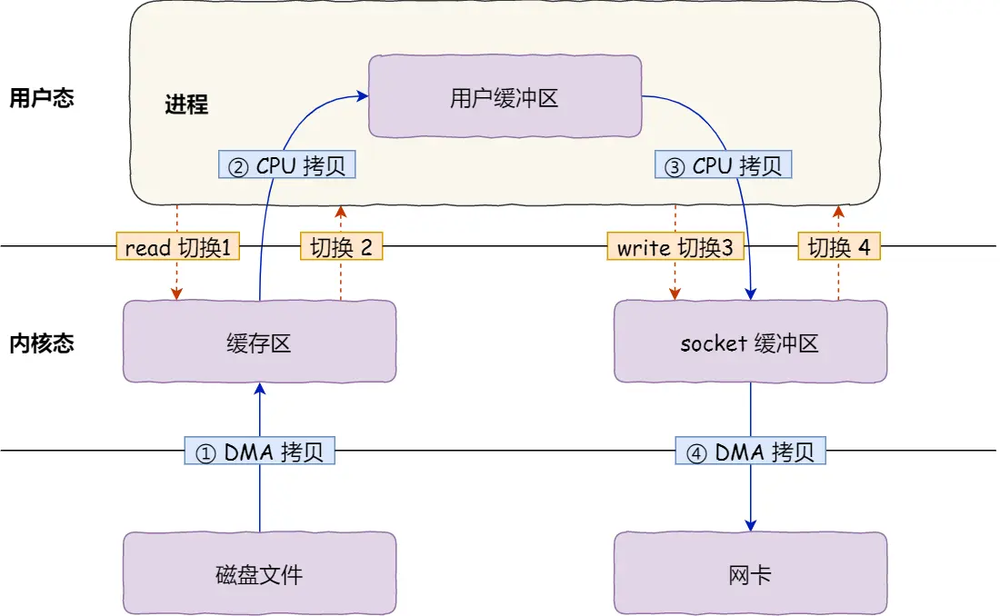
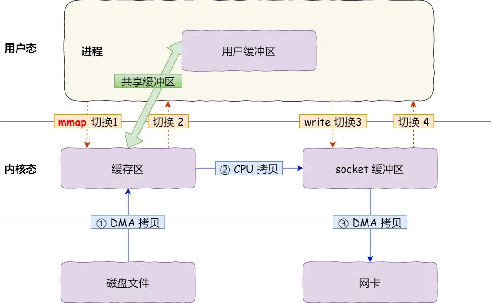
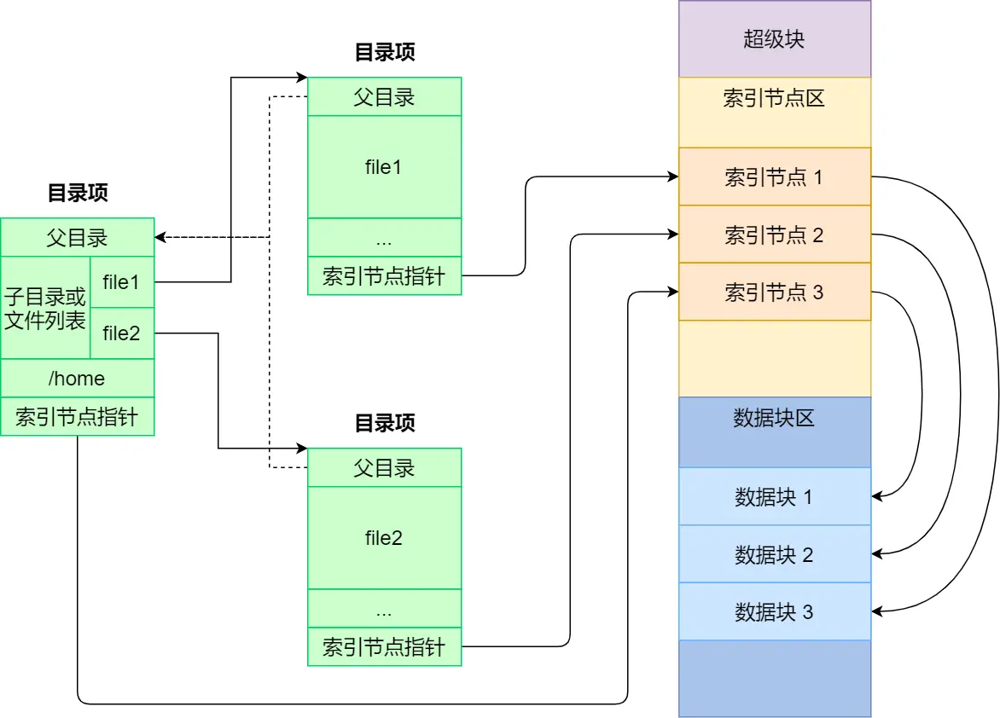
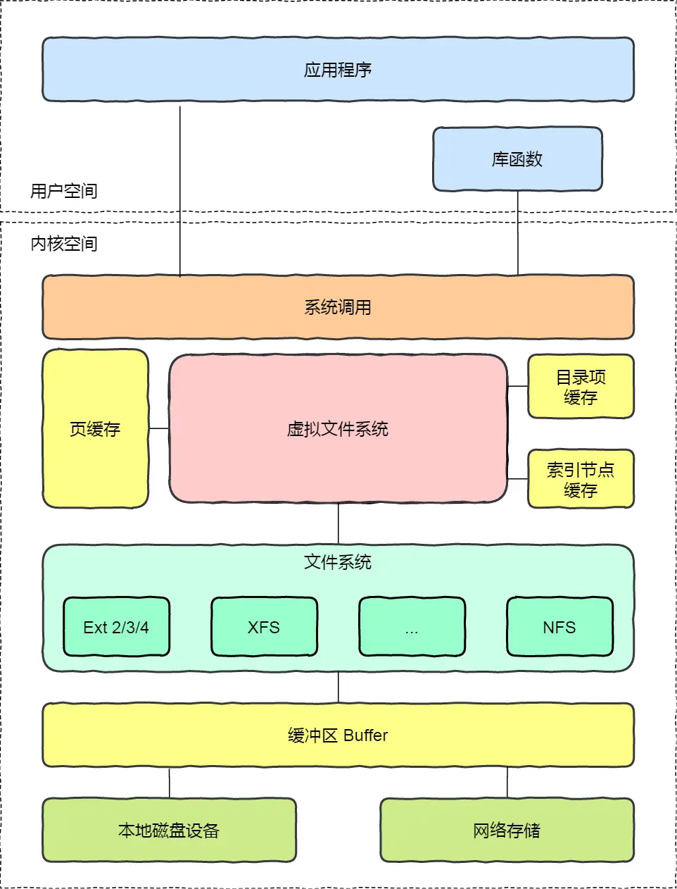
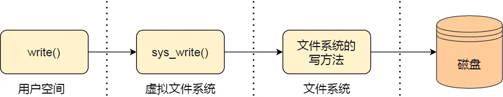

# 问题
	- **将一个文件从磁盘读到内存，需要几次拷贝？**
		- **[[$red]]==答案==**：传统的IO模式下，**两次**
		- 
		- 如果涉及到再通过网络发送出去，那么还需要两次拷贝
		- 通过``mmap``可以实现0拷贝
		- ```c++
		  buf = mmap(file, len);
		  write(sockfd, buf, len);
		  ```
		- 
		- 通过``mmap``申请的内存空间，内核态和用户态是共享的，因此可以减少一次拷贝
- # 文件系统基础
	- Linux文件系统为每个文件分配两个数据结构：**索引节点(Index Node)**和**目录项(Directory Entry)**
	- **[[$red]]==索引节点==**，即`inode`，用于记录文件的辕信息，例如inode编号，文件大小，访问权限，创建时间，修改时间，数据在磁盘的位置等信息
		- inode是某个文件的**唯一**标识，一一对应
		- inode也是存储在硬盘中，也会占用硬盘空间
	- **[[$red]]==目录项==**，即`dentry`，用于记录仪文件的名字，**索引节点指针**和其与其他目录项之间的层级联系。
		- 多个目录项关联起来即成为目录结构
		- 目录项由内核维护，**存放于内存中，不占用磁盘空间**
	- 由于索引节点是一个文件的唯一标识，而目录项记录某个文件的名字，因此**一个索引节点可以对应[[$red]]==多个==目录项**，即一个文件可以有**多个别名**，硬链接的实现就是多个目录项中的索引节点指针指向同一个文件
	- 目录也是文件，目录也是存储在磁盘里的注意区分目录项和目录，**这两个概念并不相同**
	- 文件在硬盘上实际是通过一个个**扇区**存储的，一个扇区只有512B大小，linux中将8个扇区组合起来形成一个4KB大小的**逻辑块**(和页的大小保持一致)，每次读取的最小单位就是一个逻辑块。
- # 虚拟文件系统
	- **Virtual File System (VFS)**
	- 为了屏蔽掉不同文件系统之间的差异，使用户在使用文件时有更加统一便捷的体验，linux在文件系统上做了一层额外的抽象，即虚拟文件系统
	- ## 对于具体的文件系统来说
		- 一个典型的文件系统在磁盘上的布局一般为
		- 
		- **引导块**主要目的是用于对操作系统的引导，只有在启动操作系统时使用
		- **超级块**主要存放了物理磁盘中文件系统结构的相关信息，不同的文件系统会有不同的超级块结构和操作
		- 
	- ## 对于虚拟文件系统来说
		- 
		- VFS支持很多文件系统，大致分为三类
			- **磁盘文件系统**，数据直接存储在磁盘中的文件系统，例如Ext 2/3/4, NTFS等
			- **内存文件系统**，实际数据并不在磁盘中，只是挂在到了文件系统中，其所有实际数据都在内存中，主要是用作控制用途，例如``/proc``，`/sys`下的文件。读写这些文件实际是在读写内核数据
			- **网络文件系统**，访问其他计算机数据的文件系统
		- Linux会创建一个**公共根目录**和**全局文件系统树**，访问一个文件的前提是此文件所在的文件系统必须已经被挂载到全局文件系统树的某个根目录下。所挂载到的目录称为挂载点
- # 读写文件
	- 每一个进程的``task_struct``中都有一个打开文件表，使用系统调用``open``打开一个文件时，返回的文件描述符实际就是打开文件表的索引
	- 
	- 文件的基本操作单位是**数据块**，而不是字节，因此在操作文件时切记局部性原理以提升性能
	-