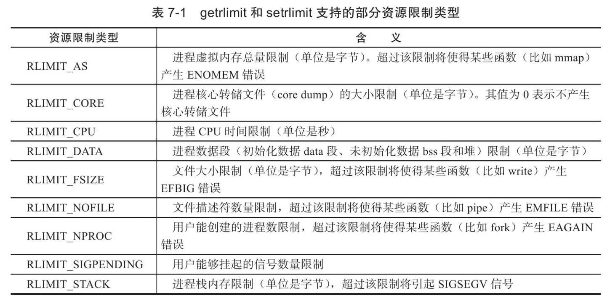

- 一般来说，一个服务器程序通常需要考虑一些细碎但是基本上都有模板可循的规范，例如：
	- Linux服务器程序一般**以后台进程形式运行**
		- 没有控制终端，以守护进程(daemon)方式运行
		- 守护进程的父进程一般是init进程（PID位1）
	- Linux服务器程序通常**有一套日志系统**，能输出日志到文件
		- 某些高级服务器还能将日志输出到专门的UDP服务器
		- 大部分后台进程都在``/var/log``目录下拥有自己的日志目录
	- Linux服务器程序一般以某个专门的**非root身份**运行
		- 例如，mysqld，httpd，sysloged等后台进程，都各自运行在自己创建的账户mysql，apache，syslog下
	- Linux服务器程序通常是**可配置的**
		- 服务器程序通常能处理很多命令行选项
		- 若配置比较复杂，还可以用配置文件来管理
		- 绝大多数服务器程序都有配置文件，并存放在``/etc``目录下
	- Linux服务器通常会在启动时**生成一个PID文件并存入``/var/run``**目录中，用以记录该后台进程的PID
	- Linux服务器通常需要考虑系统资源和限制，以**预测自身能承受的最大负荷**
- # Linux日志系统
	- 
	- Linux提供一个守护进程用于处理系统日志**syslogd**
		- 目前大多数使用其升级版**rsyslogd**
	- **rsyslogd守护进程**既能接收用户进程输出的日志，又能接收内核日志
	- **用户进程**通过调用**syslog**函数，将日志输出到一个UNIX本地域(IPC)socket类型(AF_UNIX)的文件/dev/log中
		- rsyslogd会监听此文件以获取用户进程输出
	- **内核日志**在老系统上通过守护进程rklogd来管理，但是rsyslogd已经利用额外的模块实现了相同的功能
		- 内核日志通过``printk``等函数打印到内核的**ring buffer**中(一个kfifo结构体，可能)
			- 此函数可以在**内核启动早期**调用
			- ring buffer中的内容直接映射到/proc/kmsg文件中，rsyslogd通过读取该文件获得内核日志
	- **rsyslogd保存(输出)目录**
		- **默认情况下**
			- 调试信息：``/var/log/debug``
			- 普通信息：``/var/message``
			- 内核消息：``/var/log/kern.log``
		- **自行配置**
			- rsyslogd主配置文件位于：``/etc/rsyslog.conf``
			- 可配置选项：
				- 内核日志输入路径
				- 是否接受UDP日志及其监听端口(默认514，见``/etc/services``)
				- 是否接收TCP日志及其监听端口
				- 日志文件权限
				- 包含的子配置文件(例如``/etc/rsyslog.d/*.conf``)
					- 子配置文件一般指定各类日志的输出目录
	- ## syslog函数
		- 用户进程通过**``syslogd``**函数与守护进程rsyslogd通信
			- **头文件**：``<syslog.h>``
			- **参数**：``int priority, const char* message, ...``
				- ``priority``，用于指定输出日志的***设施(faciclity)***值和***层级(level)***
					- facility值用于指定是什么样的程序在输出日志，传递时**直接or到某个level值中**有如下可能值：
					  collapsed:: true
						- LOG_AUTH       security/authorization messages
						- LOG_AUTHPRIV   security/authorization messages (private)
						- LOG_CRON       clock daemon (cron and at)
						- LOG_DAEMON     system daemons without separate facility value
						- LOG_FTP        ftp daemon
						- LOG_KERN       kernel messages (these can't be generated from user processes)
						- LOG_LOCAL0 through LOG_LOCAL7
						               reserved for local use
						- LOG_LPR        line printer subsystem
						- LOG_MAIL       mail subsystem
						- LOG_NEWS       USENET news subsystem
						- LOG_SYSLOG     messages generated internally by syslogd(8)
						- LOG_USER (default)
						               generic user-level messages
						- LOG_UUCP       UUCP subsystem
					- level值用于标识信息的重要性，由高到低分别为：
					  collapsed:: true
						- LOG_EMERG      system is unusable
						- LOG_ALERT      action must be taken immediately
						- LOG_CRIT       critical conditions
						- LOG_ERR        error conditions
						- LOG_WARNING    warning conditions
						- LOG_NOTICE     normal, but significant, condition
						- LOG_INFO       informational message
						- LOG_DEBUG      debug-level message
					- **如果没有设施值or到priority此参数中**，则使用上一次调用的openlog函数设置的默认值
						- 如果调用此函数之前没有调用openlog函数，则使用默认的``LOG_USER``
			- **返回值**：无(void)
			- 使用可变参数来进行结构化输出
		- **``openlog``**函数可以改变syslog的默认输入输出行为，进一步结构化日志内容
			- **参数**：``const char* ident, int option, int facility``
				- ``ident`` 所指向的字符串会被附加到每一条信息之前，如果设置为NULL，则会使用程序名
					- **[[$red]]==注意==**：POSIX.1-2008并没有规定当indet为0时的行为
				- ``option``用于对后续调用的syslog函数的行为做出规定，可or上多个可选项
				  collapsed:: true
					- LOG_CONS       Write directly to the system console if there is an error while sending to the system logger.
					- LOG_NDELAY     Open the connection immediately (normally, the connection is opened when the first message is logged).  This may be useful, for example, if a  sub‐
					                      sequent chroot(2) would make the pathname used internally by the logging facility unreachable.
					- LOG_NOWAIT     Don't  wait  for child processes that may have been created while logging the message.  (The GNU C library does not create a child process, so this
					                      option has no effect on Linux.)
					- LOG_ODELAY     The converse of LOG_NDELAY; opening of the connection is delayed until syslog() is called.  (This is the default, and need not be specified.)
					- LOG_PERROR     (Not in POSIX.1-2001 or POSIX.1-2008.)  Also log the message to stderr.
					- LOG_PID        Include the caller's PID with each message.
				- ``facility``即后续调用syslog时的默认facility值
			- **返回值**：无(void)
			- 此函数用于**打开与一个系统logger的连接**
		- ``setlogmask``函数用于通过优先级过滤输出信息
			- **参数**：``int mask``
				- 在使用时，通过将不同的优先级对应的掩码or起来传入，一般需配合宏``LOG_MASK``使用 ，如：
					- ``LOG_MASK(LOG_ERR) | LOG_MASK(LOG_DEBUG)``
				- 某些实现可能还会提供``LOG_UPTO``宏，一次性得到所有优先级高于且包括p的所有优先级掩码
			- **返回值**：返回之前的掩码，不会失败
		- 程序结束时使用``closelog``函数关闭日志功能
			- **参数**：无
			- **返回值**：无
- # 用户信息
	- 大部分服务器必须**以root身份启动，但不能以root身份运行**
	- 以下函数可以获取当前进程的**真实用户ID(read user id, UID)**，**有效用户ID(effective user id, EUID)**，**真实组ID(real group ID, GID)**和**有效组ID(effective group id, EGID)**
		- ```
		  #include＜sys/types.h＞
		  #include＜unistd.h＞
		  uid_t getuid();/*获取真实用户ID*/
		  uid_t geteuid();/*获取有效用户ID*/
		  gid_t getgid();/*获取真实组ID*/
		  gid_t getegid();/*获取有效组ID*/
		  ```
		- 以上函数不会失败
	- 以下函数可以设置UID，EUID，GID，EGID，即**[[$red]]==切换用户==**
		- ```
		  int setuid(uid_t uid);/*设置真实用户ID*/
		  int seteuid(uid_t uid);/*设置有效用户ID*/
		  int setgid(gid_t gid);/*设置真实组ID*/
		  int setegid(gid_t gid);/*设置有效组ID*/
		  ```
		- 以上函数失败时返回-1，成功返回0
	- 一个进程除了**真实用户ID**之外，还拥有一个**[[$red]]==有效用户ID==**
		- 有效用户ID代表着此进程的实际可用权限，例如使用sudo执行的程序实际上的EUID便是root
		- EUID为root的进程也称**特权进程**
	- **设置一个文件的EUID随着其所有用户变化而变化**
		- 默认情况下，一个进程的UID和EUID是相同的，其UID和EUID就是执行了其可执行文件的用户的ID
		- 如果希望一个可执行文件的UID和EUID随着其所用用户改变而改变，首先需要设置其``setuid``位
			- ``chmod +s``
		- 设置``setuid``位之后，通过``ls -l``查看可以看到原本的代表可执行位的``x``变成了``s``
			- 
		- 此时再用``chown``改变此文件的所有者，并执行，UID将会是执行此文件的用户，EUID是文件所有用户
		- [[$red]]==**实际上**==，**sudo就是一个设置了``setuid``位，所有用户为root**的可执行文件
			- 因此用户才可以使用在普通用户下执行sudo并获取root权限
				- 但是这是sudo本身，通过sudo执行的进程，UID和EUID都是root
- # 进程间关系
	- ## 进程组
		- Linux下每个进程都隶属于一个进程组，因此它们除了PID信息外，还有**进程组ID(PGID)**
		- 通过函数``getpgid``来获取进程组id
			- **头文件**：``<unistd.h>``
			- **参数**：``pid_t pid``
			- **返回值**：成功返回pid所属的PGID(pid_t)，失败-1
		- 一个进程组都有一个**首领进程**，其[[$red]]==PGID和PID相同==
		- 进程组一直存在，直到其中所有进程都结束或加入到其他进程组
		- 函数``setpgid``可用于设置pgid
			- **参数**：``pid_t pid, pid_t pgid``
			- **返回值**：成功返回0，否则-1
			- 此函数将PID为pid的进程的PGID设置为pgid
				- 若pgid和pid**相同**，则相当于指定pid进程担任进程组首领
				- 若**pid为0**，则标识设置**当前进程**的PGID为pgid
				- 若**pgid为0**，则使用pid作为目标PGID
			- **[[$red]]==一个进程只能设置自己或者其子进程的PGID==**
				- 若子进程**调用了``exec``**系列函数，则父进程也无法再设置此子进程的PGID
	- ## 会话
		- 一些有关联的进程组会形成一个**会话(Session)**，调用函数``setsid``函数创建会话
			- **参数**：无(void)
			- **返回值**：成功时返回新的进程组PGID(pid_t)，失败返回-1
			- 此函数[[$red]]==**不能由进程组的首领进程调用**==，否则将产生错误
			- 如果是**非组首领进程**调用，则会产生如下效果
				- 调用进程成为会话首领，此时该进程是新会话的唯一成员
				- 新建一个进程组，其PGID就是调用进程的PID，调用进程称为此组首领
				- 调用进程将断开和终端的连接(如果有)
		- Linuix进程并未提供**会话ID(SID)**的概念，认为其等同于会话首领所在的进程组的PGID
		- 调用函数``getsid``获取某个进程所处的会话ID
			- **参数**：``<pid_t pid>``
			- **返回值**：成功返回所在的会话ID(pid_t)，失败返回-1
	- ## 使用ps命令查看进程关系
		- `ps`指令使用``-o``选项可以指定输出格式，例如
			- ``ps-o pid,ppid,pgid,sid,comm``
			- 配合管道输出到``less``实现滚动式阅读和搜索
- # 系统资源限制
	- Linux上运行的程序可能会受到如下资源限制
		- 物理设备限制(CPU数量，内存大小等)
		- 系统策略限制(CPU时间等)
		- 具体实现限制(文件名最大长度等)
	- 可使用如下**函数读取和设置系统设置**
		- ```
		  #include＜sys/resource.h＞
		  int getrlimit(int resource,struct rlimit*rlim);
		  int setrlimit(int resource,const struct rlimit*rlim);
		  ```
		- resource可选的资源和编号如下：
			- 
		- 以上两个函数**成功时返回0，失败返回-1**
	- rlimit结构体的结构如下：
		- ```
		  struct rlimit{
		  rlim_t rlim_cur;
		  rlim_t rlim_max;
		  };
		  ```
		- ``rlim_t``是一个整数类型的typedef别名，描述资源级别。
		- `rlim_cur`成员指定资源的**软限制**
			- 软限制一般是建议性的，最好不要超越。
			- 如果超越软限制，**系统可能向进程发送信号以终止其运行**
			- 例如：
				- 若进程CPU时间超过 软限制，系统将向进程发送``SIGXCPU``信号
				- 若文件大小超过软限制，系统将发送``SIGXFSZ``信号
		- ``rlim_max``成员指定资源的**硬限制**，如字面意思，一般是**软限制的上限**
			- 普通程序可以减小硬限制，但**只有root身份运行的程序才能增加硬限制**
	- 使用``ulimit``命令可以修改当前shell环境下的资源限制(软硬限制均可)
		- 这种修改对后续通过此shell启动的所有程序都有效
	- 也可以通过修改系统配置文件永久改变系统软硬限制
- # 改变工作目录和根目录
	- 服务器程序可能需要 区分工作目录和根目录
		- 一般来说，Web服务器的**逻辑根目录**并非文件系统的根目录``/``，而是站点的根目录
			- 对于linux Web服务器来说，该目录一般是``/var/www/``
	- 获取和改变当前工作目录的函数分别是
		- ```
		  #include＜unistd.h＞
		  char*getcwd(char*buf,size_t size);
		  int chdir(const char*path);
		  ```
		- 对于``gwrcwd``函数来说，如果当前工作目录的长度(加上结尾的`\0`)超过``size``，则会返回``NULL``
			- 如果``buf``为NULL而``size``不为0，函数可能会在内部使用`malloc`动态分配内存，并将当前路径存入其中，这种情况下，程序员需要手动free
			- 此函数成功时返回字符串指针，失败返回``NULL``并设置``errno``
		- ``chdir``函数成功返回0，失败返回-1
	- 使用函数``chroot``改变进程根目录
		- 一般来说，**一个进程的根目录就是系统根目录**
		- ``int chroot(const char* path)``
		- 成功返回0，失败返回-1
		- **并不改变当前工作路径**
		- 切换进程根目录之后，程序可能将无法类似``/dev``之类系统目录的文件和目录，因为这些目录可能并非出于新的根目录之下
			- 但是调用此函数之后，之前打开的文件描述符仍然有效，可以提前打开需要的文件，再改变根目录
		- **[[$red]]==只有特权进程才能改变根目录==**
- # 服务器程序后台化
	- 守护进程的编写遵循一定的步骤，如下：
		- ```
		  bool daemonize(){
		      pid_t pid = fork();
		  
		      if(pid<0) return false; //创建子进程失败，退出并返回false
		      else if(pid>0) exit(0);//创建成功，关闭父进程，使得子进程自然在后台运行
		      umask(0x777); //设置创建文件时的默认权限
		      pid_t sid = setsid(); //创建新的会话，本进程自动成为会话进程组的首领
		      if(sid<0) return false;
		      if(chdir("/")<0) return false;//切换工作目录到根目录
		      close(STDIN_FILENO);//关闭标准输入设备，标准输出设备，标准错误输出设备
		      //STDIN时stdio.h中定义的标准输出流，应该对应的是一个FILE结构体，而STDIN_FILENO时POSIX标准库定义的STDIN真正对应的文件描述符
		      close(STDOUT_FILENO);
		      close(STDERR_FILENO);
		      //还应当关闭其他已经打开的文件描述符，代码省略
		      //然后将标准输入，标准输出和标准错误输出都定向到/dev/null文件
		      open("/dev/null",O_RDONLY);
		      open("/dev/null",O_RDWR);
		      open("/dev/null",O_RDWR);
		      return true;
		  }
		  ```
	- 实际上，Linux提供了完成相同功能的库函数``daemon``
		- ```
		  #include＜unistd.h＞
		  int daemon(int nochdir,int noclose);
		  ```
		- ``nochdir``用于指定是否改变工作目录，如果为`NULL`则工作目录将被设置为``/``，否则继续使用当前工作目录
		- ``noclose``用于表示是否重定向标准输入，输出，错误输出到`/dev/null`，为0表示重定向，否则继续使用原来的设备
		- 成功时返回0，失败时返回-1