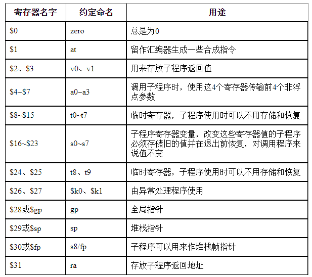
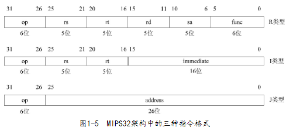
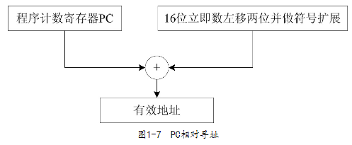

- **Microprocessor without interlocked pipelined stages**
- # 数据类型
	- 位（b）：长度是1bit。
	- 字节（Byte）：长度是8bit。
	- 半字（Half Word）：长度是16bit。
	- 字（Word）：长度是32bit。
	- 双字（Double Word）：长度是64bit。
- # 寄存器
	- 
	- 在使用汇编程序编写程序时不用在意这些约定俗成的用法
	- 若涉及高层语言如C的编译，则需要遵守相关约定
- # 字节顺序
	- 大端模式（Big-Endian）
- # 指令格式
	- MIPS32为定长指令
	- 
	- ## R类
		- 具体操作由op、func结合指定
		- rs和rt是源寄存器的编号，rd是目的寄存器的编号
	- ## I类
		- 具体操作由op指定
		- 低16位是立即数，运算时需要扩展至32位
	- ## J类
		- 具体操作由op指定
		- 一般是跳转指令
		- 低26位是字地址
- # 指令集
	- ## 逻辑操作指令
		- and
		- andi
		- or
		- ori
		- xor
		- xori
		- nor
		- lui
	- ## 移位操作指令
		- sll
		- sllv
		- sra
		- srav
		- srl
		- srlv
	- ## 移动操作指令
		- movn
		- movz
		- mfhi
		- mthi
		- mflo
		- mtlo
	- ## 算术操作指令
		- add
		- addi
		- addiu
		- addu
		- sub
		- subu
		- clo
		- clz
		- slt
		- slti
		- sltiu
		- sltu
		- mul
		- mult
		- multu
		- madd
		- maddu
		- msub
		- msubu
		- div
		- divu
	- ## 转移指令
		- jr、jalr、j、jal、b、bal、beq、bgez、bgezal、bgtz、blez、bltz、bltzal、bne
	- ## 加载存储指令
		- lb、lbu、lh、lhu、ll、lw、lwl、lwr、sb、sc、sh、sw、swl、swr
	- ## 协处理器访问指令
		- mtc0、mfc0
	- ## 异常相关指令
		- teq、tge、tgeu、tlt、tltu、tne、teqi、tgei、tgeiu、tlti、tltiu、tnei
	- ## 其他指令
		- nop、ssnop、sync、pref
- # 寻址方式
	- ## 寄存器相对寻址
		- 
		- 主要用于加载/存储指令
	- ## PC相对寻址
		- 
		- 主要用于转移指令
	- ## 寄存器寻址
		- 利用寄存器的值寻址
	- ## 立即数寻址
		- 立即数做地址
	-