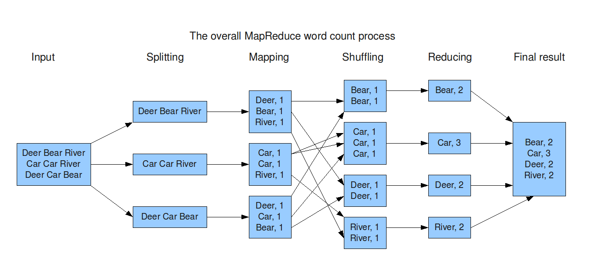

title:: MIT6.824第一讲：introduction

- # 讨论话题(Topics)
	- 在涉及到分布式系统时，有一些常见的讨论话题
	- ## 实现(Implementation)
		- 通过网络联系起来的分布式系统使用**RPC(Remote Process Call)**实现
		- 单机上的分布式往往通过**并行(Concurrency)**的方式实现，其实现会使用到**线程**和**并发控制(Concurrency Control)**，后者一半包括各种锁
	- ## 性能(Performance)
		- 分布式出现的意义就是提高性能，而其希望达到的则是**可扩展性(scalability)**
		- 所谓可扩展性指使用成倍的计算资源可获得成比例的性能提升，这是分布式系统的目标也是优点，只需投入更多的计算资源即可提升性能，而不需程序员进行手动优化
	- ## 容错性(Fault Tolerance)
		- 一台计算机往往是可靠的，但是分布式系统往往由多台计算机组成且还涉及到计算机之间的通信，这使得分布式系统的出错率往往远高于单机
		- 因此在分布式系统中，容错是一个相当重要的议题
		- 最理想的状态是所有的failure能直接对用户隐藏，即用户对于failure没有感知，系统内部能直接处理failure
		- ### 可用性(Availability)
			- 某些分布式系统会专门设计用于抵御某些failure，保证在这些failure发生时仍然能够提供完整的服务
			- **可用性**的定义就是，在**certain failure**发生的情况下，系统可以继续提供服务，但是若发生的failure超过一档限度，则无法做出承诺
		- ### 可恢复性(Recoverability)
			- 当一些错误发生时，系统会停止提供服务，但是经过一段时间或特定的修复流程之后，系统可以重新提供服务且不像发生过错误的样子(即重启的服务不丢失任何**正确性(Correctness)**)
			- 可以被看作弱化版的可用性
			- 一般来说，一个可用的系统也会是可恢复的，其一开始在少数failure发生的情况下可以继续提供服务，但随着failure的增多或严重性的提高，系统会停止服务，直到特定的维修流程完成之后，重新提供正确的服务
		- ### 实现容错性的工具
			- 有两种工具常用于实现容错性
			- **非易失性存储(Non-volatile Storage)**
				- 即硬盘，闪存等
				- 将检查点(Check-Point)，log等写入非易失性存储中，掉电之后重启读入这些数据即可恢复状态，重新提供正确的服务
				- 但是非易失性存储的写入成本往往较高，高性能的分布式系统会尽量避免频繁地更新非议实行存储
			- **复制(Replication)**
				- 多台服务器保存相同数据地复制拷贝
				- 关键问题在于如何保证数据拷贝的同步，因为随着运行时间的增加，两份拷贝之间总是有数据漂移(drift)的倾向。
				- 对于复制数据的管理是非常tricky和困难的
	- ## 一致性(Consistency)
		- 举例对于一个提供键值服务(可以视作一个提供`get`和`put`接口的map)的分布式系统来说，一致性有多种方式表达
		- **强一致性**：对于任何一次`get(key)`操作，其返回值必须是系统最近接收到的`put(key,val)`的值
		- 强一致性会导致很大的性能开销，因此某些分布式系统可能会提供性能更高的**弱一致性**服务，这些服务会降低对于`get`操作返回值的承诺
			- 强一致性导致大量性能开销的原因：处于容灾的考虑，每一份复制数据最好在物理上保持足够远的距离使得每一份复制数据都有一个**独立的出错概率**，因此多分复制数据甚至可能相隔一块大陆的距离。而强一致性本质上要求不同服务器之间**进行大量沟通以保持每一份复制数据同步**，而考虑到不同复制数据的物理距离，单次沟通就可能开销巨大，遑论多次沟通以保持强一致性的开销
- # MapReduce
	- 一个由google提出的**软件架构**，用于**大规模数据集的[[$red]]==并行计算 ==**
	- 一次MapReduce**计算(Computation)**可能包含多个**任务(Task)**，每一个任务针对原始数据集中的部分数据，而对于数据的处理分为**映射(Map)**和**规约(Reduce)**两种
		- **映射**操作将原有数据映射为一些新的数据
		- **规约**操作从多份数据得到一个简单的答案，次操作可以作用在整个数据集上，最终获得的一般是比较简单的数据答案
		- 两种操作都是高度并发的，在分布式系统下可以快速执行
	- 例如对于一个简单的单词技术功能，其流程如下
		- 
		-