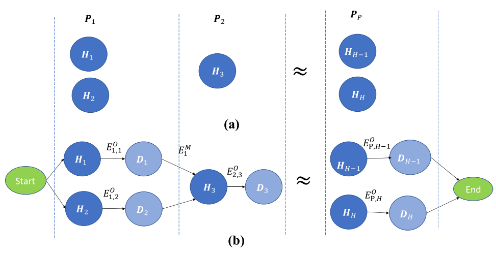

# 相关研究
	- ## 移动应用对于延迟的要求
		- 分为**硬期限(Hard Deadline)**和**软期限(Soft Deadline)**
		- ### 硬期限
			- 对于延迟非常敏感的应用程序，例如远程医疗手术，远程桌面应用程序等
			- 每个任务必须在Deadline前完成
		- ### 软期限
			- 可以适当容忍延迟的应用程序，例如视频分析应用程序，AR应用程序等
			- 可以被适当延迟执行
	- ## 预测用户移动性(Mobility)
		- 传动移动网络主要基于随机运动模型进行评估，但现实中用户的移动往往有一定目的性并受部分环境因素影响，移动并不完全随机
		- 近期研究表明，人类更倾向于执行**Lévy游走(walks)**，同时收到个人和社会特征，环境参数的强烈影响
- # 方法和步骤
	- ## 系统模型
		- ### 计算任务模型
			- 每一个计算任务$T$可以被三个项描述：$T = \{r^C,r^N,\tau^M\}$
				- $r^C$表示完成此任务所需的计算资源。单位为CPU周期(Cycles)
				- $r^N$表示此任务的计算输入，包括代码和文件等。单位为bit
				- $\tau^M$表示此任务能容忍的最大延迟。单位为纳秒(nano second)
			- 用户应用根据延迟需求和移动性模式(Mobility Pattern)的不同被分为三类(case)
				- Case 1：具有软期限且不具移动性或移动性被限制在单个MEC主机下的用户应用程序
					- 例如：博物馆导览程序
				- Case 2：具有严格硬期限但移动性被限制在单个MEC主机下的用户应用程序
					- 例如：远程医疗手术
				- Case 3：具有严格硬期限同时具有跨主机移动性的用户应用程序
					- 例如：通勤中的远程桌面
			- 考虑一组MEC主机的集合$\boldsymbol{H} = \{1,2,\ldots,h,\ldots H\}$
				- 每一台MEC主机都有一些指标，包括：
					- **最大计算能力**，单位为每秒时钟周期，即频率
					- **能效指标**，单位为每个CPU始终周期所需的焦耳
			- 所有的MEC主机被以层级关系部署，分为三层：
				- 第一层：无线节点(Radio Node)层
					- 此层使用$\boldsymbol{I}$标识$\boldsymbol{I}\in \boldsymbol{H}$
					- 此层中的某一个节点是移动应用卸载任务时的默认节点
						- 即，用户的移动设备总是会处于此层的某个节点的覆盖范围中
				- 第二层：网络汇聚点(Network Aggregation Points)层
				- 第三层：核心网络边缘(Edge of the core network)层
			- 使用集合$\boldsymbol{J}$标识所有有能力托管(host)用户应用的MEC主机集合
				- $\boldsymbol{J}\in \boldsymbol{H}$
				- $\boldsymbol{J} = \{1,2,\ldots,j,\ldots,J\}$
				- 这些节点满足了运行相关用户程序所需的需求包括，例如具有GPU等
		- ### 能量模型
			- 某个MEC主机的能量消耗由CPU，存储，内存和网络接口的使用量决定
				- 由于在其中，CPU的使用所消耗的能量中成决定性占比，主要关注CPU使用
			- 假设CPU的使用率(utilization ratio)会影响能量消耗的量
			- 建模**服务器的能量消耗**为：$E_s = \alpha E_{max} + (1-\alpha)E_{max}u$
				- $E_{max}$为服务器被完全占用时消耗的能量
				- $\alpha$是服务器闲置时能量消耗和完全占用时能量消耗的比值
					- 闲置能量消耗主要来自于电力运输的损耗和制冷设置的能量消耗
				- $u$是服务器被使用的比例
			- 一个被卸载的**计算任务的总体能量消耗**由两部分组成
				- 数据卸载消耗的能量
					- 有数据的上传和下载导致的能量消耗
					- 由于关注MEC的能量消耗，无线网络传输的能量消耗不考虑，因为对于所有MEC选择，这部分能耗都是相同的
					- 建模为$r^Ne^N_{i,j}$，其中
						- $e^N_{i,j}$是主机$i$和$j$之间及逆行数据卸载的能效，单位为焦耳每bit
				- 任务计算消耗的能量
					- 类似地，建模为$r^C,e^C_j$，其中
						- $e^C_j$是在主机$j$上计算任务的能效，单位是焦耳每CPU时钟周期
				- 因此，计算任务总的能量消耗为$r^Ne^N_{i,j}+r^Ce^C_j$
			- 一个设备应用更可能会卸载多个任务，若假设一共会卸载$n$个任务，那么**该应用所造成的总能量消耗为**：
				- $E_j = (\overline{r^N}*e^N{i,j}+\overline{r^C}*e^C_j)*n$
					- $\overline{r^N}$和$\overline{r^C}$分别表示在这些任务中的平均量
		- ### 延迟模型
			- 某次**计算卸载的总延迟**分为两部分
				- 数据卸载延迟
					- 由$\frac{r^N}{x^N_{i,j}}$决定，其中
						- $x^N_{i,j}$是被分配给用户的带宽。单位为bits per second
				- 任务计算延迟
					- 由$\frac{r^C}{x^C_j}$确定，其中
						- $x^C_j$是主机$j$分配给此次分配给用户的计算资源。单位为CPU时钟周期每秒
			- 但是由于用户应用不一定是一直托管在同一台主机中，因此延迟可能会出现波动
		- ### 用户移动性模型
			- 考虑用户在一段时间内位于MEC主机覆盖覆盖区域中的情况
			- 考虑的总时间段(period)为一个时间段集合$\bold{P}$，其中每一个时间段为$p\in \bold{P}$，$\bold{P}=\{1,2,\ldots,p，p+1,\ldots,P\}$
			- 时间段之间是连续的，即上一个时间段的结束就是下一个时间段的开始
			- 即便用户在某一个时间段内一直停留在某台主机的范围内，其所提交的任务也有可能被优化算法托管到其他主机上
				- 但是此论文中的模型认为任务的移交**不会在某个时间段内发生**
				- 即用户提交的任务在某个时间段内一定仅运行在某一台主机上
			- 因此某个时间段所消耗的能源可以建模为：
				- $E^O_{p,j} = (\overline{r^N_p}*e^N_{p,i,j}+\overline{r^C_p}*e^C_{p,j})*n_p\quad(2)$，其中
					- $p\in \bold{P}$
					- $j\in \bold{J}$
					- $n_p$是时间段$p$内卸载的所有任务总数
					- $\overline{r^N_p}$和$\overline{r^C_p}$分别是这段时间内卸载任务的所需计算资源和数据输入的平均
					- $e^N_{p,i,j}$是此时间段内从$i$到$j$卸载数据的能效，单位焦耳每bit
					- $e^C_{p,j}$是此时间段内主机$j$的计算能效，单位焦耳每CPU时钟周期
			- 任务从某台主机**迁移(Migration)**到另一台主机也会消耗能量，而迁移过程中主要的能量消耗来自于数据卸载，因此在某个时间段$p$末尾发生的任务迁移所需的能量建模为：
				- $E^M_{p,j} = r^M_{p,j}e^M_{p,j}$，其中
					- $r^M_{p,j}$是迁移所需的数据传输，单位是bit
					- $e^M{p,j}$是迁移过程中的能效，单位是焦耳每bit
						- 当$p=P$时，$E^M_{p,j}=0$
	- ## 优化目标
		- **[[$red]]==最小化早高峰时段(Morning Peak Hour)应用程序计算卸载的总能耗==**
		- $\text{min}\{\sum\limits_{p=1}^P\sum\limits_{j=1}^J y_j(E^O_{p,j}+E^M_{p,j})\}\quad (4)$，其中：
			- $y_j$是一个校准系数，当MEC主机$j$被选中时，$y_j=1$否则$y_j=0$
			- 这个公式的**解**是**在每个时间段中**选择的**MEC主机的集合**，这些主机被选择的顺序指示了用户应用程序的迁移路径
		- 定义某个时间段内的**计算强度(Computational Intensity)**：$CI_p=\frac{\overline{r^C_p}}{\overline{r^N_p}}$
			- 计算强度反映了此时间段内**平均计算资源需求**和**平均数据输入**的比率
			- 此参数可以用于描述一个任务的性质，高$CI$意味着此任务是**计算密集性(Computation-intensive)**，反之则代表此任务是**带宽密集型(Bandwidth-intensive)**
		- ### 可行(Feasible) MEC主机选择
			- **算法1：**计算可用于用户应用程序卸载的所有可行主机的算法
				- **[[$blue]]==输入==**：用户移动性(预测)，MEC网络信息
				- **[[$red]]==输出==**：所有可行的MEC主机
				- 根据用户移动性和MEC网络信息预测用户可能会在每一个主机下的时间段集合$\bold{P}$
				- 针对每一个时间段$p\in \bold{P}$
					- 获取默认连接的主机$i\in \bold{I}$
					- 获取所有可能的MEC主机集合$\bold{J}$
					- 对于每一个可能的MEC主机$j\in\bold{J}$
						- 针对不同的case，使用不同的等式或不等式检测，如果该主机符合MEC**主机选择标准**(Selection Criteria)，那么
							- 使用等式(2)计算能量消耗
							- 将$j$和能量消耗加入到输出集合中
			- 针对不同的Case，**主机选择标准**有所不同。
			- **Case 1**：**软期限**和**有限移动能力**的应用
				- 由于不会移动出某个MEC的覆盖范围，可以认为其时间段集合只包含一个元素，那就是整个早高峰
				- **迁移能耗**：0
				- 因此等式(4)可以简化为：
					- $\text{min}\{\sum\limits_{j=1}^J y_j E_j\}\quad(6)$
				- 在此背景下，需要从默认服务主机$i$开始，遍历层级结构上的所有MEC主机，找到能够使能量消耗最小化的MEC主机。
				- 如果将任务迁移到某一台非默认主机的MEC主机能够实现能量消耗最小化，那么说明在$i$上完成此任务的能量消耗一定高于在$j$上完成任务的能量消耗，基于此洞见，有：
					- $$\begin{align*} E_i&>E_j\\
					  \overline{r^C}*e_i^C&>\overline{r^N}*e^N_{i,j}+\overline{r^C}*e^C_j\\
					  \frac{\overline{r^C}}{r^N} &> \frac{e^N_{i,j}}{e^C_j-e^C_j} \\
					  CI&>\frac{e^N_{i,j}}{e^C_i-e^C_j} \qquad\qquad (7)
					  \end{align*}
					  $$
				- 不等式(7)就是case 1下的MEC主机选择标准
					- $CI$是某个任务自己的属性
					- 不等式的右边由MEC网络信息确定
				- 结合算法1使用此选择标准可获得所有可行的MEC主机集合，在其中选择使能量消耗最小的主机即为问题的解
			- **Case 2**：**硬期限**和**有限移动能力**的应用
				- 由于对延迟有了强制要求，因此需要考虑延迟的情况
				- 总延迟为数据卸载延迟和任务计算延迟之和，因此有：
					- $\frac{\overline{r^N}}{x^N_{i,j}}+\frac{\overline{r^C}}{x^C_j}\le \tau^M\quad (8)$
				- 结合(7)和(8)，可以获得此case下的**选择标准**
					- $\frac{\tau^M}{\overline{r^N}} \ge \frac{x^N{i,j}}{x^C_j(e^C_i-e^C_j)}+\frac{1}{x^N{i,j}}\quad(9)$
				- 结合算法1使用此选择标准可以获得所有可行的MEC主机集合，在其中选取能量消耗最小的主机即为问题的解
			- **Case 3**：**硬期限**和**跨主机移动能力**的应用
				- {:height 258, :width 484}
				- 类似于case 2，不过每个时间段中都要使用(9)选择一次
					- 不过本地最有并不意味着全局最优，因此不能简单地使用贪心算法去求解，这导致了需要考虑的情况变多，复杂度变高
					- 例如在上图中，使用(9)作为选择标准和算法1可以得到每个时间段的可行主机，然后每个阶段都需要考虑所有的迁移组合
				- 最终得到一个**有向无环图**结构，其中每个节点都是一个MEC主机，每条边代表的是迁移或计算能耗，在这个有向无环图上**做一次Dijkstra算法即可得到问题的解**