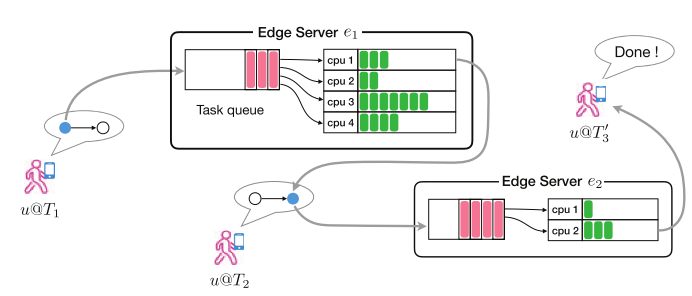
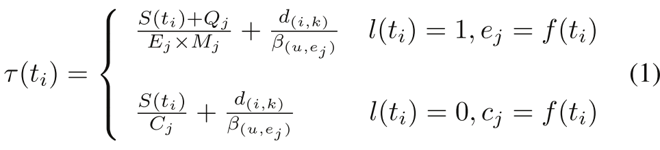
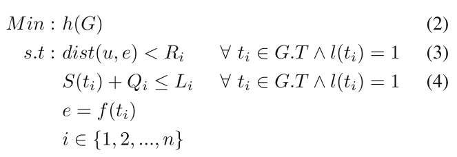

# 系统模型和问题阐述
	- ## 系统模型
		- 一个一你敢用程序包含多个功能模组
		- 使用**应用程序图**(Application Graph)来描述移动应用程序，其位一个二元组$G=(T,D)$，其中：
			- $T = \{t_1,t_2,\ldots, t_n\}$，位任务(Task)集合，一个任务会在其所有**前置任务(Predecessor Task)**完成之后进入**就绪状态(ready)**
				- 使用函数$S(t_i)$来计算一个任务所需要的计算量，计算量的单位为指令数量，例如$S(t_i)=130m$表示任务$t_i$需要130 million条指令完成
			- $D=\{d(i,j)\ |\ i\ne j \wedge i, j\in [1,n]\}$，是数据依赖集合
				- $d(i,j)$表示任务$t_i$的输出是任务$t_j$的输入，其具体数值表示了数据大小
				- 两个任务之间的数据传输时间通过公式$d(i,j)/\beta(u,e)$确定，其中$\beta(u,e)$是用户$u$和边缘服务器$e$之间的带宽
		- 考虑一个包含若干边缘服务器(Edge)和云端服务器(Cloud)的**资源池**(Resource Pool)，$P=\{e_1,e_2,\ldots,e_m,c_1,c_2,\ldots,c_p\}$，其中：
			- {:height 225, :width 519}
			- $e_i$表示可用的边缘服务器，边缘服务器**异性的(heterogeneous)**，即在核数，内存等参数上都可能各不相同，但是建设边缘服务器的处理器都是多核的，可以同时处理多个任务
				- $R_i$表示边缘服务器$e_i$的传输范围
				- $M_i$表示边缘服务器$e_i$的内核数量
				- $E_i$表示边缘服务器$e_i$的计算能力
				- $Q_i$表示边缘服务器$e_i$**当前**的任务队列长度(从下文来看**单位应该是**队列中所有任务所需**指令数**的和)，$L_i$表示该边缘服务器任务队列的**最大**长度
					- 边缘服务器会把无法立即处理的任务暂存在任务队列中
					- 任务队列通过**FCFS(先来先服务)**的方式管理
			- $c_i$表示云端服务器，对所有用户可用，但是可能会导致较高的延迟
				- $C_i$表示云端服务器$c_i$的计算能力
		- 某个任务$t_i$被卸载到某个边缘-云混合资源池的预期响应时间为：
			- {:height 108, :width 451}
			- $l(t_i)$的取值为$\{0,1\}$，为1表示该任务经过判断会被卸载到边缘服务器
			- $f(t_i)$函数表示预测任务$t_i$应该被卸载到的服务器
			- 卸载到云端的情况中的$\beta(u,e_j)$感觉是[[$red]]==笔误==，应该是$c_j$?
	- ## 问题描述
		- 假设有一个用户$u$希望将自己的某个位于应用图$G$中的任务卸载到一个资源池$P$中，我们希望知道随着用户的移动，哪个任务适合被卸载到哪个边缘或云节点中。问题用公式描述为：
			- {:height 185, :width 523}
		- 其中：
			- $h(G)$是整个图$G$的实际响应时间
			- $dist(u,e)$函数返回值为用户$u$和边缘服务器$e$的距离
		- 问题的关键在于最小化整幅图的响应时间，即表达式$(2)$
		- 等式(3)，(4)是约束条件
			- 等式(3)要求所有任务都只能卸载到在其范围内的服务器中
			- 等式(4)要求所有任务在卸载时不能卸载到任务队列已满的服务器中
	- ## mobility-aware offloading method
		- ### 算法1：在线任务卸载过程
			- **输入**：
				- 用户$u$
				- 移动应用图$G = (T,D)$
			- 定义集合$R$，初始化为$G$中的所有**没有前导任务**的任务
			- 定义集合$E$，初始化为空集
			- **当**$T$不为空时，**重复**：
				- **对于**每一个$t\in R$，**都有**：
					- 使用$\text{RTPred}(u,t)$得到针对该任务和用户拥有最低响应时间的资源$r$
					- 将任务$t$分配给$r$
					- $R\leftarrow R-\{t\}$
					- $E \leftarrow E\cup\{t\}$
				- **对于**每一个$t\in E$，**都有**：
					- **如果**$t$已完成，**那么**：
						- $E\leftarrow E-\{t\}$
						- $T\leftarrow T-\{t\}$
						- 定义集合$ts$，初始化为$G$中所有没有前导任务的任务
						- $R\leftarrow R\cup ts - R\cap ts$
					- **否则如果** $t$已经超时，**那么**：
						- $r\leftarrow \text{RTPred}(u,t)$
						- 重新将任务$t$分配给资源$r$
	- ### 算法2：RTPred
		- **输入**：
			- 用户$u$
			- 等待卸载的任务$t$
		- **输出**：
			- 用于任务$t$的资源$r$
		- 定义一个集合$P$，初始化为所有可用的边缘和云端服务器
		- 定义一个集合$C$，初始化为空集
		- **对于** 每一个$e\in P$，**都有**：
			- 定义一个变量$e.t$，初始化为根据等式(1)计算出的任务$t$在服务器$e$上的预期响应时间
			- **如果**$e$是边缘资源(即是边缘服务器而不是云端服务器)，**那么**：
				- 定义一个变量$e.s$，初始化为根据等式(6)([[$red]]==**哪里的等式(6)？我原文中没看到**==)计算出的用户会在边缘服务器$e$的覆盖范围内的暂留时间(Sojourn Time)
				- **如果**$e.t\le e.s$，**那么**：
					- $C \leftarrow C\cup \{e\}$
			- **否则**：
				- $C\leftarrow C\cup \{e\}$
		- 定义一个变量$r$，初始化为$C$中拥有最少响应时间的资源
		- **返回**$r$