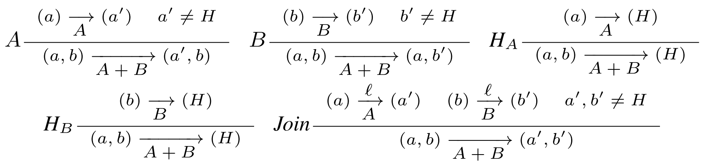
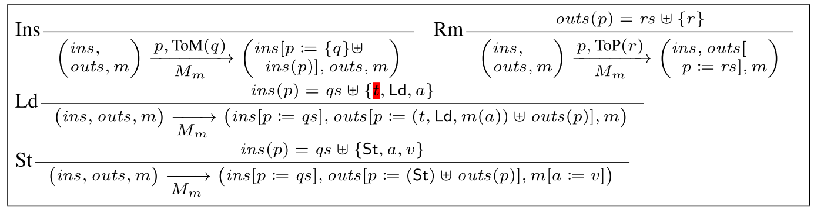
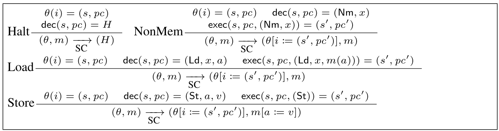
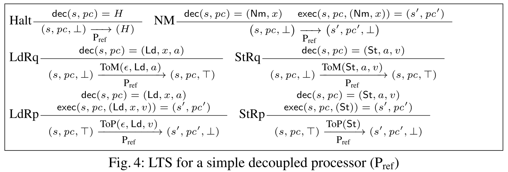

- # 图例
	- [[#green]]==生词==
	- ==重点==
	- [[#red]]==疑点==
	- [[#blue]]==附注==
- # Introduction
	- 分开证明处理器部分和内存部分都满足SC(sequential consistency)
		- SC是并发系统中一个强安全性质，要求程序的指令执行结果按照编程的顺序来
	- 然后结合起来，形成一个完整的系统
	- 提出一套基于**LTSes(labeled transition systems)**的硬件设计模块化证明方法论
	- 将LTSes作为一种硬件描述方式是一中成熟的技巧，有编译器支持
		- 本文使用的LTSes 是**Bluespec** 语言
		- Bluespec由MIT自己开发
		- Bluespec将硬件建模为一个迁移系统的原子规则
		- 有商用编译器将Bluespec转变为其他语言代码（例如verilog）
- # Related work
	- 前人对于多处理器。多层级内存系统的验证集中于model checking
	- 因此陷入了model checking的通病：状态爆炸
		- 所以能验证的系统复杂度非常有限，哪怕引入了很多可以增加验证能力的technic也仍然难以突破
- # Labeled Transition Systems（LTS）
	- **定义1**，LTS
		- 一个LTS是一个三元关系，形如$\mathcal{S}^H \times \mathcal{L}^\epsilon\times \mathcal{S}^H$
			- 其中，$\mathcal{S}$是状态集合，$\mathcal{L}$是标签集合
			- 上标$X^\epsilon$表示集合$X$有额外的空元素$\epsilon$
			- 上标$X^H$表示集合$X$有额外的halt元素$H$，表示停机状态
			- 每一个LTS在$\mathcal{S}$中有一个初始状态
		- 对于LTS $A$，$(s)\overset{\ell}{\underset{\mathrm{A}}{\rightarrow}}(s')$ 表示$(s,\ell,s')\in A$
			- $A_0$表示$A$的初始状态
			- $A$一般被自然而然地看作一个并发系统的一个进程
			- 当$A$参与了一些和其他进程的IO交换时，来自集合$\mathcal{L}$的标签$\ell$会被产生
				- 否则$\ell$就是一个空或silent lebel$\epsilon$
				- 为了方便有时会忽略$\epsilon$步骤的标签
	- ## LTS的基本构造
		- 利用一个表示单步长演变的LTS可以build一个任意长度演变的LTS
		- **定义2**，传递自反闭包
			- $A$的传递自反闭包写作$A^*$
			- $A$的元素为$\mathcal{S,L}$，则$A^*$的元素为$\mathcal{S,L^*}$
				- $\mathcal{L^*}$中的元素来自$\mathcal{L}$，或$\mathcal{L}$中的label的序列
			- 当$A$中存在0或
			- 更长的从$s$到$s'$的迁移时，$A^*$可以从$s$到$s'$，且$A^*$中该迁移的label是$A$中迁移路径上的所有label的拼接。
			- $\epsilon$在拼接时被看作identity element（$\epsilon$拼接任何元素都等于该元素）
		- **定义3**，repetition
			- $A$的n-repetition 记作$A^n$
			- $A$的状态和labels分别为$\mathcal{S,L}$，则$A^n$的状态机和为$\mathcal{S}^n$，labels为$[1,n]\times \mathcal{L}$
				- 标签的解释为，一个二元组集合，其中每一个二元组包含一个标签和产生这个标签的进程的编号
			- 只有当系统中的一个组件产生一个标签的时候整个系统才会产生一个标签
			- 如果有一个组件停机(halt)，则整个系统都会暂停
		- 有了对于进程的定义，接下来需要对进程间的通信进行刻画
		- **定义4**，通信组合（communicating composition）
			- 记作$A+B$
			- $A,B$具有相同的的标签集合$\mathcal{L}$，状态机和分别为$\mathcal{S}_A,\mathcal{S}_B$
			- $A,B$的通信组合记为$A+B$，新的LTS的状态为$\mathcal{S}_A\times \mathcal{S}_B$，标签集合为空，迁移规则如下：
			- 
	- ## Refinement between LTSes
		- **定义5**，trace-refines
			- 对于一个标签定义域$\mathcal{L}$，定义一个函数$f$，$f : \mathcal{L\rightarrow L^\epsilon}$
				- $f$可以替换标签，或者消除标签
			- 对于两个拥有相同标签集合$\mathcal{L}$的LTS，$A,B$，如果：
				- $$\forall s_A,\eta\cdot (A_0)\overset{\eta}{\underset{A^*}{\rightarrow}}(s_A)\Rightarrow \exist s_B \cdot (B_0) \overset{f(\eta)}{\underset{B^*}{\rightarrow}}(s_B)\wedge (s_A=H\Leftrightarrow s_B=H)$$
			- 则称：A **在**$f$**上**，**trace-refines** B，记作$A\sqsubseteq _f B$
				- 每一个trace中的标签都被$f$替换，被$f$映射为$\epsilon$的会被丢弃
		- 为了方便，将$A\sqsubseteq_\mathsf{id} B$ 简写作 $$A\sqsubseteq B$$
			- $\mathsf{id}$ 是identity function，将两个LTS的trace强制变为完全一致
			- 如果满足$A\sqsubseteq B$则称，A在B上是正确的(sound)
	- ## 一些引理
		- **定理 1**
			- $\sqsubseteq$ 是**自反**和**传递**的
		- **定理2**
			- 如果$sqsubseteq_f B$，则$A^n\sqsubseteq_{f^n} B^n$
			- 若$f(\ell) = \ell'$，则 $f^n(i,\ell)=(i,\ell')$
			- 若$f(\ell)=\epsilon$，则 $f^n(i,\ell) = \epsilon$
		- **定理3**
			- 如果$A\sqsubseteq_f A', B\sqsubseteq_f B'$，则$A+B\sqsubseteq A'+B'$
- # Decomposing a Shared-Memory Multiprocessor System
	- 任何常规的多处理器系统都可以在逻辑上被分为三个组件
		- **处理器(Processor)**
		- **本地缓存(Local buffer)**
		- **内存子系统(memory subsystem)**
	- 哪怕在若内存模型中，读操作的原子性仍然是需要满足的，读操作的原子性非常重要，是顺序一致性的保证[[$red]]==(?)==
	- 一个简单的内存建模
		- 
		- Ins：向来自处理器p的input buffer中插入一条请求
		- Rm：发送一条out buffer中的回应，将该回应出列
		- Ld：处理input buffer中的一条来自处理器p上针对地址a的load请求，t是一个可以让处理器用来将回应和请求匹配起来的tag；将回应压入output buffer
		- St：处理一条来自处理器p针对地址a存入值v的请求，将回应压入output buffer
		- **初始状态为：**$(\emptyset,\emptyset,m_0)$
	- 由cache的层次结构来负责实现读操作的原子性
		- cache coherence protocol就是为了保证这个不变式的
	- 本文建立了如此形式的理论：“如果系统A执行了一次并产生了特定的可观测行为，则系统B也进行了一次有相同可观测行为的执行”
		- 则称A“**正确实现(Correctly implement)**”了B
	- # 详述 Sequential Consistency
		- 使用trace refinement $\sqsubseteq$ 关系来陈述SC性质
		- 定义了一个满足**SC**的LTS，该LTS针对不同的ISA细节做了**参数化**
			- 
			- ISA给出一些架构状态s(例如寄存器阵列)和程序计数器(pc)的定义域
			- 函数$\mathsf{dec}(s,pc)$给出当前状态下pc指向的是哪条指令，并给出指令的"已解码(decoded)"版本
				- 对于非内存操作指令，输出为$(\mathsf{Nm},x)$
				- 对于load操作指令，输出为$(\mathsf{Ld},x,a)$，a为内存地址
				- 对于store操作指令，输出为$(\mathsf{St},a,v)$，v为将要存入地址a的值
				- 对halt指令，输出为$H$，将LTS移入$H$状态
				- 以上指令中的$x$表示了指令的剩余部分，包括opcode，寄存器，常数等
			- 一个类似的函数$\mathsf{exec}(s,pc,d)$将会实际执行该指令，返回一个新的状态$s'$和下一个程序计数器$pc'$
				- 该函数的合法输入包括解码后的指令和任何相关的来自内存系统的回应
				- 对于非内存指令，输入是$(\mathsf{Nm},x)$
				- 对于St指令，输入是$\mathsf{St}$，意味着不需要额外的来自内存的输入
				- 对于Ld指令，输入是$(Ld,x,v)$，v就是请求的内存单元的值
		- SC的初始状态定义为$(\theta_0,m_0)$
			- $m_0$是初始化的内存状态，所有的地址都被映射为初始值$v_0$
			- $\theta_0$将所有的处理器ID都映射为(s_0,pc_0)，$s_0$和$pc_0$是各种ISA所指定的默认值
		- 一个在LTS for SC的基础上优化的来的一个**单个(decoupled)处理器**模型如下
			- 
			- $P_{ref}$的状态是一个三元组$(s,pc,wait)$
				- $s$是目前的ISA-specific状态，$pc$是当前的程序计数器，$wait$是一个boolean flag，标识当前处理器是否处于等待内存回应的block状态
			- $P_{ref}$的初始状态为$(s_0,pc_0,\bot)$
			-
			-
- # Respecifying Sequential Consistency with Communication
	-