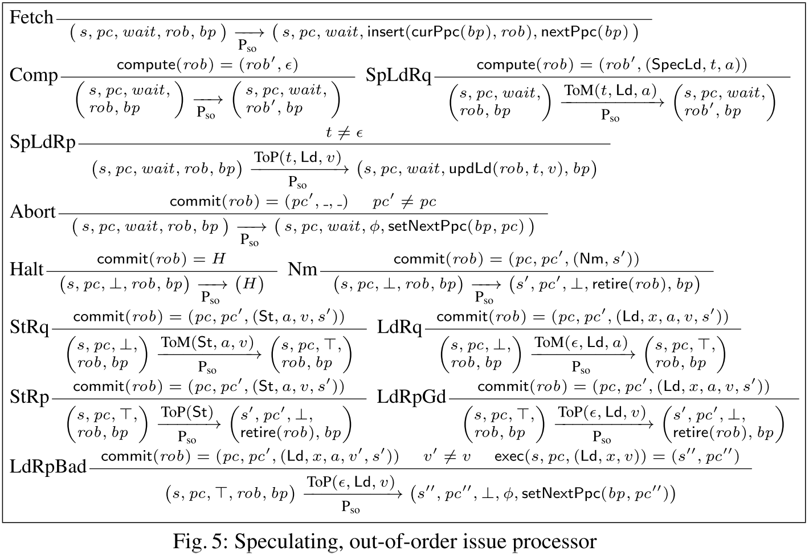
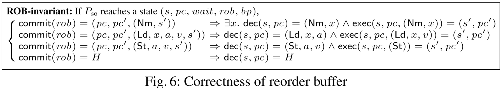
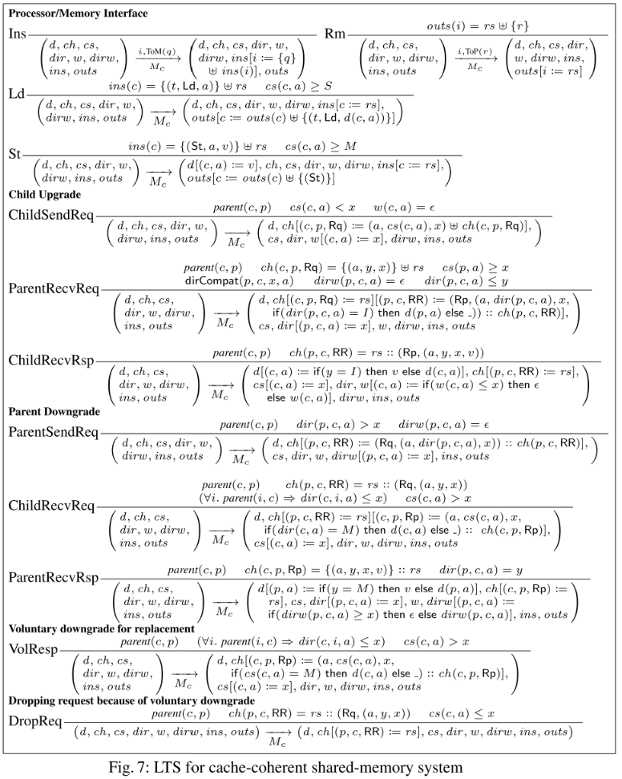
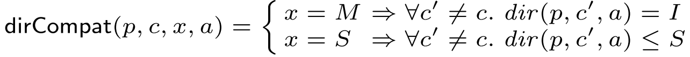

- ## [[补充：MSI协议]]
- # 图例
	- [[#green]]==生词==
	- ==重点==
	- [[#red]]==疑点==
	- [[#blue]]==附注==
- # Introduction
	- 分开证明处理器部分和内存部分都满足SC(sequential consistency)
		- SC是并发系统中一个强安全性质，要求程序的指令执行结果按照编程的顺序来
	- 然后结合起来，形成一个完整的系统
	- 提出一套基于**LTSes(labeled transition systems)**的硬件设计模块化证明方法论
	- 将LTSes作为一种硬件描述方式是一中成熟的技巧，有编译器支持
		- 本文使用的LTSes 是**Bluespec** 语言
		- Bluespec由MIT自己开发
		- Bluespec将硬件建模为一个迁移系统的原子规则
		- 有商用编译器将Bluespec转变为其他语言代码（例如verilog）
- # Related work
	- 前人对于多处理器。多层级内存系统的验证集中于model checking
	- 因此陷入了model checking的通病：状态爆炸
		- 所以能验证的系统复杂度非常有限，哪怕引入了很多可以增加验证能力的technic也仍然难以突破
- # Labeled Transition Systems（LTS）
	- **定义1**，LTS
		- 一个LTS是一个三元关系，形如$\mathcal{S}^H \times \mathcal{L}^\epsilon\times \mathcal{S}^H$
			- 其中，$\mathcal{S}$是状态集合，$\mathcal{L}$是标签集合
			- 上标$X^\epsilon$表示集合$X$有额外的空元素$\epsilon$
			- 上标$X^H$表示集合$X$有额外的halt元素$H$，表示停机状态
			- 每一个LTS在$\mathcal{S}$中有一个初始状态
		- 对于LTS $A$，$(s)\overset{\ell}{\underset{\mathrm{A}}{\rightarrow}}(s')$ 表示$(s,\ell,s')\in A$
			- $A_0$表示$A$的初始状态
			- $A$一般被自然而然地看作一个并发系统的一个进程
			- 当$A$参与了一些和其他进程的IO交换时，来自集合$\mathcal{L}$的标签$\ell$会被产生
				- 否则$\ell$就是一个空或silent lebel$\epsilon$
				- 为了方便有时会忽略$\epsilon$步骤的标签
	- ## LTS的基本构造
		- 利用一个表示单步长演变的LTS可以build一个任意长度演变的LTS
		- **定义2**，传递自反闭包
			- $A$的传递自反闭包写作$A^*$
			- $A$的元素为$\mathcal{S,L}$，则$A^*$的元素为$\mathcal{S,L^*}$
				- $\mathcal{L^*}$中的元素来自$\mathcal{L}$，或$\mathcal{L}$中的label的序列
			- 当$A$中存在0或更长的从$s$到$s'$的迁移时，$A^*$可以从$s$到$s'$，且$A^*$中该迁移的label是$A$中迁移路径上的所有label的拼接。
			- $\epsilon$在拼接时被看作identity element（$\epsilon$拼接任何元素都等于该元素）
		- **定义3**，repetition
			- $A$的n-repetition 记作$A^n$
			- $A$的状态和labels分别为$\mathcal{S,L}$，则$A^n$的状态机和为$\mathcal{S}^n$，labels为$[1,n]\times \mathcal{L}$
				- 标签的解释为，一个二元组集合，其中每一个二元组包含一个标签和产生这个标签的进程的编号
			- 只有当系统中的一个组件产生一个标签的时候整个系统才会产生一个标签
			- 如果有一个组件停机(halt)，则整个系统都会暂停
		- 有了对于进程的定义，接下来需要对进程间的通信进行刻画
		- **定义4**，通信组合（communicating composition）
			- 记作$A+B$
			- $A,B$具有相同的的标签集合$\mathcal{L}$，状态机和分别为$\mathcal{S}_A,\mathcal{S}_B$
			- $A,B$的通信组合记为$A+B$，新的LTS的状态为$\mathcal{S}_A\times \mathcal{S}_B$，标签集合为空，迁移规则如下：
			- 
	- ## Refinement between LTSes
		- **定义5**，trace-refines
			- 对于一个标签定义域$\mathcal{L}$，定义一个函数$f$，$f : \mathcal{L\rightarrow L^\epsilon}$
				- $f$可以替换标签，或者消除标签
			- 对于两个拥有相同标签集合$\mathcal{L}$的LTS，$A,B$，如果：
				- $$\forall s_A,\eta\cdot (A_0)\overset{\eta}{\underset{A^*}{\rightarrow}}(s_A)\Rightarrow \exist s_B \cdot (B_0) \overset{f(\eta)}{\underset{B^*}{\rightarrow}}(s_B)\wedge (s_A=H\Leftrightarrow s_B=H)$$
			- 则称：A **在**$f$**上**，**trace-refines** B，记作$A\sqsubseteq _f B$
				- 每一个trace中的标签都被$f$替换，被$f$映射为$\epsilon$的会被丢弃
		- 为了方便，将$A\sqsubseteq_\mathsf{id} B$ 简写作 $$A\sqsubseteq B$$
			- $\mathsf{id}$ 是identity function，将两个LTS的trace强制变为完全一致
			- 如果满足$A\sqsubseteq B$则称，A在B上是正确的(sound)
	- ## 一些引理
		- **定理 1**
			- $\sqsubseteq$ 是**自反**和**传递**的
		- **定理2**
			- 如果$sqsubseteq_f B$，则$A^n\sqsubseteq_{f^n} B^n$
			- 若$f(\ell) = \ell'$，则 $f^n(i,\ell)=(i,\ell')$
			- 若$f(\ell)=\epsilon$，则 $f^n(i,\ell) = \epsilon$
		- **定理3**
			- 如果$A\sqsubseteq_f A', B\sqsubseteq_f B'$，则$A+B\sqsubseteq A'+B'$
- # Decomposing a Shared-Memory Multiprocessor System
	- 任何常规的多处理器系统都可以在逻辑上被分为三个组件
		- **处理器(Processor)**
		- **本地缓存(Local buffer)**
		- **内存子系统(memory subsystem)**
	- 哪怕在若内存模型中，读操作的原子性仍然是需要满足的，读操作的原子性非常重要，是顺序一致性的保证[[$red]]==(?)==
	- 一个简单的内存建模
		- 
		- Mm的状态为一个三元组$(ins,outs,m)$，分别为来自处理器的输入buffer，送往处理器的输出buffer和地址到值的映射
		- **各rule的解释**
			- Ins：向来自处理器p的input buffer中插入一条请求
			- Rm：发送一条out buffer中的回应，将该回应出列
			- Ld：处理input buffer中的一条来自处理器p上针对地址a的load请求，t是一个可以让处理器用来将回应和请求匹配起来的tag；将回应压入output buffer
			- St：处理一条来自处理器p针对地址a存入值v的请求，将回应压入output buffer
		- **初始状态为：**$(\emptyset,\emptyset,m_0)$
	- 由cache的层次结构来负责实现读操作的原子性
		- cache coherence protocol就是为了保证这个不变式的
	- 本文建立了如此形式的理论：“如果系统A执行了一次并产生了特定的可观测行为，则系统B也进行了一次有相同可观测行为的执行”
		- 则称A“**[[$blue]]==正确实现(Correctly implement)==**”了B
	- # 详述 Sequential Consistency
		- 使用trace refinement $\sqsubseteq$ 关系来陈述SC性质
		- 定义了一个满足**SC**的LTS，该LTS针对不同的ISA细节做了**参数化**
			- 
			- ISA给出一些架构状态s(例如寄存器阵列)和程序计数器(pc)的定义域
			- 函数$\mathsf{dec}(s,pc)$给出当前状态下pc指向的是哪条指令，并给出指令的"已解码(decoded)"版本
				- 对于非内存操作指令，输出为$(\mathsf{Nm},x)$
				- 对于load操作指令，输出为$(\mathsf{Ld},x,a)$，a为内存地址
				- 对于store操作指令，输出为$(\mathsf{St},a,v)$，v为将要存入地址a的值
				- 对halt指令，输出为$H$，将LTS移入$H$状态
				- 以上指令中的$x$表示了指令的剩余部分，包括opcode，寄存器，常数等
			- 一个类似的函数$\mathsf{exec}(s,pc,d)$将会实际执行该指令，返回一个新的状态$s'$和下一个程序计数器$pc'$
				- 该函数的合法输入包括解码后的指令和任何相关的来自内存系统的回应
				- 对于非内存指令，输入是$(\mathsf{Nm},x)$
				- 对于St指令，输入是$\mathsf{St}$，意味着不需要额外的来自内存的输入
				- 对于Ld指令，输入是$(Ld,x,v)$，v就是请求的内存单元的值
		- SC的初始状态定义为$(\theta_0,m_0)$
			- $m_0$是初始化的内存状态，所有的地址都被映射为初始值$v_0$
			- $\theta_0$将所有的处理器ID都映射为(s_0,pc_0)，$s_0$和$pc_0$是各种ISA所指定的默认值
		- 一个在LTS for SC的基础上优化的来的一个**单个(decoupled)处理器**模型如下
			- 
			- $P_{ref}$的状态是一个三元组$(s,pc,wait)$
				- $s$是目前的ISA-specific状态，$pc$是当前的程序计数器，$wait$是一个boolean flag，标识当前处理器是否处于等待内存回应的block状态
			- $P_{ref}$的初始状态为$(s_0,pc_0,\bot)$
- # Respecifying Sequential Consistency with Communication
	- 将 decoupled LTSes $\mathrm{P}_\mathrm{ref}^n,M_m$ 通信组合起来便可以得到一个SC的实现
		- **对于一个有n个处理器的系统**，decoupled SC 实现为：$\mathrm{P}^n_\mathrm{ref}+M_m$
	- **定理4**
		- $\mathrm{P}_\mathrm{ref}^n+M_m \sqsubseteq SC$
		- 证明：通过归纳法构造一个可以把左边系统的状态映射到SC的状态的函数$f$
			- $f$会保持那些没有正在等待来自内存回应的状态
			- 当内存回应存在时，$f$会立即在相应的处理器上执行这些回应
		- [[$red]]==f不应该是针对labels的吗？==
		- [[$red]]==trace是状态序列还是labels序列？看前文感觉应该是label序列==
- # Speculative Out-Of-Order Processor
	- 进行增加并行程度的优化可能会导致同时发送大量请求给内存，短时间内这些请求将难以被快速处理
	- 对speculative 系统的建模
		- 
		- branch predictor的状态由一个元变量$bp$来指示，在此状态上的操作包括
			- $\mathsf{curPpc}(bp)$，提取对于当前pc的预测
			- $\mathsf{nextPpc}(bp)$，预测下一条指令
			- $\mathsf{setNextPpc}(bp,pc)$，重置预测于一个已知准确的pc处
		- 处理器仅仅将预测看作提示，每一次检测到预测失败都会使用$\mathsf{setNextPpc}$重置 predictor
		- $rob$作为reorder-buffer状态的一个元变量，作用在reorder-buffer状态上的操作有：
			- $\mathsf{insert}(pc,rob)$，将位于pc处的指令压入rob中
			- $\mathsf{compute}(rob)$，rob内部的计算，返回更新之后的状态和一个可发射的可选speculative load指令
			- $\mathsf{updLd}(rob,t,v)$，告知buffer内存返回了对某speculative load指令的回应，$t\ne \epsilon$
			- $\mathsf{commit}(rob)$
				- 如果积累了足够的内存回应来准确执行该指令，则返回程序顺序中的下一条指令
					- 同时还会返回该指令对应的pc和下一个pc
					- 指令也被扩展，记录了相关的内存回应(仅限load指令，信息获取自updLd)和新的架构状态
				- 否则返回$\epsilon$
			- $\mathsf{retire}(rob)$，告知rob，commit的指令被成功执行，准备进行rob中下一条指令的commit
		- 对该LTS一些规则的个人解释：
			- **Abort**：会什么会出现需要commit的pc和状态指向的下一个应该commit的pc不同的情况？
				- 这说明分支预测失败，举例：
					- 上一条commit的指令，是一条分支指令，该分支经过计算之后得出不跳转的结果，因此，该指令commit时，会将pc+4作为新pc
					- 而如果预测的是要进行跳转，按照reorder中的程序顺序，跳转指令之后紧接着的下一条指令便是跳转之后地址的指令，此时若commit，则得到的pc便不匹配，说明预测失败
				- 所以预测失败时，将会清空reorder buffer，并修正预测，重新取指
			- **LdRpGd和LdRpBad**，这两条指令是在提交load指令时会再进行一次verification load，对比两次load的值，如果不同，则也说明预测失败[[$red]]==(?)==
	- ## 带前瞻执行的LTS的正确性
		- **ROB的正确性不变式**
			- 
			- 总结来说，每当rob commit一条指令，指定下一条要执行的指令并造成了一定的状态改变时，指定的下一条指令必须是在实际程序顺序下的下一条指令，且commit的指令必须造成该指令在程序顺序下相当的状态改变
		- 定义一个函数**noSpec**，该函数去掉所有的前瞻加载请求和回应(所有tag不是$\epsilon$的load请求和回应，注意只有前瞻加载的请求和回应的tag不是$\epsilon$)
		- **定理5：** $$P_{so}\sqsubseteq_\mathsf{noSpec}P_{ref}$$
			- noSpec函数舍弃了所有和前瞻执行有关的label(所有的前瞻加载)
			- 再加上ROB正确性不变式，可以通过归纳法得出证明
		- **推论1：** $P^n_{so} \sqsubseteq_{\mathsf{noSpec}^n} P^n_{ref}$
			- 根据定理5和定理2得到
- # 基于Cache的内存系统
	- 
	- 该内存系统的一个状态包含：
		- $d,ch,cs,dir,w,dirw,ins,outs$
			- $ins, outs$的定义与图2$Mm$中的定义相同
			- $parent(c,p)$表示p是c的parent
	- M，S，I，分别表示了允许修改，允许读和什么都不让做，许可的强度大致为M>S>I
	- $cs(c,a)$表示cache c中地址a所处的状态
	- $d(c,a)$表示cache c中地址a的值
	- $w(c,a)$表示cache c中地址a的正在等待获取的permission 类型
	- $dir(p,c,a)$表示parent p对于child c中地址a的状态的感知
	- $dirw(p,c,a)$表示parent p 正在等待child c对于地址a的状态的降级的回应，如果是，则返回将会下降到的状态
	- 此系统中有三种通信信道
		- $ch(p,c,\mathsf{RR})$
			- 承载从父母节点到孩子结点的降级请求和升级回应
			- 根据先进先出的顺序传递消息，由$::$标记
		- $ch(c,p,\mathsf{Rq})$
			- 承载从孩子节点到父母节点的升级请求
			- 不遵循先进先出，由$\uplus$标记
		- $ch(c,p,\mathsf{Rp})$
			- 承载从孩子节点到父母节点的降级回应
			- 根据先进先出的顺序传递消息，由$::$标记
	- ## 工作路径
		- 一个cache可以自行决定将其状态升级，该升级需要向其父母发送升级请求
		- 其父母根据自己directory的估算和自己的状态cs决定要不要回应该升级请求
			- 如果cs低于要求升级的等级，则说明该父母无法处理该请求，必须升级cs
			- 否则，父母节点必须确保若有其余的孩子都和此次升级相同(compatible)(**见定义6**)
				- 对于不相容的孩子，要送去降级请求
			- 当cs的升级回应和孩子的降级回应都收到之后，最初的升级请求才能够被处理
		- ins中的请求只有L1 cache中的相应条目处于合适的状态时才能够被处理，否则L1 cache只能要求对该地址的状态进行升级
		- 复杂的地方在于，一个cache可以自发降低其条目的状态等级
			- 这样的设计在于cache可以通过这样的方法来换取可用空间
			- 这样一来，父母中对于孩子的权限认知可能发生不同步
				- 可能发生父母要求孩子降级，而孩子的等级已经下降到对应等级
			- 所以当这样的情况发生时，应该直接丢弃降级请求，来避免无法处理这种降级请求而导致死锁(对应图7中的法则 DropReq)
	- **定义6**，directory compatible
		- {:height 45, :width 451}
	- ## 证明Mc是 store atomic的
		- **定理6**
			- $M_c\sqsubseteq M_m$
		- time指到达指定状态之前的迁移次数(一个全局的迁移计数[[$red]]==(?)==)
		- **定理7**
			- A 是 store atomic的($A\sqsubseteq M_m and M_m \sqsubseteq$)，当且仅当对于任何一个收到的load请求$\mathsf{ToM}(t,\mathsf{Ld},a)$，回应$\mathsf{ToP}(t,\mathsf{Ld},v)$在满足以下描述的time $T$送出
				- $v=v_0$(内存的初始值)，并且没有任何储存请求$\mathsf{ToM}(\mathsf{St},a,v')$已经在时间$T'$被处理，$T'<T$，或者
				- 存在一个store请求$\mathsf{ToM}(\mathsf{St},a,v)$在时间$T_q$被处理，$T_q<T$，并且没有其他任何store请求$\mathsf{ToM}(\mathsf{St},a,v')$被在时间$T'$被处理$T_q<T'<T$
			- 说白了就是，如果一个load请求发出，则当对该请求的回应在时间t发出时，要么该内存地址在t之前从来没有被写过，是初始值；要么该内存地址在小于t的某个时间被写为了load回应中的值，且从那一次写入之后到回应发出没有其他任何在该地址的写入被处理
			- **证明**：使用后续给出的引理
		- **引理1**
			- 在任何时刻$T$，如果cache $c$上地址$a$ 满足$cs(c,a)\ge S$，并且$\forall i\cdot dir(c,i,a)\le S$($c$的所有孩子持有的$a$的状态都小于等于$c$持有的$a$的状态)，那么$a$会具有一个**最终值(last value)**，即
				- $d(c,a)=v_0$，并且 没有任何在$T$之前被处理的store 请求(根据论文表述转述，非原文)
				- 在$T$之前有一次在时间$T_q$上对某store 指令的处理，将内存的值写为了$v$，且在$$T_q$$和$T$之间，没有处理任何store指令
			- 使用引理1可以很简单地证明定理7，但证明引理1需要继续引入更多引理
		- **引理2**
			- 如果地址$a$地数据正处于转移中，即处于时间$T$，$\forall T\cdot T_s \le T\le T_r$，$T_s$是发送该数据的时间，而$T_r$是接受该数据的时间，则没有任何cache可以处理$a$的store请求并且数据必须通过一个干净的cache发送
		- **引理3**
			- 在任何时间，$\forall p,forall c,foarall a\cdot parent(c,p)\Rightarrow\\ cs(c,a)\le dir(p,c,a)\wedge \mathsf{dirCompat}(p,c,dir(p,c,a),a)\wedge dir(p,c,a)\le cs(p,a)$
		- [[$red]]==**证明最终由coq完成，代码量约为12000行**==
- # 最终结果
	- **定理8**
		- $M_m\sqsubseteq_{\mathsf{noSpec}^n} M_m$
		- 证明：构造一个identity abstraction function，在traces上递归证明
	- **定理9**
		- $P^n_{so}+M_m \sqsubseteq P^n_{ref} +M_m$
		- 证明：根据定理3，推论1和定理8
	- **定理10**
		- $P_{so}^n+M_c\sqsubseteq P_{so}^n+M_m$
		- 证明：根据定理6，3和$\sqsubseteq$的自反性质
	- **定理11**
		- $P_{so}^n+M_c\sqsubseteq SC$
		- 证明：两次使用定理1来连接定理10，9，4