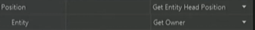
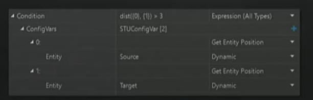
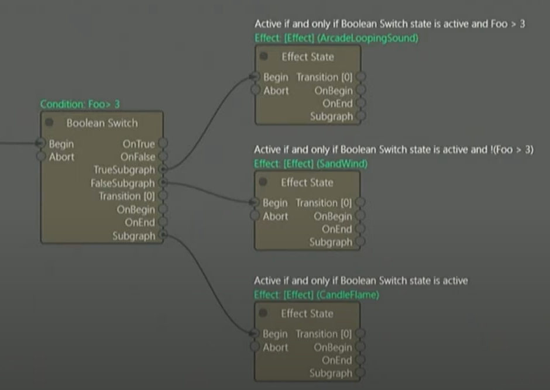
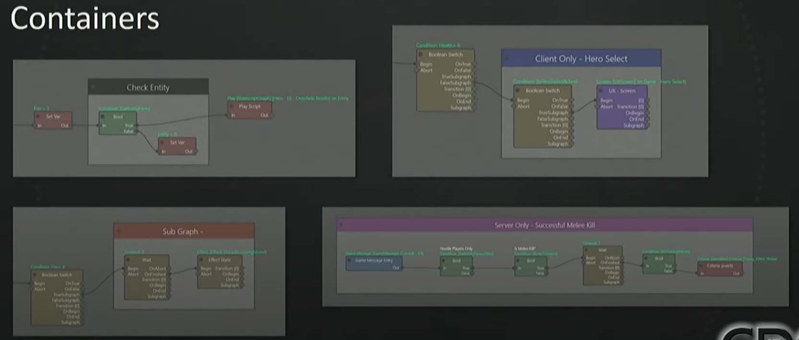
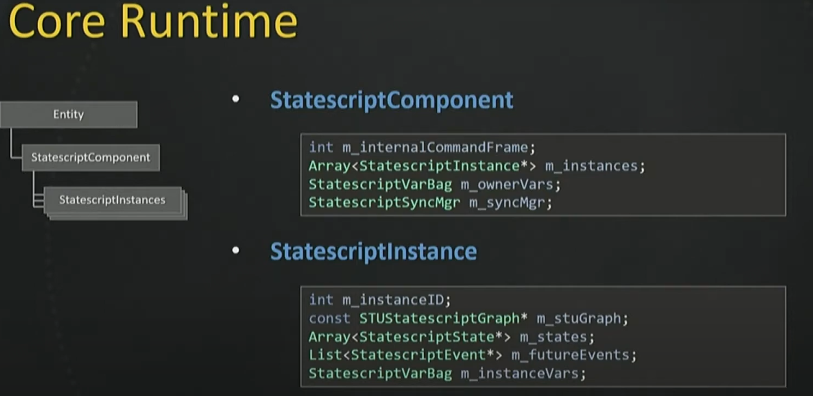
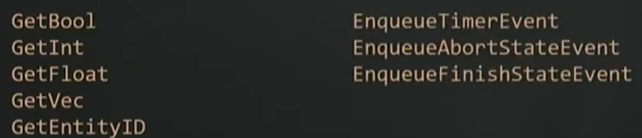
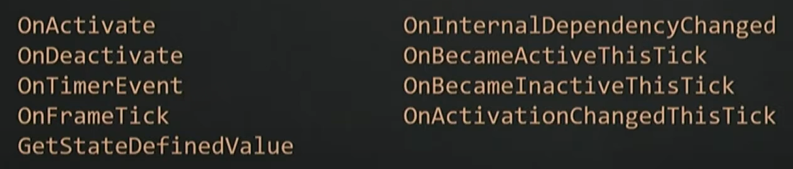

# 为什么使用statescript
	- 定义游戏状态
	- 模块化代码
	- 无痛同步状态机
- # 什么是statescript
	- 可视化脚本语言
	- 每一个脚本都是一个节点图，定义若干游戏逻辑
	- ## 运行statescript
		- 当一个statescript运行时，这个statescript（可以看作整个文件）会生成一个statescript instance
			- 一个instance被一个Entity拥有，在守望先锋中一个entity就代表一个英雄
			- instance可以被动态添加删除
			- 一个entity可以拥有多个instance
	- ## Statescript节点
		- ### Entry节点
			- 脚本的入口
		- ### Condition节点
			- 输出控制逻辑走向
		- ### Action节点
			- 执行一些实际功能的节点
		- ### State节点
			- 代表一个持续进行的行为，内部会有一些诸如OnUpdate之类的时间函数
			- 平时未激活，须由外部激活，激活之后会持续运行直到内部停止活外部要求停止
	- ## Statescript变量
		- **[[$red]]==每个Instance==**都可以有自己的一系列变量
			- 例如武器的弹匣剩余子弹数量
		- **[[$red]]==Owner Entity==**也可以有一系列共享变量
			- 例如禁用能力flag，这种变量在一个entity的所有instance之间都共享
		- 所有的变量都仅为基础类型，或者基础类型的数组
			- 发言人提到这足以cover绝大部分场景，但是极少数情况可能还是希望用到复杂的嵌套式结构体变量，他们可能后续会提供支持
		- 有一些变量可能是脚本中的state节点定义的
	- ## Statescript property
		- 节点的行为由若干property定义
			- 每一个property都有一些提前定义好的值（Config Vars），配置者通过这些值来改变节点的某些行为
		- property可能存在嵌套
			- 
			- 例如，先选择了要拉取Entity的头部位置，那么就需要配置一个嵌套的property，即要拉取哪个entity的相关值
		- 每一个property的每一个type都是一个由C++实现的函数
		- Property举例：
			- 字面量（Bool, int, float, vec, string等）
			- 变量
			- 通用工具(英雄是否选中，获取entity位置等)
			- 表达式，可以嵌套
				- {:height 204, :width 612}
	- ## 一些其他的statescript feature
		- ### 子图（subgraph）
			- 每一个State节点都有一个子图输出plug，
			- 
		- ### 容器
			- 用于组织和标识作用
			- 
- # Statescript Themes
	- ## 生命周期保障（Lifetime Guarantees）
		- 每一个state都需要确保在自身生命周期结束时做好所有的清理工作
	- ## 逻辑风格
		- ### 命令式（Imperative）
			- 一连串的指令node，先做什么然后做什么
		- ### 声明式（Delcarative）
			- 当什么情况达成时，做什么
- # StateScript 实现
	- ## Core Runtime
		- {:height 358, :width 718}
		- 更新步长基于**[[$red]]==Command Frames==**，固定delta time，每秒60帧
		- 播放statescript需要绑定StatescriptComponent
			- 守望先锋似乎全过程使用的ecs，因此这里的component是ecs中的component
			- 在unity种实现也许不必使用ecs，就传统的go hierarchy应该就够用
		- ### StatescriptComponent
			- 具有所有执行脚本所需的数据
		- ### State
			- 基类提供通用函数
				- 
			- 需要派生类实现的虚函数
				- 
			-