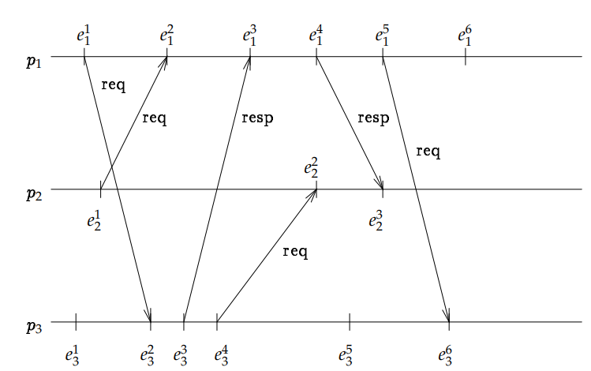
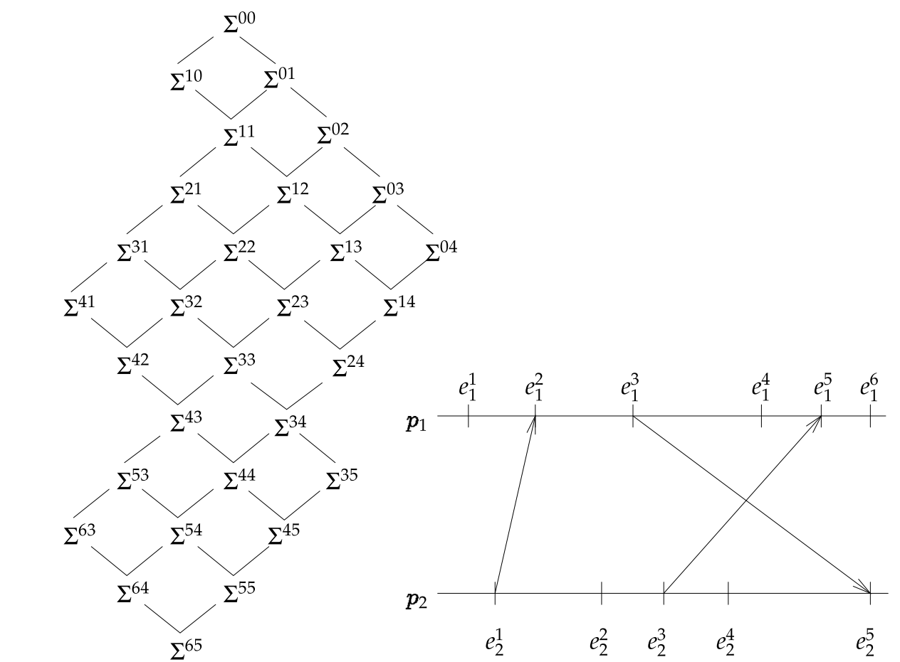
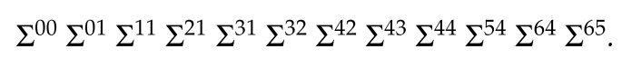

- # 概念补充
	- ## 空间-时间图(space-time diagram)
		- 描述了一个分布式系统地整体运行状况，其特征是纵轴为节点，横轴为时间，每一个点为发生在某个节点上的事件
		- 
	- ## 节点
		- 一个分布式系统中的一个**进程**(process)或**电脑**(computer)
	- ## 全局状态
		- 每一个进程都有着自己的状态，一个状态可以用一个事件来标识，表示执行了该事件之后进程的状态(pc，变量取值等)
		- 每一个进程的所有信道中的信息不需要记录，因为信息发送也可以抽象为事件，通过事件历史(event history，一个进程的所有已执行事件的**序列**)一并记录
		- 一个全局状态是一个n元组，n为系统中进程的数量
			- $\Sigma=(\sigma_1,\ldots,\sigma_n)$
			- $\sigma_n$是每一个进程的本地状态
		- ### 一致全局状态
			- **consistent global state**
			- 对应一个一致分割的全局状态([[$red]]==个人理解：可以作为一个一致分割的前线==)
	- ## 事件之间的关系
		- 全局的历史记录并不指明事件之间的因果关系
		- 定义一个关系用于表达两个事件"$\rightarrow$"之间的**因果关系**(cause-and-effect)(即强制的时间先后顺序)
			- 若$e_i^k,e_i^l\in h_i$且$k<l$则$e_i^k\rightarrow e_i^l$（时间下标为进程索引，上标为在其历史记录中的索引）
			- 若$e_send(m)$且$e_j=receive(m)$，则$e_i\rightarrow e_j$，即两个事件是针对同一消息的收发
			- 若$e\rightarrow e'$且$e'\rightarrow$，则$e\rightarrow e''$
		- 两个互不具有因果关系的事件记为: $e\| e'$
	- ## 分割
		- 一个**分割(cut)**是一个事件集合，也是一次运行中所有事件集合的一个子集，可以表示为$(c_1,\ldots,c_n)$
			- 其中每一个$c_n$表示进程n最后执行的事件
			- 形式化定义为$C=h_1^{c_1}\cup \ldots\cup h_n^{c_n}$
				- 其中$h_n^{c_n}$表示进程n到$c_n$为止的所有事件集合
			- 所有在$c_n$之前的事件都在分割中，所以$c_1,\ldots,c_n$也叫做一个分割的**前线(frontier)**
		- ### 一致分割(consistent cut)
			- 满足$e\in C \wedge (e'\rightarrow e)\Rightarrow e'\in C$的分割叫一致分割
			- 即，对于任何一个进程来说，在过去收到的信息一定要来自过去
			- 也就是格论中的***down-set***
			- 在本文中，**全局谓词**(global predicate)指的就是定义域一致分割集合上的布尔函数
			- **很明显，所有的一致分割构成的集合在**$\subseteq$**关系下构成了一个格，这是比下文中对于全局状态之间根据一直运行定义出来的格更加简洁的定义，且这两者在结构上是一致的**
	- ## 计算和运行
		- 分布式系统的一次**计算(computation)**是定义在全局历史记录$H$(也就是所有事件集合)上的一个偏序集，记为$(H,\rightarrow)$
		- 而一次**运行(run)**，包含有事件的先后顺序，其定义为一个包含了一次计算的所有事件的全序关系$R$，内涵为任何事件对于任何一个进程$p_i$，$p_i$的事件出现在$R$中的顺序和它们出现在$h_i$中顺序相同
		- 一次运行可能并不符合任何实际的执行结果，一次计算可能拥有若干运行
		- ### 一致运行
			- **consistent run**
			- 对于一个一致运行$R$，若$e\rightarrow e'$，则e在$R$中一定出现在e'之前
	- ## 全局状态之间的关系
		- 对于一个一致运行$R=e^1e^2\cdots$，其自然对应了一个全局状态序列$\Sigma^0\Sigma^1\Sigma^2\cdots$
			- 其中$\Sigma^0$表示初始全局状态$(\sigma^0_1,\ldots,\sigma^0_n)$
			- 很明显，其中某一个全局状态都是一致的
			- 每一个全局状态$\Sigma^i$都是因为在$\Sigma^{i-1}$的基础上执行了某个进程的某个事件得到的
			- 在此概念上定义一个关系$\leadsto_R$，表示$\Sigma^{i-1}$在$R$中**导致**(leads to)了$\Sigma^i$
		- 若$\Sigma'$在$R$中从$\Sigma$可达，则仅当(only if)$\Sigma \leadsto_R \Sigma'$
			- $\leadsto_R$的下标可以去掉，表示存在某个运行使得$\Sigma'$从$\Sigma$处可达
		- ### 一致全局状态之间的格(lattice)
			- 一次计算的所有一致全局状态的集合和导致关系构成了一个格
			- 此格拥有n个正交的轴(orthogonal axe)，每一个轴表示一个进程
			- 
			- 上图中，$\Sigma^{k_1\ldots k_n}$是全局状态$(\sigma_1^{k_1},\ldots,\sigma_n^{k_n})$的简写
			- 定义$k_1+\cdots+k_n$为一个一致全局状态的**层数(level)**
			- 格中的每一个全局状态都是从初始状态处可达的
			- 定义格中的一条**路径(path)**是一个层数递增的全局状态序列，该序列中任何两个相邻的元素之间的层数都只相差1
			- 每一条路径都对应了该计算中的一次运行，上图中一次可能的运行为
				- {:height 38, :width 377}
	- ## Join-Irreducible Element
		- 对于一个格$L$，一个Join-Irreducible Element $x$的需要满足如下条件：
			- $x\ne 0$
			- $\forall a,b\in L: x=a \sqcup b\Rightarrow (x=a)\vee (x=b)$
		- 第一个条件中0表示$L$中的零号元素(具体在某个一致分割集构成的格中，代表初始状态)
		- 第二个条件表示该一致分割有且只能有一条入边，其中符号$sqcup$表示join操作，输出为两个元素的**最小上界**(Least Upper Bound, LUB)，对应的另一种在格上的常见操作为$\sqcap$，meet，输出为两个元素的**最大下界**(Greatest Lower Bound, GLB)
		- 所以直观地说，一个Join-Irreducible Element就是一个入边只有一条的格元素
- # 正则谓词(Regular Predicate)
	- 由于**一致性划分(consistent cuts)**和进程数量成指数关系，因此观测或者控制一个一般的谓词是一个计算难问题
	- 若谓词满足某些额外性质，如稳定性(stability)，观测者无关性(observer-independence)或线性(linearity)，有一些有效的算法可用于观测它们
	- 非形式化地说：**若某个满足某一谓词的一致分割集构成了一致分割格的一个子格**
		- 即满足该谓词的一致分割集合在合取和析取下是闭包的
	- 形式化定义：
		- 令$C(E)$为一个计算$(E,\rightarrow)$的一致分割集合，一个谓词B是正则的当且仅当：
			- $\forall G,H: G,H\in C(E): B(G)\wedge B(H)\Rightarrow B(G\cap H)\wedge B(G\cap H)$
	- ## 正则谓词的一些例子
		- ### “信道中没有待处理信息”
			- 待处理(outstanding)信息，只已经从信道上到达某一个进程，但是该进程还开始处理的信息
			- 令此谓词为$B$
			- 若一个一致分割$G$满足此谓词，当且仅当所有$G$中的发送事件，和该发送的对应事件都在$G$中
			- 因此很明显看出，若$B(H)$和$B(G)$成立，则$B(H\cap G),B(H\cup G)$也成立
			- 以下类似地谓词也都是正则谓词
				- 没有正在传输中(in transit)的信息
					- 表示正在信道上的信息
				- 进程$P_1,\ldots, P_5$之间没有正在传递的信息
				- 每一个**request信息**都已经被一个**acknowledge信息**应答
		- ### 本地谓词
			- 一个本地谓词的非形式化描述为：其真值只受本地已执行事件集合影响的谓词
			- 类似的一些谓词：
				- 领导已经发送了所有“prepare to commit”消息
				- 进程$P_i$处于“red”状态
		- ### 单调信道谓词
			- 例如：“$P_i$到$P_j$之间最多(少)有k条信息处于传递中”
	- **引理**：正则谓词的合取也是正则的
		- 此引理说明以下谓词也是正则的
			- 没有进程拥有token且没有信道拥有token
			- 任何本地谓词的合取
	- **注意**：正则谓词的析取不一定是正则的
- # 分布式系统的计算切片
	- 一个计算切片是相对于一个全局谓词定义的
	- 非形式化地说，一个切片是定义在一个事件子集上地偏序关系，子集中的事件必须同时执行
		- 即，一个一致分割要么包含该子集中的所有事件或是一个都不包含
		- 对于一个外部观测者来说，这些事件是被**原子(atomically)**执行的，他无法观测中间状态
		- 类似于数据库中**事务(transaction)**的定义
	- 形式化地定义：一个在某个分布式计算$(E,\rightarrow)$上的切片是一个三元组$(I_B,F,\rightarrow_B)$，其中
		- $F\subseteq 2^E$
		- $\rightarrow_B$是一个偏序关系
		- $F$是$E$的某个子集的一个划分(partition，包含了某个集合所有元素的几个互相之间交集为空的集合)
		- $\forall G\in C(E):B(G) \equiv (G\in C(F))$
		- $I_B$是$C(E)$中第一个满足$B$的一致分割，即满足$B$的初始一致分割