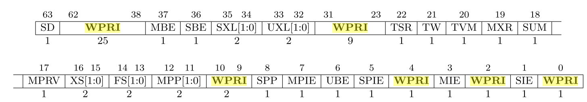

- # 杂项
	- [[The RISC-V Instruction Set Manual Volume II: Privileged Architecture]]
- # 个人思考
	- ## 对于AM(abstract-machine)的理解
		- 一开始我认为AM就是一个操作系统，加载程序到nemu的内存指定位置，然后执行
		- 然而实际上AM应该是一个特殊的抽象层，正如其名字**abstract machine**一样是一台省去了物理实现的抽象计算机
		- AM实际做的事是在物理计算机(NEMU)的基础上增添了一层新的抽象层，将NEMU的实现细节(指令集等)全部略去，使得后续的实验可以很方便地展开
		- 不过AM也做了一部分操作系统会做的事，例如库函数地实现等
- # [[$red]]==无法回答问题==
	- 阅读`fixedpt_rconst()`的代码, 从表面上看, 它带有非常明显的浮点操作, 但从编译结果来看却没有任何浮点指令. 你知道其中的原因吗?
- # [[$red]]==部分问题回答==
	- ## 理解上下文结构的前世今生
		- 上下文结构体Context在实际运行时是被**分配在栈空间上**的
		- 需要弄清楚，[[$red]]==**NANO-lite操作系统是如何执行一次trap的**==
		- 首先，操作系统在启动时需要通过**init_req**函数注册**异常回调函数**
			- 操作系统需要自定义一个根据不同的异常Event进行相应的回调函数**do_event**
				- 此函数接受一个时间Event和一个Context指针，返回一个Context指针
			- 然后调用am中的**cte_init**函数，并传入自定义的do_event函数
		- cte_init函数会完成更低一层的工作
			- 首先会设置**异常向量**
				- 当发生异常(ecall)时会跳转到储存于mtvec寄存器中保存的pc
				- 将mtvec寄存器的值设置为函数**__am_asm_trap**的地址
			- 然后将传入的do_event函数作为该文件中的一个静态全局变量**user_handler**保存下来
		- 因此当程序执行一次**yield**时，
			- 软件会：
				- 将异常编号保存进寄存器a7中
				- 使用ecall指令
			- 硬件(NEMU)会完成(通过**isa_raise_intr**函数)：
				- 将当前指令的pc保存进mepc中
				- 将异常编号放入mcause中
				- 将pc设置为mtvec的值 **等价于** 进入**__am_asm_trap**函数执行
		- __am_asm_trap函数负责trap的**事前(保存上下文)**和**事后(恢复上下文)**处理处理(软件层面)
			- 在``abstract-machine/am/src/$ARCH/nemu/trap.s``中使用汇编语言编写
				- 因为保存和恢复上下文的操作需要直接在和硬件打交道(操作寄存器)，因此使用汇编语言
			- 此函数首先会将sp寄存器(栈顶寄存器)减去Context结构体大小来在内存上分配出一个Context的空间
			- 然后再保存mcause，mstatus和mepc寄存器的值进入Context中
			- 根据保存时的偏移可知，Context结构体中各成员的顺序应该是：
				- 通用寄存器
				- mcause
				- mstatus
				- mepc
				- 地址空间
		- 在保存好Context之后，将Context在内存中的地址保存到寄存器a0中，作为接下来调用函数的参数
			- a0通常作为保存调用参数的寄存求之一
		- 调用**__am_irq_handle**函数进行事件分发
			- 声明一个Event结构体
			- 根据不同的mcause值，设置Evnet中event的值
			- 将当前Context和Event传入user_handler函数，进行用户自定义的异常处理
		- 处理完成之后，回到__am_asm_trap函数中执行
			- 还原上下文，然后使用mret指令让硬件恢复到异常发生时或下一条指令的地址(用户选择)
	- ## 理解穿越时空的旅程
		- 上一个问题的回答已经完成了本问题的解答
- # 操作系统对硬件的需求
	- 一个最基础的操作系统需要**做两件事**
		- 用户程序结束之后，跳转到操作系统的代码继续执行
		- 可以加载一个新的用户程序来执行
	- 以上两点要求程序之间的执行流切换
		- 单个程序内部的执行流切换很常见，函数调用就是
		- 执行流切换的本质还是改变PC值
	- 最初的操作系统就是一些库函数的集合，使用``call``，``jal``等指令完成执行流切换
		- 用户程序退出时，调用库函数中的特殊函数将执行流返还给操作系统
		- 缺点在于，如果用户程序崩溃了，则将导致操作系统的崩溃
		- 而且让用户随意进行任意的PC切换，很有可能会导致若干安全问题
	- 所以操作系统需要的是**[[$red]]==限制入口==的执行流切换**
		- 而实现这一点需要硬件支持
	- ## 硬件支持：执行模式分级
		- 硬件引入若干手段将当前执行程序的等级区分开、
		- 只有高特权级的程序才能执行一些系统级别的操作
		- 低特权程序尝试执行高特权操作时，CPU会抛出异常信号
		- 在硬件视角下，CPU实际并无法区分自己正在执行哪一个程序
			- 因此一般提供一个特权寄存器保存当前处理器所处的特权层级
			- 一些指令可以用于检查当前特权等级
		- 在RISCV下，存在M，S，U三个特权模式，分别代表机器模式，监管者模式和用户模式
			- 通常来说，操作系统运行在S模式
- # 自陷指令
	- 特权分级实际上是使得用户程序不再能随意进行执行流切换，使限制入口执行流切换具有了意义
	- 实际实现限制入口执行流切换的是自陷指令，也是由硬件提供
	- 程序执行自陷指令之后会跳转到操作系统预先设定好的跳转目标
		- 这个跳转目标也称为**异常入口地址**
	- 这一系列的操作是ISA规范的一部分，称为**中断/异常响应机制**
		- 大多数ISA不区分CPU异常和自陷和硬件中断，而是做统一处理
	- ## RISCV
		- 提供``ecall``指令作为自陷指令
		- 提供mtvec寄存器存放异常入口地址
		- 提供CSR(空置状态寄存器)保存程序当前状态
			- PA中使用三个CSR寄存器
				- **mepc**(Machine Exception PC)：存放触发异常的PC
				- **mstatus**(Machine Status)：存放处理器的状态(全局中断使能(globle interrupt enable)等很多其他信息)，结构如下所示
					- 
					-
				- **mcause**(Machine Exception Cause)：存放触发异常的原因
			- 剩下的部分CSR寄存器
				- **mtvec**(Machine Trap Vector)：保存发生exception时处理器需要跳转到的地址
				- **mie**(Machine Interrupt Enable)：指出处理器目前能处理和必须忽略的中断
				- **mip**(Machine Interrupt Pending)：列出目前正准备处理的中断
				- **mtval**(Machine Trap Value)：保存trap的附加信息
					- 地址exception中出错的地址
					- 发生非法指令exception的指令本身
					- 对于其他异常，值为0
				- **mscratch**(Machine Scratch)：暂时存放一个字大小的数据
		- ### 触发exception后的响应过程(简化)
			- 将当前PC值保存到mepc寄存器
			- 在mcause寄存器中设置异常号
			- 从mtvec寄存器中读取异常入口值
			- 跳转到异常入口地址
		- 在实际的硬件上，对异常的响应还涉及到特权等级切换等操作
		- ISA手册中会记录处理器对中断号和异常号的分配和相应处理
	- 异常处理完成之后的工作交由操作系统完成，操作系统会视情况决定是否继续执行程序
		- riscv通过``mret``指令从异常处理过程中返回，并根据mepc寄存器恢复pc
	- ## 状态机视角下的异常响应机制
		- 在之前的PA中提到过，程序时一个状态空间为$$S=<R,M>$$的状态机
		- 如果要给这个状态机增添异常响应机制，则首先需要对状态空间进行扩充
		- R需要扩充，使其包含特殊寄存器(系统寄存器System Register)
			- $\mathrm{S=\{GPR,PC,SR\}}$
		- M不需要修改，异常响应机制没有对内存做出改变
		- 对状态转移的扩充需要追加考虑指令执行“失败”时的操作
			- 引入一个虚拟的指令，执行该指令则代表进入了异常处理
- # 将上下文管理抽象为CTE
	- 上下文(Context)=程序状态
	- 操作系统需要进行上下文管理
	- 上下文管理的具体实现是**架构相关**的
	- 因此为了通用性，在**AM**中增添一组抽象API：**CTE**(ConText Extension)
	- 这些API需要给操作系统进行上下文管理提供统一的必要的信息，包括
		- **引起执行流切换的原因**，操作系统会根据不同的切换原因做出相应操作
		- **程序上下文**，操作系统读取一些上下文寄存器获取更多信息
- # 加载第一个用户程序
	- [[ELF文件格式和链接过程简介]]
	- 可执行文件的所有内容并非都需要加载，只需加载与runtime相关的内容即可
		- 调试信息和符号表就不必加载
	- 通过判断segment的``Type``属性是否是``PT_LOAD``来确定一个segment是否需要加载
	- ## 如何加载Segment
		- ```
		        +-------+---------------+-----------------------+
		        |       |...............|                       |
		        |       |...............|                       |  ELF file
		        |       |...............|                       |
		        +-------+---------------+-----------------------+
		        0       ^               |              
		                |<------+------>|       
		                |       |       |             
		                |       |                            
		                |       +----------------------------+       
		                |                                    |       
		     Type       |   Offset    VirtAddr    PhysAddr   |FileSiz  MemSiz   Flg  Align
		     LOAD       +-- 0x001000  0x03000000  0x03000000 +0x1d600  0x27240  RWE  0x1000
		                                 |                       |       |     
		                                 |   +-------------------+       |     
		                                 |   |                           |     
		                                 |   |     |           |         |       
		                                 |   |     |           |         |      
		                                 |   |     +-----------+ ---     |     
		                                 |   |     |00000000000|  ^      |   
		                                 |   | --- |00000000000|  |      |    
		                                 |   |  ^  |...........|  |      |  
		                                 |   |  |  |...........|  +------+
		                                 |   +--+  |...........|  |      
		                                 |      |  |...........|  |     
		                                 |      v  |...........|  v    
		                                 +-------> +-----------+ ---  
		                                           |           |     
		                                           |           |    
		                                              Memory  
		  ```
		- 找出每一个需要加载的segment的相关参数
			- **Offset**：表示该段的内容从ELF文件的第Offset字节开始
			- **FileSiz**：表示在文件中所占的大小，单位字节
			- **VirAddr**：表示需要被分配到已VirAddr为首地址的虚拟内存位置
			- **MemSiz**：表示加载进入内存中后所占用的大小
		- 加载进入内存之后，将``[VirAddr+FileSiz, VirAddr+MemSiz)``的内存**区间清零**
			- **[[$red]]==个人猜想==**：内存大小大于文件大小是因为存在一些初始化为0的变量，这些变量在ELF文件中不占空间，但是载入内存之后需要初始化为0，因此清零
		- 参看一篇文章：[COMPILER, ASSEMBLER, LINKER AND LOADER: A BRIEF STORY](http://www.tenouk.com/ModuleW.html)
		- ### [[$red]]==AM中使用的\_\_ISA\_$(ISA)\_\_宏是在哪里定义的？==
			- 在abstract-machine文件夹下的Makefile中定义
			- 首先将$(ARCH)拆分，将第一部分(也就是具体ISA的值)保存到变量ISA中(第34行到36行)
			- 然后在编译的flag中加入``-D__ISA__=\"$(ISA)\" -D__ISA_$(shell echo $(ISA) | tr a-z A-Z)__``来定义``__ISA__``和``__ISA_$(ISA)__``宏
				- 用了tr命令将小写字母替换成了大写字母，所以虽然在给make编译选项时给的ARCH=riscv64-nemu，最后定义的宏是``__ISA_RISCV64__``
		- ### [[$red]]==为什么hexdump会把ELF文件的魔数7f454c46变为457f464c?==
			- 因为x86CPU是小端的
			- 文件存放在硬盘上的实际字节顺序是7f 45 4c 46
			- 而hexdump默认是现实若干16位数据，因此把7f45作为一个整体读取
			- 读取之后有因为CPU是小端的，因此会把数据显示为457f
- # 操作系统的运行时环境
	- ## **[[$red]]==操作系统为什么要提供系统调用？==**
		- 在没有操作系统的时候，程序直接执行在硬件上，可以任意使用计算机系统中的所有资源，对于资源的利用和分配，程序自己可以完成
		- 但如果引入了操作系统，一台机器上同同时可以跑多个程序那么对于**资源的分配**将十分重要，某一个程序并不能感知到其他程序对于资源的使用情况，再放任所有程序随意使用资源将导致若干不可预料的后果
		- 因此操作系统需要对计算机系统中的资源进行统一调控，并通过提供**系统调用**的方式让程序申请对于资源的使用
		- 世界上第一个操作系统**GM-NAA I/O**(于1956年诞生)的两个主要任务就是**自动加载新程序**和**为程序提供输入输出的公共接口**，这些公共输入输出接口就可以看作系统调用的原始形态
		- ### 问题：系统调用的必要性
			- 对于批处理系统来说系统调用是必须的吗？将AM的API暴露给批处理系统中的程序, 会不会有问题呢?
			- [[$red]]==个人回答==：我认为需要分情况。如果批处理系统的加载和运行程序的过程是线性的，不同程序在时间线上从前往后占用计算机系统完成计算后退出，那么系统调用不是必须的，每一个程序都可以自由使用资源，但是在使用相关资源时不能对资源的初始状态做出任何假设，因为上一个程序可能做出了不可预测的改动(如果批处理系统在程序推出之后和加载下一个程序之前会做一些清理和初始化那另当别论)。若批处理系统是同时加载若干程序并行运行，那么相关的系统调用将很有必要。
			  同样，对于后一个问题，在目前的PA实现中来看问题不大，但是随着后续多任务执行的引入，某些API将不能直接暴露给程序
	- 所以操作系统会将运行时环境分为两个部分，一部分是操作系统内核区，另一部分是用户区
	- 任何需要访问系统资源的功能都放在内核区，程序只能在用户区执行
- # 系统调用
	- ## [[$red]]==RISC-V的系统调用号传递==
		- 为什么ricv linux要用a7寄存器来传递调用号而不是a0？
		- 感觉这个问题不能算是个问题，调用规范这么选择那我有什么办法
		- 不过riscv的寄存器调用规范中规定了a0和a1还能被作为函数返回值，因此可能便选择了a7作为调用号的传递寄存器
		- 另一方面，linux的系统调用最多有六个参数，这六个参数刚好通过a0-a5传递，a6保留不用
		- a0和a1同时也兼顾传递返回值，但是大多数情况下只有一个返回值，因此a1不使用
		- 通过``man syscall`` **查阅不同架构的系统调用约定**
		- 通过``man syscalls`` **查阅linux中已经实现的系统调用**
- # 系统调用踪迹-strace
	- 在linux下，可以使用``strace``命令查看一个用户程序进行系统调用的踪迹
- # 堆区管理
	- ``malloc(), free()``函数可以用于在堆区申请和释放一块区域
	- 但是堆区大小的改变则需要向操作系统申请
	- 操作系统提供相关接口用于调整堆区的大小，其中一个接口为``void* sbrk(intptr_t increment)``
		- 此接口将程序的**program break**增长increment字节(可以为负数，为0时相当于请求查询当前program break所在位置)
		- program break定义了进程数据段的末尾，始于未初始化数据段后的第一个位置
		- 连接器在链接时会默认田间一个``_end``符号来指示程序数据段结束的位置
		- 用户程序开始运行时，program break就位于``_end``处，表示堆区大小为0
	- 调用malloc时实际上可能也通过sbrk对堆区的大小进行了调整
	- 用户程序**[[$red]]==不应该==**直接调用``sbrk``管理堆区大小，不然会使malloc和free函数对于堆区的自动管理失效
- # [[$red]]==第三阶段最后必答题==
	- ## hello程序一开始在哪里？
		- hello程序最开始只是一个c源文件
			- include了一些库文件，这些库文件并不是常用的系统库文件，而是另外编写的NewLib里的库文件
		- 然后使用相应的工具链编译为对应平台上的elf文件，此文件后被拷贝到nano-lite下作为一个disk文件
	- ## 怎么出现在内存中的？
		- 在拷贝称为nano-lite下的一个disk文件之后，编译nano-lite时会将其作为一部分编译进入到nano-lite的elf文件中
		- 然后在nemu中执行nano-lite，在执行到nano-lite会在main函数中调用``init_proc``，该函数又会调用``naive_uload``，``naive_uload``接着调用自己编写的loader函数，该函数将ramdisk中的相关程序段根据program header的信息加载到指定的内存位置，然后返回elf头中的entry point。
		- ``naive_uload``在收到loader返回的entry point之后直接将该entry point的地址当作一个函数机型调用，于是便进入了hello程序执行。
	- ## 它的第一条指令在哪里
		- 根据elf头的entry point指明
	- ## 为什么会出现在目前的内存位置
		- 如上上个问题的回答所述，loader根据program header中的描述将相关的程序段加载进了指定的内存位置
	- ## 究竟怎么执行到它的第一条指令的
		- 如上上上个问题回答所述，``naive_uload``函数在收到loader函数返回的entry point之后，将该entry point的值直接作为一个函数进行调用
			- ``((void(*)())entry)()``
	- ## 每一个字符串经历了什么才会最终出现在终端上
		- 通过readelf可以看到格式字符串是被保存在``.rodata``节的
		- 在实际执行时，Newlib的printf库函数会通过格式字符串格式化输出，该输出被保存在一个位于**堆区**的buff上
		- 通过sbrk函数经由系统调用控制堆区的大小，然后就可以使用malloc从堆区上获取内存空间使用
		- 格式化完成之后再通过write系统调用将buff中的内容输出到串口，最后输出到屏幕上
- # 简易文件系统
	- 对简易文件系统的一些假设：
		- 每个文件的大小是固定的
		- 写文件不允许超过原有文件的大小
		- 文件的数量是固定的，不能创建新文件
		- 没有目录
- # 最后问题
	- ## [[$red]]==终极拷问==：在终端键入``./hello``之后发生了什么？
		- 本回答以hterm视角回答：
		- ## 应用层面：
			- 终端本身也不过是一个运行在操作系统之上的应用而已
			- 在键入``./hello``之后，终端首先会进行命令解析
				- 若可执行文件不存在则告知用户文件不存在
				- 若可执行文件存在则调用相应函数执行文件
		- ## 系统层面：
			- 在终端调用相应函数(execve, execvp等)尝试执行可执行文件之后，这些调用函数将会通过一些列系统调用尝试载入可执行文件并运行，这些系统调用可能包括：
				- **open**，打开文件，系统根据文件路径通过文件系统打开文件并返回描述符
				- **execve**，将要载入并执行的文件交由操作系统，由操作系统负责载入并覆盖当前进程
			- 操作系统在载入可执行文件时会通过elf文件提供的相关性息将elf文件载入到内存中对应位置然后将entry point作为函数调用(从硬件上来看就是将pc设置为可执行文件的entry point)
		- ## 硬件层面
			- 可执行文件被载入内存之后，pc将会被设置到entry point，CPU将为对代码段的指令进行取值执行
			- 对于hello word程序来说，实际上就是将“hello world”输出到串口。
			- 输出到串口的过程也是通过系统调用完成的，而hello world字符最终展示到屏幕上是将相应像素填充到显存中对应位置，然后显示器取数据并刷新在屏幕上的结果
	- ## [[$red]]==仙剑奇侠传究竟如何运行？==
		- ## 问题描述：
			- 运行仙剑奇侠传时会播放启动动画, 动画里仙鹤在群山中飞过.
			- 这一动画是通过`navy-apps/apps/pal/repo/src/main.c`中的`PAL_SplashScreen()`函数播放的. 阅读这一函数, 可以得知仙鹤的像素信息存放在数据文件`mgo.mkf`中. 请回答以下问题: 库函数, libos, Nanos-lite, AM, NEMU是如何相互协助, 来帮助仙剑奇侠传的代码从`mgo.mkf`文件中读出仙鹤的像素信息, 并且更新到屏幕上?
			- 换一种PA的经典问法: 这个过程究竟经历了些什么?
		- ## 应用层面：
			- 首先调用一系列SDL库函数初始化显式相关的对象，如调色板和rect等
			- 调用PAL_PlayAVI函数播放``2.avi``，应该是开始播放背景音乐
			- 随机生成九只仙鹤的位置
	-