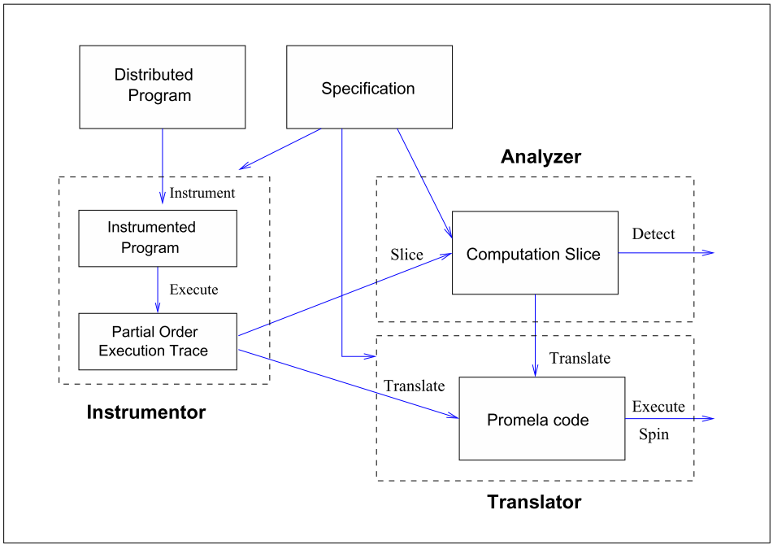

- 补充：[[On Slicing a Distributed Computation]]
- 比较久远(2003)
- 提出一个偏序trace分析器，使用时序逻辑分析消息传递和共享内存程序
- 其提出，之前的所有运行时验证工具都是使用一次执行的trace的全序模型进行验证，而POTA使用了偏序模型
- 使用偏序模型允许捕捉指数级的interleaving以及找出在total order下无法找到的bug
	- 但存在状态爆炸的问题
- POTA使用一种叫做computation slicing的有效抽象技巧
	- 此技巧的作用在于可以减缓状态爆炸问题，只专注于那些感兴趣的状态
- 在POTA种，它们实现了在时序逻辑(CTL的一个子集)下的computation slicing算法
	- 复杂度直接变成了在线程数上的多项式时间
- 而且还能将执行trace翻译成Promela，使得能验证250个进程的trace
- **此文章讲的trace的偏序关系(happen before)以及全序关系(interleaving)好像值得深究一下**
	- 文章说前一个关系反而能更好的代表并行
- **Computation Slice**也许也是一个可以深究的点
	- 对于给定的一个谓词，一个computation slice就是一个包含最少全局状态的满足该谓词的computation的最少状态数
	- 可以快速筛出不关心的全局状态
- # introduction
	- 分布式系统中的一个基础问题是**谓词检测**(predicate detection)[[$red]]==(废话）==
		- 检测在给定的有限trace序列上给定的谓词是否满足
	- 一个有限的trace序列可以用两种方式来建模
		- **偏序关系**
			- 事件之间的关系是偏序的
			- 典型的如Lamport的**happened-before**关系
		- **全序关系**
			- 就是穿插(total order)
	- 文章选用前者，并且认为其是更加符合并发的表现形式
	- 
	- 上图a表现的是偏序关系下的执行结果trace
		- 两个程序P1和P2各自拥有一个整数变量x，y
		- 一个实心圆表示一个事件
		- P2通过事件f1向p1发送信息，P1通过事件e1接受信息
		- 每一个事件都标记上了**在执行该事件之后会被立即改变的变量和其改变后的值**
		- 每一个进程的第一个事件会初始化该进程的状态
	- 上图b展示了由初始状态{e0,f0}出发所有可达的状态
		- 每一个状态是一个事件二元组，表示两个进程中最后执行的事件
		- 通过偏序关系可以捕捉所有可能的事件穿插，而不是某一种穿插。在本例中总共有十种穿插
		- 图中的粗黑实线描述了一种可能的穿插
	- 一个老生常谈的问题：**[[$red]]==状态爆炸==**
		- 有很多手段来缓解此问题，包括状态的符号化表达和**偏序关系规约(partial order reduction)**
	- 本文提出的**POTA**包含三部分
		- instrumentation模块(用于监管程序性能和生成trace)
		- 一个翻译器模块
			- 将执行trace翻译为Promela(SPIN的输入语言)
		- 分析器模块
			- 此部分最重要的部分是使用了一种针对时序逻辑验证的有效抽象手段：computation slicing
	- ## Computation Slicing(计算切片)
		- 并不是本文首创
		- 是一种用于分析分布式计算(有限执行trace)的抽象技巧
		- 一个计算切片的**定义基于一个全局谓词**
			- 是一个使该谓词为真的，包含最少全局状态的计算(computation)
			- 可以用于高效甩掉无关的全局状态
		- 使用前人的结果，可以将计算切片有效地应用到CTL的子集中，该子集的三个性质如下
			- 首先时序逻辑操作符包含EF，EG，AG，布尔操作符包括合取和析取
			- 原子命题是常规的谓词
			- 加上了否定操作符的谓词也是原子命题
		- 本文将该子集叫做Regular CTL plus(RCTL+)
		- 该子集的进一步简化版本叫做RCTL，去掉了析取和否定操作符
		- 使用的谓词是在另一篇文章中引入的**regular predicate**
			- 在正则谓词上的切片精准地包括使谓词为真的全局状态
		- 详细定义参看补充
- # POTA架构
	- 包含三个部分：分析器(analyzer)，翻译器(translator)，仪表盘(instrumentor)
	- 
	- ## 分析器
		- 包含计算切片和谓词检测算法(Predicate Detection)
		- 给定一次执行的trace和由RCTL+编写的谓词(specification)，分析器模块得出计算切片，并通过以下策略判断谓词是否被满足
			- **情景1：**如果切片和输入trace的初始状态不同，则该谓词不被满足
			- **情景2：**如果谓词是RCTL编写的，且切片的初始状态和输入trace的初始状态相同，则该谓词被满足
			- **情景3：**如果谓词不是RCTL编写的(包含非和析取)，且切片的初始状态和trace的初始状态相同，则需要做进一步的检测。因为初始状态不一定满足谓词
	- ## 翻译器
		- 在分析器遇到第三种情景时，将依赖翻译器将计算切片翻译为SPIN的输入语言Promela，再利用SPIN来检测trace(假定谓词有使用LTL的等价表达)
		- 翻译器有两个用途：
			- 可以将本文作者的工作和其他的工作作比较
			- 如上文所述当分析器不足以分析时，需要翻译为其他语言来辅助验证
	- ## 仪表盘
		- 在待观测程序的适当处插入代码，以记录谓词相关变量的值
		- 同时维护一个在每一次内部事件和收发事件都会更新的时钟向量，来获取trace的偏序关系
		- 会针对每一个进程生成一个log文件，包含该进程的本地事件，组合起来可得到一个带偏序关系的全局trace
		- 如果每一个进程将他们的trace发送到一个用于合成的trace的进程，那么可以得到一个**在线**验证环境
		- 本文的工作目前只能做到人工instrument一个程序，且针对的是java程序
- # 正则谓词
	- 一个正则谓词若不包含任何时序操作符，如**EF，AG，EG**等，则称其位**非时序**(non-temporal)的，否则则是一个时序正则谓词
	- [[On Slicing a Distributed Computation]]给出了非时序正则谓词的多项式时间复杂度算法