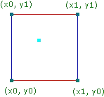

- # 基础
	- 接受一个三维坐标(x,y,z)，输出一个``0-1``的double值
	- **第一步**：**只取xyz的小数部分**，得到一个在此晶格(体积为1)的点的坐标
		- 为方便描述，接下来的部分在二维中展示
		- 
			- 此图中淡蓝色点即代表输入值在二维单位正方形中的空间坐标
	- **第二步**：给四个顶点(三维中应该是八个顶点)各自生成一个**伪随机梯度向量**
		-
		-