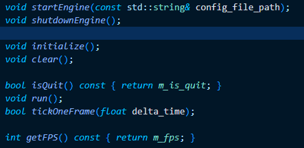

- [[补充：WSL下vscode glsl开发环境配置]]
- # 文件结构
	- 核心代码都置于``engine``目录下
		- 该目录种的代码已经根据课程中的分层思想做好了分层，放置于`engine/source`目录下
			- editor层单独一个目录
				- `engine/source/editor/source`下的`main.cpp`是editor启动时的入口，其在启动时会初始化一个PiccoloEngine对象，通过该对象初始化引擎和editor，然后运行
			- 其余几个层的代码置于``engine/source/runtime``下
				- 其中的``engine.cpp``和``engine.h``定义了引擎的入口
			- ``_generated``存放由PiccoloParser生成的功能性代码
			- ``meta_parser``就是PiccoloParser的源代码
			- `precompile`中的cmake脚本具体控制了什么时候使用PiccoloParser去生成功能性代码
			- `test`路径目前是空的，如果后续要编写单元测试，则置于此文件夹下
		- 第三方代码库置于`engine/3rdparty`下
		- ``engine/asset``中存放了一些引擎启动时加载的默认关卡所需要的资源
		- `engine/bin`是构造中生成的工具，没有加入git同步
			- 其中包含`PiccoloParser`，参与引擎的构建，根据C++代码生成一些功能性代码
		- ``engine/configs``存放编辑器启动时所需的配置文件
		- `engine/jolt-asset`存放物理库**Jolt-Physics**所需的一些shader
		- `engine/shader`存放引擎启动时所必需的一些shader
		- `engine/template`存放生成PiccoloParser所需的模板文件
- # 代码阅读
	- ## 引擎顶层代码
		- ``engine.cpp``和``engine.h``
			- 位于``engine/source/runtime``下
			- 定义了PiccoloEngine类和几个最顶层的方法
			- PiccoloEngine类中只有八个公共方法
				- 
				- 其中`initialize`和`clear`目前是两个空的占位函数
			-