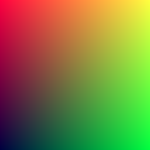
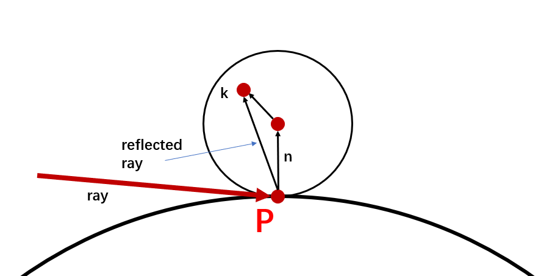
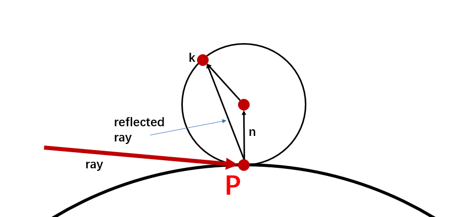

- # C++ 项目结构问题
	- ## 两个头文件互相包含
		- 一般不应该出现这种情况，如果出现，说明项目结构设计有问题
		- 如果出现，在某一个头文件中不再包含另外一个头文件，而是将需要的类，函数和变量再手动声明一次
- # 输出一张图像(image)
	- ## PPM图像格式
		- ppm(ppm pixmap format)图象格式应该是最简单明了的图像格式，其格式如下：
			- ```text
			  P3           
			  # "P3" means this is a RGB color image in ASCII 
			  # "3 2" is the width and height of the image in pixels
			  # "255" is the maximum value for each color
			  # This, up through the "255" line below are the header.
			  # Everything after that is the image data: RGB triplets.
			  # In order: red, green, blue, yellow, white, and black.
			  3 2         
			  255       
			  255 0   0 0   255 0   0 0 255
			  255 255 0 255 255 255 0 0 0
			  ```
			- 以上内容对应的图像为
				- 
			- 如果是二进制而非ASCII编码的PPM，开头的魔数应该是ASCII码对应的**``P6``**
	- ## 输出第一张图像
		- ```c++
		  #include <iostream>
		  
		  int main(int argc, char const *argv[])
		  {
		      // image size
		      const int image_width = 256;
		      const int image_height = 256;
		  
		      // Render
		      std::cout<<"P3\n" << image_width <<' '<<image_height<<"\n255\n";
		      for(int i = image_height-1;i>=0;i--){
		          for(int j = 0;j<image_width;j++){
		              double r = (double)i/(image_height-1);
		              double g = (double)j/(image_width-1);
		              double b = 0.25;
		              
		              int rp = (int)(r*255);
		              int gp = (int)(g*255);
		              int bp = (int)(b*255);
		              std::cout<<rp<<' '<<gp<<' '<<bp<<'\n';
		          }
		      }
		      return 0;
		  }
		  ```
		- 以上代码会输出一张256*256的渐变图像
		- 
	- ## 增添进度指示(Progress Indicator)
		- 通过向标准错误输出输出剩余扫描行并flush可以实时显式进度
		- 使用`\r`可以将输出光标移动回行首，**做出更新当前行而不是另外输出一行的效果**
		- ```c++
		  #include <iostream>
		  #include <unistd.h>
		  
		  int main(int argc, char const *argv[])
		  {
		      // image size
		      const int image_width = 256;
		      const int image_height = 256;
		  
		      // Render
		      std::cout<<"P3\n" << image_width <<' '<<image_height<<"\n255\n";
		      for(int i = image_height-1;i>=0;i--){
		          std::cerr<<"\rScanlines remaining: "<<"\e[44m"<<i<<"\e[0m "<<std::flush;
		          for(int j = 0;j<image_width;j++){
		              double r = (double)i/(image_height-1);
		              double g = (double)j/(image_width-1);
		              double b = 0.25;
		              
		              int rp = (int)(r*255);
		              int gp = (int)(g*255);
		              int bp = (int)(b*255);
		              std::cout<<rp<<' '<<gp<<' '<<bp<<'\n';
		          }
		      }
		      std::cerr<<"\n\e[42m Done.\e[0m\n";
		      return 0;
		  }
		  ```
- # vec3 类
	- 用于存放集向量和颜色的类
	- 在很多系统中，这样的向量都是四维的：
		- 对于几何来说，3维坐标加上**齐次坐标(homogeneous coordinate)**
		- 对于颜色来说，三维RGB值加上alpha透明通道
- # 光线(ray)，简单相机和背景
	- ## ray class
		- 所有的光线追踪器(ray tracer)都会有一个光线类
		- 一条光线可以看作一个函数：$\mathbf{P}(t) = \mathbf{A}+t\mathbf{b}$
			- $\mathbf{A}$ 是一个光线源
			- $\mathbf{b}$ 是光线方向
			- $t$ 是光线参数，为一个实数
			- {:height 118, :width 359}
	- ## 将光线添加到场景中
		- ### [[思考：viewport如何控制视野大小以及其与输出图片大小的关系]]
		- 一个光线追踪器负责将光线**发送过每一个像素**，并且计算从光线的角度看到的颜色，通过三步完成
			- 计算**从人眼到像素**的光线
			- 判明有哪些物体和光线**相交**(intersect)
			- 计算相交点的**颜色**
		- 
		- ``ray_color``函数根据光线的y分量进行**线性融合(Linear Blend)**，也称**lerp**，其一般形式为
			- $\text{blendedValue}=(1−t)⋅\text{startValue}+t⋅\text{endValue}$
- # 添加一个球体
	- 一个球体的表达就是一个中心$\mathbf{C}$和一个半径$r$
	- 一个点$\mathbf{P}$是否在球体上，可以表达为：$(\mathbf{(P-C)\cdot (P-C)}=r^2$
	- 而一条光线$\mathbf{P}(t)$是否击中一个球体的某一点，则可以描述为存在一个$t$使得
		- $(\mathbf{P}(t)-\mathbf{C})\cdot (\mathbf{P}(t)-\mathbf{C})=r^2$
	- 可展开为：
		- $(\mathbf{A}+t\mathbf{b}-\mathbf{C})\cdot (\mathbf{A}+t\mathbf{b}-\mathbf{C})=r^2$
	- 进一步展开为：
		- $t^2\mathbf{b\cdot b}+2t\mathbf{b}\cdot\mathbf{(A-C)+(A-C)\cdot(A-C)}-r^2 = 0$
	- 求解$t$即可，可能有三种情况
		- {:height 171, :width 242}
		-
- # 表面法向量(Surface Normals)和多物体
	- 对于一个球体来说一个朝外的法向量的方向是表面的一个点减去中心点
	- 
	- ## 简化光线-球体接触计算代码
		- ```c++
		  double hit_sphere(const point3& center, double radius, const ray& r) {
		      vec3 oc = r.origin() - center;
		      auto a = dot(r.direction(), r.direction());
		      auto b = 2.0 * dot(oc, r.direction());
		      auto c = dot(oc, oc) - radius*radius;
		      auto discriminant = b*b - 4*a*c;
		  
		      if (discriminant < 0) {
		          return -1.0;
		      } else {
		          return (-b - sqrt(discriminant) ) / (2.0*a);
		      }
		  }
		  ```
		- 一个向量点乘自己等于其长度的平方
		- $b$含有一个2的因素，因此：
			- {:height 181, :width 155}
			- 可以简化计算
	- ## 对可击中物体(Hittable Objects)的抽象
		- 将所有可以被光线击中的物体抽象为一个类
		- 此类会有一个``hit``函数，此函数接受一个光线作为参数，计算$t$
		- 大多数光线追踪器在计算$t$时都会有一个有效区间$t_{min}, t_{max}$只有当$t$在区间内才算是击中
	- ## 正面(Front Face)和背面(Back Face)
		- 若法线方向总是从内到外(击中点-中心)，那么通过将光线和法线的方向进行比较即可获知光线是从内部还是从外部击中了物体
			- 如果光线和(外部)法线的方向一致，说明是从内部击中了物体
			- 如果光线和(外部)法线的方向相反，说明是从外部击中了物体
		- 而**两个向量可以通过点乘的正负[[$red]]==来判断方向是否一致==**
			- **<0**说明方向相反
			- **>0**说明方向相同
		- 确定光线是从内击中物体还是从外击中物体实际上有两种实现方式，一种是几何时确定，一种是上色时确定
		- 还可以通过确定法线是否总是向外来确定
- # 反走样
	- 通过对边缘的像素进行采样可以做到类似于相机的反走样效果，但是本书不打算使用**[[$red]]==分层(stratification)==**
	- ## 随机工具函数
		- 随机函数一般都是[0,1)，不包括上界，这一点很重要，后续可能会提到
		- 新版本的C++也引入了``<random>``头文件，可以使用一些库函数，例如：
			- ```c++
			  inline double random_double() {
			      static std::uniform_real_distribution<double> distribution(0.0, 1.0);
			      static std::mt19937 generator;
			      return distribution(generator);
			  }
			  ```
	- ## 使用多次采样(多条光线)生成单个像素
		- 绘制单个像素时，发射多条光线，该像素最终的值是多条光线颜色的平均
		- 
		- 修改``write_color``函数
			- 把多次采样的颜色累加起来，然后除以采样次数
- # 漫射材质(Diffuse Material)
	- 需要决策：**材质和几何物体分开，在渲染时混合**，还是**集合物体和材质紧密联系在一起**
		- 本书选择前者，好处在于一种材质可以赋给多个物体
	- ## 一种简单的漫射材质
		- 一个不发光的漫射物体会**呈现其环境的颜色**
			- 但是会将环境颜色和自己的颜色混合到一起
		- 射到漫射材质上的光会呈现出**随机的反射行为**
			- 甚至有可能直接被吸收而不是被反射，表面越黑，**越有可能被吸收**
			- {:height 257, :width 467}
	- 任何随机化反射方向的算法都会让表面看起来是漫射表面（**哑光**）
		- 不过实际上这只是一种对理想Lambertian reflectance的一种**[[$red]]==lazy hack==**
		- 并不真的准确，需要更多的工作来真的完成一个理想Lambertian reflectance
	- 想要做到随机方向反射可以按以下步骤完成：
		- 在击中点($\mathbf{P}$)生成两个和击中点的面相切的(单位球体)
			- 两个单位球体的球心分别是$\mathbf{P+n}$和$\mathbf{P-n}$其中$\mathbf{n}$是面法线
			- 前一个球体被认为是**在表面之外**，后一个球体是**在表面内**
			- 选择和光线在同一侧的球体
			- 在球体中随机选择一个点$\mathbf{S}$
			- $\mathbf{S-P}$就是新的反射方向
			- {:height 280, :width 233}
		- 使用**拒绝(Rejection)采样**来选取球体中的一个随机点
			- 生成一个在2单位立方体中的随机点(x,y,z的长度都是-1到1)，如果不在单位球体中则重新采样
	- [[$red]]==**一条光线最终反射的颜色要么是世界(天空)的颜色，要么是0**==
	- ## 使用GAMMA校正
		- 将颜色纠正为$color^{\frac{1}{gamma}}$，若gamma取2，则相当于将颜色开平方
	- ## 修正阴影暗斑(Shadow Acne)
		- 某些被反射的光线不在两球相交的地方经常以很小的t值击中物体(0.0000001)
		- 舍弃掉这些很接近于0的值可以修正此问题
		- 解决方案很简单，在``ray_color``函数中，调用world的hit函数时，将下限设置为``0.001``即可
	- ## 真正的朗博反射(Lambertian Reflection)
		- 随机选择在球内的点会导致反射光线朝向法线的概率更高，朝向表面的概率更低
		- 然而真正的朗博反射应该是反过来，朝向表面的概率更高，朝向法线的概率更低
		- 修正这一点可以通过随机选择**球上的点来解决**
	- ## 一种替换漫射公式[[$red]]==（？）==
		- 选择上半球的点
		- [[$red]]==**不是很理解**==
		- ### 解释
			- 到目前为止一共描述了三种漫射方法
			- **第一种：lazy hack**
				- 简单的在单位球体**[[$red]]==内==**随便选择一个点
				- 此方法会让反射光线更多地**偏向法线**
				- {:height 214, :width 397}
			- **第二种**：只在球面上选择
				- 据说能够满足朗博反射
				- 此方法会让反射光线更多地**远离法线**
				- {:height 209, :width 419}
			- **第三种**：半球内选择一点
				- {:height 162, :width 381}
				- 据说是很多光线追踪器的选择
				- 此方法符合**均匀分布(uniform distribution)**
		- 三种漫射方法各有特点
- # 金属(Metal)
	- ## 材质抽象类
		- 在设计材质时，涉及到一个设计选择
			- 设计一个**通用的材质类**，具体材质地表现通过设置类成员变量完成
			- 设计一个抽象类，该类将材质地行为抽象出来
		- 本书选择后者，且在本书中，一个材质类需要做两件事
			- 产生一条**发散的光线(Scattered Ray)**，或者吸收发射出的光线
			- 如果产生了一条被发散的光线，确定此光线会被**减弱(attenuate)**多少
	- ## 分散函数(``scatter()``)
		- ``Material``是个纯虚基类，其有一个纯虚函数``scatter``
		- 此函数用于计算出一条散射的光线
		- 此函数一般需要一个``attenuation``，对于Lambertian材质来说，就是``albedo``
			- **个人认为就是一个color的mask，会对散射光线的颜色做一个filter**
			- 也可以让此函数仅有``p``的概率反射一条光线(即有``1-p``的概率**吸收一条光线**)，但是相应的，``attenuation``需要设置为``albedo/p``
				- 因为，如果仅有``p``的概率反射光线，那么最终所有颜色的mask都仅有``p``(剩下``1-p``的光线会直接返回全黑(0,0,0)，但分母不变(采样率还是那个常数))
				- 所以最终颜色会变暗，要修正，就需要将``attenuation``除以``p``
			- 所以两种方式最终的效果应该是一样的，如何选择仅取决于个人偏好
	- ## 镜像反射(Mirrored Light Reflection)
		- {:height 236, :width 311}
		-
		- 一个向量$\mathbf{V}$的镜像放射可以通过以下步骤求得：
			- $\mathbf{V\cdot N = \| V\| \| N\| \cos \theta}$
				- 其中$\cos \theta$即$\mathbf{V,N}$间的夹角
			- 又因为$\mathbf{N}$是单位向量，其长度为1，因此
				- $\mathbf{V\cdot N = \| V\|  \cos \theta = \| B\|}$
			- 又因为$\mathbf{B,N}$方向相同，因此且$\mathbf{N}$为单位向量，因此
				- $\mathbf{(V\cdot N) \times N=B}$
			- 所以有：
				- $\mathbf{V-2\times(V\cdot N) \times N=B}$
	- ## 模糊反射(Fuzzy Reflection)
		- 反射光线的末尾生成一个球体，在求体内随机选择一个新的终点重置反射光线的方向
		- 
		- 此球体的半径越大，fuzzy效果越明显
	-
- # 介质(Dielectric)
	- 透明的材质，例如水，玻璃，钻石都是**介质**
	- 当一束光射向介质，会产生**一条反射光和一条折射(Refraction)光**
		- 随机选择折射还是反射，且每次迭代只scatter一次
	- ## 折射(Refraction)
		- 当光线穿过**不同的介质**时会产生折射现象
		- ### 斯涅尔定律(Snell's Law)
			- $\eta \cdot \sin \theta = \eta' \cdot \sin \theta '$
			- {:height 290, :width 365}
			- $\eta,\eta'$分别是两种介质的**折射率**，一般来说
				- **空气**的折射率为**1**
				- **玻璃**的折射率为**1.3-1.7**
				- **钻石**的折射率为**2.4**
		- 为了计算出**被折射**的光线，需要：
			- 计算出射角：$\sin \theta' = \frac{\eta}{\eta'}\cdot \sin \theta$
			- 将出射光线$\mathbf{R'}$分割为垂直于法线的向量和平行于法线的向量
				- $\mathbf{R'=R'_\bot+R'_\|}$
			- 分别求出$\mathbf{R'_\bot,R'_\|}$
				- $\mathbf{R'_\bot} = \frac{\eta}{\eta}(\mathbf{R}+\cos \theta \mathbf{n})$
					- 若出射光线为单位向量，可改写为：$\mathbf{R'_\bot} = \frac{\eta}{\eta}(\mathbf{R+ (-R\cdot n)} \mathbf{n})$
				- $\mathbf{R'_\|}=-\sqrt{1- \| \mathbf{R'_\bot \|^2}} \mathbf{n}$
	- ## 内部全反射(Total Internal Reflection)
		- Snell's law的一个问题在于，如果一束光从折射率大的物体射入折射率小的物体则无法给出有效解
			- $\sin\theta'=\frac{\eta}{\eta'}\cdot \sin\theta \Rightarrow \sin\theta'=\frac{1.5}{1.0}\cdot \sin\theta \Rightarrow 1.5\times \sin\theta >1$
			- 若$\sin\theta$足够大，则$\theta'$无解
		- 不能折射(无解)的情况称为**内部全反射**
	- ## Schlick近似(Approximation)
		- 真实玻璃的反射率往往和角度有关，要准确描述这种性质需要很复杂的公式，但是可以使用Schlick近似来**获取一个准确的多项式近似效果**
	- ## 建模一个空的玻璃球
		- 半径的正负并不影响光线和球体碰撞的求解运算，但是会导致最后求出的碰撞点的法线反向
		- 因此可以用负半径来建模空的玻璃球
			- 最外层建模一个正半径玻璃球
			- 内部加一个负半径的同心球
- # 可移动的相机
	- ## 相机视角几何(Camera Viewing Geometry)
		- {:height 228, :width 223}
		- 实际上只要保持h相对于z的比值，viewport在任何-z举例，最终效果都是一致的
		- 因此可以选择viewport的举例时钟固定在z=-1(相对于相机)，则
			- $h=\tan(\frac{\theta}{2})$
			- $\theta$即为**垂直FOV**(vertical field-of-view)
	- ## 放置并且旋转相机
		- 将相机所放置的位置称为**``lookfrom``**
		- 相机看向的**点**称为**``lookat``**
		- 还需要一种方法来定义**roll**，也称**sideways tilt**，即相机在lookat-lookform轴上的旋转角度
			- 定义一个``up``向量，此向量**与看向的方向正交**，一般取名为**vup**(view up)向量
		- {:height 180, :width 348}
		- 使用叉乘可以获取一组正交的向量来描述相机的朝向
		- 
			- ``v, vup, w``全在同一个平面
			- 相当于，通过`vup`和lookat-lookfrom轴叉乘来确定u向量，这个u向量一定在和lookat-lookfrom轴垂直的平面内，因此可以通过修改`vup`来修改相机的roll
			- 选取``(0,1,0)``作为``vup``可以保证相机视角是水平的(也即最终输出画面是水平的)
		-