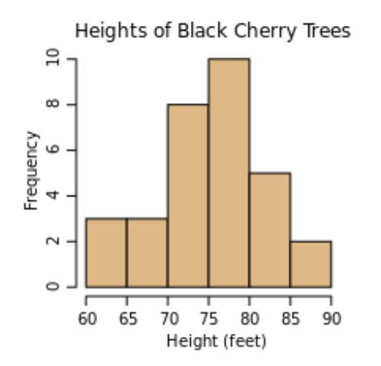

- # 蒙特卡洛(Monte Carlo)算法
	- 得名于摩纳哥的一个赌博业发达的城市
	- 一种**使用概率和统计估算某个不确定时间的可能结果**
	- 精确度随着迭代次数增加而上升
	- ## 分层(Stratify)
		- 也称**抖动(Jittering)**
		- 相较于普通MC，分层可以更好地逼近近似值
		- **[[$red]]==但是==**，此优势**随着维度增加而降低**
			- 例如，如果在三维中采样，计算出的pi差距会更小
			- 这被称为[[$red]]==**维度诅咒**==
		- 对于二维问题，分层仍然是很好的选择
- # 一维MC积分(Integration)
	- 考虑一个积分$I=\int _0^2 x^2dx$
	- 对于计算机来说，可以写为：$I=\text{area}(x^2,0,2)$
	- 也可以先计算$x^2$在0到2之间的平均数，然后用总长度2乘以平均数算取面积，即
	- $I = 2\cdot \text{average}(x^2,0,2)$
	- 高度的平均数即可使用MC来计算
	- 可以使用分层，逼近速度和精度都很惊人(毕竟一维)
	- ## 密度函数
		- 密度函数是一个**连续的直方图**
		- {:height 277, :width 289}
		- 上图是一个统计某农场黑樱桃树高度的例子
		- 样本越多，直方图的整体高度越高
		- 采样颗粒度越细，整体高度越低
		- 为了避免增加样本数量后变太高，将y轴改为占整体样本数量的百分比
		- 同时又为了避免细分颗粒度之后高度降太低，柱体高度使用公式：
			- $柱体高度=\frac{树高介于H和H'之间的比例}{(H-H')}$
		- **概率密度函数**就是一种连续的分数直方图，简称**[[$red]]==PDF==(Probability Density Function)**
	- ## 构造一个PDF
		- [[$red]]==**为什么基于pdf不等概率采样能够得到面积？**==
			- 实际上每一次踩点都是在用极小量面积在代替整个面积，因此最后平均能得到面积
			- 假设采样到了$f(x)$，那么可以看作此次采样得到的面积是$\delta\cdot f(x)$，$\delta$是一个无穷小量
			- 那么这个面积被采样的概率就是$\delta\cdot\text{pdf}(x)$
			- 因此这个面积的加权值就应该是$\frac{\delta\cdot x}{\delta\cdot \text{pdf}(x)}=\frac{f(x)}{\text{pdf}(x)}$
	- ## 重要采样
		- 上述方法的核心思想就是在采样概率上尽量贴近每个样本的重要性
		- 如果找出一个完美贴合被采样函数的pdf，则哪怕只采样一次也能做到非常完美的贴合
	- ## 思路
		- 有一个$f(x)$在某个定义域$[a,b]$上的积分
		- 选择一个在$[a,b]$上不为0的PDF $p$
		- 计算大量$\frac{f(r)}{p(r)}$的平均值
			- 选择任何$p$都能收敛到正确答案，但是$p$约接近$f$，收敛地越快
- # 光散射(Light Scattering)
	- ## 反照率(Albedo)
		- 光线的散射概率，一般记为$A$
		- 相应的，光线被吸收的概率为$1-A$
		- 反射率会随着颜色的变化而变化，也会随着入射方向而变化
		- 也表示[[$red]]==**物体固有的颜色**==
	- ## 散射
		- 大多数基于物理的渲染器都使用**波长(Wavelength)**而不是RGB来表示颜色
			- 也可以发散一下，将RGB看作长，中，短波长的混合
		- 如果一束光发生散射，可以将散射率在方向上的分布(即**不同方向上的散射率**)描述为**在方向角(Solid Angle)**上的PDF：$s(direction)$
		- PDF同时还会随着入射光的角度(Incident Direction)变化
		- 因此表面颜色可以表示为：
			- $$Color = \int A\cdot s(direction)\cdot color(direction)$$
			- $A\cdot s(direction)$可以等价于渲染方程中的$BRDF$项，即材质对入射光线的散射
			- $color(direction)$等价于$L_i \cos \theta$项，即不同角度的入射光
	- ## 散射PDF
		- 使用MC公式，得到估计如下
			- $$\frac{1}{N}\sum\frac{A\cdot s(direction)\cdot color(direction)}{p(direction)}$$
		- **回顾：[[$red]]==Lambertian表面==**
			- 朗伯表面在PDF视角下来看，就是入射光线**在所有方向均匀反射(反射概率在表面均匀分布)**
			- 即，入射光线已入射点为中心，在整个半球空间内向四周**各向同性反射能量的现象**
			- 也称漫反射，各向同性反射
			- 一个完全漫射的面称朗伯面
- # 重要材质采样
	- 期望让程序向光源发送一束额外的光线，以减少图片早点
	- 假设与光源相关的概率密度函数为$pLight(direction)$来生成这束射向光源的光线
	- 另假设一个与表面$s$相关的PDF，$pSurface(direction)$
	- 一个关于PDF的有用性质：**PDF的线性混合仍然是PDF**，如：
		- $$p(direction) = \frac{1}{2}\cdot \text{Light}(direction)+\frac{1}{2}\cdot \text{pSurface}(direction)$$
		- 只要**权值为正**且加起来是1，任何PDF的混合都是PDF
	- 问题在于如何在$s(direction)\cdot color(direction)$值最大的地方(光源的贡献更大)，使得PDF的值更大
		- 对于漫反射表面，问题等价于猜测哪里的$color(direction)$值更大，即哪个方向上的入射光值更大
		- 对于镜面反射，仅在**某个方向**部分$s()$的值较大，大多数渲染器都将镜面作为一种特殊情况并隐式调用$s/p$
	- 因此镜面反射的采样方向是**确定的**；漫反射的采样方向是**不确定的**，需要在诸多不确定的方向上找出光源贡献更大的方向进行采样
	- ## 回到Cornell Box
		- 记住MC的基础形式：$\int f(x) \approx f(r)/p(r)$
		- 对于lambertian，使用PDF：$p(direction) = \frac{\cos\theta}{\pi}$
		- 在$\cos(\theta)$更大的方向，被采样的概率密度更大
		-
			-